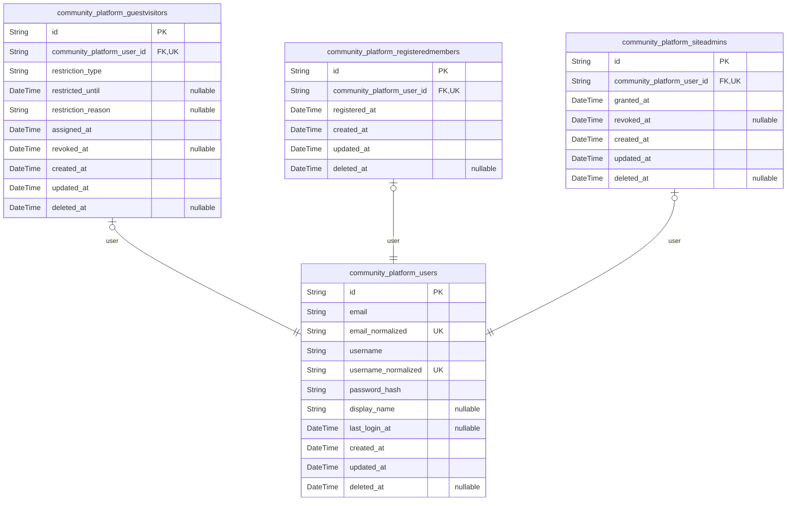
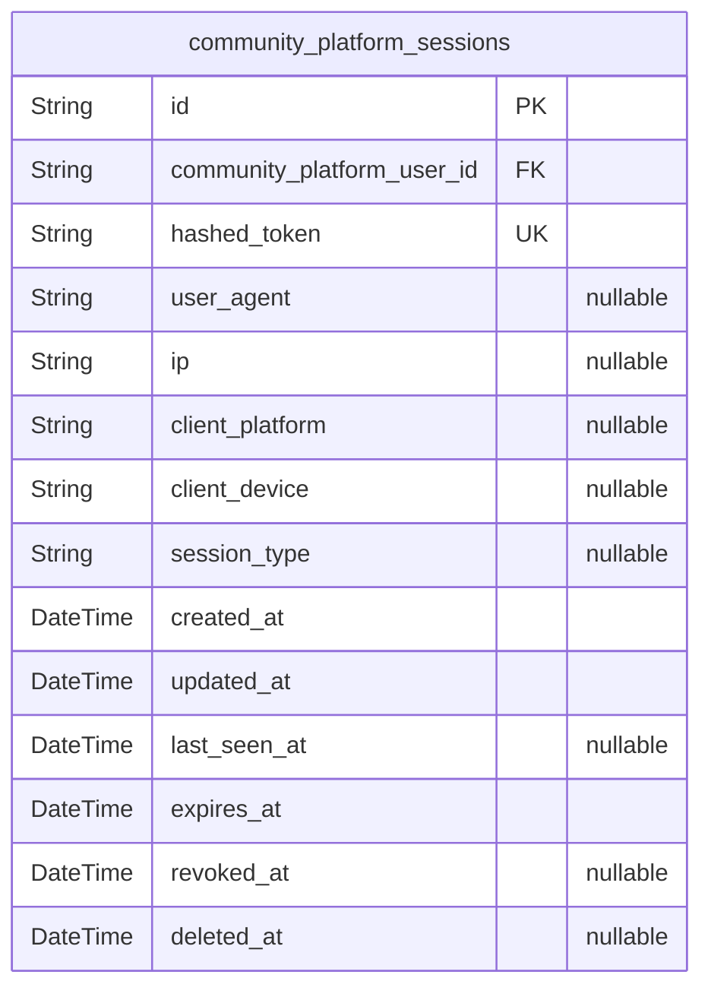
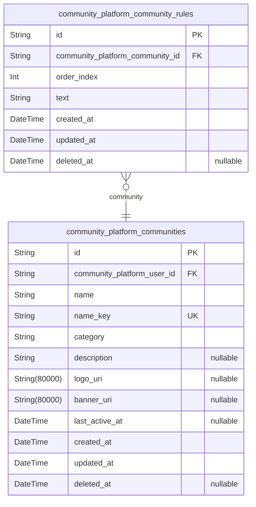
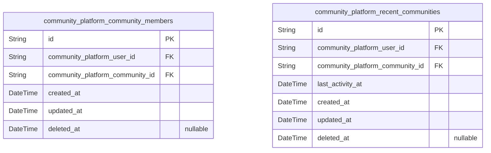
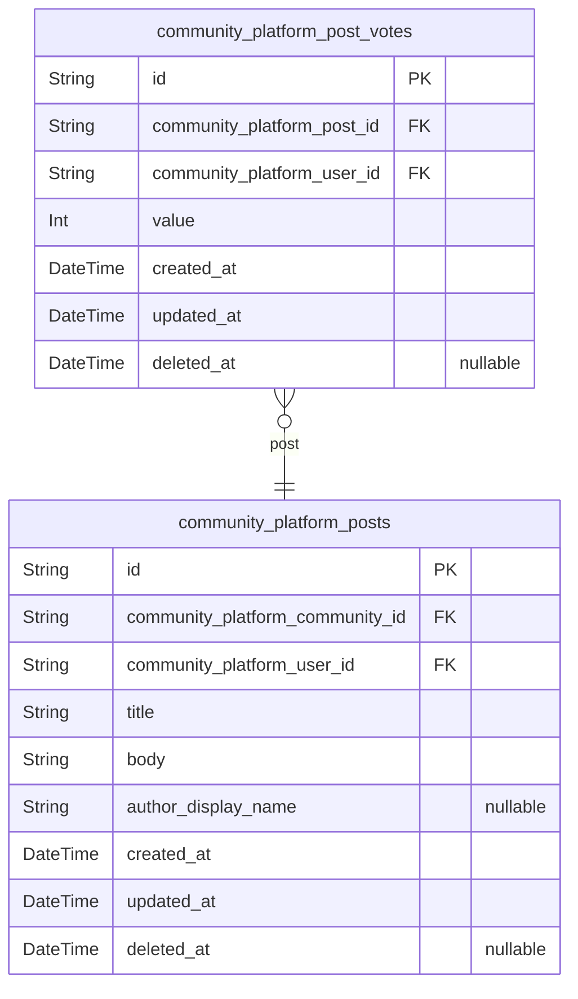
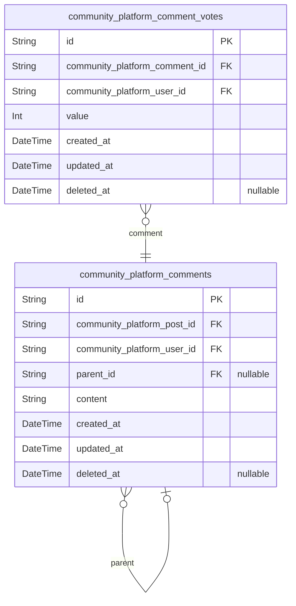

# Prisma Markdown

> Generated by [`prisma-markdown`](https://github.com/samchon/prisma-markdown)

- [Actors](#actors)
- [Sessions](#sessions)
- [Communities](#communities)
- [Memberships](#memberships)
- [Posts](#posts)
- [Comments](#comments)

## Actors

### `community_platform_users`

Core user accounts for authentication, authorship, and ownership across
the platform. Stores credentials, unique identifiers, and profile basics.
Sessions and all content entities in other components link to {@link
community_platform_users} for authorship and access control.
Case-insensitive uniqueness for email/username is enforced at the
database level via normalized columns.

Properties as follows:

- `id`: Primary Key.
- `email`
  > Email address provided by the user. Human-readable form; not used for
  > case-insensitive uniqueness enforcement directly.
- `email_normalized`
  > Lowercased canonical email used to enforce case-insensitive uniqueness at
  > the database level.
- `username`
  > Preferred handle shown in UIs. Human-readable form; not used for CI
  > uniqueness directly.
- `username_normalized`
  > Lowercased canonical username used to enforce case-insensitive uniqueness
  > at the database level.
- `password_hash`: Password hash for authentication. Plain passwords are never stored.
- `display_name`
  > Optional display name shown on posts/comments if provided; otherwise UI
  > may render "Anonymous" per business rules.
- `last_login_at`
  > Timestamp of the most recent successful login, used for account analytics
  > and security review.
- `created_at`: Creation timestamp for audit and ordering.
- `updated_at`: Last update timestamp for audit.
- `deleted_at`
  > Soft delete timestamp. When set, the account is considered deactivated
  > and hidden from normal operations.

### `community_platform_guestvisitors`

User restriction assignment table representing account-level limitations
such as read-only or suspended states for a given {@link
community_platform_users} account. This table does not model
unauthenticated guests; instead, it records enforcement states for
authenticated accounts with auditability (assigned/revoked, optional
expiry, and reason).

Properties as follows:

- `id`: Primary Key.
- `community_platform_user_id`: Restricted account's [community_platform_users.id](#community_platform_users).
- `restriction_type`
  > Type of restriction applied. Expected values: "read_only" or "suspended"
  > (future-safe for additional types).
- `restricted_until`
  > Optional expiry time for the restriction. Null means until explicitly
  > revoked.
- `restriction_reason`: Optional human-readable reason or policy reference for the restriction.
- `assigned_at`: Time when the restriction was assigned.
- `revoked_at`: Time when the restriction was revoked; null means currently active.
- `created_at`: Creation timestamp for audit and ordering.
- `updated_at`: Last update timestamp for audit.
- `deleted_at`: Soft delete timestamp for the restriction record.

### `community_platform_registeredmembers`

Role assignment table marking a [community_platform_users](#community_platform_users) account
as an active registered member with write capabilities (post, comment,
vote, join/leave). Serves as the canonical indicator of member state for
authorization and personalization.

Properties as follows:

- `id`: Primary Key.
- `community_platform_user_id`: Member account's [community_platform_users.id](#community_platform_users).
- `registered_at`: Time when the user became a registered member.
- `created_at`: Creation timestamp for audit and ordering.
- `updated_at`: Last update timestamp for audit.
- `deleted_at`
  > Soft delete timestamp for the membership record (e.g., deactivated
  > membership).

### `community_platform_siteadmins`

Role assignment table granting administrative privileges to a {@link
community_platform_users} account. Records grant and optional revocation
timestamps for audit and compliance.

Properties as follows:

- `id`: Primary Key.
- `community_platform_user_id`: Administrator account's [community_platform_users.id](#community_platform_users).
- `granted_at`: Time when administrative privileges were granted.
- `revoked_at`
  > Time when administrative privileges were revoked; null means currently
  > active.
- `created_at`: Creation timestamp for audit and ordering.
- `updated_at`: Last update timestamp for audit.
- `deleted_at`: Soft delete timestamp for the admin assignment record.

## Sessions

### `community_platform_sessions`

Authentication sessions for the community platform. Each record
represents a long-lived session tied to a user account for smooth
resume-after-login experiences. Sessions support auditability
(created/updated/last_seen), lifecycle control (expires_at, revoked_at),
and security via hashed token storage (never store plaintext). Belongs to
[community_platform_users](#community_platform_users). Common operations include listing a
user’s sessions, revoking a specific session, and purging expired
sessions. This table does not store credentials; those reside in users.

Properties as follows:

- `id`: Primary Key.
- `community_platform_user_id`
  > Owner account reference. Target model’s {@link
  > community_platform_users.id}.
- `hashed_token`
  > Secure hash of the session token used to authenticate API requests.
  > Plaintext tokens must never be stored.
- `user_agent`
  > User agent string reported by the client at sign-in or most recent
  > interaction. Useful for device identification in session management UIs.
- `ip`
  > Last observed client IP address for this session. Stored as a string to
  > accommodate IPv4/IPv6 textual forms.
- `client_platform`
  > Optional client platform hint (e.g., OS/Browser summary) for usability
  > and security reviews.
- `client_device`
  > Optional device descriptor (e.g., model or device category) captured
  > during session establishment.
- `session_type`
  > Optional logical type for the session (e.g., standard, admin-console) for
  > policy or routing purposes. Application-defined values.
- `created_at`
  > Session creation timestamp. Used for relative time displays and audit
  > trails.
- `updated_at`: Last updated timestamp for this session record (e.g., metadata changes).
- `last_seen_at`
  > Timestamp of the last authenticated activity using this session. Supports
  > long-lived session renewal logic and security review.
- `expires_at`
  > Absolute expiration timestamp for the session to satisfy longevity bounds
  > (e.g., ≤ 90 days).
- `revoked_at`: Timestamp when the session was revoked. Null means currently not revoked.
- `deleted_at`
  > Soft deletion timestamp for retention or compliance workflows. Null means
  > not deleted.

## Communities

### `community_platform_communities`

Sub-community definitions with immutable unique name, single category,
optional branding (logo/banner), and community description. Each
community is owned by a creator account ({@link
community_platform_users}) and may display a Right Sidebar "Community
Info + Rules". This revision adds a normalized case-insensitive key
(name_key) to enforce uniqueness at the database layer and clarifies safe
deletion behavior for the creator reference. Category remains a text
field per portability; application enforces allowed values and
reserved-name rules.

Properties as follows:

- `id`: Primary Key.
- `community_platform_user_id`: Creator (owner) account's [community_platform_users.id](#community_platform_users).
- `name`
  > Community's display/URL name (immutable post-creation at application
  > layer). Formatting and reserved names are enforced by the application.
- `name_key`
  > Lowercased, normalized name used to enforce case-insensitive uniqueness
  > (e.g., lower(name) with separator normalization). Must be kept in sync
  > with name by the application.
- `category`
  > Single selected category for discovery. Allowed set documented by
  > business rules; enforced at application layer.
- `description`
  > Short community description (≤ 500 chars). Optional; used in right
  > sidebar and search snippets.
- `logo_uri`
  > Optional logo image URI for the community header and cards. Defaults
  > handled at application layer when absent.
- `banner_uri`
  > Optional banner image URI for the community page. Defaults handled at
  > application layer when absent.
- `last_active_at`
  > Optional last active timestamp for the community (updated on posting,
  > commenting, or other qualifying activities). Used for info box and
  > discovery ordering.
- `created_at`: Creation timestamp for auditing and Newest ordering.
- `updated_at`: Last update timestamp for auditing; application-managed.
- `deleted_at`
  > Soft deletion timestamp for visibility control and compliance workflows.
  > Null when active.

### `community_platform_community_rules`

Ordered short rules associated with a community. These items appear in
the "Community Rules" section (top 5 by order) on Community Home and Post
Detail. Each rule belongs to exactly one community ({@link
community_platform_communities}). Text is concise (≤ ~100 chars). Rules
are managed through the parent community and are not independently
primary entities.

Properties as follows:

- `id`: Primary Key.
- `community_platform_community_id`: Belonged community's [community_platform_communities.id](#community_platform_communities).
- `order_index`
  > Display order within the community. Starts at 1 and increases without
  > gaps per business rules; used to render the top 5 rules.
- `text`
  > Rule text content (~≤ 100 characters). Rendered as numbered list; long
  > values may be truncated in UI.
- `created_at`: Creation timestamp of the rule item.
- `updated_at`: Last update timestamp of the rule item.
- `deleted_at`
  > Optional soft deletion timestamp for removal while preserving history;
  > null when active.

## Memberships

### `community_platform_community_members`

Membership link between a [community_platform_users](#community_platform_users) account and a
[community_platform_communities](#community_platform_communities) sub-community. Represents whether
a user has joined a community to personalize the Home feed and enable
join/leave toggles. Rows are typically created on Join and removed on
Leave; deleted_at can be used if soft-delete is preferred. Supports
deterministic sorting and quick filtering by user or community.

Properties as follows:

- `id`: Primary Key.
- `community_platform_user_id`: Joined account’s [community_platform_users.id](#community_platform_users).
- `community_platform_community_id`: Target sub-community’s [community_platform_communities.id](#community_platform_communities).
- `created_at`
  > Timestamp when the membership was created (Join time). Used for relative
  > time displays and ordering.
- `updated_at`
  > Timestamp when the membership record was last updated (e.g.,
  > reconciliation or metadata touch).
- `deleted_at`
  > Optional soft-deletion timestamp. When set, indicates a logically removed
  > membership while preserving audit trails.

### `community_platform_recent_communities`

Per-user recent communities list used to render the Left Sidebar “Recent
Communities”. Tracks the most recent activity timestamp per ({@link
community_platform_users}, [community_platform_communities](#community_platform_communities)) pair
for fast retrieval of up to 5 items ordered by last_activity_at.
Maintained by application signals on visit, join/leave, post, comment, or
vote within the community.

Properties as follows:

- `id`: Primary Key.
- `community_platform_user_id`: Owner user’s [community_platform_users.id](#community_platform_users).
- `community_platform_community_id`: Referenced community’s [community_platform_communities.id](#community_platform_communities).
- `last_activity_at`
  > Most recent activity time (visit, join/leave, post, comment, or vote) for
  > this user in this community. Drives ordering and capping to top 5 in UI.
- `created_at`: Creation timestamp for this recency record.
- `updated_at`: Last update timestamp when activity is recorded or reconciled.
- `deleted_at`
  > Optional soft-deletion timestamp to hide the record while preserving its
  > history.

## Posts

### `community_platform_posts`

Text-only posts authored by users within a specific community. Serves as
a core content entity for Home feed, Community pages, Post Detail, and
Search. Each post belongs to exactly one community and has exactly one
author (a user). Title and body follow length constraints;
author_display_name is optional and shown as a friendly label (defaults
to "Anonymous" at presentation when empty). Deletion removes posts from
public views; soft deletion timestamp supports operational safeguards.
Relationships: community via [community_platform_communities](#community_platform_communities),
author via [community_platform_users](#community_platform_users), and votes via {@link
community_platform_post_votes}. Author FK uses Restrict on delete to
avoid cascading content removal when accounts are deactivated; community
FK cascades to satisfy community deletion behavior.

Properties as follows:

- `id`: Primary Key.
- `community_platform_community_id`
  > Belonged community's [community_platform_communities.id](#community_platform_communities).
  > Determines the community scope for feeds and permissions.
- `community_platform_user_id`
  > Authoring user's [community_platform_users.id](#community_platform_users). Used for ownership
  > (edit/delete) and author guard rules.
- `title`: Post title. Business constraints: 5–120 characters, plain text.
- `body`
  > Post body (plain text, line breaks allowed). Business constraints:
  > 10–10,000 characters; executable content prohibited.
- `author_display_name`
  > Optional author display name shown on cards/details (0–32 chars). If
  > empty, UI shows "Anonymous".
- `created_at`
  > Creation timestamp for deterministic Newest ordering and relative time
  > display.
- `updated_at`: Last update timestamp for edits (title/body/display name).
- `deleted_at`
  > Soft deletion timestamp. When set, post is removed from public views
  > while preserving operational integrity.

### `community_platform_post_votes`

Per-user voting state for posts enabling score computation (upvote=1,
downvote=-1). Each row represents a user’s current vote on a post.
Enforces one vote per user per post. Managed indirectly through post
interactions. Related entities: [community_platform_posts](#community_platform_posts) and
[community_platform_users](#community_platform_users).

Properties as follows:

- `id`: Primary Key.
- `community_platform_post_id`: Target post's [community_platform_posts.id](#community_platform_posts).
- `community_platform_user_id`: Voting user's [community_platform_users.id](#community_platform_users).
- `value`
  > Vote value. Allowed values are -1 for downvote and 1 for upvote.
  > Transition to None is represented by row removal at application level.
- `created_at`: Vote creation timestamp for audit and ordering purposes.
- `updated_at`: Last update timestamp when vote value changes.
- `deleted_at`: Soft deletion timestamp for operational safety; typically null.

## Comments

### `community_platform_comments`

Threaded comments for posts within the community platform. Each comment
belongs to exactly one post ([community_platform_posts](#community_platform_posts)) and one
author account ([community_platform_users](#community_platform_users)). Supports hierarchical
replies via self-referencing {@link
community_platform_comments.parent_id}. Implements soft deletion using
deleted_at while preserving thread continuity. Indexed for Newest
ordering using (created_at, id) tuples per post and per parent, and
supports text search via GIN on content.

Properties as follows:

- `id`: Primary Key.
- `community_platform_post_id`
  > Target post's [community_platform_posts.id](#community_platform_posts). Each comment must
  > belong to a post.
- `community_platform_user_id`
  > Author account's [community_platform_users.id](#community_platform_users). Required for
  > ownership and permissions.
- `parent_id`
  > Optional parent comment's [community_platform_comments.id](#community_platform_comments) for
  > nested replies (adjacency list).
- `content`
  > Plain text body of the comment (2–2,000 chars). Line breaks allowed;
  > executable code prohibited. Business validation enforced at application
  > layer.
- `created_at`
  > Creation timestamp for the comment. Used for Newest ordering and relative
  > time rendering.
- `updated_at`
  > Last modification timestamp for the comment. Reflects edits after
  > creation.
- `deleted_at`
  > Soft deletion timestamp. When set, the comment body is hidden with a
  > neutral placeholder while preserving thread position.

### `community_platform_comment_votes`

Per-user vote state for comments. Each row records a single effective
vote by a user on a comment ([community_platform_comments](#community_platform_comments)) with
value in {-1, 1}. Enforces one vote per (user, comment) via a composite
unique index. Designed as a supporting entity for scoring and ranking
logic.

Properties as follows:

- `id`: Primary Key.
- `community_platform_comment_id`: Target comment's [community_platform_comments.id](#community_platform_comments).
- `community_platform_user_id`: Voter account's [community_platform_users.id](#community_platform_users).
- `value`
  > Vote value indicating direction. Allowed domain: 1 (upvote) or -1
  > (downvote). Application enforces domain and toggling to None by deleting
  > the row.
- `created_at`: Vote creation timestamp.
- `updated_at`
  > Last modification timestamp for the vote (e.g., when switching
  > Upvote↔Downvote).
- `deleted_at`
  > Soft deletion timestamp for audit or recovery scenarios. When set, the
  > vote is excluded from tallies by application logic.
