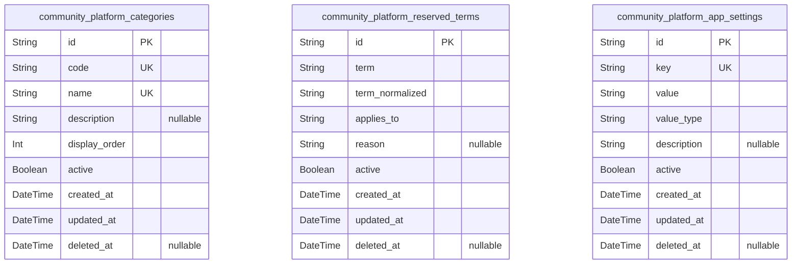
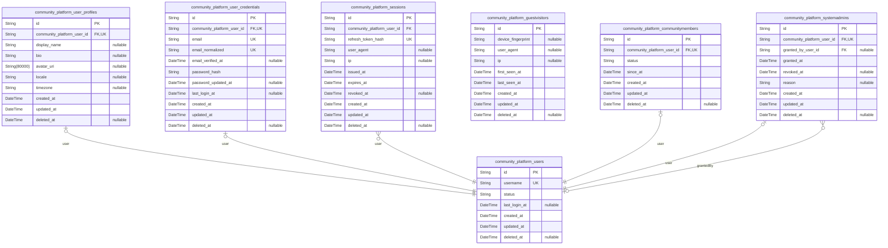
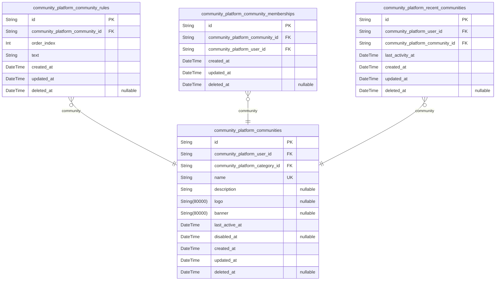
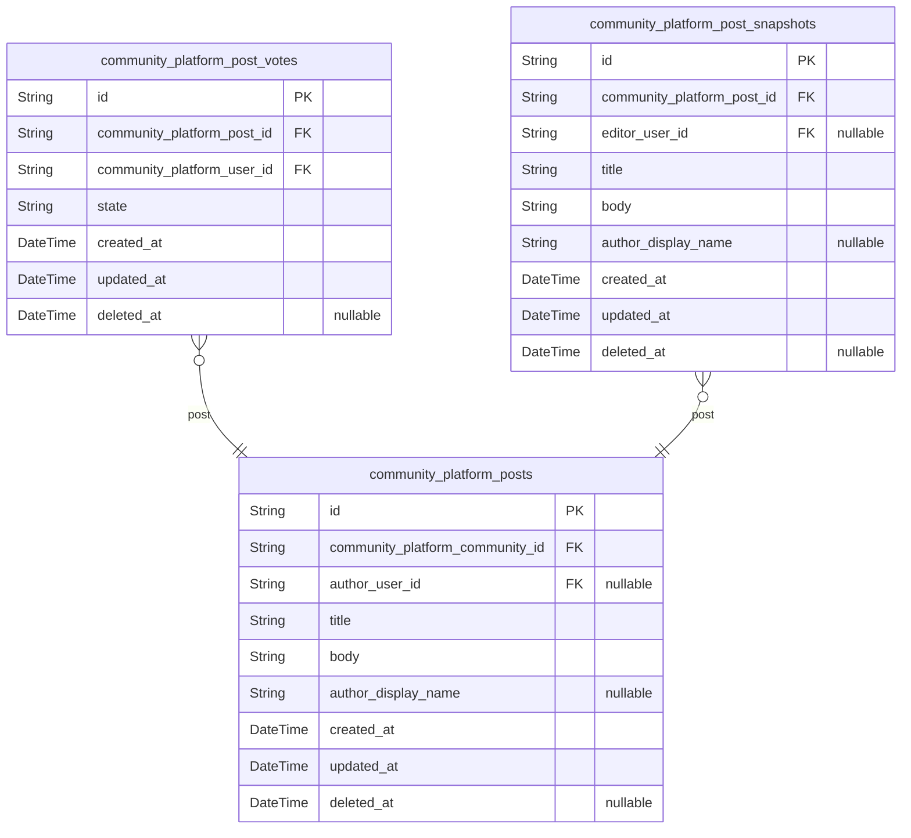
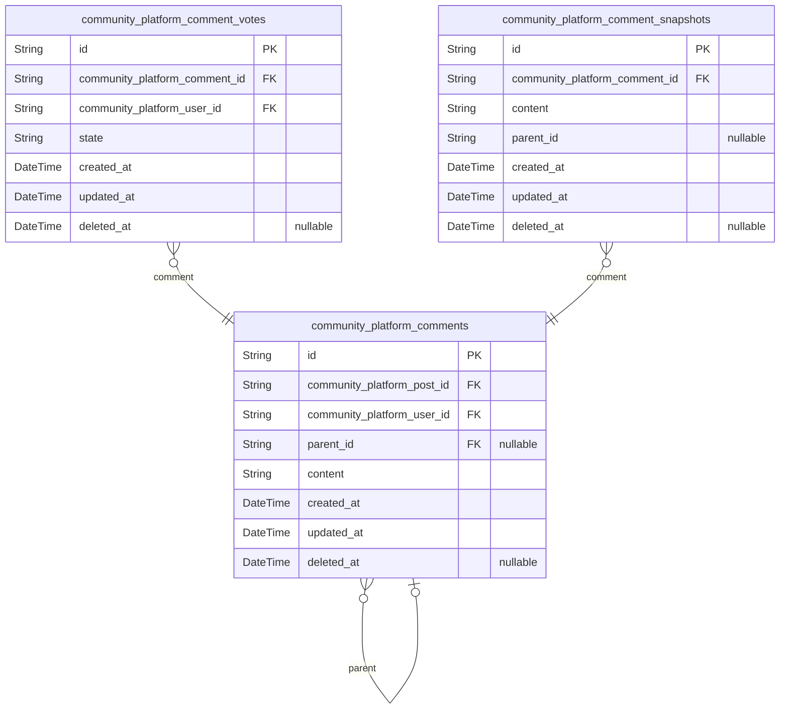
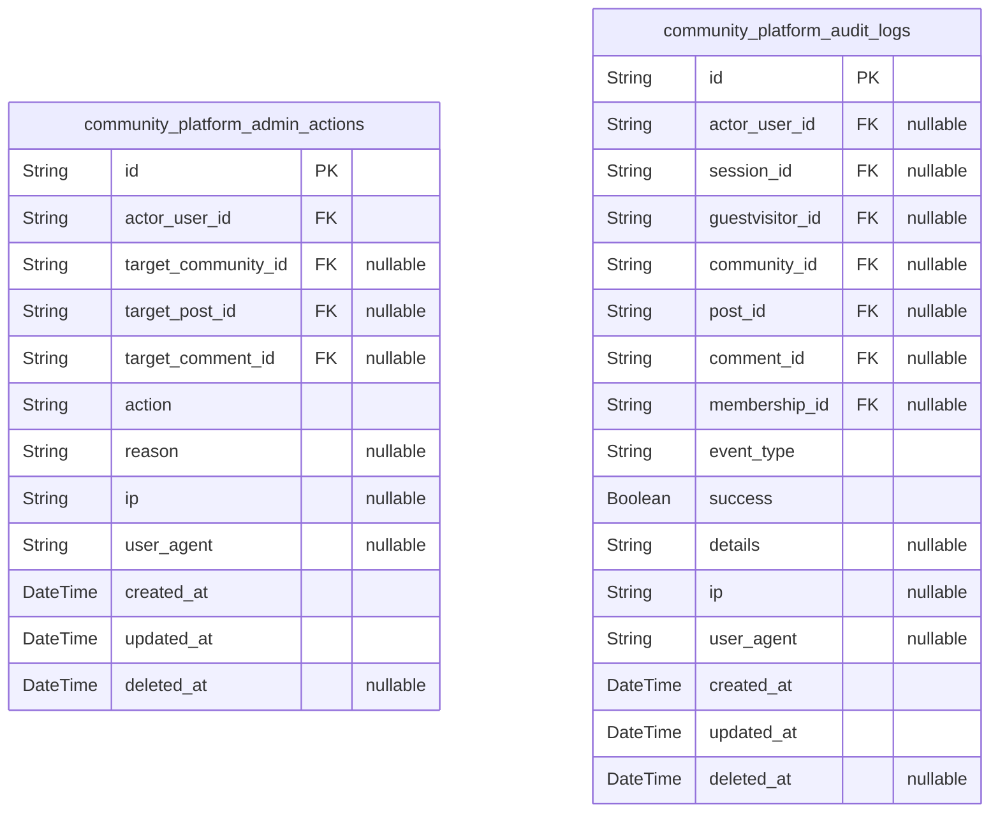
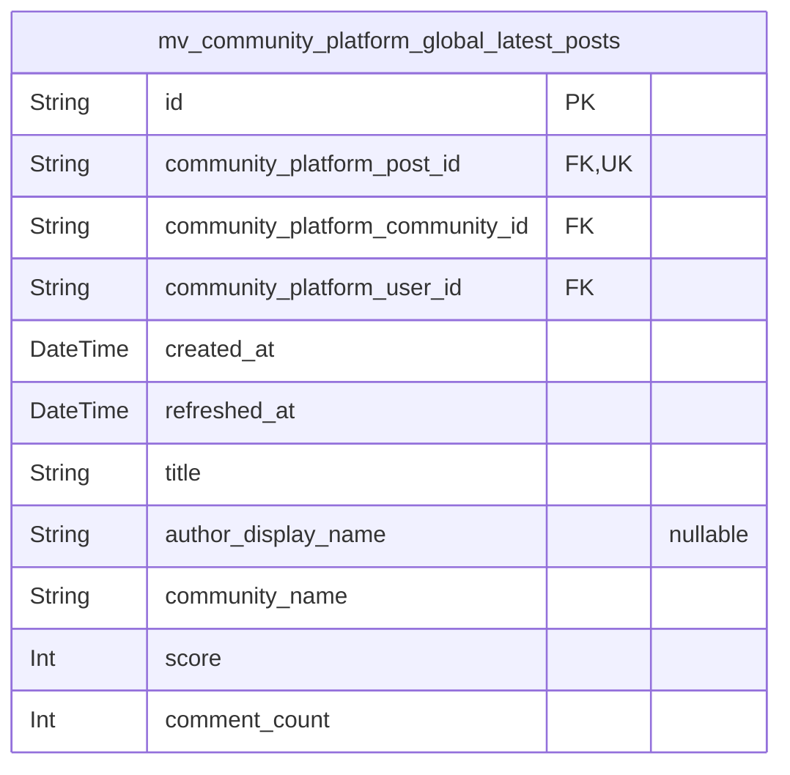

# Prisma Markdown

> Generated by [`prisma-markdown`](https://github.com/samchon/prisma-markdown)

- [Systematic](#systematic)
- [Actors](#actors)
- [Communities](#communities)
- [Posts](#posts)
- [Comments](#comments)
- [Audits](#audits)
- [default](#default)

## Systematic

### `community_platform_categories`

Canonical list of community categories used for Explore and filtering
across the platform. Managed by administrators and referenced by {@link
community_platform_communities} in other components. Contains business
key (code), human-readable name, and ordering/visibility controls.
Downstream entities should reference this table by ID or business code;
this table itself does not depend on business entities.

Properties as follows:

- `id`: Primary Key.
- `code`
  > Unique business identifier (slug-like) for the category. Used in URLs,
  > filters, and as a stable reference in configurations.
- `name`
  > Human-readable category name displayed to users in listings and filters.
  > Must be unique to avoid ambiguous display labels across the platform.
- `description`
  > Optional detailed description of the category for admin/reference
  > purposes.
- `display_order`: Ordering hint for UI presentation. Lower values appear earlier.
- `active`: Whether this category is currently enabled for selection and display.
- `created_at`: Creation timestamp.
- `updated_at`: Last update timestamp.
- `deleted_at`: Soft deletion timestamp. Null when not deleted.

### `community_platform_reserved_terms`

Administrative list of reserved terms used to validate and block specific
names or identifiers (e.g., community names, system-reserved words). Each
record captures the term and its normalized variant for case-insensitive
uniqueness within a specific application context (applies_to). No
external dependencies; consumed by validation logic in other components.

Properties as follows:

- `id`: Primary Key.
- `term`
  > Original reserved term as entered by an administrator. Used for display
  > and reference.
- `term_normalized`
  > Normalization of the term (e.g., lowercased) for case-insensitive
  > matching. Application logic is responsible for maintaining this value.
- `applies_to`
  > Target context to which this reservation applies (e.g., 'community_name',
  > 'global').
- `reason`: Optional administrative note explaining why the term is reserved.
- `active`: Whether the reservation is currently enforced.
- `created_at`: Creation timestamp.
- `updated_at`: Last update timestamp.
- `deleted_at`: Soft deletion timestamp. Null when not deleted.

### `community_platform_app_settings`

Key-value application configuration entries controlling platform behavior
(e.g., feature flags, policy values). Designed for administrator
management with descriptive metadata. Does not depend on business
entities; other domains read from this store.

Properties as follows:

- `id`: Primary Key.
- `key`
  > Unique configuration key name. Used to retrieve the setting
  > programmatically.
- `value`
  > Stored value for this setting as string. Application layer handles
  > parsing to the appropriate type.
- `value_type`
  > Semantic type of the value (e.g., 'string', 'int', 'boolean',
  > 'duration'). Used for validation and UI hints.
- `description`: Optional explanation of the setting’s purpose and expected format.
- `active`
  > Whether this setting is currently effective. Allows temporarily disabling
  > values without deletion.
- `created_at`: Creation timestamp.
- `updated_at`: Last update timestamp.
- `deleted_at`: Soft deletion timestamp. Null when not deleted.

## Actors

### `community_platform_users`

Core user identity entity representing authenticated accounts in the
platform. Serves as the parent for credentials, profile, and sessions.
Other role assignment tables such as {@link
community_platform_communitymembers} and {@link
community_platform_systemadmins} reference this entity. This table is the
central user record used across the system for authorship and
permissions.

Properties as follows:

- `id`: Primary Key.
- `username`
  > Unique public handle used to identify the account. Used for login
  > alternatives and search. Must be unique platform-wide.
- `status`
  > Account status lifecycle label (e.g., active, disabled, pending). Used by
  > administrative controls and guard checks.
- `last_login_at`: Timestamp of the last successful login for this account.
- `created_at`: Entity creation timestamp.
- `updated_at`: Last update timestamp.
- `deleted_at`
  > Soft deletion timestamp. When set, the record is considered removed from
  > active use.

### `community_platform_user_profiles`

Presentation-oriented profile information for a user, managed separately
from credentials for security and normalization. One-to-one with {@link
community_platform_users}. Typical fields include display name and avatar
URI. Managed through user settings and not used for authentication.

Properties as follows:

- `id`: Primary Key.
- `community_platform_user_id`: Owned user’s [community_platform_users.id](#community_platform_users).
- `display_name`
  > Public display name shown in UI. Suggested 0–32 characters; empty is
  > allowed and may default to a neutral label for display.
- `bio`: Optional short biography or intro text for the user profile.
- `avatar_uri`: Optional avatar image URI for the profile.
- `locale`: Optional locale preference tag (e.g., en-US).
- `timezone`: Optional preferred IANA timezone identifier (e.g., Asia/Seoul).
- `created_at`: Profile creation timestamp.
- `updated_at`: Profile last update timestamp.
- `deleted_at`: Soft deletion timestamp for the profile.

### `community_platform_user_credentials`

Authentication credentials bound to a single user. Contains email
identity and password hash. One-to-one with {@link
community_platform_users}. Supports email verification and password
rotation timestamps. Security-sensitive data; never stores plaintext
passwords. Adds email_normalized to enforce case-insensitive uniqueness
and faster lookups.

Properties as follows:

- `id`: Primary Key.
- `community_platform_user_id`: Owned user’s [community_platform_users.id](#community_platform_users).
- `email`
  > Login email address for the account (original casing). Must be unique
  > platform-wide and used for communications where applicable.
- `email_normalized`
  > Lowercased email for case-insensitive uniqueness and lookups. Application
  > must maintain this value in sync with email.
- `email_verified_at`: Timestamp when the email address was verified. Null if not verified.
- `password_hash`
  > BCrypt/Argon or similar password hash. Plaintext passwords must never be
  > stored.
- `password_updated_at`
  > Timestamp when the password was last changed to support security policy
  > checks.
- `last_login_at`: Timestamp of the last successful login using these credentials.
- `created_at`: Credentials creation timestamp.
- `updated_at`: Credentials last update timestamp.
- `deleted_at`: Soft deletion timestamp for the credentials record.

### `community_platform_sessions`

Issued sessions for authenticated users enabling access/refresh
workflows, sign-out from current/all devices, and revocation. Each
session belongs to one [community_platform_users](#community_platform_users). Stores token
hash rather than raw token for security. Adds composite index to optimize
active-session queries (by user_id, revoked_at, expires_at).

Properties as follows:

- `id`: Primary Key.
- `community_platform_user_id`: Session owner’s [community_platform_users.id](#community_platform_users).
- `refresh_token_hash`
  > Hash of the refresh token associated with this session. Prevents
  > plaintext token storage. Must be unique to avoid duplication.
- `user_agent`: Client user-agent string observed at session creation.
- `ip`: Client IP address observed at session creation.
- `issued_at`: Timestamp when the session was issued.
- `expires_at`: Timestamp when the session will expire without renewal.
- `revoked_at`: Timestamp when this session was revoked (sign-out). Null if still active.
- `created_at`: Record creation timestamp.
- `updated_at`: Record last update timestamp.
- `deleted_at`: Soft deletion timestamp for the session record.

### `community_platform_guestvisitors`

Anonymous visitor representations used for sessionless interactions
analytics and guard flows. Not tied to authenticated accounts. Provides
minimal device fingerprinting context and last seen timestamps. This
model is supporting and not user-managed directly.

Properties as follows:

- `id`: Primary Key.
- `device_fingerprint`
  > Optional opaque device/browser fingerprint used to correlate guest
  > activity.
- `user_agent`: Observed user-agent string for the guest visitor.
- `ip`: Observed IP address for the guest visitor.
- `first_seen_at`: First observed timestamp for this guest visitor.
- `last_seen_at`: Most recent observed timestamp for this guest visitor.
- `created_at`: Record creation timestamp.
- `updated_at`: Record last update timestamp.
- `deleted_at`: Soft deletion timestamp for the guest visitor record.

### `community_platform_communitymembers`

Role assignment table indicating that a [community_platform_users](#community_platform_users)
holds the communityMember role. Used for permission checks, analytics,
and onboarding workflows. One row per user (unique), with lifecycle
timestamps for activation/suspension.

Properties as follows:

- `id`: Primary Key.
- `community_platform_user_id`: Assigned user’s [community_platform_users.id](#community_platform_users).
- `status`: Lifecycle status of the membership capability (e.g., active, suspended).
- `since_at`: Timestamp when the communityMember role became effective.
- `created_at`: Record creation timestamp.
- `updated_at`: Record last update timestamp.
- `deleted_at`: Soft deletion timestamp for this role assignment.

### `community_platform_systemadmins`

Role assignment table indicating that a [community_platform_users](#community_platform_users)
holds the systemAdmin role. Supports administrative governance with
grant/revoke tracking and optional reason text. Enables independent
management and audit of elevated privileges.

Properties as follows:

- `id`: Primary Key.
- `community_platform_user_id`: Admin user’s [community_platform_users.id](#community_platform_users).
- `granted_by_user_id`
  > Granting actor’s [community_platform_users.id](#community_platform_users). Null when
  > system-initialized.
- `granted_at`: Timestamp when administrative privileges were granted.
- `revoked_at`: Timestamp when administrative privileges were revoked, if applicable.
- `reason`: Optional reason or notes for the grant/revocation for audit context.
- `created_at`: Record creation timestamp.
- `updated_at`: Record last update timestamp.
- `deleted_at`: Soft deletion timestamp for this role assignment.

## Communities

### `community_platform_communities`

Primary entity representing a public sub-community (e.g., /c/ai). Stores
immutable unique name, optional metadata (description, logo, banner),
categorization, and lifecycle state. Owned by a user from {@link
community_platform_users}. Related ordered rules are stored in {@link
community_platform_community_rules}. Memberships are recorded in {@link
community_platform_community_memberships}. Recent per-user activity is
tracked in [community_platform_recent_communities](#community_platform_recent_communities). The name is
immutable after creation (enforced in application logic). "disabled_at"
indicates a non-destructive administrative disablement (no new
posts/comments, hidden from promotion surfaces).

Properties as follows:

- `id`: Primary Key.
- `community_platform_user_id`: Owner account's [community_platform_users.id](#community_platform_users).
- `community_platform_category_id`: Assigned category's [community_platform_categories.id](#community_platform_categories).
- `name`
  > Unique community identifier (3–32 chars, letters, digits, hyphen,
  > underscore). Must be case-insensitively unique service-wide.
- `description`: Optional human-readable description for the community.
- `logo`: Optional logo image URI for the community.
- `banner`: Optional banner image URI for the community.
- `last_active_at`
  > Timestamp of the most recent activity relevant to the community
  > (post/comment/join/leave). Used for display and sorting in explore views.
- `disabled_at`
  > When set, the community is disabled by administrators; new posts/comments
  > are blocked and the community is hidden from promotion surfaces.
- `created_at`: Creation timestamp.
- `updated_at`: Last update timestamp.
- `deleted_at`: Soft deletion timestamp. Null when active.

### `community_platform_community_rules`

Ordered list of short rule items authored by the community owner to set
participation expectations. Each record belongs to a {@link
community_platform_communities} and includes a stable order_index to
control display order. Managed via community settings; not independently
searched.

Properties as follows:

- `id`: Primary Key.
- `community_platform_community_id`: Belonged community's [community_platform_communities.id](#community_platform_communities).
- `order_index`
  > Display order (1-based or 0-based as defined by application). Unique per
  > community to preserve deterministic ordering.
- `text`
  > Rule text content (1–200 characters). Display may truncate; stored text
  > remains intact.
- `created_at`: Creation timestamp of this rule item.
- `updated_at`: Last update timestamp of this rule item.
- `deleted_at`: Soft deletion timestamp. Null when active.

### `community_platform_community_memberships`

Junction table capturing membership between a user {@link
community_platform_users} and a community {@link
community_platform_communities}. Drives personalization (Home feed
inclusion) and enables quick checks of join state. Each user may have at
most one membership per community. Soft deletion (deleted_at) records
leave time; active memberships have deleted_at = null.

Properties as follows:

- `id`: Primary Key.
- `community_platform_community_id`: Joined community's [community_platform_communities.id](#community_platform_communities).
- `community_platform_user_id`: Member user's [community_platform_users.id](#community_platform_users).
- `created_at`: Membership creation timestamp (join time).
- `updated_at`: Last update timestamp (e.g., for auditing).
- `deleted_at`: Soft deletion timestamp (leave time). Null when active.

### `community_platform_recent_communities`

Per-user recency tracker for communities interacted with or visited.
Maintains up to 5 communities by most recent activity for each user.
Supports quick rendering of the left sidebar list. Not a source of truth
for membership but often correlated with {@link
community_platform_community_memberships}.

Properties as follows:

- `id`: Primary Key.
- `community_platform_user_id`: The user's [community_platform_users.id](#community_platform_users).
- `community_platform_community_id`: Related community's [community_platform_communities.id](#community_platform_communities).
- `last_activity_at`
  > Timestamp of the most recent eligible activity involving this user and
  > community (visit, post, comment, vote, join/leave). Used to order the
  > top-5 list.
- `created_at`: Creation timestamp.
- `updated_at`: Last update timestamp.
- `deleted_at`: Soft deletion timestamp. Null when active.

## Posts

### `community_platform_posts`

Primary posts authored by users within exactly one community. Each record
represents a text-only post with title, body, and an optional author
display name used for presentation (e.g., "Anonymous" when empty). Posts
are independently created, searched, and moderated, forming a core
content entity. Relationships: belongs to a {@link
community_platform_communities} and an author {@link
community_platform_users}. Voting and comment entities reference this
table, and historical edits are preserved in {@link
community_platform_post_snapshots}. No calculated fields (e.g., score,
counts) are stored here; those are derived via queries or materialized
views. Author linkage is nullable to support account closure with
anonymization; on user deletion, the author reference is set to null
rather than cascading content deletion.

Properties as follows:

- `id`: Primary Key.
- `community_platform_community_id`: Belonged community's [community_platform_communities.id](#community_platform_communities).
- `author_user_id`
  > Author account's [community_platform_users.id](#community_platform_users). Nullable to enable
  > anonymization on account deletion while retaining content.
- `title`
  > Post title shown in feeds and detail. Business constraints: length 5–120
  > characters enforced at application level.
- `body`
  > Post body as plain text with line breaks only (no scripts/code). Business
  > constraints: length 10–10,000 characters enforced at application level.
- `author_display_name`
  > Optional author display name (0–32 chars). When empty, display a default
  > such as "Anonymous". Stored for presentation only; does not affect
  > authorship.
- `created_at`: Creation timestamp of the post (used for Newest sort and tie-breakers).
- `updated_at`: Last update timestamp of the post (editing).
- `deleted_at`: Soft deletion timestamp. Null means the post is active.

### `community_platform_post_votes`

Per-user vote state for posts. Captures a single state per (user, post)
with allowed values managed at application level. Absence of a row
represents the "None" state. To align with comment votes, the canonical
values should be lower-case "up" | "down". Supports score computation
(upvotes − downvotes) and the voting state machine. References {@link
community_platform_posts} and [community_platform_users](#community_platform_users).

Properties as follows:

- `id`: Primary Key.
- `community_platform_post_id`: Target post's [community_platform_posts.id](#community_platform_posts).
- `community_platform_user_id`: Voter account's [community_platform_users.id](#community_platform_users).
- `state`
  > Canonical voting state value. Recommended values (to match comment
  > votes): "up" for upvote, "down" for downvote. The "None" state is
  > represented by absence of a record.
- `created_at`: Creation timestamp of this vote record (initial state time).
- `updated_at`: Last update timestamp of this vote record (when state changes).
- `deleted_at`: Soft deletion timestamp. Null means the vote record is active.

### `community_platform_post_snapshots`

Historical snapshots of post content for audit/versioning. Each record
captures a point-in-time state of a post’s mutable fields (title, body,
author_display_name) to provide an immutable history of edits. References
the source [community_platform_posts](#community_platform_posts) and optionally an editor
[community_platform_users](#community_platform_users). Append-only in practice; used for audit
trails and temporal analysis.

Properties as follows:

- `id`: Primary Key.
- `community_platform_post_id`: Source post's [community_platform_posts.id](#community_platform_posts).
- `editor_user_id`
  > Optional editor account's [community_platform_users.id](#community_platform_users) who created
  > this snapshot (if different from author).
- `title`: Snapshot of the post title at the time of change.
- `body`: Snapshot of the post body (plain text) at the time of change.
- `author_display_name`: Snapshot of the post's author display name at the time of change (if any).
- `created_at`: Snapshot creation timestamp (represents the point-in-time state).
- `updated_at`
  > Timestamp when this snapshot metadata was last modified (rare; snapshots
  > are effectively append-only).
- `deleted_at`
  > Soft deletion timestamp for this snapshot record, if ever needed for
  > administrative purposes.

## Comments

### `community_platform_comments`

User-authored comment entities for discussion threads. Each comment
belongs to a post and may optionally reply to another comment (nested
threading via self-reference). Authors can edit/delete their own
comments; audit history is captured in {@link
community_platform_comment_snapshots}. Votes on comments are stored in
[community_platform_comment_votes](#community_platform_comment_votes). Parent relation uses ON DELETE
SET NULL to avoid unintended cascade deletions when hard-deleting a
parent; soft deletion is the default behavior via deleted_at.

Properties as follows:

- `id`: Primary Key.
- `community_platform_post_id`
  > Target post’s [community_platform_posts.id](#community_platform_posts). Required association
  > that determines the comment’s container post.
- `community_platform_user_id`
  > Author user’s [community_platform_users.id](#community_platform_users). Identifies who created
  > the comment.
- `parent_id`
  > Optional parent comment’s [community_platform_comments.id](#community_platform_comments) for
  > nested reply threading. Uses ON DELETE SET NULL to preserve child
  > comments when a parent is hard-deleted.
- `content`
  > Plain-text comment body. Business constraints: 2–2,000 characters; no
  > executable code. Stored as raw text for search and display.
- `created_at`: Creation timestamp of the comment (UTC).
- `updated_at`: Last update timestamp of the comment (UTC). Updated when content changes.
- `deleted_at`
  > Soft deletion timestamp (UTC). Null when the comment is active; non-null
  > indicates removal from public view.

### `community_platform_comment_votes`

Per-user voting state for comments. Each record represents a single
user’s current vote on a specific comment, enforcing one vote per
(comment, user). States are stored as raw strings (e.g., "Upvote" or
"Downvote"). Absence of a record represents the "None" state. Used to
compute scores (upvotes − downvotes).

Properties as follows:

- `id`: Primary Key.
- `community_platform_comment_id`: Target comment’s [community_platform_comments.id](#community_platform_comments).
- `community_platform_user_id`: Voter user’s [community_platform_users.id](#community_platform_users).
- `state`
  > Voting state value. Expected values enforced in application logic:
  > "Upvote" or "Downvote". The "None" state is represented by absence of a
  > record.
- `created_at`: Creation timestamp of this vote record (UTC).
- `updated_at`
  > Last update timestamp of this vote record (UTC). Changes when vote state
  > toggles.
- `deleted_at`
  > Soft deletion timestamp (UTC). Null for active votes; non-null if
  > logically removed.

### `community_platform_comment_snapshots`

Historical point-in-time records capturing the content state of {@link
community_platform_comments}. Created whenever content changes to
preserve audit trails and enable version history review. Append-only
usage is typical.

Properties as follows:

- `id`: Primary Key.
- `community_platform_comment_id`
  > The source comment’s [community_platform_comments.id](#community_platform_comments) whose state
  > is captured by this snapshot.
- `content`
  > Point-in-time plain-text content of the comment as captured by this
  > snapshot.
- `parent_id`
  > Parent comment identifier captured at snapshot time (if any). Stored for
  > historical accuracy without enforcing referential updates.
- `created_at`: Snapshot creation timestamp (UTC).
- `updated_at`
  > Administrative timestamp for this snapshot record (UTC). Typically equal
  > to created_at as snapshots are append-only.
- `deleted_at`
  > Soft deletion timestamp if the snapshot record is ever logically removed
  > (rare). Null in normal operation.

## Audits

### `community_platform_admin_actions`

Administrative actions executed by platform administrators for policy
enforcement. Each record is an immutable, append-only snapshot of an
action taken against a target resource. Common targets include
communities, posts, and comments. The actor is the admin user who
performed the action. This table enables audit and compliance reviews and
incident investigations.

Key relationships:
- Actor admin user via [community_platform_users](#community_platform_users)
- Optional target community via [community_platform_communities](#community_platform_communities)
- Optional target post via [community_platform_posts](#community_platform_posts)
- Optional target comment via [community_platform_comments](#community_platform_comments)

Behavioral notes:
- Records are append-only to preserve audit integrity (snapshot stance).
- "action" stores the canonical action key (e.g., "disable_community",
"delete_post", "remove_comment").
- Free-text "reason" may contain policy references or case notes.
- onDelete configured to preserve audit records (Restrict/SetNull as
appropriate).

Properties as follows:

- `id`: Primary Key.
- `actor_user_id`
  > Administrator who performed the action. Target model's {@link
  > community_platform_users.id}
- `target_community_id`
  > Target community for the action, if applicable. Target model's {@link
  > community_platform_communities.id}
- `target_post_id`
  > Target post for the action, if applicable. Target model's {@link
  > community_platform_posts.id}
- `target_comment_id`
  > Target comment for the action, if applicable. Target model's {@link
  > community_platform_comments.id}
- `action`
  > Canonical action identifier describing what was performed (e.g.,
  > "disable_community", "delete_post", "remove_comment"). Used for policy
  > analytics and classification.
- `reason`
  > Free-text reason, including policy references or moderator notes
  > explaining the action context.
- `ip`
  > IP address observed for the actor’s session at action time, recorded for
  > security/audit review.
- `user_agent`
  > User agent string observed for the actor’s session, aiding forensic
  > analysis.
- `created_at`: Creation timestamp when the admin action snapshot was recorded.
- `updated_at`
  > Last update timestamp for this record (typically same as creation;
  > retained for consistency).
- `deleted_at`
  > Soft deletion timestamp when the entry was logically removed from active
  > views (retained for audit retention windows).

### `community_platform_audit_logs`

General-purpose audit trail capturing significant user and system events
for observability and compliance. Events include joins/leaves, votes,
content creation/deletion, authentication-related activities, and other
domain actions. Designed as an append-only snapshot log to support
investigations, analytics, and anomaly detection.

Key relationships:
- Actor user (optional) via [community_platform_users](#community_platform_users) for
authenticated events
- Session (optional) via [community_platform_sessions](#community_platform_sessions) for correlation
- Guest visitor (optional) via [community_platform_guestvisitors](#community_platform_guestvisitors)
for unauthenticated events
- Optional resource targets via [community_platform_communities](#community_platform_communities),
[community_platform_posts](#community_platform_posts), [community_platform_comments](#community_platform_comments),
[community_platform_community_memberships](#community_platform_community_memberships)

Behavioral notes:
- Append-only historical records (snapshot stance) with outcome flag
(success) and optional details for context.
- Polymorphic targeting is realized via nullable FKs to specific resource
tables (only one is typically populated per record).
- onDelete configured to SetNull for all optional foreign keys to
preserve the audit log when targets are deleted.

Properties as follows:

- `id`: Primary Key.
- `actor_user_id`
  > Authenticated actor who triggered the event, if any. Target model's
  > [community_platform_users.id](#community_platform_users)
- `session_id`
  > Correlated application session for the event, if tracked. Target model's
  > [community_platform_sessions.id](#community_platform_sessions)
- `guestvisitor_id`
  > Guest visitor identity for unauthenticated events, if tracked. Target
  > model's [community_platform_guestvisitors.id](#community_platform_guestvisitors)
- `community_id`
  > Related community for the event, if applicable. Target model's {@link
  > community_platform_communities.id}
- `post_id`
  > Related post for the event, if applicable. Target model's {@link
  > community_platform_posts.id}
- `comment_id`
  > Related comment for the event, if applicable. Target model's {@link
  > community_platform_comments.id}
- `membership_id`
  > Related membership for join/leave or membership-related events, if
  > applicable. Target model's {@link
  > community_platform_community_memberships.id}
- `event_type`
  > Canonical event type key (e.g., "join_community", "leave_community",
  > "post_created", "comment_deleted", "vote_toggled", "login", "logout").
- `success`
  > Whether the attempted event resulted in a successful outcome (true) or
  > failed (false).
- `details`
  > Optional free-text details to provide context (e.g., validation errors,
  > policy notes, or server messages).
- `ip`
  > IP address observed for the actor’s session or request, for security and
  > forensic purposes.
- `user_agent`: User agent string observed for the client at event time, aiding analysis.
- `created_at`: Creation timestamp when the audit log entry was recorded.
- `updated_at`
  > Last update timestamp for this record (typically same as creation;
  > retained for consistency).
- `deleted_at`
  > Soft deletion timestamp when the entry was logically removed from active
  > views (retained for audit retention windows).

## default

### `mv_community_platform_global_latest_posts`

Materialized view that caches the sitewide 10 most recent posts for the
Global Latest sidebar. It denormalizes display-critical fields for fast
read access and applies business tie-breakers primarily by creation time.
Records reference the authoritative [community_platform_posts](#community_platform_posts),
their owning [community_platform_communities](#community_platform_communities), and the author
[community_platform_users](#community_platform_users). Data is refreshed by background jobs;
users do not write to this table directly.

Properties as follows:

- `id`: Primary Key.
- `community_platform_post_id`
  > Referenced post's [community_platform_posts.id](#community_platform_posts). One row per post
  > within this MV.
- `community_platform_community_id`: Owning community's [community_platform_communities.id](#community_platform_communities).
- `community_platform_user_id`: Author user's [community_platform_users.id](#community_platform_users).
- `created_at`: Original post creation timestamp used for recency ordering (Newest).
- `refreshed_at`: Timestamp when this MV row was last refreshed/materialized.
- `title`: Denormalized post title for display on the Global Latest card.
- `author_display_name`
  > Denormalized author display name for presentation; may be empty or null
  > if not provided by the author at post time.
- `community_name`
  > Denormalized community unique name (immutable identifier) used for
  > display such as /c/{name}.
- `score`
  > Denormalized score (upvotes − downvotes) at refresh time for the
  > referenced post.
- `comment_count`
  > Denormalized total number of comments at refresh time for the referenced
  > post.
