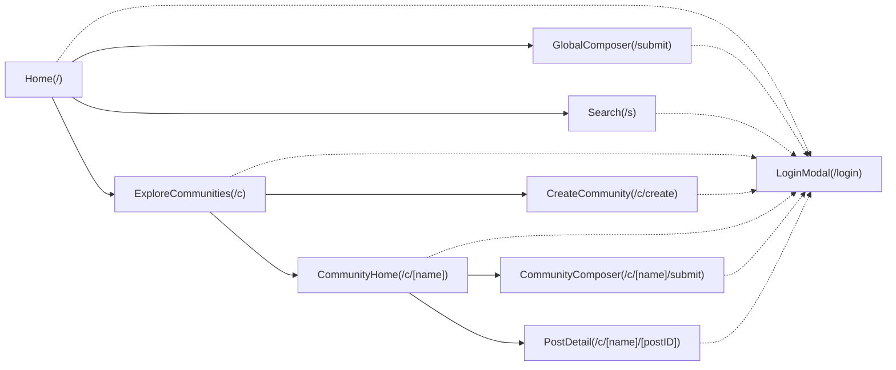
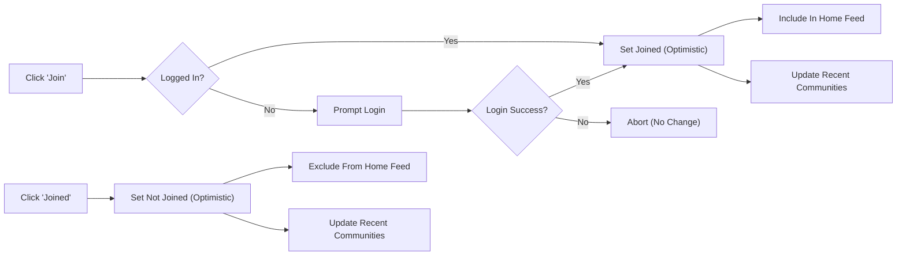
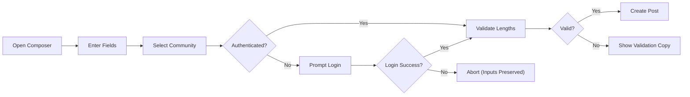
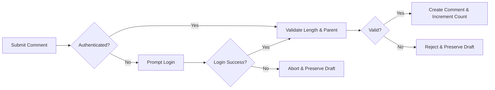
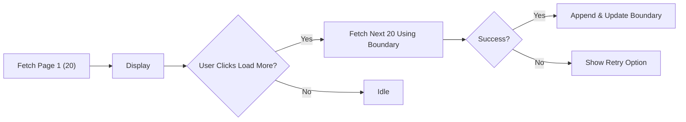
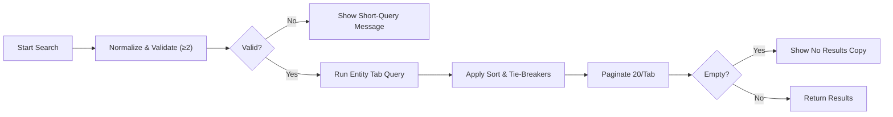
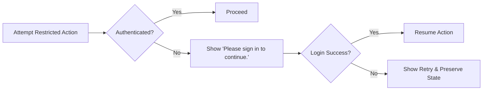

# Community Platform — Functional Business Requirements (communityPlatform)

## Vision and Scope
Enable topic-based sub-communities where everyone can read, and logged-in users can create communities, post, comment, vote, and join/leave. Prioritize smooth, low-friction flows with long-lived sessions and resume-after-login. Provide deterministic sorting, simple pagination, and predictable behaviors across Home, Community, Post Detail, and Search.

- THE platform SHALL keep reading open to everyone (guestVisitor).
- THE platform SHALL require authentication for posting, commenting, voting, creating sub-communities, and joining/leaving.
- THE platform SHALL enforce account-based ownership for editing/deleting posts and comments; only authors may modify their items (siteAdmin override for policy/legal compliance).
- THE platform SHALL minimize validation while enforcing essential constraints only.
- THE platform SHALL implement deterministic sorting and clear pagination rules across surfaces.

## Roles and Access Model
Roles
- guestVisitor: Unauthenticated; read-only across public content and search.
- registeredMember: Authenticated; may create communities, post, comment, vote, join/leave; may edit/delete only authored content; may edit/delete communities they created (name immutable).
- siteAdmin: Administrative; may remove or edit any content and act on accounts/communities for policy/legal reasons.

Global EARS
- THE platform SHALL allow reading of public content to all roles.
- THE platform SHALL require login for any write action (post/comment/vote/create/join/leave).
- THE platform SHALL enforce author guard: only the author may edit/delete their posts/comments; community editing/deletion reserved for the creator (name immutable) or siteAdmin.

## Information Architecture and Sitemap
Global Layout Duties
- Left Sidebar (fixed on all pages): Home, Explore, Create (community), Recent Communities (up to 5 by most recent activity; default icon shown if none).
- Main Content: Page primary content; adheres to sort and pagination rules.
- Right Sidebar: Contextual—Home shows Global Latest (10 newest across all communities); Community pages show Community Info + Rules.

Mermaid — Sitemap


EARS (IA)
- THE platform SHALL render Left Sidebar, Main Content, and Right Sidebar on all pages.
- THE Right Sidebar on Home SHALL show "Global Latest" with exactly 10 newest posts; no pagination.
- THE Right Sidebar on Community pages SHALL show "Community Info + Rules" with specified fields.
- THE Left Sidebar SHALL include Recent Communities (up to 5), ordered by most recent activity; update immediately on relevant interactions.

## Page-Level Requirements (A–I)

### A) Home (/)
- Sort control: Dropdown [Newest | Top].
- Main feed: 20 post cards per load; [Load more] appends next 20; for authenticated users, include only posts from joined communities. WHERE a user has joined none, show latest or top across all communities plus guidance to explore/join.
- Post card fields: community name (e.g., "/c/ai"), title, author display name (or "Anonymous"), relative time, comment count, score (upvotes − downvotes).
- Right Sidebar: Global Latest (10 newest posts sitewide) with community name, single-line title (ellipsis if long), relative time.
- Guard: Attempting post/comment/vote while unauthenticated triggers login; upon success, resume the original action.

EARS (Home)
- WHEN sort is Newest, THE Home feed SHALL apply Newest ordering and tie-breakers.
- WHEN sort is Top, THE Home feed SHALL apply Top ordering and tie-breakers.
- THE Home feed SHALL display 20 cards per page; Load more appends next 20.
- WHERE the user has no joined communities, THE Home feed SHALL show sitewide posts per selected sort and surface guidance to explore/join.

### B) Sub-Community Home (/c/[name])
- Header: Community logo (default if absent), Create Post button, Join ↔ Joined toggle.
- Sort toggle: [Newest | Top].
- Inline composer available when logged in; otherwise, guarded.
- List: 20 post cards per load; [Load more] for next 20.
- Right Sidebar: Community Info (name, short description, created date optional, last active optional), Rules section with title "Community Rules" showing top 5 numbered rules (each up to ~2 lines).

EARS (Community)
- THE page SHALL be readable by all roles.
- WHEN Join is toggled by a logged-in user, THE page SHALL update button state immediately (optimistic) and include/exclude the community in the user’s Home feed on subsequent loads; Recent Communities updates immediately.

### C) Post Detail (/c/[name]/[postID])
- Top: Community mini-info (name + small logo), Back.
- Body: Title, author, relative time; full post content; below show vote controls, score, comment count.
- Comments: Composer then 20 comments; [Load more] appends next 20; nested replies supported.
- Edit/Delete visible only on items authored by the current user; siteAdmin override for policy/legal.
- Right Sidebar: Community Info + Rules (as above).

EARS (Post Detail)
- THE page SHALL show post content and current score/comment count.
- THE page SHALL list 20 comments per page with Load more and support nesting.
- WHEN session expires during comment or vote, THE page SHALL prompt re-login and resume the action upon success.

### D) Global Post Composer (/submit)
- Fields: Community selector (required), Title (5–120), Body (10–10,000, plain text/line breaks only; scripts/code prohibited), Author display name (optional 0–32), Submit.
- Guard: If logged out on submit, prompt login and resume submission with inputs intact.

EARS (Global Composer)
- THE composer SHALL block submission when no community is selected with copy "Please choose a community to post in.".
- THE composer SHALL enforce Title and Body length ranges and display name bounds.

### E) Create a Community (/c/create)
- Fields: Name, Description, Logo/Banner (optional), Rules (optional), Category (single selection from fixed set), Create.
- On success: Navigate to community home.

EARS (Create Community)
- THE flow SHALL require login and check name format and uniqueness.
- THE community name SHALL be immutable after creation.
- THE creator SHALL be set as owner and may edit metadata (not name) and delete the community.

### F) Global Search (/s)
- Input: Large search box with placeholder "Search communities, posts, and comments (2+ characters)"; keep focus.
- Tabs: Posts (default), Sub-Communities, Comments.
- Pagination: 20 results per page per tab; [Load more] appends next 20.
- Sorting: Posts—[Newest | Top] (default Newest). Sub-Communities—[Name Match | Recently Created] (default Name Match). Comments—[Newest].
- Empty states: "Please enter at least 2 characters."; "No matching results. Try different keywords."

EARS (Search)
- IF query length < 2 after normalization, THEN no search executes and the short-query message is presented.
- THE Posts tab SHALL match on title/body and provide all card fields including score and comment count.
- THE Sub-Communities tab SHALL present Join | Joined button state per user.
- THE Comments tab SHALL show a two-line snippet, author, relative time, parent post title (link), community name.

### G) Explore Sub-Communities (/c)
- Category chips filter the grid by category.
- Community grid: 20 cards per load; [Load more] appends next 20.
- Card fields: Logo (default if none), community name, member count, Join button; body shows description (up to 2 lines).

EARS (Explore)
- WHEN a category chip is selected, THE grid SHALL filter to that category.
- THE grid SHALL present 20 results per page and allow Load more for next 20.

### H) Community-Specific Post Composer (/c/[name]/submit)
- Same as global composer with community pre-selected; user may change before submit.

EARS (Community Composer)
- THE composer SHALL enforce the same validation and display name rules as global composer.

### I) Login & Sign Up (/login modal)
- Inputs: identifier (email or username), password; buttons [Sign in] / [Sign up].
- Errors: Simple retry message on failure.
- On success: Return to previous page and resume the in-progress action.

EARS (Login Modal)
- WHEN invoked via guest guard, THE modal SHALL resume the originating action upon successful authentication.
- WHEN login fails, THE modal SHALL present "Login failed. Please try again." and remain responsive.

## Sub-Communities — Business Rules
Creation and Inputs
- Required: Unique name (alphanumeric, hyphen "-", underscore "_"; length 3–30; starts/ends alphanumeric; no double separators), single category from fixed set.
- Optional: Description (≤500 chars), Logo/Banner, Rules (≤20 items, short text each).
- Creator becomes owner and is auto-joined.

Editing and Deletion
- Editable by owner/siteAdmin: description, logo, banner, rules, category.
- Name is immutable.
- Deletion by owner/siteAdmin removes community and all posts; appears atomic to users.

Join/Leave and Member Count
- Join/Leave requires login; toggles are idempotent and optimistic; updates Recent Communities immediately; home feed inclusion/exclusion changes accordingly; no moderation rights conferred.
- Member count equals number of distinct joined users; reflect changes consistently and abbreviate large numbers.

Right Sidebar — Community Info + Rules
- Show community name, short description, created date (optional), last active (optional), logo (default if none), and "Community Rules" (top 5 numbered, each up to ~2 lines).

Errors and Messages
- Name taken: "This name is already in use."
- Invalid name: "This name isn’t available. Please choose something simpler."
- Temporary error: "A temporary error occurred. Please try again in a moment."

EARS (Communities)
- THE platform SHALL require unique, well-formed names and one category at creation.
- THE platform SHALL auto-join the creator upon successful creation and navigate to the community home.
- WHEN a user toggles Join ↔ Joined, THE platform SHALL update state immediately and reconcile server-side.
- WHEN a community is deleted, THE platform SHALL remove it and all its posts from public views.

Mermaid — Join/Leave Flow


## Posts — Business Rules
Composition
- Title: 5–120 chars. Body: 10–10,000 chars; plain text, line breaks; scripts/code prohibited. Author display name: 0–32 chars; default "Anonymous" if empty.
- Target community selection is required (reject with "Please choose a community to post in.").

Ownership and Permissions
- Only the author may edit/delete their post; siteAdmin override permitted for compliance.
- Posting does not require membership in the target community.

Card Display Fields
- Community name (e.g., "/c/ai"), title, author, relative time, comment count, score.

Deletion Effects
- Remove post from all lists (Home, Community, Global Latest, Search, Post Detail); hide its comments; prevent further interactions; update counts and scores.

EARS (Posts)
- THE platform SHALL enforce title/body/display name constraints and community selection.
- THE platform SHALL treat title/body as plain text and neutralize executable content.
- THE platform SHALL present post cards with required fields and relative time in user’s local timezone.

Mermaid — Post Creation (Guest Guard)


## Comments — Business Rules
Creation and Structure
- Length: 2–2,000 chars; plain text and line breaks; no executable code.
- Nested replies supported (max depth 8 levels, including root at depth 1).
- Pagination: 20 root comments per page; replies paginate in 20s within threads.

Ownership and Soft-Deletion
- Only the author may edit/delete their comments; siteAdmin override allowed.
- Soft-delete comments with neutral placeholder; retain replies; exclude soft-deleted comments from post’s visible comment count.

Ordering
- Default order: Newest for root comments and replies using tie-breakers.

EARS (Comments)
- THE platform SHALL accept comments for existing posts and valid parents; preserve user content on transient errors.
- THE platform SHALL enforce length limits and nesting depth.
- THE platform SHALL paginate 20 root comments and 20 replies per fetch using Newest order.

Mermaid — Comment Flow


## Voting — Business Rules
Vote States and Transitions
- Single state per user per item (post/comment): None, Upvote, Downvote.
- Transitions: None→Upvote, None→Downvote, Upvote→None, Downvote→None, Upvote→Downvote, Downvote→Upvote.
- Self-vote prohibited; show copy "You can’t vote on your own posts/comments."; state remains None.

Score Calculation
- Score = upvotes − downvotes; update visible score on changes; abbreviate large numbers per copy rules.

Optimistic UI
- Reflect vote state and score immediately; reconcile with server; on error, revert and show temporary error copy.

EARS (Voting)
- THE platform SHALL maintain one of {None, Upvote, Downvote} per user per item.
- THE platform SHALL compute score as upvotes minus downvotes.
- WHEN a user toggles a vote, THE platform SHALL apply transitions deterministically and block self-vote.

Mermaid — Voting State Machine
```mermaid
stateDiagram-v2
    direction LR
    [*] --> "None"
    "None" --> "Upvote": "Click Upvote"
    "None" --> "Downvote": "Click Downvote"
    "Upvote" --> "None": "Click Upvote"
    "Downvote" --> "None": "Click Downvote"
    "Upvote" --> "Downvote": "Click Downvote"
    "Downvote" --> "Upvote": "Click Upvote"
```

## Sorting and Pagination — Deterministic Rules
Definitions
- Identifier: Monotonically increasing unique ID assigned at creation; larger identifier indicates more recent generation.

Sort Orders
- Newest: Order by created time desc; tie-break by identifier desc.
- Top: Order by score desc; tie-break by created time desc; if still tied, identifier desc.

Pagination Sizes
- Main feeds (Home, Community): 20 per page; Load more appends next 20.
- Comments: 20 root per page; 20 replies per load within a thread.
- Global Latest (Home right sidebar): exactly 10 newest posts; no Load more.
- Search results: 20 per page per tab.

EARS (Sorting/Pagination)
- THE platform SHALL apply Newest and Top exactly as defined, including tie-breakers.
- THE platform SHALL honor page sizes and avoid duplicates/omissions across Load more.

Mermaid — Load More Flow


## Search — Business Rules
Scope
- Posts: Match on title/body; default sort Newest; alternative Top.
- Sub-Communities: Name Match (default) | Recently Created; Name Match prioritizes exact match, starts-with, token containment, fuzzy proximity; tie-break by more recent creation then identifier.
- Comments: Match on content; sort Newest only.

Validation and Empty States
- Minimum query length: 2 characters after normalization; if fewer, present "Please enter at least 2 characters." and do not search.
- No results: "No matching results. Try different keywords.".

EARS (Search)
- THE system SHALL return 20 results per page per tab.
- THE system SHALL provide fields necessary to render each result type (posts, communities, comments) with relative time and scores where applicable.

Mermaid — Global Search Flow


## Session and Authentication — Experience Rules
Session Longevity
- Idle timeout target 30 days; absolute lifetime target 90 days.
- Renew idle timeout on authenticated actions.

Guest Guard and Resume
- Any restricted action prompts login with copy "Please sign in to continue."; after success, resume the action with preserved inputs/intent.
- Session expiry mid-action prompts re-login and resumes upon success.

Logout
- Logout returns to the same page in read-only state; "log out of all devices" ends all sessions for the account.

EARS (Session/Auth)
- WHEN a guest attempts post/comment/vote/create/join/leave, THE system SHALL prompt login and resume the action after success.
- WHEN a session expires during an action, THE system SHALL prompt re-login and resume the action upon success.
- WHILE a session is valid, THE system SHALL not interrupt permitted actions.

Mermaid — Guest Guard & Resume


## Standard Copy and Formatting
Messages
- Login required: "Please sign in to continue."
- No permission (author guard): "You can edit or delete only items you authored."
- Community name taken: "This name is already in use."
- Invalid community name: "This name isn’t available. Please choose something simpler."
- No community selected: "Please choose a community to post in."
- Query too short: "Please enter at least 2 characters."
- Self-vote: "You can’t vote on your own posts/comments."
- Temporary error: "A temporary error occurred. Please try again in a moment."
- Login failed: "Login failed. Please try again."
- Content unavailable: "This content is no longer available."

Time and Numbers
- Relative time: "just now"; "X minutes ago" (≤60 minutes); "X hours ago" (<24h); "X days ago" (<7d); ≥7d show absolute date "MMM D, YYYY"; user’s local timezone.
- Number abbreviations: 1,234 → "1.2k"; 1,000,000 → "1m"; 1,200,000,000 → "1.2B"; strip trailing ".0"; preserve sign for negatives; no spaces.

## Interaction Rules and Optimistic UI
Guest Guard
- Attempting a restricted action prompts login; on success, resume with preserved inputs.

Author Guard
- Edit/Delete visible only on items authored by current user; disallowed actions show the no-permission copy.

Optimistic UI
- Reflect votes, join/leave, and new comments immediately; reconcile with server; revert on error with temporary error copy.

Session Expiry
- Prompt gentle re-login and resume on success; no data loss.

## Non-Functional Expectations (Business-Level)
Performance Targets (p95 under normal load)
- Home/Community first page: ≤1.5s; Post detail (post ≤1.0s, initial comments ≤1.8s); Load more posts ≤1.2s; Load more comments ≤1.5s; Vote reconciliation ≤1.0s; Join/Leave updates ≤2.0s; Post submit ≤2.0s (visible to others ≤5.0s); Comment submit ≤1.5s; Search first page ≤1.8s; Global Latest freshness ≤10s.

Availability and Reliability
- Target availability: core reads 99.9% monthly; core writes 99.5% monthly.
- Durable writes upon acknowledge; reconcile optimistic states promptly.

Privacy and Observability
- Collect only necessary data; allow account deletion/anonymization consistent with policy; retain operational logs minimally; restrict access to sensitive data; audit admin actions.

## Acceptance Criteria (Business-Level)
Authentication and Guards
- WHEN a guest votes, THE system SHALL prompt login and apply the intended vote after success.
- WHEN a session expires mid-comment, THE system SHALL prompt re-login and submit the comment with preserved text upon success.

Sub-Communities
- WHEN a user creates a community with a unique valid name and category, THE system SHALL create it, set ownership, auto-join, and navigate to community home.
- WHEN a non-owner attempts to edit community metadata, THE system SHALL deny with author-guard copy.
- WHEN owner deletes a community, THE system SHALL remove the community and all posts from public views.

Posts
- WHEN a user submits a valid post with a selected community, THE system SHALL create it and render required card fields with relative time.
- IF title/body violates constraints or no community selected, THEN THE system SHALL block submission and show appropriate copy.

Comments
- WHEN an authenticated user submits a valid comment, THE system SHALL create it and increase visible comment count.
- WHEN a reply would exceed depth 8, THE system SHALL reject and preserve draft.

Voting
- WHEN user toggles Upvote ↔ Downvote, THE system SHALL reflect transitions and update score accordingly; self-vote is blocked with copy.

Sorting & Pagination
- GIVEN Newest sort, WHEN two items share created time, THEN the item with the larger identifier appears first.
- GIVEN Top sort, WHEN two items share score and time, THEN the item with the larger identifier appears first.
- GIVEN a feed, WHEN Load more is used, THEN exactly 20 new items append without duplicates.

Search
- IF query length < 2, THEN search does not execute and shows short-query message.
- GIVEN Posts tab and Top sort, WHEN two items share score, THEN order by more recent creation time.

Formatting
- WHEN counts exceed thresholds, THE system SHALL abbreviate per rules (e.g., 12,340 → "12.3k").
- WHEN times are displayed, THE system SHALL use relative formats in the user’s local timezone.

## Glossary
- Global Latest: Right sidebar on Home showing 10 newest posts sitewide.
- Joined Communities: Communities included in a user’s Home main feed.
- Score: Upvotes minus downvotes for posts or comments.
- Identifier: Monotonically increasing unique ID used for tie-breakers when created times are equal.
- Optimistic UI: Immediate UI updates that later reconcile with server-confirmed state.

End of specification.