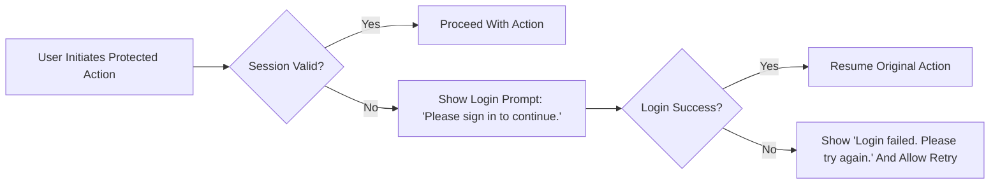
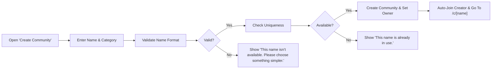
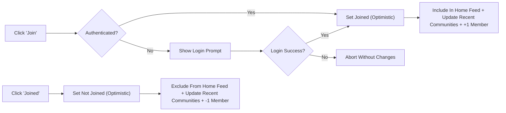
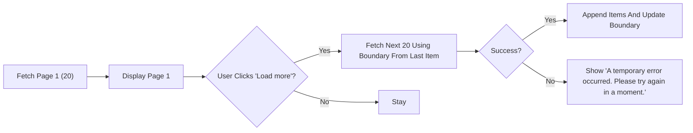
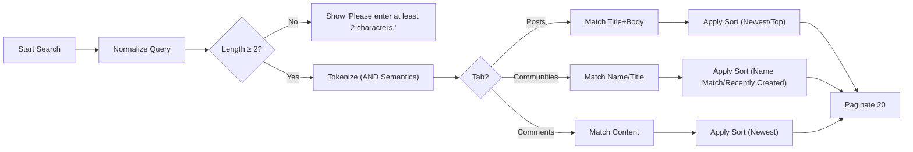
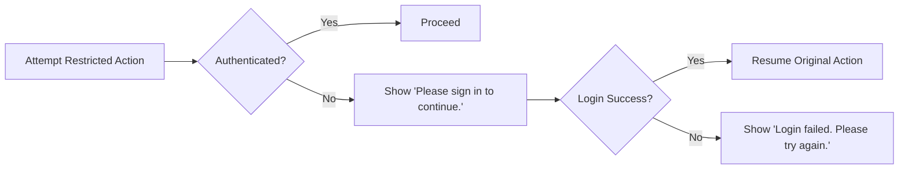
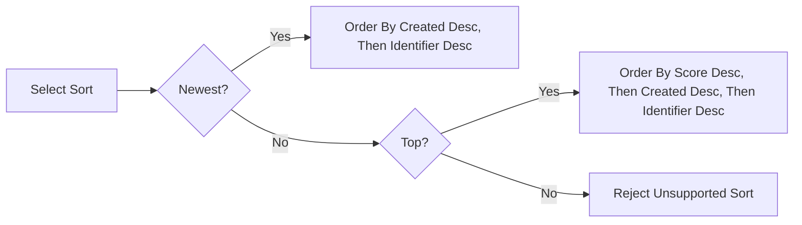
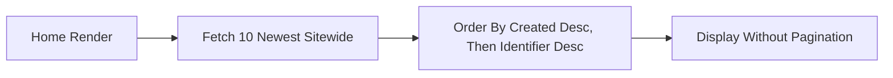

# Community Platform — Unified Business Requirements (communityPlatform)

## Scope and Intent
Defines complete business requirements for a Reddit-like community platform with sub-communities, text-only posts, nested comments, and voting. Reading is open to all; participation actions require authentication. Deterministic sorting, minimal validation, long-lived sessions, and resume-after-login are mandatory. No APIs, data schemas, or implementation details appear here.

EARS baseline:
- THE communityPlatform SHALL allow reading of public content without authentication.
- THE communityPlatform SHALL require authentication for posting, commenting, voting, creating sub-communities, and joining/leaving.
- THE communityPlatform SHALL enforce account-based ownership for editing/deleting authored content.
- THE communityPlatform SHALL maintain deterministic sorting (Newest, Top) and fixed pagination sizes.
- THE communityPlatform SHALL provide long-lived sessions and resume in-progress actions after login or re-login.

## Roles and Access Model
Roles: guestVisitor, registeredMember, siteAdmin.
- THE communityPlatform SHALL treat guestVisitor as unauthenticated with read-only access to public pages and search.
- THE communityPlatform SHALL treat registeredMember as authenticated with permissions to create communities, post, comment, vote, and join/leave.
- THE communityPlatform SHALL allow siteAdmin to remove or edit any content and restrict accounts for policy/legal compliance.

Ownership:
- THE communityPlatform SHALL restrict edit/delete of posts/comments to their authors; siteAdmin may override for compliance.
- THE communityPlatform SHALL restrict editing/deletion of sub-communities to their creators; community names are immutable after creation.

## Authentication and Session Experience
### Long Session Expectations
- THE session management SHALL provide generous longevity with idle timeout of at least 30 days and absolute lifetime of at most 90 days.
- WHEN a registeredMember performs an authenticated action, THE session management SHALL renew the idle timeout countdown.
- WHERE a user logs out, THE platform SHALL revert to guestVisitor state while keeping the current page readable.

### Guest Guard and Resume-After-Login
- WHEN a guestVisitor attempts to post, comment, vote, create a community, or join/leave, THE communityPlatform SHALL prompt “Please sign in to continue.” and, upon successful authentication, SHALL resume the original action using preserved inputs.
- WHEN a session expires during a protected action, THE communityPlatform SHALL prompt a smooth re-login and, upon success, SHALL resume the interrupted action without data loss.

### Failure Messaging
- IF credentials are rejected, THEN THE platform SHALL display “Login failed. Please try again.”
- IF a temporary error occurs during authentication, THEN THE platform SHALL display “A temporary error occurred. Please try again in a moment.” and allow retry.

### Session Expiry and Multi-Tab
- WHEN re-login completes in one tab, THE platform SHALL consider other tabs authenticated on next interaction without destructive effects.

Mermaid — Session Expiry and Resume


## Information Architecture and Page Responsibilities
Global layout: Left Sidebar (Home/Explore/Create + Recent Communities up to 5), Main Content (page primary), Right Sidebar (contextual).

Pages and responsibilities:
- Home (/): 20 post cards per page with [Load more]. Sort toggle [Newest | Top]. Right Sidebar shows “Global Latest” with 10 newest sitewide posts. Guests can read; actions trigger guest guard.
- Global Composer (/submit): Requires login; requires community selection; fields = Community, Title, Body, optional Author display name; resume after login.
- Explore (/c): Category chips; 20 community cards per page; [Load more].
- Community Create (/c/create): Requires login; minimal validation; on success navigate to community home.
- Community Home (/c/[name]): Sort [Newest | Top]; 20 post cards per page; [Load more]; header shows logo (if any), Create Post, Join ↔ Joined; Right Sidebar shows Community Info + Rules (top 5 rules numbered).
- Community Composer (/c/[name]/submit): Pre-selected community; same validations as global.
- Post Detail (/c/[name]/[postID]): Show title, author, relative time, full content, vote controls, score, comment count. Comments: 20 per page with [Load more]. Right Sidebar shows Community Info + Rules.
- Search (/s): Tabs: Posts (default), Sub-Communities, Comments; query ≥ 2 chars; 20 results per page; sorting as defined below.
- Login (/login modal): Overlays context; on success resume original action.

Left Sidebar — Recent Communities rules:
- THE communityPlatform SHALL display up to 5 most recently active communities for the user, ordered by most recent activity.
- THE communityPlatform SHALL define activity as: visiting a community, viewing a post detail in it, joining/leaving it, posting, commenting, or voting within it.
- IF a community is deleted, THEN THE list SHALL remove it immediately.

Right Sidebar:
- Home: THE Right Sidebar SHALL display “Global Latest” of exactly 10 newest posts sitewide, ordered by Newest, no pagination.
- Community pages: THE Right Sidebar SHALL display Info + Rules (name, description, created date optional, last active optional, rules top 5 numbered; each rule up to ~2 lines ~50 chars).

## Sub-Communities
### Creation and Inputs
- THE communityPlatform SHALL require login to create a sub-community.
- THE communityPlatform SHALL require: name (immutable), category (single choice). Optional: description, logo, banner, rules.
- THE communityPlatform SHALL set the creator as owner and mark the creator as joined upon creation.

### Naming and Category Constraints
- THE communityPlatform SHALL enforce unique names (case-insensitive) using normalized form: lowercased alphanumeric with hyphen “-” and underscore “_”, length 3–30, starting/ending with alphanumeric, with no consecutive hyphens/underscores.
- THE communityPlatform SHALL reject reserved names (e.g., “c”, “s”, “login”, “submit”, “create”, “admin”).
- THE communityPlatform SHALL require exactly one category chosen from: “Tech & Programming”, “Science”, “Movies & TV”, “Games”, “Sports”, “Lifestyle & Wellness”, “Study & Education”, “Art & Design”, “Business & Finance”, “News & Current Affairs”.
- THE communityPlatform SHALL keep the community name immutable after creation.

### Edit and Delete
- THE communityPlatform SHALL allow only the owner or siteAdmin to edit description, logo, banner, rules, and category.
- THE communityPlatform SHALL allow only the owner or siteAdmin to delete the community; deletion SHALL remove all posts in that community from public visibility.
- THE communityPlatform SHALL perform community deletion atomically from a user perspective (fully deleted or no change).

### Member Count and Discovery
- THE communityPlatform SHALL display member count as the number of distinct accounts currently joined.
- WHEN a user joins/leaves, THE member count SHALL increment/decrement accordingly and never go below 0.

Mermaid — Community Creation Flow


## Join / Leave
- THE communityPlatform SHALL require login for join/leave.
- WHEN a user clicks “Join”, THE system SHALL immediately reflect Joined state (optimistic), include the community’s posts in Home feed, update Recent Communities, and increment member count.
- WHEN a user clicks “Joined”, THE system SHALL immediately reflect Join state (optimistic), exclude the community’s posts from Home feed, update Recent Communities, and decrement member count.
- IF server reconciliation fails, THEN THE system SHALL revert to the last confirmed state and show “A temporary error occurred. Please try again in a moment.”

Mermaid — Join/Leave Flow


## Posts
### Composition and Validation
- THE communityPlatform SHALL accept text-only posts with: Title 5–120 chars; Body 10–10,000 chars (line breaks allowed; scripts/code prohibited); optional Author display name 0–32 chars.
- THE communityPlatform SHALL require selecting exactly one target sub-community to submit a post.
- IF no community is selected, THEN THE system SHALL present “Please choose a community to post in.” and block submission.
- WHERE display name is empty, THE system SHALL display “Anonymous” for the author on cards and details.

### Ownership and Editing
- THE communityPlatform SHALL allow only the author (or siteAdmin) to edit or delete a post; community membership is not required to post there.
- THE communityPlatform SHALL allow edits to title, body, and author display name using the same validation ranges as creation; community location is not editable.

### Card Fields and Visibility
- THE communityPlatform SHALL display on post cards: “/c/<name>”, title, author (or “Anonymous”), relative created time, comment count, and score (upvotes − downvotes).
- WHEN a post is deleted, THE system SHALL remove it from Home, Community, Global Latest, Search, and direct access, and prevent further comments/votes.

## Comments and Nesting
- THE communityPlatform SHALL require login to create/edit/delete comments.
- THE communityPlatform SHALL enforce comment length 2–2,000 chars.
- THE communityPlatform SHALL support nested replies; a reply belongs to the same post as its parent comment.
- THE communityPlatform SHALL allow only the author (or siteAdmin) to edit/delete a comment.
- THE communityPlatform SHALL paginate comments in increments of 20 per scope; replies within a thread may load in 20-item increments as expanded.
- THE communityPlatform SHALL soft-delete comments (placeholder retained) and exclude soft-deleted comments from the visible comment count; replies remain if compliant.

## Voting and Score
### States and Transitions
- THE communityPlatform SHALL allow a single vote state per user per item among {None, Upvote, Downvote}.
- WHEN Upvote from None, THE system SHALL set state to Upvote; same Upvote again SHALL set to None.
- WHEN Downvote from None, THE system SHALL set state to Downvote; same Downvote again SHALL set to None.
- WHEN switching Upvote ↔ Downvote, THE system SHALL change directly without intermediate None.
- THE communityPlatform SHALL prohibit voting on one’s own posts/comments and present “You can’t vote on your own posts/comments.”

### Score Calculation and Optimism
- THE communityPlatform SHALL compute score as upvotes − downvotes.
- WHEN a vote state changes, THE system SHALL apply optimistic UI within ~100 ms and reconcile to server-confirmed totals; on failure, revert and show the temporary error message.

Mermaid — Voting State Machine
```mermaid
stateDiagram-v2
    direction LR
    [*] --> "None"
    "None" --> "Upvote": "Click Upvote"
    "None" --> "Downvote": "Click Downvote"
    "Upvote" --> "None": "Click Upvote"
    "Downvote" --> "None": "Click Downvote"
    "Upvote" --> "Downvote": "Click Downvote"
    "Downvote" --> "Upvote": "Click Upvote"
```

## Sorting and Pagination
### Sort Orders and Tie-Breakers
- Newest: THE communityPlatform SHALL order by created time descending; IF created times equal, THEN order by larger identifier first.
- Top: THE communityPlatform SHALL order by higher score first; IF scores equal, THEN order by more recent created time; IF still equal, THEN order by larger identifier.

### Pagination Sizes
- Home and Community feeds: THE communityPlatform SHALL show 20 post cards per page; [Load more] appends the next 20 in order.
- Global Latest (Home Right Sidebar): THE communityPlatform SHALL show exactly 10 newest sitewide posts with no pagination.
- Comments: THE communityPlatform SHALL fetch/display 20 items per scope per load.

Mermaid — Load More Pagination (Main Feeds)


## Search
### Scope and Access
- THE communityPlatform SHALL allow anyone to search posts, communities, and comments across public content without login.
- THE communityPlatform SHALL reject queries shorter than 2 characters after normalization and show “Please enter at least 2 characters.”

### Entity Rules and Sorting
- Posts tab (default): Match title/body; default sort Newest; alternate sort Top; 20 per page; card fields include community name, title, body excerpt (≤2 lines), author, relative time, comment count, score.
- Sub-Communities tab: Match name/title (Name Match default, Recently Created alternate); 20 per page; card shows name, description (≤2 lines), logo if any, and Join | Joined.
- Comments tab: Match content; sort Newest; 20 per page; item shows snippet (≤2 lines), author, relative time, parent post title (link), community name.

### Normalization and Tokens
- THE communityPlatform SHALL trim whitespace, normalize multiple spaces, match case-insensitively, ignore diacritics, and treat hyphen/underscore as token separators.
- THE communityPlatform SHALL split into tokens and require AND semantics; the last token may match as a prefix.

### Empty States and Errors
- IF no results, THEN THE system SHALL display “No matching results. Try different keywords.”
- IF a temporary error occurs, THEN THE system SHALL display “A temporary error occurred. Please try again in a moment.” and allow retry.

Mermaid — Search Flow


## Interaction Rules and Standard Copy
### Guards and Ownership
- WHEN an unauthenticated user attempts a protected action, THE platform SHALL show “Please sign in to continue.” and resume the action after login.
- WHEN a user attempts to edit/delete non-authored content, THE platform SHALL show “You can edit or delete only items you authored.” and block the action.
- WHEN a user attempts to vote on their own content, THE platform SHALL show “You can’t vote on your own posts/comments.” and keep state as None.

### Relative Time and Number Abbreviations
- THE platform SHALL display relative time phrases in the user’s local timezone: “just now” (<60s), “X minute(s) ago” (≥60s and <60m), “X hour(s) ago” (≥60m and <24h), “X day(s) ago” (≥24h and <7d), else absolute “MMM D, YYYY”.
- THE platform SHALL abbreviate numbers: 1,234 → “1.2k”; 1,234,567 → “1.2m”; 1,234,000,000 → “1.2B”; strip trailing “.0”; keep negative sign; zero as “0”.

### Temporary Errors
- THE platform SHALL use “A temporary error occurred. Please try again in a moment.” for recoverable failures and allow user retry.

## Non-Functional Expectations (Business-Level)
Performance budgets (p95 under normal load):
- Home/Community first page: ≤1.5s to present 20 post cards.
- Post detail content: ≤1.0s; first 20 comments: ≤1.8s.
- Load more (posts): ≤1.2s; Load more (comments): ≤1.5s.
- Vote reconcile: ≤1.0s; Join/Leave inclusion updates: ≤2.0s.
- Post submission accept: ≤2.0s; visibility within feeds: ≤5.0s.
- Search first page: ≤1.8s.
- Global Latest freshness: ≤10s.

Availability goals:
- Reads (feeds, post detail): target 99.9% monthly.
- Writes (post/comment/vote/join/community ops): target 99.5% monthly.

Consistency and determinism:
- THE communityPlatform SHALL honor sort keys and tie-breakers exactly and avoid duplicates or omissions across pagination windows.
- THE communityPlatform SHALL reconcile optimistic updates promptly and revert on failure with standardized messaging.

## Acceptance Criteria (Selected, Black-Box)
Authentication and sessions:
- WHEN a guest attempts to vote, THE platform prompts login and applies the intended vote upon success.
- WHEN a session expires during post submission, THE platform prompts re-login and completes submission with preserved inputs upon success.

Sub-communities:
- WHEN a valid unique name and category are submitted, THE platform creates the community, sets creator as owner, auto-joins them, and navigates to /c/[name].
- IF name format fails, THEN show “This name isn’t available. Please choose something simpler.” and block creation.
- IF name is taken, THEN show “This name is already in use.” and block creation.

Posts and comments:
- WHEN an authenticated user submits a valid post to a selected community, THE platform publishes it and shows it to the author immediately.
- IF a non-author attempts to edit/delete, THEN show “You can edit or delete only items you authored.” and block.
- WHEN an authenticated user submits a 2–2,000 char comment, THE platform publishes it and increments visible comment count.

Voting:
- GIVEN state None, WHEN Upvote, THEN state Upvote and score +1; WHEN Upvote again, THEN state None and score −1.
- IF a user attempts to vote on own item, THEN block and show “You can’t vote on your own posts/comments.”

Sorting and pagination:
- WHEN sort=Newest, THEN order by created desc, ties by larger identifier desc across all lists claiming Newest.
- WHEN sort=Top, THEN order by score desc, ties by created desc, ties by larger identifier desc.
- WHEN “Load more” is clicked, THEN append exactly 20 additional items in correct order with no duplicates.

Search:
- IF normalized query length < 2, THEN return “Please enter at least 2 characters.” and do not execute.
- WHEN Posts tab is active, THEN default sort Newest; allow Top; 20 results per page with required fields.
- WHEN no matches, THEN return “No matching results. Try different keywords.”

Copy and formatting:
- WHEN rendering times, THEN use relative phrasing; ≥7 days shows “MMM D, YYYY”.
- WHEN rendering large counts, THEN abbreviate per rules and strip trailing “.0”.

## Diagrams — Summary Map
Mermaid — Guest Guard and Resume


Mermaid — Sorting Decision (Per List)


Mermaid — Global Latest (Home Right Sidebar)


Compliance boundary
- THE communityPlatform SHALL keep this specification business-only. All technology choices, data designs, and API contracts remain at the development team’s discretion while satisfying the behaviors above.
