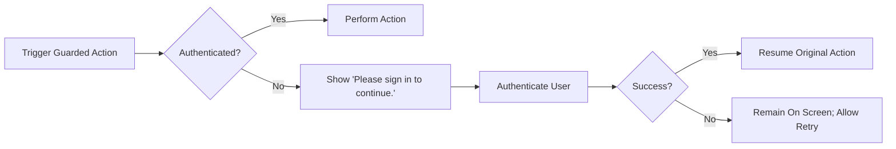
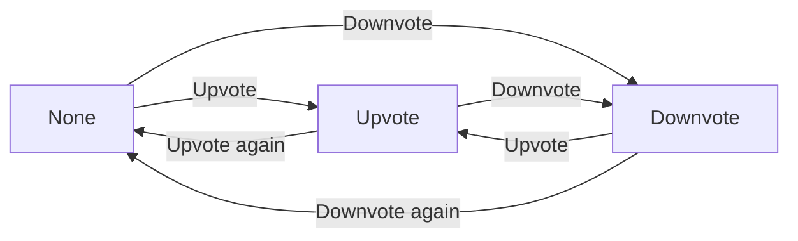
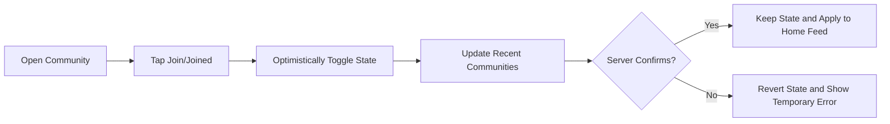
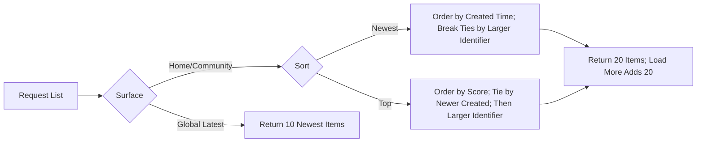

# Business Requirements Specification — communityPlatform

Audience: backend developers and QA engineers who will implement business behavior. Defines WHAT the system must do in observable terms; all technical implementation decisions (architecture, APIs, databases, infrastructure) are at the discretion of the development team.

## 1) Scope and Purpose
- THE service SHALL provide a topic-based discussion platform where users can create sub-communities, publish text posts, comment in threads, and vote with upvotes/downvotes.
- THE service SHALL keep reading open to everyone while requiring authentication for any state-changing actions (posting, commenting, voting, creating communities, joining/leaving).
- THE service SHALL prioritize smooth flows with minimal validation, deterministic sorting and pagination rules, and optimistic UI behaviors that reconcile with the server.

## 2) Definitions and Roles
### 2.1 Key Definitions
- "Sub-community" (community): Topic-based area (e.g., /c/ai) users can create and optionally join.
- "Member Count": Number of users who have joined a community (display use).
- "Global Latest": Sitewide list of the 10 most recently created posts.
- "Recent Communities": Per-user list of up to 5 communities most recently visited or interacted with.
- "Score": Upvotes − Downvotes.
- "Sort: Newest": Most recently created items first; ties by more recent creation time; if still tied, larger identifier first.
- "Sort: Top": Higher score first; ties by more recent creation time; if still tied, larger identifier first.
- "Optimistic UI": Immediate user-visible updates with later reconciliation to authoritative server state.

### 2.2 Roles (Business-Level)
- guestVisitor: Unauthenticated visitor; can read and search public content only.
- communityMember: Authenticated user; can create and manage own posts/comments, vote on others’ items, join/leave communities, create communities they own.
- systemAdmin: Platform administrator; can enforce policy (e.g., disable/delete communities or content) without assuming authorship of others’ content.

## 3) Authentication and Session (Business-Level)
### 3.1 Core Authentication Functions (EARS)
- THE service SHALL support sign up using a user identifier (email or username) and password (simple policy).
- THE service SHALL support sign in, sign out (current device), and sign out from all devices.
- WHEN a guest attempts a guarded action (post/comment/vote/create/join/leave), THE service SHALL prompt login and, upon success, SHALL resume the original action with preserved inputs.

### 3.2 JWT-Based Session (Business-Level) (EARS)
- THE service SHALL use JWT for access and refresh tokens to manage sessions.
- THE service SHALL issue an access token expiring in 15–30 minutes and a refresh token expiring in 7–30 days.
- THE service SHALL include in JWT payload at minimum: userId, role, and a permissions array reflecting effective capabilities.
- WHEN an access token expires, THE service SHALL attempt silent renewal using the refresh token; IF renewal fails, THEN THE service SHALL prompt re-login and, upon success, SHALL resume the prior flow.

### 3.3 Performance Targets (Auth) (EARS)
- WHEN a user submits credentials, THE service SHALL validate and respond within 2 seconds under normal conditions.
- WHEN a session refresh is attempted, THE service SHALL complete the refresh within 1 second under normal conditions.

## 4) Ownership and Permissions
### 4.1 Authorship and Community Ownership (EARS)
- THE service SHALL attribute authorship of posts/comments to the creating account.
- THE service SHALL attribute community ownership to the account that created the community.
- THE service SHALL allow only the authors to edit/delete their own posts/comments.
- WHERE a user is the community owner, THE service SHALL allow editing of description, logo, banner, rules, and category; the community name SHALL remain immutable.

### 4.2 Permission Matrix (Business-Level Summary)
| Capability | guestVisitor | communityMember | systemAdmin |
|---|---|---|---|
| Read communities/posts/comments | ✅ | ✅ | ✅ |
| Search posts/communities/comments | ✅ | ✅ | ✅ |
| Join/Leave community | ❌ | ✅ | ✅ (as user) |
| Create community | ❌ | ✅ | ✅ (as user) |
| Edit community metadata/rules | ❌ | Owner only | ✅ (policy actions) |
| Delete community | ❌ | Owner only | ✅ (policy actions) |
| Create post (text) | ❌ | ✅ | ✅ |
| Edit/Delete own post | ❌ | ✅ | ✅ (policy takedown, not authorship) |
| Create comment | ❌ | ✅ | ✅ |
| Edit/Delete own comment | ❌ | ✅ | ✅ (policy takedown, not authorship) |
| Vote on posts/comments | ❌ | ✅ (no self-vote) | ✅ (no self-vote) |

- THE service SHALL deny unauthorized edits/deletes with “You can edit or delete only items you authored.”

## 5) Functional Requirements by Domain (EARS)
### 5.1 Communities
- THE service SHALL require a unique, immutable community name with allowed characters [A-Za-z0-9-_], length 3–32, starting with a letter and ending with alphanumeric.
- THE service SHALL require exactly one category from: "Tech & Programming", "Science", "Movies & TV", "Games", "Sports", "Lifestyle & Wellness", "Study & Education", "Art & Design", "Business & Finance", "News & Current Affairs".
- THE service SHALL allow optional description, logo, banner, and rules.
- WHEN a community is created successfully, THE service SHALL set the creator as owner and proceed with normal navigation to the community surface in subsequent UI.
- IF a name duplicates an existing community, THEN THE service SHALL block creation and show “This name is already in use.”
- IF a name violates format/readability rules, THEN THE service SHALL block creation and show “This name isn’t available. Please choose something simpler.”
- WHEN the owner edits description/logo/banner/rules/category, THE service SHALL apply changes; THE service SHALL not allow name edits.
- WHEN a community is deleted by owner or systemAdmin, THE service SHALL remove all posts within it from public access and terminate memberships.
- WHEN a user toggles Join, THE service SHALL include the community’s posts in that user’s home feed and update Recent Communities immediately (optimistic).
- WHEN a user toggles Leave, THE service SHALL exclude the community’s posts from that user’s home feed and update Recent Communities immediately (optimistic).

### 5.2 Posts
- THE service SHALL support text-only posts with fields: community, title (5–120 chars), body (10–10,000 chars, plain text + line breaks only), optional author display name (0–32 chars; default to “Anonymous” if empty).
- THE service SHALL require selecting exactly one target community per post.
- THE service SHALL allow posting to a community without requiring joining that community.
- THE service SHALL display post cards containing: community name (e.g., /c/ai), title, author display name, relative created time, comment count, score.
- THE service SHALL allow only the author to edit/delete their post; attempts by others SHALL be denied with the standard message.

### 5.3 Comments
- THE service SHALL allow nested replies (comments can reply to posts or other comments).
- THE service SHALL require comment length 2–2,000 chars.
- THE service SHALL allow only the comment author to edit/delete the comment; attempts by others SHALL be denied with the standard message.

### 5.4 Voting
- THE service SHALL maintain one vote state per user per item: None, Upvote, or Downvote.
- WHEN a user toggles between Upvote and Downvote, THE service SHALL switch state directly and adjust score accordingly.
- WHEN a user presses the active vote again, THE service SHALL revert to None and adjust score accordingly.
- IF a user attempts to vote on their own item, THEN THE service SHALL prevent the action and show “You can’t vote on your own posts/comments.”
- THE service SHALL compute score as upvotes − downvotes and exclude self-votes.

### 5.5 Sorting & Pagination
- THE service SHALL support sorts: Newest and Top, using canonical tie-breakers (see Definitions).
- WHERE surface is a main feed (Home, Community Home), THE service SHALL display 20 post cards per page and reveal the next 20 upon load-more.
- WHERE surface is Global Latest (Home right sidebar), THE service SHALL display exactly 10 most recent posts sitewide without load-more.
- WHERE surface is Post Detail comments, THE service SHALL display 20 comments and reveal the next 20 upon load-more.

### 5.6 Search
- THE service SHALL accept queries with length ≥ 2 characters; shorter inputs SHALL show “Please enter at least 2 characters.” and cancel search.
- THE service SHALL provide three result tabs: Posts (default), Sub-Communities, Comments.
- THE service SHALL for Posts: match words in title/body; default sort Newest with option Top; 20 results per page.
- THE service SHALL for Sub-Communities: match name/title; sort by Name Match (ties by more recent creation) or Recently Created; 20 results per page.
- THE service SHALL for Comments: sort by Newest; 20 results per page.
- IF no results, THEN THE service SHALL show “No matching results. Try different keywords.”

## 6) Interaction and Optimistic UI (EARS)
- WHEN a guest attempts a guarded action, THE service SHALL prompt “Please sign in to continue.” and, upon success, SHALL resume the action with preserved inputs.
- WHEN a user toggles Join/Leave, THE service SHALL update the button state, Recent Communities list, and home feed inclusion/exclusion immediately (optimistic) and reconcile with server.
- WHEN a user votes, THE service SHALL update vote state and score immediately (optimistic) and reconcile with server.
- WHEN a session expires mid-action, THE service SHALL prompt re-login gently and, upon success, SHALL resume the prior flow.
- IF a temporary error occurs, THEN THE service SHALL show “A temporary error occurred. Please try again in a moment.” and SHALL allow retry without losing inputs.

## 7) Error Handling and Standard Messages (EARS)
- THE service SHALL use the following standard copy verbatim:
  - Login required: “Please sign in to continue.”
  - No permission: “You can edit or delete only items you authored.”
  - Community name taken: “This name is already in use.”
  - Invalid community name format: “This name isn’t available. Please choose something simpler.”
  - No community selected: “Please choose a community to post in.”
  - Query too short: “Please enter at least 2 characters.”
  - Self-vote: “You can’t vote on your own posts/comments.”
  - Temporary error: “A temporary error occurred. Please try again in a moment.”

## 8) Performance and UX Expectations (Business-Level) (EARS)
- THE service SHALL display relative timestamps in the user’s local timezone with labels like “just now,” “X minutes ago,” “X hours ago,” “X days ago.”
- THE service SHALL abbreviate large numbers as 1.2k, 12.3k, 1.2m where applicable.
- WHEN a user performs a primary action (vote/join/load-more), THE service SHALL show visible acknowledgment within 100–150 ms and render meaningful content within seconds consistent with non-functional expectations.
- WHEN a valid search is submitted, THE service SHALL show first results within a timeframe that feels immediate, targeting within ~1,200 ms under common conditions.
- WHILE optimistic updates are pending, THE service SHALL reconcile to authoritative state as soon as confirmation is received.

## 9) Business Model and Success Metrics
### 9.1 Why This Service Exists
- THE service SHALL offer predictable, transparent community interactions with explicit sorting/pagination and ownership rules that users can trust.
- THE service SHALL support topic-based niches and public reading to maximize discovery and ease of participation.

### 9.2 Revenue Strategy (Business Guardrails)
- WHERE monetization is introduced, THE service SHALL prioritize user trust: clear labeling for sponsored/promoted content, conservative frequency caps, optional premium to remove ads.
- WHERE a user holds a premium subscription (optional future), THE service SHALL suppress ads/sponsored units during the subscription period.

### 9.3 Growth Plan
- THE service SHALL enable creator-led community seeding and SEO-friendly public reading to drive acquisition and joining.
- THE service SHALL encourage joining via low-friction flows and personalized home feeds.

### 9.4 Success Metrics (Illustrative)
- Engagement: posts/DAU, comments/DAU, votes/DAU.
- Personalization: join conversion rate and number of joined communities per user.
- Search: query success rates and zero-result rates.
- Session continuity: rate of successful resume after login prompts.

## 10) Acceptance Criteria and Examples (EARS)
Communities
- WHEN a user submits a new community with valid inputs, THE service SHALL create it, set the user as owner, and make the name immutable thereafter.
- IF the submitted name is taken, THEN THE service SHALL show “This name is already in use.”
- IF the submitted name is invalid, THEN THE service SHALL show “This name isn’t available. Please choose something simpler.”
- WHEN owner edits metadata (not name), THE service SHALL apply changes; IF a non-owner attempts to edit, THEN THE service SHALL deny with the standard message.
- WHEN a user joins/leaves, THE service SHALL update Recent Communities immediately and include/exclude posts in the home feed accordingly.

Posts
- WHEN an authenticated user submits a post with valid title/body and selected community, THE service SHALL create the post.
- IF no community is selected, THEN THE service SHALL show “Please choose a community to post in.” and block submission.
- WHERE author display name is empty, THE service SHALL use “Anonymous.”

Comments
- WHEN a user submits a comment within 2–2,000 characters, THE service SHALL add it at the intended nesting level and increment the post’s comment count optimistically.
- IF a non-author attempts to edit/delete a comment, THEN THE service SHALL deny with the standard message.

Voting
- WHEN a user toggles None→Upvote, THE service SHALL set Upvote and add +1 to score optimistically; similar deterministic deltas apply for other transitions.
- IF a user attempts to vote on own item, THEN THE service SHALL show the self-vote message and make no change.

Sorting & Pagination
- WHEN sort=Newest, THE service SHALL order by most recent creation; ties by more recent creation time; if still tied, larger identifier first.
- WHEN sort=Top, THE service SHALL order by higher score; ties by more recent creation time; if still tied, larger identifier first.
- WHEN loading feeds/search, THE service SHALL return pages of 20 items; WHEN requesting Global Latest, THE service SHALL return exactly 10 newest posts.

Search
- IF query length<2, THEN THE service SHALL show “Please enter at least 2 characters.” and cancel search.
- WHEN searching posts, THE service SHALL match words in title/body and default to Newest; WHERE Top is selected, THE service SHALL apply Top rules.
- WHEN searching communities, THE service SHALL support Name Match with ties broken by more recent creation, and Recently Created.
- WHEN searching comments, THE service SHALL sort by Newest.

Interaction & Errors
- WHEN a guest attempts a guarded action, THE service SHALL prompt login and resume the action upon success.
- WHEN a temporary error occurs, THE service SHALL show the temporary error message and allow retry without losing state.

## 11) Diagrams (Mermaid)
### 11.1 Guest Guard and Resume

### 11.2 Voting State Machine

### 11.3 Join/Leave Lifecycle

### 11.4 Sorting and Pagination Flow

## 12) Constraints and Out-of-Scope
- THE service SHALL not specify technical implementation details in this document (no API specs, no database schemas, no infrastructure choices).
- THE service SHALL avoid prescribing UI layout or visual designs; surface names are used to define business behavior (e.g., “Global Latest” shows 10 newest posts) without design specifics.
- THE service SHALL restrict content to plain text for posts and comments; rich media is out of initial scope.
- THE service SHALL not define moderation roles beyond systemAdmin in this version.

## 13) Glossary
- Authorship: The relationship between an account and the content it created.
- Community Owner: The account that created a community; has exclusive rights to edit its metadata and rules; community name is immutable.
- Guarded Action: Any action requiring authentication (post, comment, vote, create community, join/leave).
- Optimistic UI: Immediate local reflection of an intended change before server confirmation.
- Surfaces: Contexts where lists appear (Home, Community Home, Post Detail, Global Latest, Search).

This specification provides business requirements only. All technical implementation decisions (architecture, APIs, database design, storage strategies) are at the discretion of the development team.