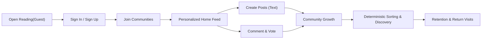
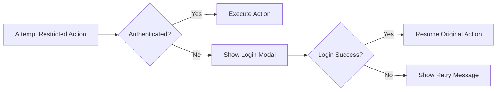
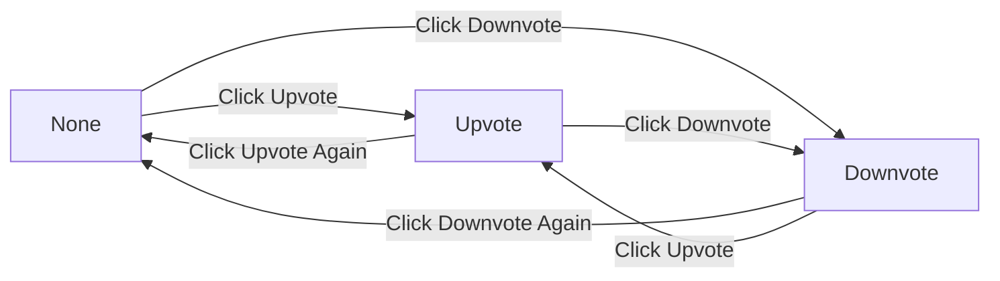
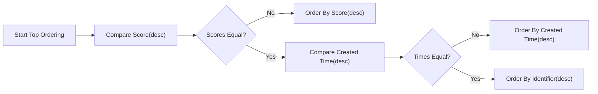
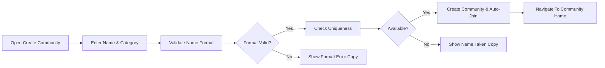

# Community Platform — Business Requirements Specification (communityPlatform)

## 1. Scope and Purpose
A topic-centric community platform where anyone can read public content while authenticated users create sub-communities, publish text-only posts, discuss via threaded comments, and curate with upvotes/downvotes. Personalization is controlled by joining/leaving communities; deterministic sorting and consistent pagination make experiences predictable. Ownership is account-based. Sessions are long-lived and re-login is smooth, resuming the user’s in-progress action.

Out of scope: technical stack, API shapes, database schemas, index designs, UI styling or component specifications. All behaviors below are stated in business, implementation-agnostic terms.

## 2. Roles and Access Model
- guestVisitor: Unauthenticated. Can read all public content and use search read-only. Cannot post, comment, vote, create, or join/leave communities.
- registeredMember: Authenticated. Can create sub-communities; post; comment; vote; join/leave communities; edit/delete only their authored posts/comments; edit metadata and delete communities they created. Community names are immutable.
- siteAdmin: Administrative override for policy/legal compliance; may act on any content or account within policy.

EARS requirements:
- THE platform SHALL keep reading open to everyone.
- THE platform SHALL require authentication for posting, commenting, voting, creating sub-communities, and joining/leaving.
- THE platform SHALL enforce account-based ownership for edit/delete on posts and comments.
- THE platform SHALL allow creators to edit community metadata (not name) and delete only communities they created; siteAdmin may override for compliance.

## 3. Core Principles (Global)
- WHEN a guest attempts a restricted action, THE platform SHALL prompt “Please sign in to continue.” and, upon success, SHALL resume the action with inputs preserved.
- WHEN a session expires during an action, THE platform SHALL prompt a gentle re-login and, upon success, SHALL resume the interrupted action without data loss.
- WHEN a user joins a community, THE platform SHALL immediately include its posts in that user’s Home main feed and update Recent Communities; leaving SHALL exclude and update accordingly.
- THE platform SHALL minimize validation to keep flows smooth, while enforcing essential constraints (name uniqueness/format; length ranges).
- THE platform SHALL apply deterministic sorting with explicit tie-breakers, and consistent pagination sizes for each surface.
- THE platform SHALL display friendly relative time in the user’s local timezone and abbreviate large numbers using k/m/B.
- THE platform SHALL reflect optimistic changes immediately for votes, join/leave, and fresh content, then reconcile to server-confirmed state.

## 4. Information Architecture & Canonical Routes
- “Home” (/): Personalized main feed (joined communities) with sort [Newest|Top]; right sidebar shows Global Latest (10 newest sitewide). Left sidebar is global.
- “Submit” (/submit): Global post composer (choose community). Requires login.
- “Search” (/s): Global search across posts, communities, and comments with tabs.
- “Explore” (/c): Sub-community discovery by category with a grid and Load more.
- “Create Community” (/c/create): Community creator form. Requires login.
- “Community Home” (/c/[name]): Community header (logo optional), Create Post, Join/Joined, sort [Newest|Top], 20 cards per page.
- “Community Submit” (/c/[name]/submit): Composer pre-selects the community.
- “Post Detail” (/c/[name]/[postID]): Post content, vote controls, score, comment count, and comments (20 at a time with Load more). Right sidebar shows Community Info + Rules.
- “Login” (/login modal): Overlays on any screen; on success returns to the originating action.

EARS requirements:
- THE Left Sidebar SHALL appear on all pages with Home/Explore/Create and a Recent Communities list up to 5 by most recent activity.
- THE Right Sidebar on Home SHALL show Global Latest (10 newest posts sitewide, no pagination). THE Right Sidebar on Community Home and Post Detail SHALL show Community Info + Rules.

## 5. Sub-Communities
### 5.1 Creation and Metadata
- Inputs: name (immutable), category (one from fixed set), optional description, logo, banner, rules (ordered, numbered on display).
- Categories: “Tech & Programming”, “Science”, “Movies & TV”, “Games”, “Sports”, “Lifestyle & Wellness”, “Study & Education”, “Art & Design”, “Business & Finance”, “News & Current Affairs”.

Validation (name):
- THE name SHALL be unique (case-insensitive normalized form), 3–30 chars, alphanumeric with hyphen/underscore allowed, begins/ends alphanumeric, no consecutive hyphens/underscores, not a reserved path (e.g., “c”, “s”, “login”, “submit”, “create”, “admin”).

EARS requirements:
- THE platform SHALL require login to create a sub-community.
- THE platform SHALL validate community name format and uniqueness per the rules above.
- THE platform SHALL require selecting exactly one category from the fixed set.
- THE platform SHALL set the creator as owner and auto-join the creator upon creation.
- THE platform SHALL make the community name immutable after creation.
- WHEN creation succeeds, THE platform SHALL navigate to the new Community Home and make it discoverable in Explore and Search.
- IF the name is taken, THEN THE platform SHALL show “This name is already in use.”
- IF the name fails format validation, THEN THE platform SHALL show “This name isn’t available. Please choose something simpler.”

### 5.2 Editing and Deletion
- Editable by owner (or siteAdmin): description, logo, banner, rules, category. Name is immutable.
- Deletion is irreversible and removes all posts under the community.

EARS requirements:
- THE platform SHALL allow only the owner (or siteAdmin) to edit metadata fields and delete the community.
- WHEN a community is deleted, THE platform SHALL remove the community and all its posts from feeds, search, and Global Latest, and clear memberships.

### 5.3 Community Info + Rules (Right Sidebar)
- Fields: name, short description, created date (optional), last active (optional), rules.
- Rules presentation: label “Community Rules”, show top 5 rules numbered 1..N, each up to ~2 lines (~50 chars per line; ≤100 chars).

EARS requirements:
- THE platform SHALL render the Community Info + Rules block on Community Home and Post Detail.
- WHERE assets are absent or fail to load, THE platform SHALL show defaults without blocking.

## 6. Membership (Join/Leave)
EARS requirements:
- THE platform SHALL require authentication for join/leave and treat membership purely as personalization (no moderation rights).
- WHEN Join is toggled to Joined, THE platform SHALL immediately reflect the state, include the community in the user’s Home main feed, update Recent Communities, and increment member count.
- WHEN Joined is toggled to Join, THE platform SHALL immediately reflect the state, exclude from Home main feed, update Recent Communities, and decrement member count (not below 0).
- IF a temporary error occurs, THEN THE platform SHALL revert to the last confirmed state and show “A temporary error occurred. Please try again in a moment.”
- THE platform SHALL ensure join/leave is idempotent.

Member count:
- THE platform SHALL display the number of distinct users currently joined; abbreviate large numbers (e.g., 12.3k). Updates may be eventually consistent within 5 seconds.

## 7. Posts (Text-Only)
Inputs and constraints:
- Title: 5–120 chars. Body: 10–10,000 chars; plain text with line breaks only (no executable scripts/code). Optional author display name: 0–32 chars (default to “Anonymous” if empty).

EARS requirements:
- THE platform SHALL require selecting exactly one target community for submission; IF none, THEN show “Please choose a community to post in.”
- THE platform SHALL treat title/body as plain text and neutralize markup/executable content.
- THE platform SHALL allow posts by authenticated users without requiring membership in the target community.
- THE platform SHALL allow only the author to edit or delete their post (siteAdmin override for compliance). Edits obey the same constraints; community cannot be changed by edit.
- WHEN a post is deleted, THE platform SHALL remove it from feeds, search, Global Latest, and prevent further voting/commenting on it; associated comments are hidden from public view via parent removal.

Card display fields in lists (Home, Community, Search results):
- Community name (e.g., “/c/ai”), title, author (or “Anonymous”), relative created time, comment count, score (upvotes − downvotes).

## 8. Comments (Threaded)
EARS requirements:
- THE platform SHALL require authentication to create, edit, or delete comments.
- THE platform SHALL enforce comment length 2–2,000 chars; plain text, line breaks allowed, no executable code.
- THE platform SHALL support nested replies (depth up to 8). Replies preserve associations; parent/post cannot be changed by edit.
- THE platform SHALL allow only the comment author to edit/delete their comment (siteAdmin override for compliance).
- THE platform SHALL soft-delete comments (neutral placeholder) and retain replies; soft-deleted comments are excluded from visible comment counts.
- THE platform SHALL display 20 comments per page with Load more; default order: Newest with tie-breakers.

## 9. Voting and Scoring
States: None, Upvote, Downvote.

EARS requirements:
- THE platform SHALL allow exactly one vote state per user per item (post or comment) and compute score as upvotes − downvotes.
- WHEN Upvote is pressed in None, THE state SHALL become Upvote; repeated Upvote SHALL return to None.
- WHEN Downvote is pressed in None, THE state SHALL become Downvote; repeated Downvote SHALL return to None.
- WHEN switching Upvote ↔ Downvote, THE state SHALL change directly.
- THE platform SHALL prohibit voting on one’s own posts/comments and show “You can’t vote on your own posts/comments.”
- THE platform SHALL reflect optimistic vote state and score changes immediately and reconcile with server; on failure revert and show the temporary error copy.

## 10. Sorting and Pagination
Sorting keys:
- Newest: creation time desc; ties by identifier desc (larger identifier first).
- Top: score desc; ties by more recent creation time; then identifier desc.

EARS requirements:
- THE platform SHALL apply Newest and Top exactly as defined, consistently across all lists claiming those sorts.
- THE platform SHALL show 20 items per page for main feeds (Home and Community) and for search result lists; Load more appends the next 20.
- THE platform SHALL show exactly 10 items in Home’s Global Latest (Newest only), without Load more.
- THE platform SHALL paginate comments in blocks of 20 per scope (root comments; replies per thread), ordered by Newest.
- THE platform SHALL avoid duplicates/omissions across pages; boundary for next page is the last item’s tuple for the active sort.

## 11. Search (Global)
Scope and access:
- Posts: match on title/body. Default sort Newest; optional Top.
- Sub-communities: match on name/title; sort by Name Match (priority: exact match; starts-with; token containment; small edit-distance proximity), tie-break by created time desc then identifier desc. Alternate sort: Recently Created.
- Comments: match on comment content; sort Newest only.

Validation and pagination:
- Minimum query length: 2 characters post-normalization; else show “Please enter at least 2 characters.”
- Results per page: 20 with Load more. Provide fields sufficient for display (post card fields; community name/description/logo presence and Join state; comment snippet/author/time/parent post/ community name).
- Empty state: “No matching results. Try different keywords.”

## 12. Global Layout Responsibilities
Left Sidebar (fixed on all pages): Home, Explore, Create, and Recent Communities (up to 5 by most recent activity among visited, joined/left, posted, commented, voted within communities). Immediate updates on qualifying activity; no duplicates; remove deleted communities.

Right Sidebar:
- Home: “Global Latest” with 10 newest sitewide posts (community name, single-line title ellipsis, relative time).
- Community Home & Post Detail: Community Info + Rules.

EARS requirements:
- THE Left Sidebar SHALL always render the navigation items and Recent Communities, updating immediately upon activity and capping at 5.
- THE Right Sidebar on Home SHALL always present 10 newest sitewide posts with no Load more.
- THE Right Sidebar on community pages SHALL display Info + Rules per Section 5.3.

## 13. Authentication & Session Experience
Targets: long-lived sessions (idle timeout ~30 days; absolute lifetime ~90 days) without mandating mechanisms.

EARS requirements:
- THE session experience SHALL feel “stay signed in” by default on a given device/browser.
- WHEN a restricted action is attempted by a guest, THE platform SHALL prompt “Please sign in to continue.” and, upon success, SHALL resume the action with inputs preserved.
- WHEN a session expires during an action, THE platform SHALL prompt a smooth re-login and resume upon success.
- WHEN logout occurs, THE platform SHALL return the user to the same page in read-only state; “log out of all devices” SHALL end all sessions.
- THE login modal (/login) SHALL overlay without navigating away and SHALL present “Login failed. Please try again.” on failure.

## 14. Input & Display Rules
Standard copy (exact text):
- “Please sign in to continue.”
- “Login failed. Please try again.”
- “Your session has expired. Please sign in again to continue.”
- “You can edit or delete only items you authored.”
- “You can’t vote on your own posts/comments.”
- “This name is already in use.”
- “This name isn’t available. Please choose something simpler.”
- “Please choose a community to post in.”
- “Please enter at least 2 characters.”
- “No matching results. Try different keywords.”
- “A temporary error occurred. Please try again in a moment.”

Relative time (user’s local timezone):
- Under 60 seconds: “just now”
- 1–59 minutes: “X minute(s) ago” (floor; singular/plural)
- 1–23 hours: “X hour(s) ago” (floor)
- 1–6 days: “X day(s) ago” (floor)
- 7+ days: absolute date “MMM D, YYYY” (e.g., “Sep 30, 2025”)

Number abbreviation:
- <1,000 no abbreviation; thousands “k”; millions “m”; billions “B”; one decimal with half-up rounding; strip trailing “.0”. Preserve negative sign (e.g., -1,234 → “-1.2k”).

## 15. Non-Functional Expectations (Business)
Performance (p95 under normal load):
- Home/Community first page: ≤1.5s to first 20 cards.
- Post content: ≤1.0s; first 20 comments ≤1.8s.
- Load more (posts): ≤1.2s; Load more (comments): ≤1.5s.
- Vote optimistic reflection: immediate; reconciliation ≤1.0s.
- Join/Leave reflection: immediate; feed/Recent Communities updates ≤2.0s.
- Post submit: ≤2.0s to confirm; visible in feeds within 5.0s.
- Search first page: ≤1.8s.
- Global Latest freshness: ≤10s.

Availability (targets, non-contractual):
- Reads 99.9% monthly; writes 99.5% monthly. Graceful degradation favors reads; queue or defer non-critical writes during spikes.

Privacy & audit (business-level):
- Collect minimal data; provide account deletion/anonymization pathways; retain sensitive audit logs up to 180 days; restrict admin access; record administrative actions.

## 16. Acceptance Criteria (Business-Level)
Authentication & session:
- WHEN a guest votes, THE platform SHALL prompt login and, on success, apply the vote and show updated score.
- WHEN a session expires during comment submit, THE platform SHALL re-login and publish the preserved comment upon success.

Sub-communities:
- WHEN a logged-in user creates a community with a unique, well-formed name and valid category, THE platform SHALL create it, set owner, auto-join, and navigate to Community Home.
- WHEN a non-owner attempts edit/delete, THEN “You can edit or delete only items you authored.” SHALL be shown and no changes occur.

Membership:
- WHEN Join is pressed, THE state SHALL switch to “Joined” immediately and Home feed inclusion SHALL take effect for subsequent queries; Recent Communities SHALL update instantaneously.

Posts:
- WHEN a valid post is submitted to a selected community, THE platform SHALL publish it and display it immediately to the author; others see it within a few seconds.
- IF title/body or community selection is invalid, THEN submission SHALL be blocked with the specific message.

Comments:
- WHEN an authenticated user submits a 2–2,000 char comment, THE platform SHALL add it and increase visible comment count by 1.
- WHEN a comment is soft-deleted, THE visible count SHALL decrease accordingly; replies remain.

Voting:
- GIVEN state None, WHEN Upvote, THEN state Upvote and score +1.
- GIVEN state Upvote, WHEN Upvote, THEN state None and score −1.
- GIVEN state Upvote, WHEN Downvote, THEN state Downvote and score −2.
- WHEN attempting to vote on own content, THEN show the self-vote message and keep state None.

Sorting & pagination:
- WHEN Newest is selected, THEN lists SHALL order by created time desc, ties by identifier desc.
- WHEN Top is selected, THEN lists SHALL order by score desc, ties by created time desc, then identifier desc.
- WHEN Load more is pressed, THEN exactly 20 new items SHALL append with no duplicates or gaps.

Search:
- WHEN query length < 2 (normalized), THEN search SHALL not execute and SHALL display the short-query message.
- WHEN no results match, THEN display the no-results message.

Copy, time, and numbers:
- WHEN displaying counts ≥ 1,000, THEN abbreviations SHALL follow the k/m/B rules; times SHALL use relative rules or “MMM D, YYYY” for 7+ days.

## 17. Mermaid Diagrams (Validated Syntax)

Overall value loop:

Guest guard and resume:

Voting state transitions:

Sorting decision (Top):

Community creation flow:

## 18. Glossary
- Community: Topic-based group with unique immutable name, one category, optional branding and rules.
- Post: Text-only content with title and body, belongs to exactly one community.
- Comment: Text reply to a post or another comment; supports nesting.
- Score: Upvotes minus downvotes.
- Global Latest: Exactly 10 most recent posts sitewide on the Home right sidebar.
- Recent Communities: Up to 5 communities ordered by most recent user activity.
- Newest sort: Order by created time desc, then identifier desc.
- Top sort: Order by score desc, then created time desc, then identifier desc.

End of specification.