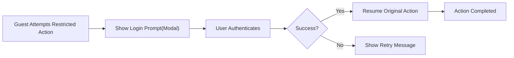
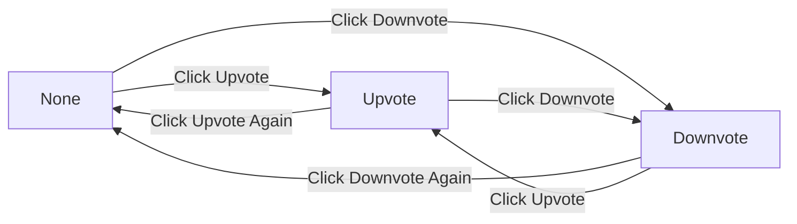
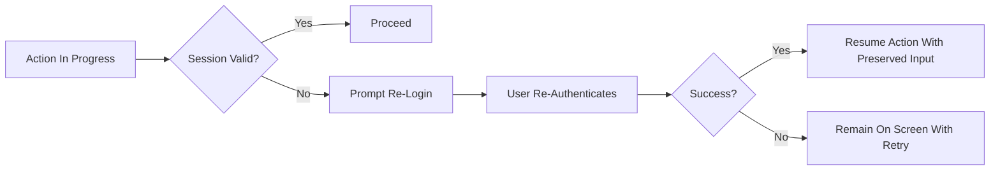

# User Roles and Permissions — Business Requirements (communityPlatform)

## 1. Scope and Intent
Defines role catalog, ownership rules, authentication and session experience, permission boundaries, account states, and abuse-prevention expectations in business terms for communityPlatform. Reading is open to everyone; posting, commenting, voting, creating sub-communities, and joining/leaving require login. Requirements use EARS where applicable and avoid technical implementation details (no APIs, schemas, or infrastructure prescriptions).

## 2. Role Definitions and Hierarchy

### 2.1 Role Catalog
- guestVisitor
  - Unauthenticated user; may browse and read all public content, view Global Latest, and use search read-only.
  - Cannot create, edit, delete, vote, join/leave communities, or create communities.
- registeredMember
  - Authenticated user; may create sub-communities, post, comment, vote, and join/leave communities.
  - May edit or delete only content authored by their own account.
  - May edit metadata of sub-communities they created and may delete only communities they created (with cascading removal of posts) subject to safeguards.
- siteAdmin
  - Platform-wide administrator; may act to satisfy policy/legal obligations and manage content or accounts when necessary.
  - May remove or edit any content where required for policy, safety, or legal reasons.

### 2.2 Precedence and Global Principles
- THE communityPlatform SHALL recognize precedence: siteAdmin > registeredMember > guestVisitor.
- THE communityPlatform SHALL keep reading of public content available to all roles.
- THE communityPlatform SHALL require login for posting, commenting, voting, joining/leaving communities, and creating communities.
- THE communityPlatform SHALL enforce account-based ownership such that only authors may edit or delete their own posts/comments; community creators may edit community metadata; community names are immutable.
- THE communityPlatform SHALL minimize validation while enforcing essential constraints.

## 3. Authentication Experience and Session Expectations

### 3.1 Sign Up and Sign In (Business Outcomes)
- WHEN a user attempts an action requiring authentication while unauthenticated, THE platform SHALL present a login prompt with the copy “Please sign in to continue.” and, upon successful authentication, SHALL resume the original action without losing user input.
- WHEN credentials are invalid, THE platform SHALL present “Login failed. Please try again.” and SHALL allow immediate retry.
- WHERE login succeeds, THE platform SHALL grant access according to the user’s role (registeredMember by default; siteAdmin if applicable).

### 3.2 Long Session Targets and Renewal
- THE session management SHALL provide generous session longevity to minimize re-authentication during normal use.
- THE session management SHALL renew idle timeout upon authenticated activity (e.g., posting, commenting, voting, joining/leaving, editing/deleting own content).
- WHILE a session remains valid, THE platform SHALL not prompt for re-authentication.

### 3.3 Session Expiry and Resume-After-Login
- WHEN a session expires during any protected action, THE platform SHALL prompt a smooth re-login without navigating away and, upon success, SHALL resume the interrupted action with preserved inputs.
- WHEN an unauthenticated user triggers a protected action, THE platform SHALL prompt login and, upon success, SHALL execute the original intent exactly once to avoid duplicates.
- IF re-login fails, THEN THE platform SHALL present an error and allow retry without losing entered data.

### 3.4 Logout and Profile Basics
- WHEN a user logs out, THE platform SHALL end the current device session and return to the same page in read-only state.
- WHERE a user logs out of all devices, THE platform SHALL end all active sessions and return the current page in read-only state.
- WHEN logout completes, THE platform SHALL clear unsaved inputs tied to protected actions unless the user explicitly saved a draft.

## 4. Authorization Rules by Domain

### 4.1 Sub-Communities
- Creation
  - THE platform SHALL require login.
  - THE platform SHALL validate name uniqueness and format (alphanumeric, hyphen, underscore) and require one category from the fixed set.
  - THE platform SHALL set the creator as the owner and auto-join the creator upon success.
- Edit
  - THE platform SHALL allow only the owner (or siteAdmin) to edit description, logo, banner, rules, and category; THE platform SHALL forbid renaming.
- Delete
  - THE platform SHALL allow only the owner (or siteAdmin) to delete a community and SHALL remove all posts within it.
- Join/Leave
  - THE platform SHALL require login; joining/leaving is idempotent and impacts personalization only.
  - WHEN toggled, THE platform SHALL update home feed inclusion/exclusion and the Recent Communities list immediately (optimistic UI with server sync).

### 4.2 Posts
- Composition
  - THE platform SHALL require a selected target sub-community to publish.
  - THE platform SHALL enforce title length 5–120 characters and body length 10–10,000 characters; plain text with line breaks only; scripts/code prohibited.
  - THE platform SHALL accept optional author display name 0–32 characters; where empty, display “Anonymous”.
- Permissions and Ownership
  - THE platform SHALL require login to create, edit, or delete.
  - THE platform SHALL allow only the author (or siteAdmin) to edit/delete.
  - THE platform SHALL not require community membership to post in that community.

### 4.3 Comments
- Creation and Structure
  - THE platform SHALL require login to create, edit, or delete comments.
  - THE platform SHALL enforce length 2–2,000 characters; plain text; scripts/code prohibited.
  - THE platform SHALL support nested replies (threaded structure).
- Ownership and Visibility
  - THE platform SHALL allow only the author (or siteAdmin) to edit/delete a comment.
  - THE platform SHALL preserve thread integrity when a comment is removed consistent with platform rules.

### 4.4 Voting
- THE platform SHALL allow exactly one vote state per user per item (None, Upvote, Downvote) with direct toggling between Upvote and Downvote and pressing the same vote again reverting to None.
- THE platform SHALL compute item score as upvotes − downvotes.
- IF a user attempts to vote on their own post or comment, THEN THE platform SHALL block the action and present “You can’t vote on your own posts/comments.”

## 5. Permission Matrix (Business-Level)

| Action (Business) | guestVisitor | registeredMember | siteAdmin |
|---|---|---|---|
| Read public communities/posts/comments | ✅ | ✅ | ✅ |
| Use global search (read-only) | ✅ | ✅ | ✅ |
| View Global Latest | ✅ | ✅ | ✅ |
| Create sub-community | ❌ | ✅ | ✅ |
| Edit sub-community metadata (own) | ❌ | ✅ (own) | ✅ (any) |
| Delete sub-community | ❌ | ✅ (own) | ✅ (any) |
| Join/Leave community | ❌ | ✅ | ✅ |
| Create post (text-only) | ❌ | ✅ | ✅ |
| Edit/Delete own post | ❌ | ✅ (own) | ✅ (any) |
| Create comment | ❌ | ✅ | ✅ |
| Edit/Delete own comment | ❌ | ✅ (own) | ✅ (any) |
| Vote on post/comment | ❌ | ✅ (not own) | ✅ (not own) |
| Toggle vote state (Upvote/Downvote/None) | ❌ | ✅ | ✅ |
| View/manage own profile basics | ❌ | ✅ | ✅ |
| Enforce policy and remove any content | ❌ | ❌ | ✅ |
| Suspend/restore user accounts (business action) | ❌ | ❌ | ✅ |

Notes
- “(own)” denotes ownership by the acting account.
- siteAdmin actions are limited to policy, safety, and legal needs, with audit logging.

## 6. Guest Guard and Author Guard
- Guest Guard
  - WHEN an unauthenticated user attempts to post, comment, vote, create a community, or join/leave, THE platform SHALL prompt login with “Please sign in to continue.” and SHALL resume the original action upon success.
- Author Guard
  - WHEN a user attempts to edit or delete content they do not own, THE platform SHALL deny the action and present “You can edit or delete only items you authored.”

## 7. Account States and Recovery

### 7.1 Account States
- Active: Full access according to role.
- Suspended: Read-only; cannot create/edit/delete/vote/join/leave.
- Closed (User-initiated): Account deactivated; login disabled; existing public content remains per policy.
- Restricted (Temporary): Specific actions disabled due to abuse or policy violations.

EARS
- WHEN an account is suspended, THE platform SHALL restrict actions to read-only until restored by siteAdmin.
- WHEN an account is closed by the user, THE platform SHALL disable subsequent logins and retain already public content per policy.
- WHERE an account is restricted, THE platform SHALL block only the specified actions and present a clear message indicating restriction scope and duration, where applicable.

### 7.2 Credential Recovery and Changes
- WHEN a user initiates password recovery, THE platform SHALL provide a guided process to restore access.
- WHEN a user changes a password, THE platform SHALL apply the change to future authentications and invalidate old credentials.
- WHERE the user requests sign-out across devices, THE platform SHALL end active sessions while preserving account integrity and content.

### 7.3 Session Expiry and Re-Login
- WHEN a session expires during any action, THE platform SHALL prompt re-login and, upon success, SHALL resume the interrupted action from the same state.
- WHILE re-authenticating, THE platform SHALL preserve form inputs and user selections.

## 8. Abuse Prevention and Appeals (Business-Level)
- THE platform SHALL deter spam, manipulation, and harassment via business-level controls such as reasonable rate limits and temporary restrictions (implementation is at development team discretion).
- WHEN suspicious behavior is detected (e.g., rapid voting sequences, mass postings), THE platform SHALL throttle or temporarily restrict implicated actions and present a clear message.
- IF abusive content is reported or confirmed, THEN THE platform SHALL allow siteAdmin to remove the content and apply account restrictions where appropriate.
- WHERE a user is suspended or restricted, THE platform SHALL provide a channel for appeal and SHALL restore access if the appeal is approved.

## 9. Diagrams (Mermaid)

### 9.1 Guest Guard and Resume Flow

### 9.2 Voting State Transitions (Per Item)

### 9.3 Session Expiry and Re-Login

## 10. Assumptions, Constraints, and Non-Goals

### Assumptions
- Public reading is permitted system-wide.
- At least one siteAdmin exists for governance and policy enforcement.
- Community deletion cascades to posts within that community.
- Joining affects only personalization and does not grant moderation rights.

### Constraints
- Business rules only; no API definitions, token formats, or data models.
- Name immutability for communities after creation.
- Minimal validation to keep flows smooth while preserving essential constraints.

### Non-Goals
- UI design, component layout, or styling specifications.
- Technology stack or infrastructure decisions.
- API endpoint enumeration or payload schemas.

## 11. Acceptance Criteria and Test Scenarios (Business-Level)

### 11.1 Authentication and Sessions
- WHEN an unauthenticated user attempts to vote, THE platform SHALL prompt login and resume the vote upon success.
- WHEN a session expires during post submission, THE platform SHALL prompt re-login and submit the post with previously entered content upon success.
- WHILE a session is valid, THE platform SHALL not present re-login prompts.

### 11.2 Sub-Communities
- WHEN a registeredMember creates a community with a unique, valid name and a valid category, THE platform SHALL create it, set the creator as owner, and auto-join the creator.
- WHEN the owner edits the community’s description, THE platform SHALL apply the change; non-owners SHALL be denied.
- WHEN the owner deletes the community, THE platform SHALL remove the community and all posts within it; name remains available for reuse per policy.
- WHEN any user joins a community, THE platform SHALL immediately include its posts in that user’s personalized home feed and update Recent Communities.

### 11.3 Posts and Comments
- WHEN a registeredMember submits a valid post to a target community, THE platform SHALL publish it.
- IF a non-author attempts to edit or delete a post, THEN THE platform SHALL deny the action with “You can edit or delete only items you authored.”
- WHEN a registeredMember creates a valid comment, THE platform SHALL publish it; non-authors SHALL be denied from modifying it.

### 11.4 Voting
- WHEN a registeredMember votes on another user’s post, THE platform SHALL set the vote state accordingly and update the score as (upvotes − downvotes).
- IF a user attempts to vote on their own content, THEN THE platform SHALL deny the action and present “You can’t vote on your own posts/comments.”
- WHEN a user toggles from Upvote to Downvote, THE platform SHALL reflect the direct switch; pressing the same vote again SHALL revert to None.

### 11.5 Account States and Recovery
- WHEN an account is Suspended, THE platform SHALL allow only read access and deny create/edit/delete/vote/join/leave actions with an explanatory message.
- WHEN a user completes password recovery, THE platform SHALL enable login with the new credential and invalidate the old one.
- WHEN a siteAdmin approves an appeal, THE platform SHALL restore the appropriate access level immediately.

## 12. Related Documents
- Roles and permissions interact with: User journeys, Sorting and Pagination, Sub-Communities, Posts, Comments, Voting, Search, Session & Auth Experience, and Standard Copy. Refer to the respective business requirements by those names for canonical rules.

## 13. Business-Only Clarification
Specifies business requirements and expected behaviors. All technical implementation details—including architecture, API design, data storage, and token formats—are the responsibility of the development team.
