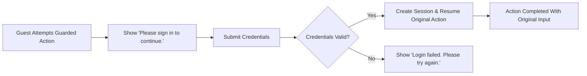
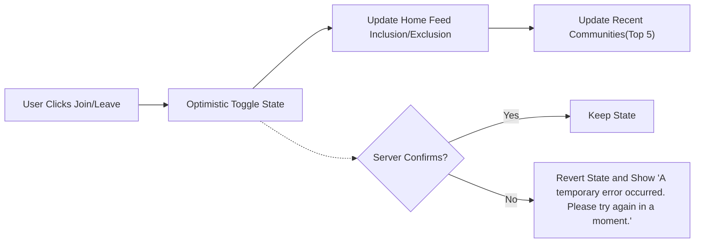
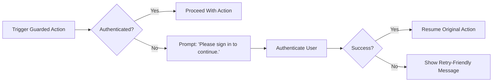
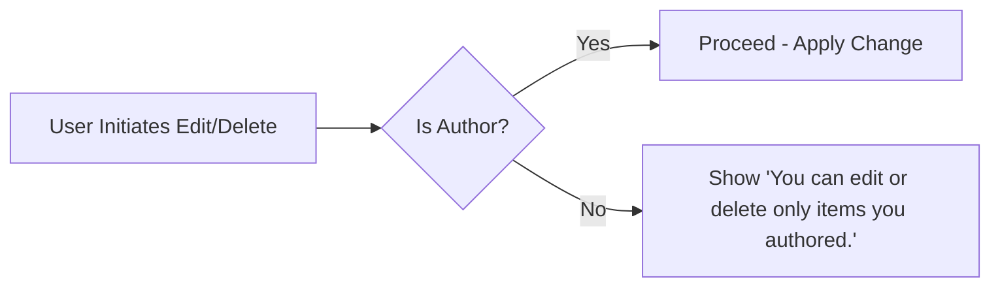
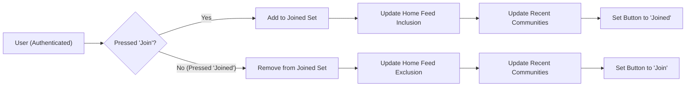

# 03 — User Roles and Permissions Specification (communityPlatform)

## 1. Scope and Principles
Business-level requirements for roles, permissions, authentication/session behavior, content ownership, join/leave membership effects, and administrative safeguards. The scope is the observable behavior of the system; implementation details (APIs, database schemas, infrastructure) are intentionally excluded.

Guiding principles:
- Reading is open to everyone.
- Posting, commenting, voting, creating sub-communities, and joining/leaving require login.
- Sessions are generously long; on expiry, a smooth re-login resumes the original action.
- Ownership is account-based; only authors may edit/delete their own posts and comments.
- Validation is minimal and favors smooth, error-free flows.
- Optimistic UI provides immediate feedback for votes, joins/leaves, and counters with reconciliation.

EARS principles:
- THE communityPlatform SHALL allow anyone to read public communities, posts, comments, and search results without login.
- THE communityPlatform SHALL require authentication for posting, commenting, voting, creating communities, and joining/leaving.
- THE communityPlatform SHALL enforce ownership so only authors may edit or delete their own posts and comments.
- WHEN a session expires during an action, THE communityPlatform SHALL prompt re-login and, upon success, SHALL resume the interrupted action without loss of input.

## 2. Role Taxonomy and Hierarchy
### 2.1 Roles
- guestVisitor: Unauthenticated visitor; can browse and search public content only.
- communityMember: Authenticated user; can create/manage own posts/comments, vote on others’ content, join/leave communities, and create communities (becoming their owner).
- systemAdmin: Platform administrator; can execute policy enforcement actions (e.g., disable/delete communities or content). Does not gain authorship rights over others’ content.

### 2.2 Hierarchy and Scope
- THE communityPlatform SHALL define a flat role structure with guestVisitor, communityMember, and systemAdmin.
- WHERE the user is the creator (owner) of a community, THE communityPlatform SHALL grant exclusive rights to edit that community’s metadata and rules; the community name remains immutable.
- THE communityPlatform SHALL ensure systemAdmin actions do not attribute authorship to systemAdmin for content created by others.

EARS statements:
- THE communityPlatform SHALL allow guestVisitor to read public content and search results.
- THE communityPlatform SHALL restrict guarded actions (post/comment/vote/create/join/leave) to authenticated users.
- WHERE the user is the community owner, THE communityPlatform SHALL allow editing of description, logo, banner, rules, and category only; name remains immutable.

## 3. Authentication and Session Principles
### 3.1 Core Authentication Functions (Business-Level)
- THE communityPlatform SHALL support sign up using an identifier (email or username) and a password with simple policy.
- THE communityPlatform SHALL support sign in, sign out (current session), and sign out from all devices.
- THE communityPlatform SHALL support email verification and password reset where enabled by policy.
- WHEN login is required due to a guarded action, THE communityPlatform SHALL prompt for authentication and, upon success, SHALL resume the original action with preserved input.

### 3.2 Token Management (JWT — Business Expectations)
- THE communityPlatform SHALL use JWT for access and refresh tokens to manage sessions.
- THE communityPlatform SHALL issue an access token that expires within 15–30 minutes and a refresh token that expires within 7–30 days.
- THE communityPlatform SHALL include in JWT payload at minimum: userId, role, and a permissions array reflecting effective capabilities at issuance.
- THE communityPlatform SHALL allow secure token storage using an approach selected by the development team (e.g., httpOnly cookies or localStorage), adhering to platform security best practices.
- THE communityPlatform SHALL ensure JWT signing keys are managed securely with periodic rotation under development team policy.
- WHEN an access token expires, THE communityPlatform SHALL attempt non-intrusive renewal using the refresh token; IF renewal fails, THEN THE communityPlatform SHALL prompt smooth re-login and, upon success, SHALL resume the prior action.

### 3.3 Performance Expectations for Auth
- WHEN a user submits login credentials, THE communityPlatform SHALL validate and respond within 2 seconds under normal conditions.
- WHEN a session refresh occurs, THE communityPlatform SHALL complete the refresh within 1 second under normal conditions.

### 3.4 Guest Guard and Resume (Mermaid)

EARS:
- WHEN a guestVisitor triggers a guarded action, THE communityPlatform SHALL show “Please sign in to continue.” and SHALL block the action until authentication succeeds.
- WHEN authentication completes successfully, THE communityPlatform SHALL resume the exact original action using preserved input and context.
- IF authentication fails, THEN THE communityPlatform SHALL show “Login failed. Please try again.” and keep the user on the same screen.

## 4. Ownership and Authorship Rules
### 4.1 Account-Based Ownership
- THE communityPlatform SHALL attribute authorship of posts and comments to the authenticated account that created them.
- THE communityPlatform SHALL attribute community ownership to the account that created the community.
- THE communityPlatform SHALL treat “Author display name” as presentation-only; WHERE empty, THE communityPlatform SHALL display a default such as “Anonymous.”

### 4.2 Edit/Delete Permissions
- THE communityPlatform SHALL allow only the author of a post to edit or delete that post.
- THE communityPlatform SHALL allow only the author of a comment to edit or delete that comment.
- WHERE the user is the community owner, THE communityPlatform SHALL allow editing of description, logo, banner, rules, and category; the name is immutable.
- WHEN a community is deleted by its owner or systemAdmin, THE communityPlatform SHALL remove all posts within that community from public access.

### 4.3 Voting Restrictions
- THE communityPlatform SHALL prevent users from voting on their own posts or comments.
- WHEN a user interacts with vote controls, THE communityPlatform SHALL maintain a single state per item: None, Upvote, or Downvote, with direct toggling allowed and pressing the same state again reverting to None.

EARS examples:
- THE communityPlatform SHALL restrict edit/delete of a post to its author only.
- THE communityPlatform SHALL restrict edit/delete of a comment to its author only.
- THE communityPlatform SHALL prohibit self-votes on posts and comments.

## 5. Permission Matrix Across Major Capabilities
“Owner” indicates the authenticated creator of the respective resource (post/comment/community). “Community Owner” indicates the account that created the sub-community.

| Action | guestVisitor | communityMember | systemAdmin |
|--------|--------------|-----------------|-------------|
| Read communities, posts, comments | ✅ | ✅ | ✅ |
| Search posts/communities/comments | ✅ | ✅ | ✅ |
| Join a community | ❌ | ✅ | ✅ (as user) |
| Leave a community | ❌ | ✅ | ✅ (as user) |
| Create a community | ❌ | ✅ | ✅ (as user) |
| Edit community metadata/rules | ❌ | “Community Owner” only | Admin safeguards only |
| Delete a community | ❌ | “Community Owner” only | ✅ (admin action) |
| Create a post (text) | ❌ | ✅ | ✅ (as user) |
| Edit own post | ❌ | “Owner” only | ❌ (no authorship override) |
| Delete own post | ❌ | “Owner” only | ✅ (admin removal; not authorship) |
| Comment on a post | ❌ | ✅ | ✅ (as user) |
| Edit own comment | ❌ | “Owner” only | ❌ (no authorship override) |
| Delete own comment | ❌ | “Owner” only | ✅ (admin removal; not authorship) |
| Vote on posts/comments | ❌ | ✅ (no self-vote) | ✅ (no self-vote) |
| Access Global Latest list | ✅ | ✅ | ✅ |
| Use Global Post Composer | ❌ | ✅ | ✅ |
| View Community Info + Rules | ✅ | ✅ | ✅ |

Clarifications:
- systemAdmin may act “as user” for normal content creation but does not receive special authorship; administrative removals are distinct from owner edits.
- Posting does not require membership in the target community.

EARS statements:
- THE communityPlatform SHALL allow reading and searching to all roles.
- THE communityPlatform SHALL require authentication for joining/leaving and all write actions.
- WHERE the actor is not the content owner, THE communityPlatform SHALL deny edit/delete with the message “You can edit or delete only items you authored.”

## 6. Join/Leave and Membership Display Rules
### 6.1 Join/Leave Behavior
- WHEN a user toggles join/leave on a community, THE communityPlatform SHALL immediately update the user’s membership state (optimistic) and later reconcile with the server.
- WHEN joined, THE communityPlatform SHALL include the community’s posts in the user’s home feed; WHEN left, THE communityPlatform SHALL exclude them.
- WHEN join/leave occurs, THE communityPlatform SHALL update the left sidebar Recent Communities list (up to 5 by most recent activity) immediately.
- WHERE a user has not joined any community, THE communityPlatform SHALL show latest/top posts across all communities in the home feed and surface guidance to explore/join.

### 6.2 Membership Count and Display
- THE communityPlatform SHALL compute “Member Count” as the number of users who have joined a community.
- WHILE the membership state is pending reconciliation, THE communityPlatform SHALL present the optimistic status and adjust feeds accordingly.

EARS statements:
- WHEN a community is joined, THE communityPlatform SHALL include its posts in the home feed and update “Recent Communities” immediately.
- WHEN a community is left, THE communityPlatform SHALL exclude its posts from the home feed and update “Recent Communities” immediately.

Mermaid flow (join/leave lifecycle):

## 7. Administrative Safeguards and Audit Expectations
### 7.1 Administrative Powers
- THE communityPlatform SHALL allow systemAdmin to perform emergency actions: disable or delete communities, and remove content that violates policy.
- WHEN a community is disabled by systemAdmin, THE communityPlatform SHALL prevent new posts/comments and SHALL exclude the community’s posts from promotion surfaces while preserving data for review.
- WHEN a community is deleted by systemAdmin, THE communityPlatform SHALL remove all posts within that community and SHALL mark the community as removed immediately.
- WHEN inappropriate content is removed by systemAdmin, THE communityPlatform SHALL decrement related counters (e.g., comment counts) accordingly.

### 7.2 Safeguards and Separation of Authorship
- THE communityPlatform SHALL separate administrative removals from owner edits to preserve authorship semantics.
- THE communityPlatform SHALL not attribute administrative edits/removals to the admin as author.

### 7.3 Audit Expectations
- THE communityPlatform SHALL record audit events for administrative actions, including: actor identity, action type, target resource, timestamp, and optional reason text.
- THE communityPlatform SHALL retain audit records for at least 365 days.
- WHEN an administrative action is executed, THE communityPlatform SHALL make the audit record available to authorized reviewers.

EARS statements:
- WHEN systemAdmin disables a community, THE communityPlatform SHALL block new posts/comments for that community and SHALL hide it from promotion surfaces while retaining data.
- WHEN systemAdmin deletes a community, THE communityPlatform SHALL remove all posts within it and SHALL mark the community as removed immediately.
- WHEN systemAdmin removes content, THE communityPlatform SHALL update counters and scores accordingly.
- THE communityPlatform SHALL log administrative actions with actor, action, target, timestamp, and optional reason.

## 8. Error Messages and Guard Behaviors
Standard messages (verbatim) per product rules:
- “Please sign in to continue.”
- “You can edit or delete only items you authored.”
- “This name is already in use.”
- “This name isn’t available. Please choose something simpler.”
- “Please choose a community to post in.”
- “Please enter at least 2 characters.”
- “You can’t vote on your own posts/comments.”
- “A temporary error occurred. Please try again in a moment.”

EARS statements:
- WHEN permission checks fail, THE communityPlatform SHALL emit the corresponding standard message and SHALL not proceed with the restricted action.
- WHEN temporary errors occur during guarded actions, THE communityPlatform SHALL allow retry and SHALL preserve user input for subsequent attempts.

## 9. Non-Functional Expectations Related to Roles & Permissions
- WHEN an authorization check is evaluated, THE communityPlatform SHALL return an allow/deny decision within 150 ms under normal load.
- WHEN login or token refresh is required, THE communityPlatform SHALL complete the flow within the response time targets defined in Section 3.
- WHILE optimistic UI is in effect for join/leave and voting, THE communityPlatform SHALL reconcile with server state and SHALL correct inconsistencies within 5 seconds of detection.
- THE communityPlatform SHALL present timestamps in the user’s local timezone using relative formats (“just now,” “X minutes ago,” “X hours ago,” “X days ago”).
- THE communityPlatform SHALL use number abbreviations such as 1.2k, 12.3k, 1.2m for large counters in contexts that display counts.

## 10. Mermaid Diagrams
### 10.1 Guest Guard and Resume

### 10.2 Author Guard Enforcement

### 10.3 Join/Leave Lifecycle

## 11. Glossary
- Authorship: Relationship between a user account and the content it created.
- Community Owner: Account that created a sub-community; has exclusive rights to edit metadata and rules; name is immutable.
- Guarded Action: Action requiring authentication (post/comment/edit/delete/vote/join/leave/create community).
- Optimistic UI: Immediate client-side reflection of an action’s expected result prior to server confirmation, with subsequent reconciliation.
- Promotion Surfaces: Feeds and lists where content is surfaced (e.g., home feed, explore grid, global latest sidebar).

## 12. Traceability to Product Requirements
- Open reading; guarded write actions: Sections 1–3.
- Session longevity and smooth re-login: Sections 3 and 9.
- Account-based ownership and author-only editing/deleting: Sections 4 and 5.
- Join/leave effects and Recent Communities updates: Section 6.
- Voting state and self-vote prevention: Sections 4 and 9 (non-functional) with cross-reference to platform rules.
- Standard messages and input rules: Section 8.

This specification provides business requirements only. All technical implementation decisions (architecture, APIs, database design, security controls) are at the discretion of the development team. 