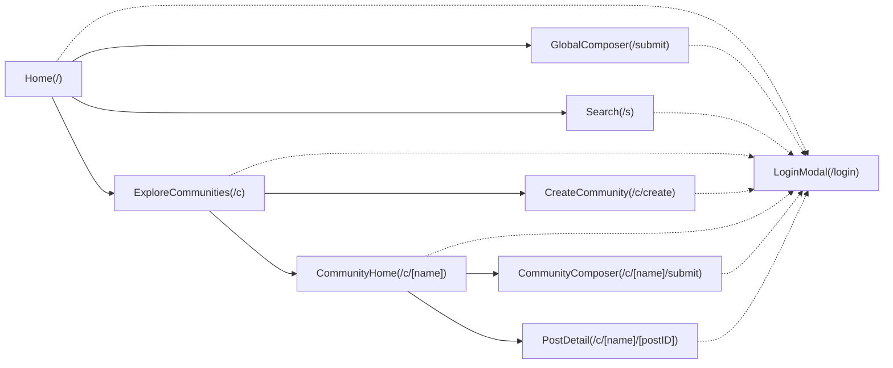
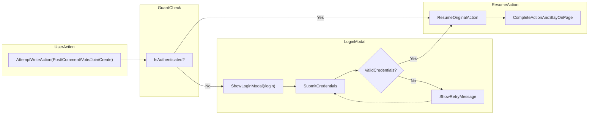

# Information Architecture and Navigation Requirements — communityPlatform

This document specifies the conceptual structure of the communityPlatform service, focusing on navigation, page responsibilities, and cross-cutting sidebars. It defines business behavior only and deliberately avoids UI layout specifications, styling, technical stacks, API endpoints, or data schemas. All terms and rules herein are written for backend developers to implement server-side behavior and to ensure consistent navigation semantics across the product.

## Global Layout Concepts

### Scope and Guiding Principles
- THE platform SHALL provide a consistent global layout composed of: Left Sidebar (global navigation and Recent Communities), Main Content area (primary page content), and Right Sidebar (contextual information).
- THE platform SHALL keep reading open to everyone; write actions (posting, commenting, voting, creating communities, joining/leaving) require authentication.
- THE platform SHALL minimize validation friction to maintain smooth flows and error-free behaviors, while enforcing critical constraints such as name uniqueness and input ranges.

### Access Model (Read vs. Write)
- THE platform SHALL allow all users (including guestVisitor) to read content and navigate to all public pages.
- WHERE a user is unauthenticated, THE platform SHALL require login before performing any write action (post, comment, vote, create community, join/leave community) and resume the intended action upon success.

### Roles and Navigation Constraints
- Roles used in this document:
  - guestVisitor: unauthenticated user with read-only access.
  - registeredMember: authenticated user with standard permissions.
  - siteAdmin: platform-wide administrator with elevated permissions (business-level override powers when necessary for policy/legal compliance).
- THE platform SHALL enforce ownership: users can edit/delete only content they authored; creators can edit community metadata; community names are immutable after creation.

### Global Elements Summary
- Left Sidebar (fixed across all pages): conceptual location for Home, Explore, Create actions and "Recent Communities" (up to 5 by most recent activity).
- Main Content: page-specific primary content, such as feeds, community home content, post detail with comments, composer forms, or search results.
- Right Sidebar: contextual content depending on page type (Global Latest on Home; Community Info + Rules on community-related pages).

### Performance and Responsiveness Expectations (Business-Level)
- THE platform SHALL return navigation responses perceived within 2 seconds for standard pages under normal load.
- THE platform SHALL load incremental content via "Load more" interactions within 2 seconds for typical 20-item pages.
- IF a temporary error occurs, THEN THE platform SHALL present the standard message and enable retry without losing the current context.

### Global EARS Requirements
- THE platform SHALL maintain a consistent global layout with Left Sidebar, Main Content, and Right Sidebar across all pages.
- WHEN an unauthenticated user attempts a write action, THE platform SHALL prompt login and resume the original action after successful authentication.
- WHILE a login session is valid, THE platform SHALL allow all permitted write actions without interruption.
- IF a session expires during an action, THEN THE platform SHALL prompt a smooth re-login and, upon success, resume the interrupted flow.
- THE platform SHALL display relative timestamps in the user’s local timezone.
- THE platform SHALL abbreviate large numbers using k/m notation per business copy standards.

## Sitemap and Page Responsibilities

### Canonical Routes and Purposes
The following list defines each canonical route, its purpose, and key responsibilities at the business-logic level.

| Route | Purpose | Primary Responsibilities (Business-Level) |
|------|---------|--------------------------------------------|
| / | Home feed prioritizing posts from joined communities; accessible to all users | Provide sortable feed [Newest | Top]; 20 posts per page with Load more; apply joined-communities filter for authenticated users; if user has not joined any, show latest or top across all communities with guidance to explore/join; Right Sidebar shows Global Latest (10 newest sitewide) |
| /submit | Global post composer | Require login; enforce community selector requirement; enforce title and body ranges; resume submission after login if prompted |
| /s | Global search for posts, sub-communities, and comments | Enforce minimum query length (2+); default tab Posts with sort [Newest | Top]; return 20 results per page; maintain focus behavior conceptually |
| /c | Explore sub-communities | Provide category filtering via chips; community grid with 20 cards per page and Load more |
| /c/create | Create a sub-community | Require login; enforce name format and uniqueness; allow optional description, logo/banner, rules; on success redirect to community home |
| /c/[name] | Community Home | Provide header actions (Join ↔ Joined; Create Post); show feed sorted [Newest | Top]; 20 posts per page; Right Sidebar shows Community Info + Rules |
| /c/[name]/submit | Community-specific post composer | Require login; pre-select target community; same constraints as global composer |
| /c/[name]/[postID] | Post Detail with comments | Show post content, up/down voting controls, score, comment count; comments listed with 20 per page and Load more; Right Sidebar shows Community Info + Rules; edit/delete visible only to authors |
| /login (modal) | Sign in/up modal overlay | Prompt login when guest attempts write actions; show retry on failure; return to prior page and resume action on success |

Notes:
- Sorting tie-break rules and pagination sizes are defined deterministically in the dedicated document referenced below.

References:
- See [Sorting and Pagination Rules](./10-sorting-and-pagination-rules.md) for exact sorting order and tie-breakers.
- See [Posts Requirements](./07-posts-requirements.md) for post composition constraints and display fields.
- See [Sub-Communities Requirements](./06-sub-communities-requirements.md) for community metadata rules, categories, and join/leave behavior.
- See [Comments and Nesting](./08-comments-and-nesting.md) for comment length and structure.
- See [Voting and Scoring](./09-voting-and-scoring.md) for vote state transitions and score calculation.
- See [Search Requirements](./11-search-requirements.md) for search scopes and sorting defaults.
- See [Session and Auth Experience](./12-session-and-auth-experience.md) for session longevity and resume behaviors.
- See [Error Handling and Standard Copy](./13-error-handling-and-standard-copy.md) for standardized messages and formatting rules.

### EARS Requirements per Page
- Home (/):
  - THE Home page SHALL display 20 post cards per page with a [Load more] mechanism for subsequent sets of 20.
  - WHERE the user has joined communities, THE Home page SHALL prioritize posts from those communities in the main feed.
  - WHERE the user has joined no communities, THE Home page SHALL display latest or top posts across all communities and present guidance to explore/join communities.
  - THE Right Sidebar on Home SHALL display "Global Latest" with exactly 10 most recent posts sitewide with no pagination.
- Global Composer (/submit):
  - WHEN a user submits the composer while logged out, THE platform SHALL prompt login and, upon success, resume submission with the entered data intact.
  - THE composer SHALL enforce that a community is selected and that title/body/author display name comply with length ranges.
- Search (/s):
  - THE Search page SHALL reject queries with fewer than 2 characters using the standard message and not perform a search.
  - THE Search page SHALL default to the Posts tab with sort Newest and return results in pages of 20.
- Explore (/c):
  - THE Explore page SHALL filter communities by the selected category chip and return communities in pages of 20 with Load more.
- Community Create (/c/create):
  - THE community creation flow SHALL validate name uniqueness and basic format, and, upon success, navigate to the new community’s home.
- Community Home (/c/[name]):
  - THE Community Home SHALL provide a sort toggle [Newest | Top], list 20 posts per page with Load more, and present Join ↔ Joined behavior.
  - THE Right Sidebar on Community Home SHALL display "Community Info + Rules" with specified fields and rules.
- Community Composer (/c/[name]/submit):
  - THE composer SHALL pre-select the target community and apply the same constraints as the global composer.
- Post Detail (/c/[name]/[postID]):
  - THE Post Detail page SHALL display the post body, voting controls, score, and comment count.
  - THE Comments section SHALL list 20 comments per page with Load more and support replies (nested) per business rules.
  - THE Right Sidebar on Post Detail SHALL display "Community Info + Rules" identical to Community Home.
- Login modal (/login):
  - WHEN invoked for a guarded action, THE modal SHALL overlay on the current context, and, upon successful login, THE platform SHALL resume the action without losing state.

### Mermaid Diagram: Sitemap

## Left Sidebar Responsibilities

### Conceptual Inventory
- Items:
  - Home (navigates to /)
  - Explore (navigates to /c)
  - Create (navigates to /c/create for community creation; may use guest guard)
  - Recent Communities (up to 5 items)

### Recent Communities: Business Rules
- Capacity and Ordering:
  - THE Recent Communities list SHALL display up to 5 communities.
  - THE Recent Communities list SHALL be ordered by most recent activity associated with the current user.
- What Counts as Activity:
  - THE following events SHALL update recency for a community: visiting the community home, viewing a post detail within the community, joining/leaving the community, creating a post in the community, commenting within the community, and voting within the community.
- Deduplication and Eligibility:
  - THE Recent Communities list SHALL not display duplicate entries.
  - IF a community is deleted, THEN THE list SHALL remove it immediately if present.
- Immediate Update:
  - WHEN a user joins or leaves a community, THE list SHALL update immediately to reflect the new recency and membership state.
- Display Behavior:
  - THE list SHALL show each community’s name and a small icon; WHERE no icon exists, THE list SHALL show a default icon.
  - THE list item selection SHALL navigate to the community home.
- Empty State:
  - WHERE the user has no recent activity, THE list SHALL be empty without error and SHALL not block navigation.

### Left Sidebar EARS Requirements
- THE Left Sidebar SHALL appear on all pages of the platform.
- THE Left Sidebar SHALL include Home, Explore, Create, and Recent Communities.
- WHEN a user performs an activity in a community, THE platform SHALL move that community to the top of Recent Communities and ensure a maximum of 5 items are retained.
- IF a community present in Recent Communities is deleted or becomes inaccessible, THEN THE platform SHALL remove it from the list immediately.
- WHEN a user joins a community from any page, THE platform SHALL reflect the change immediately in Recent Communities ordering and membership status visuals.

## Right Sidebar Responsibilities

### Home: Global Latest
- THE Right Sidebar on Home SHALL present a section labeled "Global Latest" showing exactly 10 most recently posted items across all communities.
- THE Right Sidebar on Home SHALL display each item with community name, single-line title with ellipsis policy, and relative time; no Load more is provided.

### Community Pages: Info + Rules
- THE Right Sidebar on Community Home and Post Detail SHALL show a Community Info + Rules section with:
  - Community name
  - Short description
  - Created date (optional)
  - Last active (optional)
  - A "Community Rules" subsection showing top 5 rules, numbered (1,2,3,…) with each rule up to approximately 2 lines (~50 characters)

### Other Pages (Default Behavior)
- WHERE a page is not Home, Community Home, or Post Detail, THE Right Sidebar MAY be empty or reserved for future contextual modules without affecting navigation.

### Right Sidebar EARS Requirements
- THE Right Sidebar on Home SHALL list 10 most recent posts sitewide with no pagination.
- THE Right Sidebar on Community pages SHALL display the Info + Rules block as specified.
- IF the community lacks a logo/banner or rules, THEN THE Right Sidebar SHALL display defaults per business copy (e.g., default images, absence handling) without errors.

## Navigation Rules and Recent Communities Behavior

### Global Navigation Rules
- THE platform SHALL provide deterministic sorting and pagination behaviors on all pages that list content, using the defined business rules.
- THE platform SHALL preserve the selected sort order within a page context during pagination and Load more actions.
- WHEN navigating away and back to a page in the same session, THE platform SHOULD preserve the last chosen sort order for that page where feasible.
- WHEN a user clicks Back on Post Detail, THE platform SHALL return to the prior page context and maintain its current scroll position and sort selection where feasible.
- THE platform SHALL ensure that navigation to guarded actions triggers the login modal where necessary, with full resume of intent.

### Guest Guard and Resume-After-Login
- WHEN a guest attempts to post, comment, vote, create, or join/leave, THE platform SHALL display the login modal and, upon successful login, complete the original action using the pre-action inputs.
- IF login fails, THEN THE platform SHALL show the standard retry message without losing the pre-action inputs.

### Session Expiry Handling
- IF a session expires during a write action, THEN THE platform SHALL prompt a gentle re-login and, upon success, resume the interrupted flow.

### Recent Communities Update Rules (Cross-Cutting)
- WHEN a user visits a community or performs any interaction defined as activity, THE platform SHALL update the Recent Communities list ordering immediately.
- WHERE activity occurs in more than 5 communities over time, THE platform SHALL retain only the 5 most recent entries.

### EARS Requirements (Navigation)
- THE platform SHALL route the left sidebar actions to their respective pages and maintain consistent availability across pages.
- WHEN an action triggers the login modal, THE platform SHALL resume the action on success and remain on the originating page unless the action itself implies navigation (e.g., successful community creation navigates to the new community home).
- WHERE page responsibilities imply fixed page sizes (e.g., 20 items), THE platform SHALL honor those sizes consistently across pagination.

### Mermaid Diagram: Guest Guard and Resume Flow

## Cross-References and Compliance
- This document intentionally avoids prescribing UI design or styling. It defines business behaviors that govern navigation and sidebars.
- Sorting, pagination, and tie-breaker specifics referenced herein are defined in the [Sorting and Pagination Rules](./10-sorting-and-pagination-rules.md).
- All copy and formatting standards (relative time, number abbreviations, error messages) are defined in [Error Handling and Standard Copy](./13-error-handling-and-standard-copy.md).
- Session longevity and smooth re-login requirements are defined in [Session and Auth Experience](./12-session-and-auth-experience.md).
- Ownership, permissions, and join/leave semantics referenced here align with [User Roles and Permissions](./03-user-roles-and-permissions.md) and [Sub-Communities Requirements](./06-sub-communities-requirements.md).

## Acceptance Criteria Summary (Business-Level, EARS)
- THE platform SHALL keep reading open to everyone and guard write actions behind authentication with resume-after-login.
- THE platform SHALL render Left Sidebar, Main Content, and Right Sidebar consistently across all pages.
- THE Home page SHALL display 20 posts per page with Load more and use the user’s joined communities to filter the main feed when applicable.
- THE Right Sidebar on Home SHALL always show exactly 10 most recent sitewide posts with no pagination.
- THE Community Home and Post Detail pages SHALL show the Community Info + Rules block in the Right Sidebar with the specified fields and rule presentation limits.
- THE Left Sidebar Recent Communities list SHALL show up to 5 items, ordered by most recent activity, updating immediately upon interactions.
- WHEN a guest attempts a write action, THE platform SHALL show the login modal and, upon success, resume the original action without losing context.
- IF a session expires mid-action, THEN THE platform SHALL prompt re-login and resume the action after successful authentication.

End of document.