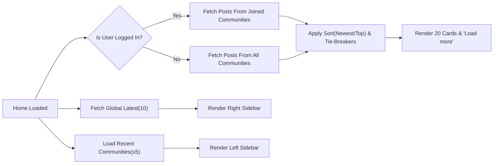
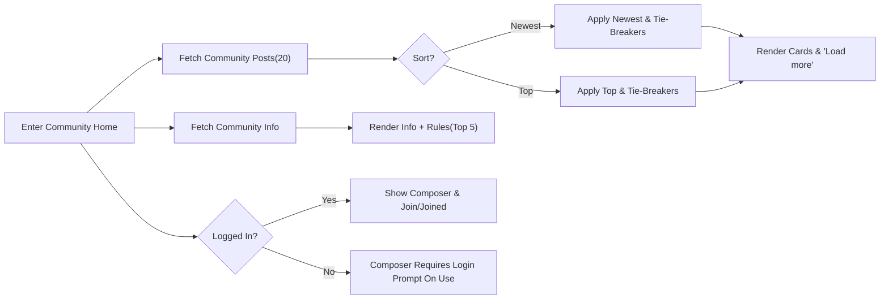
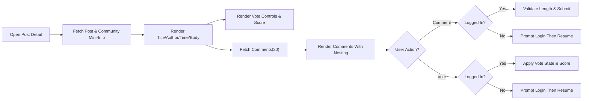
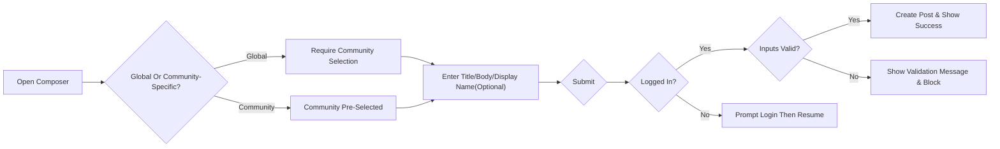
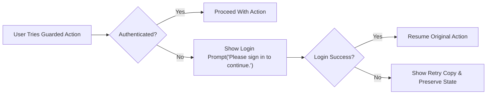

# communityPlatform — Functional Requirements for Core User Flows

## 1) Title and Scope
Defines WHAT must happen across the primary journeys of communityPlatform in business terms. Excludes technical implementation details (APIs, storage, infrastructure, layout or styling). Journeys covered:
- Home (/) main feed and sidebars
- Sub-Community Home (/c/[name])
- Post Detail (/c/[name]/[postID])
- Global Composer (/submit) and Community Composer (/c/[name]/submit)
- Guest Guard and Resume-After-Login behaviors (cross-cutting)

Conventions:
- “Score” = upvotes − downvotes.
- “Relative time” is displayed in the user’s local timezone per standard copy rules.
- Sorting and pagination use the canonical rules defined platform-wide.

## 2) Roles and Global Preconditions
Roles referenced:
- guestVisitor: unauthenticated, read-only access to public content and search.
- registeredMember: authenticated; may create communities, post, comment, vote, join/leave; may edit/delete only authored content; may edit/delete communities they created.
- siteAdmin: administrative oversight; may remove/edit any content for policy/legal compliance.

Global EARS requirements:
- THE platform SHALL allow anyone to read public content across Home, Community Home, Post Detail, and Search.
- THE platform SHALL require login for posting, commenting, voting, creating sub-communities, and joining/leaving communities.
- THE platform SHALL enforce account-based ownership: only authors may edit/delete their posts/comments; only creators may edit/delete their communities; community names are immutable.
- WHEN a session expires mid-action, THE platform SHALL prompt a smooth re-login and, upon success, SHALL resume the action with inputs intact.
- WHEN a guest attempts a restricted action, THE platform SHALL present “Please sign in to continue.” and, upon success, SHALL resume the intended action.
- THE platform SHALL minimize validation while enforcing essential constraints (input ranges, name format/uniqueness, category selection).

## 3) Home Feed Behavior (/) 
Purpose: Personalized discovery surface that prioritizes posts from communities the user has joined, with deterministic sorting and consistent pagination. The left sidebar is global; the right sidebar shows Global Latest.

### 3.1 Content sources and visibility
- THE Home main feed SHALL display posts from communities joined by the signed-in user.
- WHERE the signed-in user has not joined any community, THE Home main feed SHALL display latest or top posts across all communities according to the selected sort.
- WHERE the viewer is a guestVisitor, THE Home main feed SHALL display latest or top posts across all communities according to the selected sort.
- THE Right Sidebar on Home SHALL always display “Global Latest” with exactly 10 newest posts sitewide (Newest order), no pagination.
- THE Left Sidebar on all pages SHALL display Home/Explore/Create and “Recent Communities” (up to 5 by most recent activity).

### 3.2 Sorting and tie-breaking
- WHEN sort is Newest, THE Home main feed SHALL order by most recent creation time first; IF created times are equal, THEN THE Home main feed SHALL order by the more recently generated identifier (larger identifier) first.
- WHEN sort is Top, THE Home main feed SHALL order by higher score first; IF scores are equal, THEN THE Home main feed SHALL order by more recent creation time; IF created times are also equal, THEN THE Home main feed SHALL order by the more recently generated identifier first.

### 3.3 Pagination and continuation
- THE Home main feed SHALL display 20 post cards per page.
- WHEN “Load more” is activated, THE Home main feed SHALL append the next 20 items using a deterministic boundary derived from the last displayed item’s ordering tuple.
- THE Home main feed SHALL avoid duplicates and omissions across consecutive loads under normal conditions.

### 3.4 Card fields and interactions
- THE Home post card SHALL display: community name (e.g., “/c/ai”), title, author display name (or “Anonymous” if empty), created time (relative), comment count, and score.
- WHEN an unauthenticated user attempts to post/comment/vote from Home, THE platform SHALL prompt login and, upon success, SHALL resume the exact intended action.

### 3.5 Empty and guidance states
- WHERE the signed-in user has not joined any communities, THE Home main feed SHALL display latest/top across all communities and SHALL provide guidance to explore/join communities.
- WHERE the Home main feed returns an empty set due to new platform state, THE platform SHALL present a neutral empty state and guidance to Explore.

### 3.6 Error handling and performance
- IF a temporary error occurs retrieving the feed, THEN THE platform SHALL show “A temporary error occurred. Please try again in a moment.” and SHALL allow retry without losing current sort or scroll context.
- THE first page of the Home main feed SHALL render within 2 seconds under normal load (p95). “Load more” SHALL append within 1.5 seconds under normal load (p95).

### 3.7 Home flow (Mermaid)

## 4) Sub-Community Home Behavior (/c/[name])
Purpose: Community-scoped post listing with Join/Joined toggle, Create Post access, and Community Info + Rules in the right sidebar.

### 4.1 Access and header actions
- THE Sub-Community Home page SHALL be readable by all roles.
- WHERE the viewer is authenticated, THE header SHALL present the Join ↔ Joined toggle and a Create Post action.
- WHERE logo/banner or rules are available, THE page SHALL display them; otherwise defaults SHALL apply per standard copy.

### 4.2 Sorting and pagination
- THE Sub-Community Home list SHALL support [Newest | Top] with the same deterministic rules and tie-breakers as Home.
- THE Sub-Community Home list SHALL display 20 post cards per page and support “Load more” to append the next 20 deterministically.

### 4.3 Inline composer availability
- WHERE the viewer is authenticated, THE Sub-Community Home SHALL present a post composer (text-only) subject to composition constraints; otherwise, attempts SHALL trigger login and resume-after-login.

### 4.4 Join/Leave semantics and effects
- WHEN a member toggles Join→Joined, THE page SHALL update button state immediately (optimistic), include the community’s posts in the Home main feed, and update Recent Communities.
- WHEN a member toggles Joined→Join, THE page SHALL update button state immediately (optimistic), exclude the community’s posts from the Home main feed, and update Recent Communities.
- IF server reconciliation fails, THEN the membership state SHALL revert and the temporary error message SHALL be shown.

### 4.5 Community Info + Rules (Right Sidebar)
- THE right sidebar on Sub-Community Home SHALL display: community name, short description, created date (optional), last active (optional), and “Community Rules” (top 5 numbered, each ≤ ~2 lines).

### 4.6 Errors and performance
- IF fetching community info fails temporarily, THEN THE page SHALL display a temporary error while preserving the post list; retry SHALL be possible.
- THE first page of community posts SHALL render within 2 seconds under normal load (p95).

### 4.7 Community Home flow (Mermaid)

## 5) Post Detail Behavior (/c/[name]/[postID])
Purpose: Reading and interacting with a single post and its comments, with voting, score, comment count, and nesting.

### 5.1 Content and header
- THE Post Detail view SHALL present community mini-info (name + small logo), Back control, full title, author display name, relative time, and the post body.
- THE Post Detail view SHALL present vote controls, current score, and total comment count for visible comments.

### 5.2 Commenting and nesting
- THE platform SHALL allow authenticated users to create comments (2–2,000 chars) and replies (nested threads).
- THE platform SHALL paginate comments in sets of 20 for top-level threads and allow loading of additional replies in increments of 20 per thread.
- THE platform SHALL order comments by Newest with tie-breaking by larger identifier where times equal.

### 5.3 Ownership guards and moderation
- THE platform SHALL display Edit/Delete buttons only for items authored by the current user (author guard), except siteAdmin override for policy/legal reasons.
- THE platform SHALL prevent voting on one’s own posts/comments and SHALL show “You can’t vote on your own posts/comments.” when attempted.

### 5.4 Session and errors
- WHEN a comment or vote is attempted with an expired session, THE platform SHALL prompt re-login and, upon success, SHALL resume the action with inputs/intent intact.
- IF a temporary error occurs during comment creation or voting, THEN THE platform SHALL show the temporary error message and preserve typed content/intent for retry.

### 5.5 Performance
- THE post content and initial comments (20) SHALL render within 2 seconds under normal load (p95). “Load more” for comments SHALL append within 1.5 seconds under normal load (p95).

### 5.6 Post Detail flow (Mermaid)

## 6) Composers (Global and Community-Specific)
Purpose: Create text-only posts with deterministic validation and resume-after-login semantics.

### 6.1 Global Composer (/submit)
- THE Global Composer SHALL require selecting exactly one target community.
- THE Global Composer SHALL collect: Community (selector), Title (5–120), Body (10–10,000; plain text; line breaks allowed; scripts/code prohibited), and optional Author display name (0–32; default to “Anonymous” if empty for display).
- IF submission is attempted while logged out, THEN THE platform SHALL prompt login and, upon success, SHALL resume submission with all inputs intact.
- IF no community is selected, THEN THE platform SHALL block submission and show “Please choose a community to post in.”

### 6.2 Community Composer (/c/[name]/submit)
- THE Community Composer SHALL pre-select the community context and otherwise apply the same constraints as the Global Composer.

### 6.3 Post ownership and visibility
- THE platform SHALL attribute authorship to the submitting account regardless of community membership.
- THE platform SHALL make the new post visible in relevant feeds per sorting and pagination rules, with optimistic visibility to the author.

### 6.4 Errors and performance
- IF Title or Body violates constraints, THEN THE platform SHALL block submission with the specific validation copy and preserve inputs for correction.
- IF a temporary error occurs during submission, THEN THE platform SHALL present the temporary error message and allow retry without data loss.
- THE composer SHALL validate fields within 0.5 seconds (p95) and confirm successful submission within 2 seconds (p95) under normal load.

### 6.5 Composer flow (Mermaid)

## 7) Guest Guard & Resume-After-Login (Cross-Cutting)
Purpose: Ensure smooth prompts for restricted actions and precise resumption of intent after authentication or re-authentication.

### 7.1 Guarded actions and prompts
- Guarded actions: create post, create comment, vote, create community, join/leave community, and edit/delete own content.
- WHEN a guestVisitor initiates a guarded action, THE platform SHALL show “Please sign in to continue.” and, after successful login, SHALL resume the exact action using preserved inputs and intent.

### 7.2 Session expiry mid-action
- WHEN a session expires during a guarded action, THE platform SHALL prompt gentle re-login and, upon success, SHALL resume the action exactly once to prevent duplicates.

### 7.3 Optimistic UI and reconciliation
- WHERE applicable (vote, join/leave), THE platform SHALL reflect the intended change immediately (optimistic) and reconcile with server state; IF reconciliation fails, THEN THE platform SHALL revert and present the temporary error copy.

### 7.4 Guest Guard flow (Mermaid)

## 8) Sorting & Pagination Integration (Per-Flow)
- THE Home and Sub-Community feeds SHALL keep the user-selected sort across “Load more” interactions within that view.
- WHEN the user changes sort, THE view SHALL reset pagination to the first page and apply the new order deterministically.
- WHEN navigating Back from Post Detail to a feed, THE platform SHOULD preserve the prior feed’s scroll position and last chosen sort where feasible.
- THE Right Sidebar Global Latest on Home SHALL list exactly 10 newest posts (Newest order), no “Load more”.
- THE Post Detail comments list SHALL show 20 items per page and respect Newest order with tie-breakers; per-thread replies SHALL also paginate in 20s.

## 9) Sidebars Responsibilities
- Left Sidebar (All pages): Home, Explore, Create, and Recent Communities (up to 5 by most recent activity); updates immediately upon join/leave or relevant activity; no duplicates; default icon if none.
- Right Sidebar (Home): “Global Latest” — 10 newest posts sitewide; each displays community name, single-line title (ellipsis as needed), and relative time; no pagination.
- Right Sidebar (Community Home, Post Detail): “Community Info + Rules” — community name, short description, created date (optional), last active (optional), and top 5 numbered rules (each ≤ ~2 lines); defaults if missing.

## 10) Edge Cases & Error Scenarios (Business Perspective)
- Attempt to post without selecting a community: show “Please choose a community to post in.” and block submission.
- Attempt to edit/delete non-authored content: show “You can edit or delete only items you authored.” and block action.
- Attempt to vote on own content: block with “You can’t vote on your own posts/comments.”; state remains None.
- Deleted content navigation: present “This content is no longer available.” and avoid broken states; remove deleted items from feeds and search.
- Network or transient backend failures: present “A temporary error occurred. Please try again in a moment.” and allow retry without data loss.
- Multi-tab re-login: accept re-login from any tab and consider others authenticated on their next interaction without losing page context.

## 11) Performance & Observability (Business-Level)
- THE feeds (Home, Community) SHALL render the first page within 2 seconds (p95) and append “Load more” within 1.5 seconds (p95) under normal load.
- THE Post Detail view SHALL render the post within 1 second and the first 20 comments within 2 seconds (p95) under normal load; subsequent comment loads within 1.5 seconds (p95).
- THE Global Latest list SHALL reflect sitewide newest posts with ≤ 10 seconds freshness under normal load.
- THE platform SHALL capture business-level telemetry: time-to-first-feed, time-to-first-comment, vote/join toggle latency, error rate for guarded actions, and resume-after-login success rate.
- THE platform SHALL log business events for guard prompts, login success/failure, post/comment creation, vote state changes, join/leave, and community creation to support audit and QA without exposing technical mechanisms.

## 12) Acceptance Criteria (EARS)

### 12.1 Home
- WHEN a signed-in user with joined communities opens Home, THE platform SHALL display 20 posts from joined communities sorted by the selected order and a “Load more” to append the next 20.
- WHEN a signed-in user with no joined communities opens Home, THE platform SHALL display latest/top posts across all communities and guidance to explore/join.
- WHEN a guestVisitor opens Home, THE platform SHALL display latest/top posts across all communities and the Global Latest list with 10 newest posts.
- WHEN the sort is Newest, THE Home feed SHALL order by created time desc; IF created times tie, THEN order by larger identifier.
- WHEN the sort is Top, THE Home feed SHALL order by score desc; IF scores tie, THEN by created time desc; IF still tied, THEN by larger identifier.

### 12.2 Sub-Community Home
- WHEN viewing /c/[name], THE platform SHALL show [Newest | Top] controls, 20 cards per page, and a “Load more” action.
- WHEN the user toggles Join ↔ Joined, THE platform SHALL update membership state immediately and reflect inclusion/exclusion in the Home feed and Recent Communities.

### 12.3 Post Detail
- WHEN viewing a post, THE platform SHALL display title, body, author, relative time, score, and comment count.
- WHEN commenting with valid inputs, THE platform SHALL create the comment and update the visible count; IF unauthenticated, THEN prompt login and resume submission upon success.
- WHEN voting, THE platform SHALL apply the vote state per allowed transitions; IF unauthenticated, THEN prompt login and resume the vote upon success; IF self-vote, THEN block with the standard message.

### 12.4 Composers
- WHEN submitting a post with Title 5–120, Body 10–10,000, and a selected community, THE platform SHALL create the post and show it to the author immediately in context.
- IF no community is selected, THEN THE platform SHALL block submission and present “Please choose a community to post in.”
- IF a guestVisitor submits, THEN THE platform SHALL prompt login and resume the submission upon success without input loss.

### 12.5 Guest Guard & Resume
- WHEN a guest initiates a guarded action, THE platform SHALL present “Please sign in to continue.” and, upon success, SHALL resume the exact action with preserved inputs/intent.
- WHEN a session expires mid-action, THE platform SHALL prompt re-login and, upon success, SHALL resume the interrupted action exactly once.

## 13) Cross-References
- Sub-Communities — Business Requirements: see “Sub-Communities Requirements”.
- Posts — Composition and Ownership Rules: see “Posts Requirements”.
- Comments — Nesting and Moderation: see “Comments and Nesting Requirements”.
- Voting — Score and Transitions: see “Voting and Scoring Requirements”.
- Sorting & Pagination — Deterministic Rules: see “Sorting and Pagination Rules”.
- Search — Scope and Defaults: see “Search Requirements”.
- Session & Auth — Long Sessions and Resume: see “Session and Auth Experience Requirements”.
- Copy, Relative Time, Numbers, Errors: see “Error Handling and Standard Copy Requirements”.
- Non-Functional Expectations: see “Non-Functional Requirements”.

End of requirements.