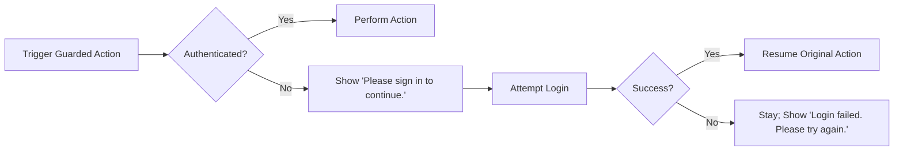
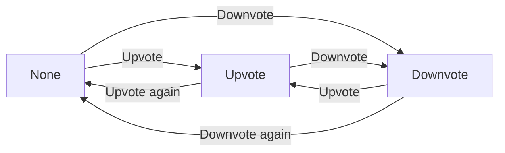
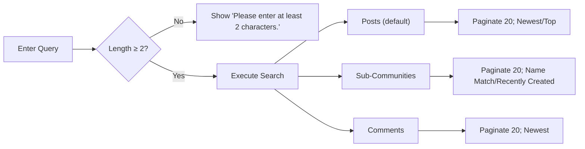
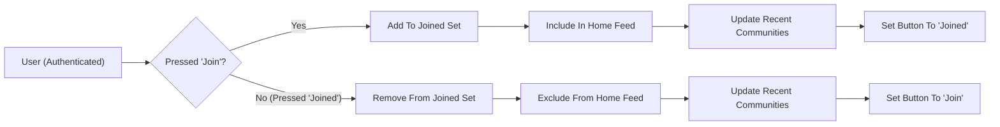
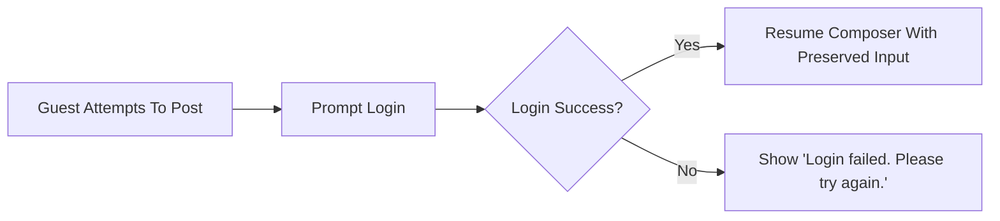

# Functional Requirements — communityPlatform

## 1) Scope and Intent
Defines complete, testable business requirements for the communityPlatform service. Describes WHAT the system must do, not HOW to implement it. Requirements use EARS for clarity and testability. Reading is open to all; writing actions are guarded by authentication; ownership is account-based; validation is minimal but precise where specified.

## 2) Definitions and Roles
- communityPlatform: The service covered by these requirements.
- Sub-community ("community"): Topic-based group (e.g., /c/ai) where posts are published.
- Guest: Unauthenticated visitor (guestVisitor) with read-only access.
- Member: Authenticated user (communityMember) with write capabilities and ability to join/leave and create communities.
- Admin: Platform administrator (systemAdmin) with policy enforcement powers that do not grant authorship over others’ content.
- Global Latest: Home right-sidebar list of sitewide 10 most recent posts.
- Recent Communities: Left-sidebar list (up to 5) per user, ordered by most recent activity.
- Sort orders: Newest and Top as defined in Section 9.

Roles (business scope):
- guestVisitor: Read/search only; cannot post/comment/vote/join/leave/create.
- communityMember: Can post/comment/vote/join/leave/create; owns created content and communities.
- systemAdmin: May enact policy removals/disablements; does not assume authorship of users’ content.

## 3) Global Functional Principles (EARS)
- THE communityPlatform SHALL allow reading of communities, posts, comments, and search results without login.
- THE communityPlatform SHALL require login for posting, commenting, voting, joining/leaving, and creating communities.
- THE communityPlatform SHALL enforce authorship ownership so only content authors can edit or delete their posts and comments.
- THE communityPlatform SHALL maintain generously long sessions and avoid disrupting the current screen during renewal.
- WHEN a session expires during an interaction, THE communityPlatform SHALL prompt re-login and, upon success, SHALL resume the interrupted action with preserved input.
- THE communityPlatform SHALL minimize validation while enforcing explicit constraints defined here.

## 4) Guarded Authentication Flows (Business-Level)
- WHEN a guestVisitor attempts a guarded action (post/comment/vote/join/leave/create community), THE communityPlatform SHALL display "Please sign in to continue." and SHALL present the login overlay.
- WHEN the guestVisitor successfully signs in from the overlay, THE communityPlatform SHALL resume the originally intended action using preserved inputs.
- IF sign-in fails, THEN THE communityPlatform SHALL show "Login failed. Please try again." and SHALL keep the user on the same context with inputs intact.
- WHILE a session is valid, THE communityPlatform SHALL allow authorized actions without re-prompting.
- WHEN a user signs out from all devices, THE communityPlatform SHALL require re-authentication on the next guarded action.

Mermaid — Guard and Resume:

## 5) Communities
### 5.1 Data and Constraints (EARS)
- THE communityPlatform SHALL treat community name as a unique, immutable identifier after creation.
- THE communityPlatform SHALL allow only alphanumeric characters with hyphen (-) and underscore (_), require a length of 3–32 characters, and require names to start with a letter and end with an alphanumeric character.
- THE communityPlatform SHALL require exactly one category: "Tech & Programming", "Science", "Movies & TV", "Games", "Sports", "Lifestyle & Wellness", "Study & Education", "Art & Design", "Business & Finance", "News & Current Affairs".
- THE communityPlatform SHALL support optional description, logo, banner, and rules.
- THE communityPlatform SHALL compute member count as the number of users who have joined the community.

### 5.2 Create Community (EARS)
- WHEN an authenticated user submits a new community with valid name and category, THE communityPlatform SHALL create the community and assign the user as the owner.
- IF the name duplicates an existing community (case-insensitive), THEN THE communityPlatform SHALL block creation and show "This name is already in use.".
- IF the name violates format rules, THEN THE communityPlatform SHALL block creation and show "This name isn’t available. Please choose something simpler.".
- WHEN creation succeeds, THE communityPlatform SHALL navigate subsequent state to the new community’s home.

### 5.3 Edit Community (EARS)
- WHERE the user is the community owner, THE communityPlatform SHALL allow editing description, logo, banner, rules, and category; the name SHALL remain immutable.
- IF a non-owner attempts to edit, THEN THE communityPlatform SHALL deny and show "You can edit or delete only items you authored.".

### 5.4 Delete Community (EARS)
- WHERE the user is the community owner, THE communityPlatform SHALL allow community deletion.
- WHEN a community is deleted, THE communityPlatform SHALL remove all posts within it from public access and SHALL invalidate existing joins.
- WHEN a community is deleted, THE communityPlatform SHALL remove it from feeds, Global Latest, search results, and Recent Communities.

### 5.5 Join / Leave (EARS)
- WHEN an authenticated user presses "Join", THE communityPlatform SHALL add the community to the user’s joined set and SHALL immediately include the community’s posts in the user’s home feed.
- WHEN a joined user presses "Joined" (leave), THE communityPlatform SHALL remove the community from the user’s joined set and SHALL immediately exclude the community’s posts from the user’s home feed.
- WHEN a join/leave occurs, THE communityPlatform SHALL update the left sidebar Recent Communities list (up to 5, ordered by most recent activity) and SHALL update the button state immediately.
- WHERE membership changes, THE communityPlatform SHALL not grant or revoke any moderation or administrative privileges.

## 6) Posts
### 6.1 Composition and Constraints (EARS)
- THE communityPlatform SHALL require selecting exactly one target community for each post.
- THE communityPlatform SHALL require a title 5–120 characters.
- THE communityPlatform SHALL require a body 10–10,000 characters, plain text with line breaks only (scripts/code prohibited).
- THE communityPlatform SHALL support an optional author display name 0–32 characters; WHERE empty, THE communityPlatform SHALL use a default like "Anonymous".
- THE communityPlatform SHALL allow posting without requiring membership in the target community.

### 6.2 Authoring and Ownership (EARS)
- WHEN an authenticated user submits a valid post, THE communityPlatform SHALL create the post attributed to that user as author.
- WHERE the user is the author, THE communityPlatform SHALL allow that user to edit or delete the post.
- IF a non-author attempts to edit or delete, THEN THE communityPlatform SHALL deny and show "You can edit or delete only items you authored.".

### 6.3 Display Fields (EARS)
- THE communityPlatform SHALL display, for each post card: community name (e.g., /c/ai), title, author display name, relative creation time, comment count, and score (upvotes − downvotes).
- THE communityPlatform SHALL display relative timestamps in the user’s local timezone using labels like "just now", "X minutes ago", "X hours ago", "X days ago".

## 7) Comments
### 7.1 Threading and Limits (EARS)
- THE communityPlatform SHALL allow authenticated users to create, edit, and delete their own comments.
- THE communityPlatform SHALL require comment length 2–2,000 characters.
- THE communityPlatform SHALL support nested replies (comments can reply to posts and to other comments).
- WHERE the user is the comment author, THE communityPlatform SHALL allow edit/delete of that comment.
- IF a non-author attempts to edit/delete a comment, THEN THE communityPlatform SHALL deny and show "You can edit or delete only items you authored.".

### 7.2 Post Detail Pagination (EARS)
- THE communityPlatform SHALL present comments in pages of 20 and SHALL reveal the next 20 upon a load-more action.

## 8) Voting
### 8.1 State Machine and Rules (EARS)
- THE communityPlatform SHALL allow exactly one vote state per user per item (post/comment): None, Upvote, or Downvote.
- WHEN state is None and Upvote is pressed, THE communityPlatform SHALL set state to Upvote.
- WHEN state is None and Downvote is pressed, THE communityPlatform SHALL set state to Downvote.
- WHEN state is Upvote and Downvote is pressed, THE communityPlatform SHALL set state to Downvote.
- WHEN state is Downvote and Upvote is pressed, THE communityPlatform SHALL set state to Upvote.
- WHEN the active vote is pressed again, THE communityPlatform SHALL set state to None.
- THE communityPlatform SHALL compute score as (number of Upvotes) − (number of Downvotes).
- IF a user attempts to vote on their own content, THEN THE communityPlatform SHALL deny and show "You can’t vote on your own posts/comments.".

Mermaid — Voting State Transitions:

## 9) Sorting and Pagination
### 9.1 Sorting Definitions (EARS)
- THE communityPlatform SHALL support Newest and Top sort orders across applicable surfaces.
- WHERE sort is Newest, THE communityPlatform SHALL order by most recent creation time first; WHERE creation times are equal, THE communityPlatform SHALL order the item with the larger identifier first.
- WHERE sort is Top, THE communityPlatform SHALL order by higher score first; WHERE scores tie, THE communityPlatform SHALL order by more recent creation time; WHERE creation times are equal, THE communityPlatform SHALL order the item with the larger identifier first.

### 9.2 Page Sizes and Behavior (EARS)
- WHERE surface is a main feed (Home or Community Home), THE communityPlatform SHALL present 20 post cards per page and SHALL reveal the next 20 upon load-more.
- WHERE surface is Global Latest (Home right sidebar), THE communityPlatform SHALL present exactly 10 most recent posts sitewide without load-more.
- WHERE surface is search results (Posts/Sub-Communities/Comments), THE communityPlatform SHALL present 20 results per page and SHALL reveal the next 20 upon load-more.
- WHERE surface is Post detail comments, THE communityPlatform SHALL present 20 comments per page and SHALL reveal the next 20 upon load-more.

## 10) Search
### 10.1 Query Prerequisites (EARS)
- THE communityPlatform SHALL accept queries with length ≥ 2 characters; shorter queries SHALL not execute and SHALL show "Please enter at least 2 characters.".

### 10.2 Post Search (EARS)
- THE communityPlatform SHALL match words in post title and body.
- WHERE sort is unspecified for posts, THE communityPlatform SHALL default to Newest.
- THE communityPlatform SHALL return post results in pages of 20 with applicable sorting and tie-breakers.

### 10.3 Sub-Community Search (EARS)
- THE communityPlatform SHALL match by community name/title.
- THE communityPlatform SHALL support sort options [Name Match (default) | Recently Created].
- WHERE similarity ties in Name Match, THE communityPlatform SHALL tiebreak by more recent creation time; WHERE creation times tie, by larger identifier.

### 10.4 Comment Search (EARS)
- THE communityPlatform SHALL list comments sorted by Newest and SHALL paginate at 20 per page.

### 10.5 Tabs, Fields, and Empty States (EARS)
- THE communityPlatform SHALL display three tabs: Posts (default), Sub-Communities, Comments.
- IF no results match, THEN THE communityPlatform SHALL show "No matching results. Try different keywords.".

Mermaid — Search Flow:

## 11) Feeds and Information Architecture Behaviors (Business-Level)
### 11.1 Home Feed (EARS)
- WHERE a user has joined one or more communities, THE communityPlatform SHALL populate the Home main content with posts from those communities using the selected sort.
- WHERE a user has not joined any community, THE communityPlatform SHALL populate the Home main content with latest or top posts across all communities and SHALL present guidance to explore/join.
- THE communityPlatform SHALL provide a sort control [Newest | Top] for Home and SHALL apply the canonical sorting rules.
- THE communityPlatform SHALL render 20 post cards per page and SHALL reveal next 20 upon load-more.
- THE communityPlatform SHALL always present Global Latest (10 newest sitewide) on the right sidebar of Home.

### 11.2 Community Home (EARS)
- THE communityPlatform SHALL provide Join ↔ Joined toggle for authenticated users.
- THE communityPlatform SHALL provide a post creation entry point when authenticated.
- THE communityPlatform SHALL present 20 post cards per page with load-more and [Newest | Top] sorting per canonical rules.
- THE communityPlatform SHALL show Community Info + Rules box on the right sidebar, including rules numbered 1..n and default visible top 5.

### 11.3 Post Detail (EARS)
- THE communityPlatform SHALL display community mini-info (name + small logo if any), a back control, post title, author, time (relative), and content; below, up/down vote score and comment count.
- THE communityPlatform SHALL present a comment composer for authenticated users and list comments in pages of 20 with load-more.
- THE communityPlatform SHALL show Edit/Delete buttons only on items authored by the current user (author guard).

### 11.4 Explore Sub-Communities (EARS)
- THE communityPlatform SHALL present category chips that filter the grid by selected category.
- THE communityPlatform SHALL present community cards containing logo (default if none), community name, member count, Join button, and description truncated to two lines.
- THE communityPlatform SHALL show 20 cards per page and SHALL reveal the next 20 upon load-more.

### 11.5 Recent Communities (EARS)
- THE communityPlatform SHALL maintain a per-user Recent Communities list with up to 5 entries ordered by most recent activity.
- WHEN a user visits a community, views a post from it, joins/leaves it, posts in it, comments in it, or votes on its items, THE communityPlatform SHALL move that community to the front of the Recent Communities list.

## 12) Standard Messages and Display Rules (EARS)
- THE communityPlatform SHALL display time using relative labels in the user’s local timezone: "just now", "X minutes ago", "X hours ago", "X days ago".
- THE communityPlatform SHALL abbreviate numbers per standard: 1,000 → 1.2k; 10,000 → 12.3k; 1,000,000 → 1.2m.
- THE communityPlatform SHALL use the following messages verbatim:
  - "Please sign in to continue."
  - "You can edit or delete only items you authored."
  - "This name is already in use."
  - "This name isn’t available. Please choose something simpler."
  - "Please choose a community to post in."
  - "Please enter at least 2 characters."
  - "You can’t vote on your own posts/comments."
  - "A temporary error occurred. Please try again in a moment."
  - "Login failed. Please try again."

## 13) Optimistic Interactions, Guards, and Session Expiry (EARS)
- WHEN a guest attempts a guarded action, THE communityPlatform SHALL prompt login and, upon success, SHALL resume the original action with preserved input.
- WHEN a user toggles Join/Leave, THE communityPlatform SHALL immediately update home feed inclusion/exclusion, Recent Communities, and button state, then reconcile with server confirmation.
- WHEN a user votes on a post/comment, THE communityPlatform SHALL immediately reflect vote state and score changes and reconcile with server confirmation.
- IF a temporary error occurs, THEN THE communityPlatform SHALL revert any unconfirmed optimistic changes and SHALL show "A temporary error occurred. Please try again in a moment." while allowing retry without data loss.

## 14) Performance and UX Expectations (Business-Perceived)
- THE communityPlatform SHALL acknowledge primary actions (vote, join, load-more) immediately in a way that feels instant.
- THE communityPlatform SHALL render first items in feeds within a timeframe that feels immediate and SHALL append the next 20 on load-more without disruptive reordering.
- THE communityPlatform SHALL keep sign-in prompts and session renewal non-disruptive and SHALL resume the original action upon success.

## 15) Permission Matrix (Business View)
| Capability | guestVisitor | communityMember | systemAdmin |
|---|---|---|---|
| Read public communities/posts/comments | ✅ | ✅ | ✅ |
| Search content | ✅ | ✅ | ✅ |
| Create community | ❌ | ✅ | ✅ |
| Edit community metadata (owner only) | ❌ | ✅ (owner only) | ✅ (policy actions) |
| Delete community | ❌ | ✅ (owner only) | ✅ (policy actions) |
| Join/Leave community | ❌ | ✅ | ✅ |
| Create post | ❌ | ✅ | ✅ |
| Edit/Delete own post | ❌ | ✅ | ✅ (policy actions) |
| Create comment | ❌ | ✅ | ✅ |
| Edit/Delete own comment | ❌ | ✅ | ✅ (policy actions) |
| Vote on others’ content | ❌ | ✅ | ✅ |
| Vote on own content | ❌ | ❌ | ❌ |

Notes: Administrative removals are distinct from author-based edits and do not grant authorship rights.

## 16) Error Handling and Edge Cases (EARS)
- IF a user attempts a write action without selecting a target community, THEN THE communityPlatform SHALL show "Please choose a community to post in." and SHALL not submit.
- IF a search query is shorter than 2 characters, THEN THE communityPlatform SHALL show "Please enter at least 2 characters." and SHALL not execute search.
- IF a user attempts to edit/delete content they did not author, THEN THE communityPlatform SHALL show "You can edit or delete only items you authored." and SHALL not proceed.
- IF a user attempts to self-vote, THEN THE communityPlatform SHALL show "You can’t vote on your own posts/comments." and SHALL leave the vote state unchanged.
- IF transient failures occur, THEN THE communityPlatform SHALL show "A temporary error occurred. Please try again in a moment." and SHALL allow retry without data loss.
- WHEN a community is deleted, THE communityPlatform SHALL remove it and its posts from feeds, Global Latest, search, and Recent Communities.
- WHEN a post or comment is deleted, THE communityPlatform SHALL remove it from public lists and adjust related counts consistently.

## 17) Diagrams (Mermaid)
### 17.1 Join/Leave Lifecycle

### 17.2 Post Creation Guard and Resume

## 18) Compliance and Ownership Notes (Business-Level)
- THE communityPlatform SHALL recognize authorship at account level; only authors can edit/delete their own posts/comments.
- THE communityPlatform SHALL ensure community joining is a personalization feature only; it does not convey moderation powers.
- THE communityPlatform SHALL treat community deletion as a cascade that removes all posts and related items from public view.

## 19) Acceptance Criteria Summary (EARS Highlights)
- WHEN sorting by Newest, THE communityPlatform SHALL order by creation time descending; ties by larger identifier.
- WHEN sorting by Top, THE communityPlatform SHALL order by score descending; ties by more recent creation time; then by larger identifier.
- WHEN a user with joined communities opens Home, THE communityPlatform SHALL include posts only from those communities.
- WHEN a user has not joined any community, THE communityPlatform SHALL show latest or top posts across all communities and guidance to explore/join.
- WHEN a guest attempts any guarded action, THE communityPlatform SHALL prompt login and resume action upon success.
- WHEN a user toggles votes, THE communityPlatform SHALL update state per the voting state machine and adjust score accordingly.
- WHEN creating/editing content, THE communityPlatform SHALL enforce input lengths and constraints.
- WHEN creating a community, THE communityPlatform SHALL enforce uniqueness and format; set category to one of the allowed values.
- WHEN displaying times and numbers, THE communityPlatform SHALL use relative timestamps and number abbreviations as specified.

## 20) Glossary
- Authorship: Relationship between a user account and the content created by that account.
- Community Owner: Account that created the community; has exclusive rights to edit metadata/rules; name immutable.
- Guarded Action: Any action requiring authentication (post/comment/edit/delete/vote/join/leave/create community).
- Optimistic UI: Immediate reflection of an intended change before server confirmation, followed by reconciliation.
- Surfaces: Home, Community Home, Post Detail, Explore, Global Search, Global Latest sidebar, Recent Communities list.

## 21) Traceability to PRD and Related Documents
- Aligns with PRD core principles and features (open reading, guarded interactions, ownership, optimistic UI, sorting/pagination/search rules).
- For role taxonomy and session details, see the [User Roles and Permissions Specification](./03-user-roles-and-permissions.md).
- For search and sorting tie-breakers and pagination specifics, see the [Search and Sorting Requirements](./07-search-and-sorting-requirements.md).
- For error scenarios and recovery, see the [Error Handling and Recovery Requirements](./09-error-handling-and-recovery.md).
- For event-style optimistic updates, see the [Event Lifecycle and Optimistic UI Requirements](./12-event-lifecycle-and-optimistic-ui.md).
