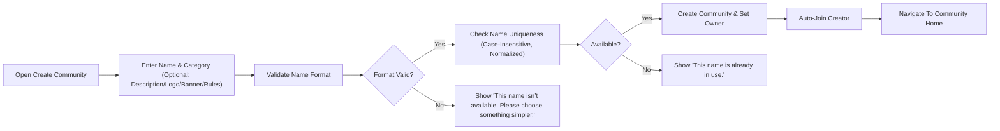
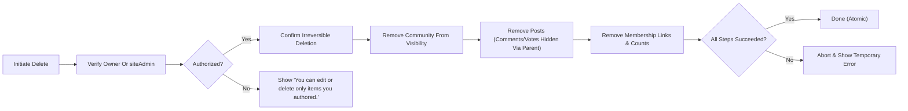
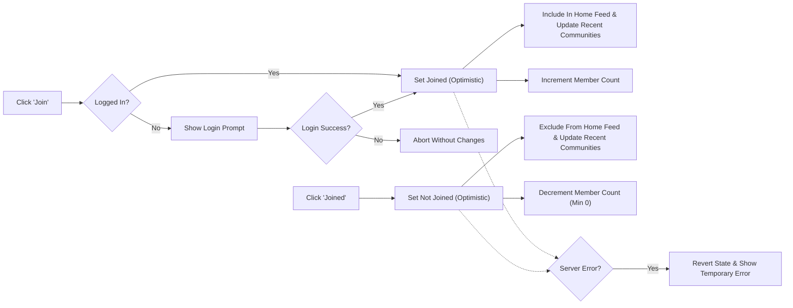

# Sub-Communities — Business Requirements (communityPlatform)

## 1) Title and Scope
Defines complete business rules for sub-communities: creation, naming and category constraints, editing and deletion, join/leave behavior and effects, member counts, and the Community Info + Rules box. Describes WHAT must happen in user-facing terms. Avoids APIs, schemas, infrastructure, and UI styling.

EARS scope statements:
- THE communityPlatform SHALL keep reading open to everyone and SHALL require login for creating, editing, deleting, joining/leaving, posting, commenting, and voting.
- THE communityPlatform SHALL minimize validation while enforcing essential constraints for names, categories, and content lengths.
- THE communityPlatform SHALL apply deterministic sorting and consistent pagination rules referenced from the sorting specification.

Out of scope:
- Database schema, API design, endpoint enumeration, storage/index choices, and UI component styling.

## 2) Glossary and Roles
Terms:
- Sub-community (community): A topic-based space identified by an immutable unique name (e.g., "/c/ai").
- Owner: The account that created the community.
- Member: A registeredMember who has joined a community.
- Global Latest: Home right-sidebar list of 10 newest posts sitewide.

Roles:
- guestVisitor: Unauthenticated, read-only.
- registeredMember: Authenticated; may create communities, post, comment, vote, and join/leave. May edit/delete only items authored; may edit/delete communities they created per rules herein.
- siteAdmin: Administrative oversight; may intervene for policy/legal compliance.

## 3) Principles and Global Assumptions
- THE platform SHALL enforce account-based ownership; only authors may edit/delete their posts/comments; only community owners may edit community metadata or delete the community.
- THE platform SHALL treat the community name as immutable after creation.
- THE platform SHALL reflect optimistic UI for join/leave and counters and reconcile quickly with server state.
- WHEN session expiry interrupts any action, THE platform SHALL prompt a smooth re-login and, on success, SHALL resume the interrupted action with preserved inputs.

## 4) Community Creation
### 4.1 Inputs and Eligibility
- THE platform SHALL require login to create a community.
- THE platform SHALL require: name (immutable identifier), category (one from the fixed list).
- THE platform SHALL accept optionally: description (≤ 500 chars), logo (optional asset), banner (optional asset), rules (ordered list, up to 20 items; each item intended to be concise).

### 4.2 Name and Category Validation at Creation
- THE platform SHALL validate name format and uniqueness per Section 5 before creation.
- THE platform SHALL validate that exactly one category from the allowed set is provided.
- IF inputs violate constraints, THEN THE platform SHALL block creation with the standardized messages in Section 10.

### 4.3 Success Effects
- WHEN creation succeeds, THE platform SHALL set the creator as the owner and auto-join the creator as a member of the new community.
- WHEN creation succeeds, THE platform SHALL navigate context to the new community’s home and make it discoverable in Explore/Search according to search rules.
- THE platform SHALL display default images where no logo/banner is provided.

### 4.4 Timings and Performance (Business)
- THE platform SHALL complete valid creation within 2 seconds (p95) under normal load.

### 4.5 Error Handling
- WHEN the proposed name fails format validation, THE platform SHALL respond: "This name isn’t available. Please choose something simpler." and SHALL not create the community.
- WHEN the proposed name is already in use (case-insensitive, normalized), THE platform SHALL respond: "This name is already in use." and SHALL not create the community.
- IF a temporary error occurs, THEN THE platform SHALL respond: "A temporary error occurred. Please try again in a moment." and SHALL allow retry without duplicating creations.
- WHEN a guestVisitor attempts creation, THE platform SHALL respond: "Please sign in to continue." and, upon success, SHALL resume creation with preserved inputs.

## 5) Naming and Category Constraints
### 5.1 Naming Policy
- THE platform SHALL enforce uniqueness across all communities using a normalized name (lowercased, trimmed).
- THE platform SHALL allow only [a–z], [0–9], hyphen ("-"), and underscore ("_").
- THE platform SHALL enforce length 3–30 inclusive.
- THE platform SHALL enforce that names begin and end with an alphanumeric character.
- THE platform SHALL forbid consecutive hyphens or consecutive underscores.
- THE platform SHALL reject names colliding with reserved path segments (e.g., "c", "s", "login", "submit", "create", "admin").
- THE platform SHALL treat names differing only by case or separator sequences as the same for uniqueness.
- THE platform SHALL make the name immutable post-creation.

Format failure message:
- WHEN a name violates any format rule, THE platform SHALL show: "This name isn’t available. Please choose something simpler."

### 5.2 Category Policy
- THE platform SHALL require exactly one category at creation chosen from:
  - "Tech & Programming"
  - "Science"
  - "Movies & TV"
  - "Games"
  - "Sports"
  - "Lifestyle & Wellness"
  - "Study & Education"
  - "Art & Design"
  - "Business & Finance"
  - "News & Current Affairs"
- THE platform SHALL permit the owner (or siteAdmin) to change category later to another valid category.

### 5.3 Name Reuse Post-Deletion
- WHEN a community is deleted, THE platform SHALL release its name for reuse immediately, subject to the same validation rules.

## 6) Edit and Delete
### 6.1 Editable Fields and Immutability
- THE platform SHALL allow only the owner (or siteAdmin) to edit description, logo, banner, rules, and category.
- THE platform SHALL not permit renaming.

### 6.2 Deletion Permissions and Confirmation
- THE platform SHALL allow only the owner or siteAdmin to delete a community.
- THE platform SHALL require an explicit irreversible confirmation before deletion.

### 6.3 Deletion Effects (Atomic Visibility)
- WHEN a community is deleted, THE platform SHALL:
  - Remove the community from public view across Home, Explore, Search, Community Home, and Post Detail.
  - Remove all posts belonging to the community from user-visible surfaces; comments and votes on those posts cease to be visible via parent removal.
  - Remove all membership associations and stop displaying member count.
  - Release the name for reuse.
- THE platform SHALL ensure deletion appears atomic: either the community is fully gone or not deleted at all from a user perspective.

### 6.4 Timings and Errors (Deletion)
- THE platform SHALL complete deletion within 3 seconds (p95) under normal load.
- IF a temporary error occurs during deletion, THEN THE platform SHALL show: "A temporary error occurred. Please try again in a moment." and SHALL leave the community intact.

## 7) Join/Leave Membership
### 7.1 Eligibility and Guards
- THE platform SHALL require login for join/leave.
- THE platform SHALL make join/leave idempotent: joining an already joined community leaves it joined; leaving a not-joined community leaves it not joined.
- THE platform SHALL not grant moderation or administrative rights through joining.

### 7.2 Immediate Effects (Optimistic)
- WHEN a user joins, THE platform SHALL immediately set state to "Joined", include the community’s posts in that user’s Home feed, update Recent Communities, and increment member count.
- WHEN a user leaves, THE platform SHALL immediately set state to "Join", exclude the community’s posts from that user’s Home feed, update Recent Communities, and decrement member count (never below 0).

### 7.3 Resume-After-Login and Errors
- WHEN a guestVisitor attempts join/leave, THE platform SHALL prompt login and SHALL resume the intended action upon success.
- IF a temporary error occurs, THEN THE platform SHALL revert to the prior state and show: "A temporary error occurred. Please try again in a moment."
- WHILE a session expires mid-action, THE platform SHALL prompt re-login and, upon success, SHALL retry the last intended state exactly once.

### 7.4 Consistency Across Surfaces
- THE platform SHALL reflect joined/not-joined state consistently across Home, Explore, Community Home, Search, and Post Detail.
- THE platform SHALL keep Global Latest sitewide and unaffected by membership; only the user’s Home main feed changes with membership.

### 7.5 Timings and Consistency
- THE platform SHALL reflect join/leave UI state within 1 second (p95) and finalize server-confirmed state within 3 seconds (p95) under normal load.
- THE platform SHALL ensure membership-derived feed inclusion updates within 5 seconds for subsequent queries.

## 8) Member Count Display
- THE platform SHALL define member count as the number of distinct users currently joined (joined minus left), excluding guests.
- WHEN a user joins, THE platform SHALL increment member count by 1; WHEN a user leaves, THE platform SHALL decrement by 1 (not below 0).
- THE platform SHALL display member counts anywhere they appear using number abbreviations (e.g., 1.2k, 1.2m) per copy rules.
- THE platform SHALL propagate member count updates consistently across Community Home, Explore, and Search; minor propagation delay up to 5 seconds is acceptable under normal load.
- IF a temporary error prevents updating the count after a confirmed membership change, THEN THE platform SHALL retry and maintain best-known last value until reconciled.

## 9) Community Info + Rules Box
### 9.1 Placement and Purpose
- THE platform SHALL display the Community Info + Rules box on the right sidebar of Community Home and Post Detail.

### 9.2 Information Shown
- THE platform SHALL display: community name, short description, created date (optional), last active (optional), and a rules section.
- THE platform SHALL display a logo if provided; otherwise, a default image.
- THE platform SHALL render created/last active using relative timestamps in the user’s local timezone.

### 9.3 Rules Presentation
- THE platform SHALL label the section header exactly as "Community Rules".
- THE platform SHALL display the top 5 rules (by stored order), numbered 1, 2, 3, …, each limited to about two lines (~50 chars/line; max 100 chars per rule).
- WHERE more than 5 rules exist, THE platform SHALL display only the first five by default.

### 9.4 Empty States and Asset Failures
- WHEN description is empty, THE platform SHALL omit or show a neutral placeholder consistent with platform standards.
- WHEN no rules exist, THE platform SHALL omit the rules list and the "Community Rules" header.
- IF assets fail to load temporarily, THEN THE platform SHALL show default images.

### 9.5 Immediate Reflection After Edits
- WHEN the owner or siteAdmin edits description, logo, banner, rules, or category, THE platform SHALL reflect updates immediately upon success.

## 10) Error Handling and Standard Copy Mapping
Exact messages (en-US):
- Login required: "Please sign in to continue."
- Name taken: "This name is already in use."
- Invalid name format: "This name isn’t available. Please choose something simpler."
- Temporary error: "A temporary error occurred. Please try again in a moment."

EARS mapping:
- WHEN a guestVisitor attempts creation or join/leave, THE platform SHALL present "Please sign in to continue." and SHALL resume upon successful login.
- WHEN a name collides after normalization, THE platform SHALL present "This name is already in use." and SHALL block creation.
- WHEN a name fails format, THE platform SHALL present "This name isn’t available. Please choose something simpler." and SHALL block creation.
- IF a recoverable error occurs, THEN THE platform SHALL present "A temporary error occurred. Please try again in a moment." and SHALL allow retry without duplicating effects.

## 11) Sorting, Pagination, and Discoverability Linkage
- THE platform SHALL display Home main feed in pages of 20 with Load more; joined communities determine inclusion for authenticated users.
- THE platform SHALL display Community Home in pages of 20 with Load more; sort toggle [Newest | Top] per sorting rules.
- THE platform SHALL keep Global Latest at exactly 10 newest posts in Home right sidebar without Load more.
- THE platform SHALL surface communities in Explore with category chips and 20-card pages; Search results per entity tab (20 per page) with rules in the search specification.
- THE platform SHALL respect deterministic Newest and Top definitions, including tie-breakers by identifier, as referenced in the sorting specification.

## 12) Performance and Non-Functional Expectations (Business)
- Community creation (valid): complete within 2 seconds (p95) under normal load.
- Community deletion (valid): complete within 3 seconds (p95) under normal load with atomic visibility.
- Join/Leave: optimistic update within 1 second; reconciliation within 3 seconds; feed inclusion effects visible within 5 seconds on subsequent queries.
- Info + Rules box: render alongside main content; degraded asset loads fall back to default images without blocking text content.
- Numbers and times: compute abbreviations and relative time within 100 ms for typical page sizes (20 items/cards).

## 13) Workflows (Mermaid)

Community creation (business-level):

Deletion (atomic visibility):

Join/Leave (idempotent, optimistic):

## 14) Acceptance Criteria and Test Scenarios (EARS)

Creation
- WHEN a logged-in user submits name "ai_research" and category "Science" with optional fields empty, THE platform SHALL create the community within 2 seconds, set the user as owner, auto-join, and navigate to its home.
- IF name "ai_research" violates any format rule (e.g., begins with "-"), THEN THE platform SHALL block creation and show "This name isn’t available. Please choose something simpler.".
- IF name "Games" collides (normalized) with existing "games", THEN THE platform SHALL block creation and show "This name is already in use.".

Edit/Delete
- WHEN the owner edits description, THE platform SHALL apply the change immediately; non-owners SHALL be denied with "You can edit or delete only items you authored.".
- WHEN the owner confirms deletion, THE platform SHALL remove the community and all posts from user-visible surfaces with atomic visibility and finish within 3 seconds.

Join/Leave
- WHEN a logged-in user joins, THE platform SHALL set state to "Joined" immediately, include the community in Home feed, update Recent Communities, and increment member count.
- WHEN a logged-in user leaves, THE platform SHALL set state to "Join" immediately, exclude the community from Home feed, update Recent Communities, and decrement member count.
- WHEN a guest taps Join, THE platform SHALL prompt login and, upon success, SHALL complete the join and reflect the state.
- IF a temporary error occurs during join/leave, THEN THE platform SHALL revert to prior state and show "A temporary error occurred. Please try again in a moment.".

Member Count
- WHEN a user joins, THE platform SHALL display updated member count within 5 seconds across Community Home, Explore, and Search with proper abbreviation.
- WHEN a user leaves, THE platform SHALL not allow the count to drop below 0.

Info + Rules Box
- WHEN present, THE Info box SHALL include name, description, created date (optional), last active (optional), and top 5 numbered rules labeled under "Community Rules".
- WHEN no rules exist, THE platform SHALL omit the rules label and list without error.
- WHEN logo/banner fails temporarily, THE platform SHALL show default images without blocking text content.

## 15) Examples and Edge Cases
- Name normalization: "AI_Research" and "ai-research" normalize to the same uniqueness key; only one may exist.
- Reserved path collision: "login", "submit" are rejected regardless of case.
- Excess rules: Providing > 20 rules is rejected; providing long rule text is accepted but only up to the top 5 are shown in the box with two-line truncation.
- Deletion race: If deletion starts while another user loads Community Home, atomic visibility ensures either full presence or full removal for that user’s result set.
- Idempotent join: Re-joining an already joined community leaves state unchanged and does not double-increment counts.

## 16) Observability and Audit (Business)
- THE platform SHALL record business-significant events: community created (owner, timestamp), metadata edited, community deleted, user joined, user left.
- THE platform SHALL retain operational logs and audit trails according to platform-wide retention policies referenced in non-functional guidance.

## 17) Cross-References
- Roles and permissions: see "User Roles and Permissions — Business Requirements".
- Sorting and pagination: see "Sorting and Pagination Rules".
- Posts behavior and card fields: see "Posts — Business Requirements".
- Comments and nesting: see "Comments and Nesting — Business Requirements".
- Search behavior: see "Search Requirements (Business-Level)".
- Session/guest guard/resume: see "Session and Authentication Experience".
- Standard messages, time, numbers: see "Error Handling and Standard Copy Requirements".
- Non-functional expectations: see "Non-Functional Requirements".

## 18) Business-Only Boundary and Closing
Requirements above define user-visible behaviors and business rules for sub-communities. Technical implementation details (APIs, storage, schemas, infrastructure, UI styling) remain at the discretion of the development team, provided the outcomes meet these specifications.
