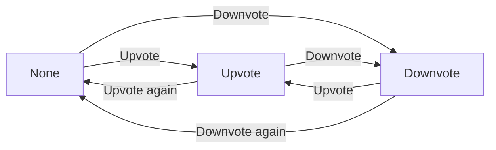
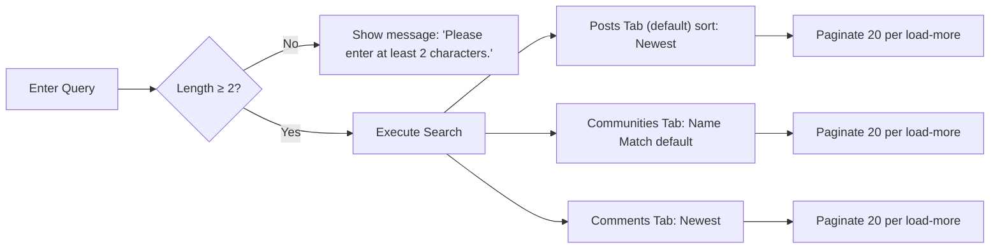
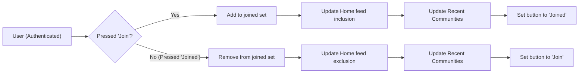
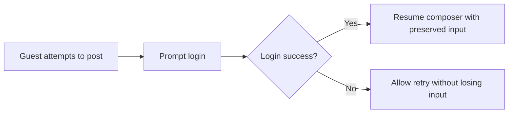

# Functional Requirements – communityPlatform (04-functional-requirements.md)

## 1) Scope and Principles
This document specifies complete, testable business requirements for the communityPlatform. It describes WHAT the system must do from a backend behavior perspective and refrains from prescribing HOW to implement it. Requirements are expressed in EARS (Easy Approach to Requirements Syntax) where applicable.

## 2) Definitions and Roles
- communityPlatform: The service described in this document.
- Sub-community ("community"): A topic-based group (e.g., /c/ai) created by users where content is posted.
- Member: An authenticated user who has joined a specific community.
- Guest: An unauthenticated visitor.
- Global Latest: Sitewide list of 10 most recent posts across all communities displayed on the right sidebar of Home.
- Recent Communities: Up to 5 communities the user recently visited or interacted with, ordered by most recent activity.
- Sort orders: Newest, Top (with tie-breakers defined herein).
- Roles:
  - guestVisitor: Unauthenticated user; read-only access.
  - communityMember: Authenticated user; can post, comment, vote, join/leave, and create communities; owns created content and communities.
  - systemAdmin: Platform administrator; may enforce policy and perform emergency interventions; does not assume authorship of others’ content.

## 3) Global Functional Principles (EARS)
- THE communityPlatform SHALL allow reading public communities, posts, comments, and search results without login.
- THE communityPlatform SHALL require login for posting, commenting, voting, creating communities, and joining/leaving communities.
- THE communityPlatform SHALL enforce authorship ownership so that only content authors can edit or delete their own posts and comments.
- THE communityPlatform SHALL maintain generous user sessions such that typical browsing and interaction over extended periods does not frequently require re-login.
- WHEN a session expires during an interaction, THE communityPlatform SHALL prompt a smooth re-login and, upon success, resume the interrupted action without losing user input.
- THE communityPlatform SHALL minimize validation to prioritize smooth, error-free user flows while respecting explicit input constraints defined in this document.
- WHERE a user is not a member of any community, THE communityPlatform SHALL present a home feed from all communities and provide guidance to explore and join communities.

## 4) Communities: Create, Edit, Delete, Join, Leave
### 4.1 Community Data and Constraints (EARS)
- THE communityPlatform SHALL treat community "name" as a unique identifier that is immutable after creation.
- THE communityPlatform SHALL accept community names containing alphanumeric characters, hyphen (-), and underscore (_), and reject other characters.
- THE communityPlatform SHALL ensure community names are unique across all communities.
- THE communityPlatform SHALL support optional description, optional logo, optional banner, and optional rules.
- THE communityPlatform SHALL require a category to be exactly one of the following: "Tech & Programming", "Science", "Movies & TV", "Games", "Sports", "Lifestyle & Wellness", "Study & Education", "Art & Design", "Business & Finance", "News & Current Affairs".
- THE communityPlatform SHALL compute member count as the number of users who have joined the community.

### 4.2 Create Community (EARS)
- WHEN an authenticated user submits a new community with valid name, selected category, and optional metadata, THE communityPlatform SHALL create the community and assign the submitting user as the creator/owner.
- IF the submitted name is already in use, THEN THE communityPlatform SHALL block creation and present the message "This name is already in use.".
- IF the submitted name format includes disallowed characters or fails readability expectations, THEN THE communityPlatform SHALL block creation and present the message "This name isn’t available. Please choose something simpler.".
- WHEN a community is created successfully, THE communityPlatform SHALL redirect the user to that community’s home in subsequent navigation state.

### 4.3 Edit Community (EARS)
- WHERE a user is the creator/owner of a community, THE communityPlatform SHALL allow editing description, logo, banner, and rules, but not the name.
- IF a non-owner attempts to edit a community, THEN THE communityPlatform SHALL deny the action and present the message "You can edit or delete only items you authored.".
- WHEN community rules are edited, THE communityPlatform SHALL store and display the latest rules according to rules display standards.

### 4.4 Delete Community (EARS)
- WHERE the creator/owner deletes a community, THE communityPlatform SHALL delete the community and all posts within it.
- WHEN a community is deleted, THE communityPlatform SHALL remove it from all feeds, searches, and Recent Communities, and invalidate associated joins.

### 4.5 Join / Leave (EARS)
- WHEN an authenticated user presses "Join" on a community, THE communityPlatform SHALL add the community to the user’s joined set and update the user’s home feed inclusion accordingly.
- WHEN a joined user presses "Joined" to leave, THE communityPlatform SHALL remove the community from the user’s joined set and update the user’s home feed exclusion accordingly.
- WHEN a join or leave occurs, THE communityPlatform SHALL immediately update the left sidebar Recent Communities list and the join button state.
- WHERE joining, THE communityPlatform SHALL not grant moderator or administrative rights; membership is strictly for personalized display.
- IF a guest attempts to join or leave, THEN THE communityPlatform SHALL require login and resume the attempted action upon successful login.

## 5) Posts: Create, Edit, Delete, Display
### 5.1 Composition and Constraints (EARS)
- THE communityPlatform SHALL require selecting exactly one target community for every post.
- THE communityPlatform SHALL require a title of length 5–120 characters.
- THE communityPlatform SHALL require a body of length 10–10,000 characters consisting of plain text with line breaks only; scripts and executable code are prohibited.
- THE communityPlatform SHALL support an optional author display name of length 0–32 characters; where empty, use a default such as "Anonymous" for display.
- THE communityPlatform SHALL allow posting to a community without requiring the user to be a member of that community.

### 5.2 Authoring and Ownership (EARS)
- WHEN an authenticated user submits a valid post, THE communityPlatform SHALL create the post attributed to that user as author.
- WHERE a user is the author of a post, THE communityPlatform SHALL allow that user to edit or delete the post.
- IF a non-author attempts to edit or delete a post, THEN THE communityPlatform SHALL deny the action and present the message "You can edit or delete only items you authored.".

### 5.3 Display Fields (EARS)
- THE communityPlatform SHALL display on each post card: community name (e.g., /c/ai), title, author display name, creation time (relative), comment count, and score (upvotes − downvotes).
- THE communityPlatform SHALL present creation time using user’s local timezone and friendly relative labels (e.g., "just now", "X minutes ago").

## 6) Comments: Threading and Limits (EARS)
- THE communityPlatform SHALL allow authenticated users to create, edit, and delete their own comments.
- THE communityPlatform SHALL require comment content length 2–2,000 characters.
- THE communityPlatform SHALL support nested reply threads such that comments can reply to posts and to other comments.
- WHERE a user is the author of a comment, THE communityPlatform SHALL allow that user to edit or delete that comment.
- IF a non-author attempts to edit or delete a comment, THEN THE communityPlatform SHALL deny the action and present the message "You can edit or delete only items you authored.".

## 7) Voting: State Machine and Score (EARS)
### 7.1 Voting Rules
- THE communityPlatform SHALL allow exactly one voting state per user per item (post or comment): None, Upvote, or Downvote.
- WHEN a user with state None presses Upvote, THE communityPlatform SHALL set the state to Upvote.
- WHEN a user with state None presses Downvote, THE communityPlatform SHALL set the state to Downvote.
- WHEN a user with state Upvote presses Downvote, THE communityPlatform SHALL set the state to Downvote.
- WHEN a user with state Downvote presses Upvote, THE communityPlatform SHALL set the state to Upvote.
- WHEN a user presses the current state button again (e.g., Upvote while Upvote), THE communityPlatform SHALL revert the state to None.
- THE communityPlatform SHALL compute score as (number of Upvotes) − (number of Downvotes).
- IF a user attempts to vote on their own post or comment, THEN THE communityPlatform SHALL deny the action and present the message "You can’t vote on your own posts/comments.".
- IF a guest attempts to vote, THEN THE communityPlatform SHALL require login and resume the attempted vote upon successful login.

### 7.2 Voting State Diagram

## 8) Sorting and Pagination (Canonical Rules)
### 8.1 Sorting: Newest and Top (EARS)
- THE communityPlatform SHALL support two sort orders for posts and comments where applicable: Newest and Top.
- WHERE sort order is Newest, THE communityPlatform SHALL order items by most recently created first; where creation times are equal, the item with the larger identifier SHALL come first.
- WHERE sort order is Top, THE communityPlatform SHALL order items by higher score first; where scores tie, more recent creation time SHALL come first; where creation times tie, the item with the larger identifier SHALL come first.

### 8.2 Pagination (EARS)
- WHERE surface is a main feed (Home or Community Home), THE communityPlatform SHALL present 20 post cards per page and reveal the next 20 upon a load-more action.
- WHERE surface is the right sidebar Global Latest, THE communityPlatform SHALL present exactly 10 most recent posts sitewide without load-more.
- WHERE surface is search results, THE communityPlatform SHALL present 20 items per page in each tab and reveal the next 20 upon a load-more action.

## 9) Search (Posts / Communities / Comments)
### 9.1 Query Prerequisites (EARS)
- THE communityPlatform SHALL accept search queries of length 2 or more characters; shorter queries SHALL present the message "Please enter at least 2 characters." and SHALL not perform a search.

### 9.2 Post Search (EARS)
- THE communityPlatform SHALL match query words against post titles and bodies.
- WHERE no sort is specified for post search, THE communityPlatform SHALL default to Newest.
- THE communityPlatform SHALL return post results in pages of 20 using the specified sort order rules.

### 9.3 Community Search (EARS)
- THE communityPlatform SHALL match search queries against community name/title for queries of length ≥ 2.
- WHERE sort is Name Match, THE communityPlatform SHALL order communities by similarity to the query; where similarity ties, more recent creation SHALL rank higher.
- WHERE sort is Recently Created, THE communityPlatform SHALL order communities by most recent creation time first.

### 9.4 Comment Search (EARS)
- THE communityPlatform SHALL support comment search returning items sorted by Newest and 20 results per page.

### 9.5 Search Tabs and Items (EARS)
- THE communityPlatform SHALL present three result tabs: Posts (default), Sub-Communities, Comments.
- THE communityPlatform SHALL provide item fields per tab as defined in the PRD and this document, including relative time and counters where applicable.
- IF no results are found, THEN THE communityPlatform SHALL present the message "No matching results. Try different keywords.".

### 9.6 Search Flow Diagram

## 10) Feeds and Information Architecture Behaviors
### 10.1 Home Feed (EARS)
- WHERE a user has joined one or more communities, THE communityPlatform SHALL populate the Home main content with posts from those communities using the selected sort order.
- WHERE a user has not joined any community, THE communityPlatform SHALL populate the Home main content with latest or top posts across all communities and present guidance to explore/join communities in a prominent area.
- THE communityPlatform SHALL provide a sort control at the top of Home allowing [Newest | Top] and SHALL apply the canonical sorting rules.
- THE communityPlatform SHALL render 20 post cards in Home and reveal the next 20 upon a load-more action.
- THE communityPlatform SHALL always show Global Latest (10 items) in the right sidebar of Home.

### 10.2 Community Home (EARS)
- THE communityPlatform SHALL provide Join ↔ Joined toggle on community pages for authenticated users.
- THE communityPlatform SHALL provide a post creation entry point specific to the community for authenticated users.
- THE communityPlatform SHALL present 20 post cards per page with load-more and allow [Newest | Top] sorting using canonical rules.
- THE communityPlatform SHALL show Community Info + Rules box on the right sidebar per rules display standards.

### 10.3 Post Detail (EARS)
- THE communityPlatform SHALL display community mini-info, back navigation context, post title, author, relative time, and post content, followed by voting score and comment count.
- THE communityPlatform SHALL display a comment composer for authenticated users and list comments (20 at a time) with load-more.
- THE communityPlatform SHALL display Edit/Delete buttons only on items authored by the current user.

### 10.4 Explore Communities (EARS)
- THE communityPlatform SHALL present category filters (chips) that filter communities by the selected category.
- THE communityPlatform SHALL present a grid/list of community cards with logo if any, community name, member count, Join button, and description truncated to two lines.
- THE communityPlatform SHALL show 20 cards per page with load-more.

### 10.5 Global Post Composer (EARS)
- THE communityPlatform SHALL provide a global composer that requires selecting a community, entering title, body, optional author display name, and submitting.
- IF submission is attempted while logged out, THEN THE communityPlatform SHALL prompt login and return to complete submission after successful authentication.

## 11) Standard Messages and Display Rules (EARS)
- THE communityPlatform SHALL display relative timestamps using the user’s local timezone with labels such as "just now", "X minutes ago", "X hours ago", "X days ago".
- THE communityPlatform SHALL abbreviate numbers as follows: 1,000 → 1.2k; 10,000 → 12.3k; 1,000,000 → 1.2m.
- THE communityPlatform SHALL use the following standard messages verbatim where applicable:
  - Login required: "Please sign in to continue."
  - No permission: "You can edit or delete only items you authored."
  - Community name taken: "This name is already in use."
  - Invalid community name format: "This name isn’t available. Please choose something simpler."
  - No community selected: "Please choose a community to post in."
  - Query too short: "Please enter at least 2 characters."
  - Self-vote: "You can’t vote on your own posts/comments."
  - Temporary error: "A temporary error occurred. Please try again in a moment."

## 12) Optimistic Interactions, Guards, and Session Expiry (EARS)
- WHEN a guest attempts to post, comment, vote, create a community, or join/leave, THE communityPlatform SHALL prompt login and, upon success, SHALL resume the original action with preserved user input.
- WHEN a user toggles Join/Leave, THE communityPlatform SHALL immediately update the Home feed inclusion/exclusion, Recent Communities list, and the button state, and later reconcile with the server if necessary.
- WHEN a user votes on a post or comment, THE communityPlatform SHALL immediately reflect the new state and score in the UI and later reconcile with the server if necessary.
- WHEN a session expires during any guarded action, THE communityPlatform SHALL gently prompt re-login and, upon success, SHALL resume the prior flow without losing input.
- IF a temporary error occurs during an action, THEN THE communityPlatform SHALL show the message "A temporary error occurred. Please try again in a moment." and SHALL allow a retry without losing user input.

## 13) Performance and UX Expectations (Business-Perceived Targets) (EARS)
- THE communityPlatform SHALL respond to typical read operations (feed retrieval, post detail, Global Latest) such that data appears within a perceived "instant" to "a few seconds" range.
- THE communityPlatform SHALL ensure load-more interactions return the next 20 items without noticeable blocking in common conditions.
- THE communityPlatform SHALL maintain sessions for a generously long duration and SHALL renew or re-establish sessions with minimal friction when needed.

## 14) Permission Matrix (By Role and Capability)
| Capability | guestVisitor | communityMember | systemAdmin |
|---|---|---|---|
| Read public communities/posts/comments | ✅ | ✅ | ✅ |
| Search content | ✅ | ✅ | ✅ |
| Create community | ❌ | ✅ | ✅ |
| Edit community metadata (owner only) | ❌ | ✅ (owner only) | ✅ (policy actions) |
| Delete community | ❌ | ✅ (owner only) | ✅ (policy actions) |
| Join/Leave community | ❌ | ✅ | ✅ |
| Create post | ❌ | ✅ | ✅ |
| Edit/Delete own post | ❌ | ✅ | ✅ (policy actions) |
| Create comment | ❌ | ✅ | ✅ |
| Edit/Delete own comment | ❌ | ✅ | ✅ (policy actions) |
| Vote on others’ content | ❌ | ✅ | ✅ |
| Vote on own content | ❌ | ❌ | ❌ |

Notes (business level):
- System administrative actions are limited to policy enforcement and emergency interventions and do not alter authorship or ownership semantics.

## 15) Error Handling and Edge Cases (Business-Level) (EARS)
- IF a user attempts an action without sufficient permissions, THEN THE communityPlatform SHALL deny the action and present the message "You can edit or delete only items you authored." for authorship violations or an appropriate denial message for other permission issues.
- IF a user attempts to post without selecting a community, THEN THE communityPlatform SHALL block submission and present "Please choose a community to post in.".
- IF a search query is shorter than 2 characters, THEN THE communityPlatform SHALL present "Please enter at least 2 characters." and SHALL not run the query.
- IF a user attempts to self-vote, THEN THE communityPlatform SHALL present "You can’t vote on your own posts/comments." and SHALL leave vote state unchanged.
- IF transient backend issues occur, THEN THE communityPlatform SHALL present "A temporary error occurred. Please try again in a moment." and SHALL allow resubmission without data loss.

## 16) Diagrams (Mermaid)
### 16.1 Join/Leave Lifecycle

### 16.2 Post Creation Guard and Resume

## 17) Compliance and Content Ownership (EARS)
- THE communityPlatform SHALL recognize authorship at the account level; only the author of a post/comment can edit or delete it.
- THE communityPlatform SHALL ensure that joining a community does not grant moderation or administrative privileges.
- THE communityPlatform SHALL remove all posts within a community upon deletion of that community by its owner.

## 18) Acceptance Criteria Summary (EARS Highlights)
- WHEN sorting by Newest, THE communityPlatform SHALL order by creation time descending; if equal, larger identifier first.
- WHEN sorting by Top, THE communityPlatform SHALL order by score descending; if equal, more recent creation first; if still equal, larger identifier first.
- WHEN loading Home feed and the user has joined communities, THE communityPlatform SHALL include posts only from those communities.
- WHEN loading Home feed and the user has not joined any community, THE communityPlatform SHALL include latest or top posts across all communities and display join guidance.
- WHEN a user attempts restricted actions while unauthenticated, THE communityPlatform SHALL prompt login and resume the action upon success.
- WHEN a user toggles a vote, THE communityPlatform SHALL update the state according to the voting state machine and adjust score accordingly.
- WHEN creating or editing content, THE communityPlatform SHALL enforce length limits as specified.
- WHEN creating a community, THE communityPlatform SHALL enforce name uniqueness and allowed characters and set category to one of the allowed values.
- WHEN displaying times and numbers, THE communityPlatform SHALL use relative timestamps and number abbreviations as specified.

References to Related Documents
- For role definitions and guard details, see the [User Roles and Permission Specification](./03-user-roles-and-permissions.md).
- For detailed search and sort behaviors, see the [Search and Sorting Requirements](./07-search-and-sorting-requirements.md).
- For community metadata rules, see the [Community and Content Rules](./08-community-and-content-rules.md).
- For failure handling, see the [Error Handling and Recovery Rules](./09-error-handling-and-recovery.md).
- For performance targets, see the [Performance and UX Expectations](./10-performance-and-ux-expectations.md).
- For event lifecycles and optimistic updates, see the [Event Lifecycle and Optimistic UI](./12-event-lifecycle-and-optimistic-ui.md).
