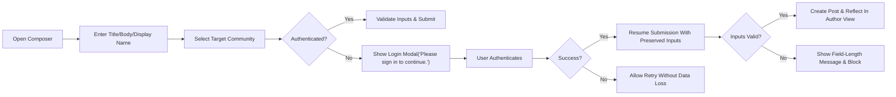
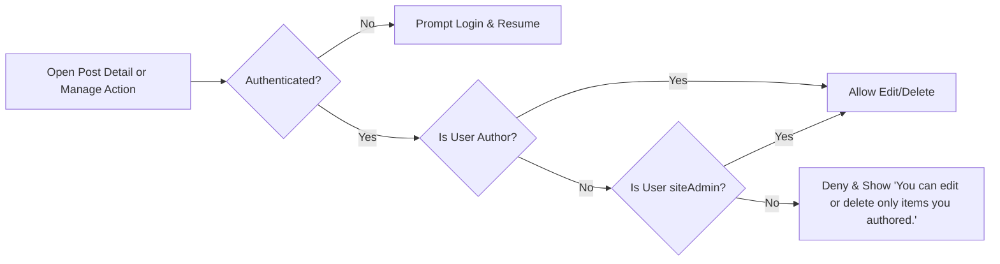
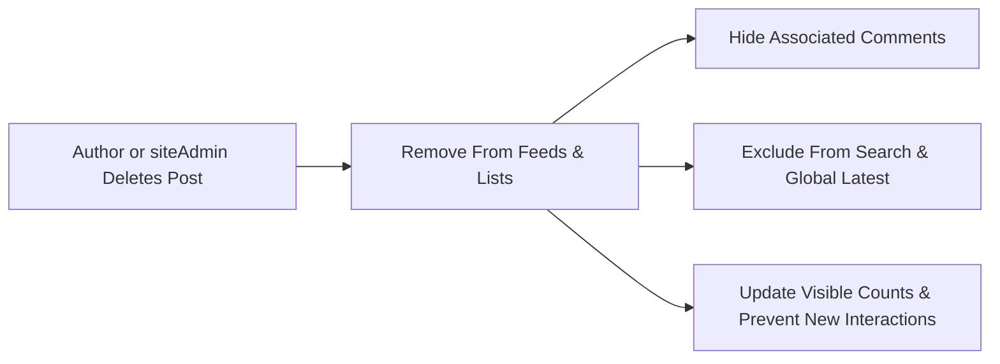
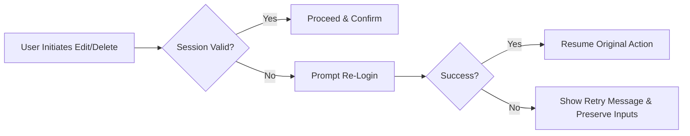

# Posts Requirements — Community Platform (communityPlatform)

## 1) Title and Scope
Defines business requirements for posts in communityPlatform: composition, validation, ownership, edit/delete behaviors, display fields for cards, sorting/pagination interactions, error handling, performance expectations, diagrams, and acceptance criteria. Expresses WHAT must happen from the user’s perspective without prescribing HOW to implement it (no APIs, schemas, or tech stacks).

Out of scope:
- Technical architecture, endpoints, request/response payloads, data models, or storage specifics.
- UI layout/styling specifications beyond business-required fields and behaviors.
- Media uploads or rich content types; posts are text-only in this scope.

## 2) Roles and Global Principles
Roles:
- guestVisitor: Unauthenticated, read-only; can browse posts and comments and use search read-only.
- registeredMember: Authenticated; can create posts, comment, vote, join/leave communities, and create communities; can edit/delete only their own authored posts/comments.
- siteAdmin: Administrative oversight; may remove or edit any content for policy/legal compliance.

Global principles (EARS):
- THE platform SHALL allow anyone to read public posts and comments without authentication.
- THE platform SHALL require authentication for creating, editing, or deleting posts.
- THE platform SHALL enforce ownership such that only the author can edit or delete their own posts, except for siteAdmin acting for policy/legal compliance.
- THE platform SHALL minimize validation to keep flows smooth while enforcing stated input ranges and required fields.
- THE platform SHALL reflect relative timestamps in the user’s local timezone and abbreviate large numbers per standard rules.

## 3) Post Composition
### 3.1 Inputs and Constraints (Business)
- Required fields: Title, Body, Target Community.
- Optional field: Author Display Name.
- Title length: 5–120 characters (inclusive).
- Body length: 10–10,000 characters (inclusive), plain text only; preserve line breaks; scripts/code prohibited.
- Author Display Name length: 0–32 characters (inclusive); if empty, display as "Anonymous".

Plain text rules:
- No executable content. Prohibit script tags, event handlers, embedded code, or markup execution.
- Preserve line breaks in display. Do not interpret markup semantics (no rendering of HTML/JS).
- Full Unicode permitted subject to length constraints; neutralize any markup semantics.

Authentication (composition):
- Creating a post requires login. If attempted while unauthenticated, trigger guest guard and resume after login.
- Posting does not require being a member of the target community.

EARS — Composition:
- THE posts feature SHALL require Title length 5–120 and Body length 10–10,000, both as plain text with line breaks preserved and no executable code.
- THE posts feature SHALL accept an optional Author Display Name length 0–32; WHERE absent, THE posts feature SHALL display "Anonymous".
- WHEN a guestVisitor attempts to submit a post, THE posts feature SHALL show "Please sign in to continue." and SHALL resume submission after successful login with all inputs preserved.

## 4) Target Community Selection
Business rules:
- Exactly one existing, active sub-community must be selected per post.
- The global composer requires selection; the community-specific composer preselects the community but allows change before submission.
- If no community is selected, block submission and present standard copy.

EARS — Community Selection:
- THE posts feature SHALL require selecting exactly one valid target sub-community prior to submission.
- IF no community is selected, THEN THE posts feature SHALL block submission and present "Please choose a community to post in.".
- WHERE the composer is opened from /c/[name]/submit, THE posts feature SHALL preselect that community and allow change before submission.

## 5) Ownership, Permissions, and Immutability
Ownership and permissions:
- Only the author can edit or delete their own posts; siteAdmin may do so for policy/legal compliance.
- Authentication required for edit/delete; guest attempts trigger guest guard and resume-after-login.

Immutability:
- Post identifier and creation timestamp are immutable after creation.
- Target community of a post is immutable after creation (no moving posts between communities via edit).
- Author of a post is immutable; display name may be edited but not the owning account.

EARS — Ownership & Immutability:
- THE posts feature SHALL allow only the author (or siteAdmin) to edit or delete a post.
- THE posts feature SHALL keep the post’s identifier and creation timestamp immutable after creation.
- THE posts feature SHALL keep the target community immutable after creation.
- IF a non-author attempts edit/delete, THEN THE posts feature SHALL deny the action and present "You can edit or delete only items you authored.".

## 6) Edit and Delete Behaviors
### 6.1 Edit
- Editable fields: Title, Body, Author Display Name.
- Validation for edits: same ranges and plain-text rules as creation.
- Session expiry mid-edit: prompt re-login and resume with preserved edits.
- No change to target community via edit.

EARS — Edit:
- WHEN an author edits a post, THE posts feature SHALL validate Title, Body, and Author Display Name with the same constraints as creation.
- WHEN a session expires during edit, THE posts feature SHALL prompt re-login and SHALL resume the edit upon success without data loss.

### 6.2 Delete
- Deletion is permanent from user perspective.
- Effects of deletion: remove post from Home feed, Community Home, Global Latest (Home right sidebar), Search results, and Post Detail.
- Prevent further interactions: new comments and votes disallowed; direct navigation to deleted post results in an unavailable experience.
- Counts: adjust visible counts to exclude the deleted post and its comments.

EARS — Delete:
- WHEN an author deletes a post, THE posts feature SHALL remove the post from all user-visible surfaces (feeds, lists, searches, Global Latest, post detail) and SHALL prevent new interactions.
- WHEN a post is deleted, THE posts feature SHALL hide its associated comments from public view and update visible counters accordingly.

### 6.3 Optimistic UI and Reconciliation
- Author’s view may reflect successful edit/delete immediately; server reconciliation follows.
- On reconciliation failure, restore prior state and show temporary error copy.

EARS — Optimistic Behavior:
- WHEN an edit or delete is initiated, THE posts feature SHALL reflect the intended outcome immediately for the initiating user and SHALL reconcile with server-confirmed state.
- IF reconciliation fails, THEN THE posts feature SHALL revert to the last confirmed state and present "A temporary error occurred. Please try again in a moment.".

## 7) Display and Derived Fields (Cards)
Required card fields for lists (Home, Community Home, Search results — Posts tab):
- Community name (e.g., "/c/ai").
- Title.
- Author display name (or "Anonymous").
- Created time as a relative timestamp in user’s local timezone.
- Comment count (visible comments only).
- Score (upvotes − downvotes).

Formatting and derivations:
- Relative time: "just now", "X minutes ago", "X hours ago", "X days ago"; absolute fallback after 7 days per standard rules.
- Number abbreviations: 1.2k, 12.3k, 1.2m, 1.2B; retain negative signs; strip trailing .0.
- Score computation equal to upvotes minus downvotes; self-votes are prohibited by voting rules.

EARS — Display:
- THE posts feature SHALL display community name, title, author, relative created time, comment count, and score for each post card.
- THE posts feature SHALL format time and numbers per standardized rules.

## 8) Sorting, Pagination, and Feed Interaction
Sorting:
- Newest: order by most recent creation time; tie-break by larger identifier when times equal.
- Top: order by higher score; tie-break by more recent creation time; if equal, by larger identifier.

Pagination:
- Home and Community feeds: 20 cards per page; [Load more] appends next 20.
- Global Latest (Home right sidebar): exactly 10 newest posts sitewide; no load more.

Membership effects and visibility:
- Home main feed includes posts from communities the user has joined (if any). If none joined, show latest/top across all communities.
- Global Latest is sitewide and unaffected by membership.
- New posts should appear for the author immediately and for others within a short propagation window.

EARS — Sorting & Pagination:
- THE posts feature SHALL adhere to the deterministic sorting and tie-break rules defined above for Newest and Top.
- THE posts feature SHALL use a 20-item page size for feeds and SHALL use [Load more] to append the next 20.
- THE posts feature SHALL ensure Global Latest shows exactly 10 newest posts sitewide without pagination.

## 9) Error Handling and Standard Copy
Standardized copy (en-US):
- Login required: "Please sign in to continue."
- No permission: "You can edit or delete only items you authored."
- No community selected: "Please choose a community to post in."
- Title invalid: "Title must be between 5 and 120 characters."
- Body invalid: "Body must be between 10 and 10,000 characters."
- Display name invalid: "Display name must be 0 to 32 characters."
- Temporary error: "A temporary error occurred. Please try again in a moment."
- Content unavailable: "This content is no longer available."

EARS — Error Handling:
- WHEN a guestVisitor attempts to create/edit/delete a post, THE posts feature SHALL present "Please sign in to continue." and SHALL resume upon successful login.
- IF a non-author attempts to edit/delete, THEN THE posts feature SHALL present "You can edit or delete only items you authored." and SHALL block the action.
- IF Title/Body/Display Name violate length constraints, THEN THE posts feature SHALL present the respective validation message and SHALL block submission while preserving inputs.
- IF a temporary error occurs during create/edit/delete, THEN THE posts feature SHALL present "A temporary error occurred. Please try again in a moment." and SHALL allow retry without losing data.
- IF a deleted post is accessed, THEN THE posts feature SHALL present "This content is no longer available." and SHALL prevent interactions.

## 10) Performance and Concurrency Expectations (Business)
Perceived response-time budgets under normal load (p95):
- Open composer: validate inputs within 0.5 seconds.
- Submit post: accept and confirm within 2.0 seconds; author sees success immediately; others see within 5.0 seconds.
- Edit post: save within 1.0 second and reflect changes to the author immediately.
- Delete post: remove from the author’s view immediately and cease visibility platform-wide within a short propagation window (typically a few seconds).
- Load more (feeds): append next 20 items within 1.5 seconds.

Concurrency and optimistic reconciliation:
- Optimistic reflection for submit/edit/delete for the initiating user; reconcile within ~1.0 second when possible.
- Avoid duplicates or gaps during pagination; maintain deterministic ordering across pages.

EARS — Performance:
- THE posts feature SHALL meet the above response-time budgets for p95 under normal load.
- THE posts feature SHALL reconcile optimistic states with server-confirmed outcomes promptly; IF a conflict arises, THEN THE posts feature SHALL revert and present the temporary error copy.

## 11) Role-Based Permission Matrix (Business)

| Action | guestVisitor | registeredMember | siteAdmin |
|---|---|---|---|
| Read posts | ✅ | ✅ | ✅ |
| Create post | ❌ | ✅ | ✅ |
| Edit own post | ❌ | ✅ (own) | ✅ (any) |
| Delete own post | ❌ | ✅ (own) | ✅ (any) |
| Vote on post | ❌ | ✅ (not own) | ✅ (not own) |

Notes:
- "(own)" denotes ownership by the acting account.
- siteAdmin actions are restricted to policy/legal compliance needs.

## 12) Mermaid Diagrams (Flows)

### 12.1 Post Creation (Guest Guard + Resume)

### 12.2 Edit/Delete Authorization Flow

### 12.3 Deletion Visibility Effects

### 12.4 Session Expiry During Edit/Delete

## 13) Acceptance Criteria and Test Scenarios (Business-Level)

### 13.1 Composition and Submission
- WHEN an authenticated user submits a post with Title length 5–120 and Body length 10–10,000 and a selected community, THE posts feature SHALL create the post and reflect it immediately for the author.
- IF Title or Body violates length constraints, THEN THE posts feature SHALL block submission and present the specific length message.
- IF no community is selected, THEN THE posts feature SHALL block submission and present "Please choose a community to post in.".
- WHEN a guestVisitor submits, THE posts feature SHALL prompt login and, upon success, SHALL resume submission without loss of entered content.

### 13.2 Ownership and Authorization
- WHEN the post author initiates edit, THE posts feature SHALL allow editing Title/Body/Display Name and validate ranges.
- IF a non-author attempts to edit or delete, THEN THE posts feature SHALL deny and present "You can edit or delete only items you authored.".
- WHEN siteAdmin deletes any post, THE posts feature SHALL remove it from all surfaces and prevent new interactions.

### 13.3 Display and Sorting
- WHEN a post appears on a feed card, THE posts feature SHALL display community name, title, author (or "Anonymous"), relative time, comment count, and score.
- WHERE Newest is selected, THE posts feature SHALL order by creation time desc and tie-break by larger identifier.
- WHERE Top is selected, THE posts feature SHALL order by score desc, then creation time desc, then larger identifier.
- WHERE feed pagination is used, THE posts feature SHALL return 20 items per page and append the next 20 on [Load more] without duplicates.

### 13.4 Deletion Effects and Unavailable Content
- WHEN an author deletes a post, THE posts feature SHALL remove it from Home, Community Home, Global Latest, Search, and Post Detail.
- WHEN a deleted post is accessed via link, THE posts feature SHALL present "This content is no longer available." and prevent interactions.

### 13.5 Performance and Optimistic UI
- WHEN a post is created, THE posts feature SHALL confirm within 2 seconds and render immediately for the author; others see it within 5 seconds.
- WHEN a post is edited, THE posts feature SHALL reflect the change for the author within 1 second and reconcile globally promptly.
- WHEN a post is deleted, THE posts feature SHALL remove it from the author’s view immediately and from other surfaces within a few seconds.

## 14) Cross-References
- Deterministic ordering and page sizes: see Sorting & Pagination rules.
- Voting behavior and score computation: see Voting & Scoring rules.
- Session longevity, guest guard, and resume-after-login: see Session & Auth Experience.
- Standardized messages, time, and number formatting: see Error Handling & Standard Copy.

## 15) Non-Goals and Constraints
- No API specifications, payloads, or database schemas are defined here.
- No UI design or styling directives; only business-required fields and behaviors are specified.
- Future enhancements such as media attachments or rich text editing are out of current scope.
