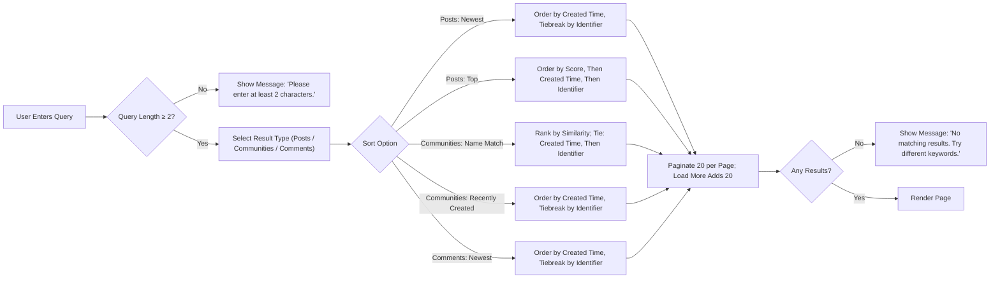
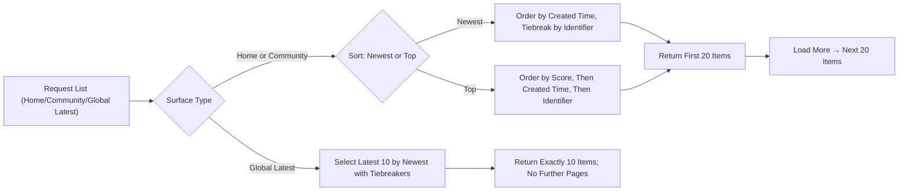

# communityPlatform — Search and Sorting Requirements

## 1) Scope and Alignment with PRD
Business rules for search, sorting, ranking, and pagination across communityPlatform. Focus is on observable behavior users experience, not technical design.

- THE communityPlatform SHALL implement search, sorting, ranking, and pagination consistently across all listed surfaces.
- THE communityPlatform SHALL keep reading and searching open to all users, regardless of authentication state.
- THE communityPlatform SHALL avoid prescribing APIs, database schemas, or infrastructure; this file specifies WHAT the system must do.

## 2) Definitions and Common Concepts
- Score: Upvotes minus downvotes for posts and comments.
- Identifier: A unique, monotonically increasing item identifier; larger identifier indicates a more recently generated item and is used as a final tiebreaker.
- Created time: Item creation timestamp. Ordering by Newest is based on this timestamp (display formatting does not change ordering).
- Surfaces: Home feed, Sub-Community feed, Global Latest (right sidebar on Home), Global Search results (Posts, Sub-Communities, Comments tabs), Post detail comments list.
- Roles: guestVisitor (unauthenticated), communityMember (authenticated), systemAdmin (administrator). Reading/search is allowed for all roles.

EARS requirements:
- THE communityPlatform SHALL use “score = upvotes − downvotes” wherever score is referenced for ordering or display.
- THE communityPlatform SHALL use “larger identifier first” as the final tiebreaker where specified.
- THE communityPlatform SHALL base Newest ordering on created time.

## 3) Global Principles and Constraints (EARS)
- THE communityPlatform SHALL allow all users to search and view search results without login.
- THE communityPlatform SHALL apply identical sorting and tiebreaker definitions across all relevant surfaces to ensure determinism.
- THE communityPlatform SHALL ensure that hidden or deleted content is excluded from lists and search results.
- WHERE the same item appears on multiple surfaces concurrently, THE communityPlatform SHALL keep the visible ordering consistent with each surface’s rules.

## 4) Search Prerequisites and Query Handling (EARS)
- THE communityPlatform SHALL require a minimum query length of 2 characters for all search entry points.
- WHEN a search query is fewer than 2 characters, THE communityPlatform SHALL not execute a search and SHALL show “Please enter at least 2 characters.”
- WHEN a search query is 2 or more characters, THE communityPlatform SHALL execute the search using rules for the selected result type (Posts, Sub-Communities, Comments).
- THE communityPlatform SHALL perform matching in a case-insensitive manner for queries and targets across all search types.
- WHERE punctuation or whitespace differences exist, THE communityPlatform SHALL match words in a manner that ignores basic punctuation boundaries for business-level expectations of word matching.
- IF no results match a valid query, THEN THE communityPlatform SHALL show “No matching results. Try different keywords.”

## 5) Post Search Rules and Ranking (EARS)
Scope: Match query terms in post title and body.

Rules:
- THE communityPlatform SHALL include posts in results only WHEN words in the title or body match the query and the query length requirement is satisfied.
- THE communityPlatform SHALL default post search sort to Newest; WHERE the user selects Top, THE communityPlatform SHALL apply the Top definition.
- WHEN post search sort is Newest, THE communityPlatform SHALL order results by most recent created time first; WHERE created times are equal, THE communityPlatform SHALL order by larger identifier first.
- WHEN post search sort is Top, THE communityPlatform SHALL order results by higher score first; WHERE scores are equal, THE communityPlatform SHALL order by more recent created time first; WHERE created times are also equal, THE communityPlatform SHALL order by larger identifier first.
- THE communityPlatform SHALL return post search results in pages of 20 items and SHALL support loading the next 20 items sequentially.

Acceptance criteria examples (business-level):
- WHEN query = “graph” (length ≥ 2), THE communityPlatform SHALL return posts with “graph” in title/body subject to sort rules.
- WHEN two results have identical created time and score, THE communityPlatform SHALL position the item with the larger identifier ahead.

## 6) Sub-Community Search Rules and Ranking (EARS)
Scope: Match by community name/title.

Rules:
- THE communityPlatform SHALL include communities in results only WHEN their name/title matches the query with query length ≥ 2.
- THE communityPlatform SHALL provide sort options: Name Match (default) and Recently Created.
- WHEN sort is Name Match, THE communityPlatform SHALL order results by similarity to the query; WHERE similarity ties, THE communityPlatform SHALL order by more recent creation time; WHERE creation times are also equal, THE communityPlatform SHALL order by larger identifier first.
- WHEN sort is Recently Created, THE communityPlatform SHALL order by most recent created time first; WHERE created times are equal, THE communityPlatform SHALL order by larger identifier first.
- THE communityPlatform SHALL return community results in pages of 20 items and SHALL support loading the next 20 sequentially.

Acceptance criteria examples:
- WHEN query = “ai” and sort = Name Match, THE communityPlatform SHALL place exact or closest name matches first and break ties by more recent creation time, then by identifier.

## 7) Comment Search Rules and Ranking (EARS)
Scope: Return comments that match the query.

Rules:
- THE communityPlatform SHALL execute comment search only for queries with length ≥ 2.
- THE communityPlatform SHALL order comment results by Newest: most recent created time first; WHERE created times tie, THE communityPlatform SHALL order by larger identifier first.
- THE communityPlatform SHALL return comment results in pages of 20 items and SHALL support loading the next 20 sequentially.

Acceptance criteria examples:
- WHEN query = “pagination” (length ≥ 2), THE communityPlatform SHALL return matching comments sorted by Newest with standard tiebreaking.

## 8) Sorting Definitions (Newest, Top) and Tiebreakers (EARS)
Canonical across applicable surfaces.

- THE communityPlatform SHALL implement Newest ordering as: most recent created time first; WHERE created times are equal, THE communityPlatform SHALL order by larger identifier first.
- THE communityPlatform SHALL implement Top ordering as: higher score first; WHERE scores are equal, THE communityPlatform SHALL order by more recent created time; WHERE created times are also equal, THE communityPlatform SHALL order by larger identifier first.
- THE communityPlatform SHALL compute score for ordering as upvotes minus downvotes and SHALL exclude self-votes from score.
- THE communityPlatform SHALL apply the same definitions consistently across Home, Community feeds, and Post search results where those sorts are offered.

Determinism and stability (business-level):
- THE communityPlatform SHALL ensure stable ordering within the same response; identical items shall not change relative order between page renders of the same response.
- WHERE refresh or pagination yields new data, THE communityPlatform SHALL apply canonical definitions to the newly retrieved portion without re-ordering items already rendered unless a user explicitly refreshes.

## 9) Pagination Rules by Surface (EARS)
Page sizes and behaviors are standardized.

| Surface | Page size | Load more behavior |
|--------|-----------|--------------------|
| Home main feed | 20 | Load next 20 per action |
| Sub-Community main feed | 20 | Load next 20 per action |
| Global Latest (right sidebar) | 10 | No additional load; fixed 10 latest |
| Global search: Posts | 20 | Load next 20 per action |
| Global search: Sub-Communities | 20 | Load next 20 per action |
| Global search: Comments | 20 | Load next 20 per action |
| Post detail: Comments list | 20 | Load next 20 per action |

EARS requirements:
- THE communityPlatform SHALL return the above page sizes per surface and SHALL provide a mechanism to load the next page when applicable.
- THE communityPlatform SHALL avoid duplicates or skipped items across consecutive pages for the same query and sort.
- THE communityPlatform SHALL preserve list context during load-more such that existing items remain visible and in order.
- THE communityPlatform SHALL present Global Latest as exactly the 10 most recently posted items sitewide with no further pagination.

## 10) Empty States, Validation, and Standard Copy (EARS)
- WHEN a query is shorter than 2 characters, THE communityPlatform SHALL display “Please enter at least 2 characters.” and SHALL not run the search.
- WHEN a valid query returns zero results, THE communityPlatform SHALL display “No matching results. Try different keywords.”
- IF a temporary error occurs during search, THEN THE communityPlatform SHALL show “A temporary error occurred. Please try again in a moment.”

## 11) Determinism, Stability, and Consistency Guarantees (EARS)
- THE communityPlatform SHALL apply identical sorting and tiebreakers across all surfaces where a sort type applies.
- THE communityPlatform SHALL ensure that the Global Latest list reflects the sitewide 10 most recent posts by Newest with the standard tiebreaker.
- WHERE two items are otherwise equal under the active sort, THE communityPlatform SHALL ensure their relative order is stable within the same response.
- WHERE content is removed (e.g., deleted, hidden), THE communityPlatform SHALL exclude it from results and SHALL not leave placeholders; pagination proceeds to the next available items.
- WHERE a user changes the sort selection, THE communityPlatform SHALL re-issue the ordering and return items consistent with the newly selected sort.

## 12) Performance Expectations (Business-Level, EARS)
- WHEN a valid search is executed (≥ 2 characters), THE communityPlatform SHALL provide visible acknowledgment promptly and present the first page of results within user-perceived “instant” to “a few seconds” range as defined in the performance document.
- WHEN load-more is invoked, THE communityPlatform SHALL append the next 20 items with immediate acknowledgment and present initial appended items within a user-perceived fast range, remaining interactive during the process.

## 13) Example Scenarios and Acceptance Criteria (EARS)
Home feed and community feed:
- WHEN Home feed is requested with sort Newest, THE communityPlatform SHALL include posts according to membership personalization rules and order by Newest with standard tiebreakers.
- WHEN the same feed is requested with sort Top, THE communityPlatform SHALL order by Top with standard tiebreakers.

Global Latest:
- WHEN the Global Latest list is requested, THE communityPlatform SHALL return exactly 10 posts ordered by Newest and SHALL not support load-more for that list.

Post search:
- WHEN a query of length ≥ 2 is submitted with sort Newest, THE communityPlatform SHALL return the first 20 posts ordered by Newest with standard tiebreakers and allow loading the next 20.
- WHEN the same query is submitted with sort Top, THE communityPlatform SHALL return the first 20 posts ordered by Top with standard tiebreakers and allow loading the next 20.

Community search:
- WHEN a query of length ≥ 2 is submitted with sort Name Match, THE communityPlatform SHALL rank by similarity; WHERE similarity ties, THE communityPlatform SHALL tiebreak by more recent creation time, then by larger identifier.
- WHEN sort is Recently Created, THE communityPlatform SHALL order by Newest with the standard tiebreaker and pages of 20.

Comment search:
- WHEN a query of length ≥ 2 is submitted to Comment search, THE communityPlatform SHALL return comments ordered by Newest with the standard tiebreaker in pages of 20.

Pagination integrity:
- WHEN consecutive pages are loaded for the same query and sort, THE communityPlatform SHALL not include duplicates and SHALL not skip items.

Error cases:
- IF a search execution fails temporarily, THEN THE communityPlatform SHALL show “A temporary error occurred. Please try again in a moment.” and SHALL allow retry without losing the query.

## 14) Mermaid Process Diagrams

Search decision and result flow:

Sorting and pagination flow (feeds and Global Latest):

## 15) Dependencies and References
- For end-to-end feature behaviors, see the [Functional Requirements Document](./04-functional-requirements.md).
- For guarded action flows and resumption behavior, see the [User Flows Document](./06-user-flows.md).
- For standardized messages and recovery behaviors, see the [Error Handling and Recovery Guide](./09-error-handling-and-recovery.md).
- For perceived responsiveness targets and localization, see the [Performance and UX Expectations](./10-performance-and-ux-expectations.md).

This file defines WHAT the system must do for search, sorting, and pagination. All technical implementation decisions remain at the discretion of the development team.