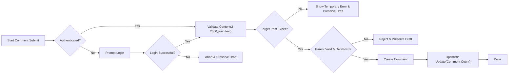
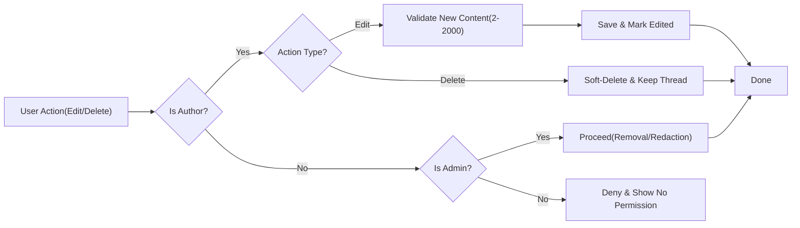
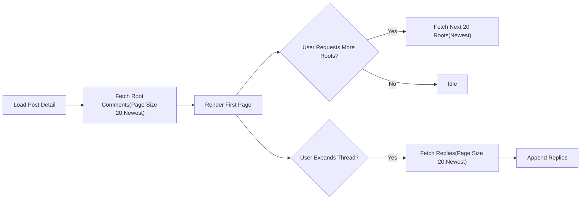

# Comments and Nesting — Business Requirements (communityPlatform)

## 1) Title and Scope
Defines business requirements for comment behaviors in communityPlatform, including creation, validation, nesting, editing, deletion, visibility, ordering, pagination, counting, error handling, guard behaviors, optimistic updates, and performance expectations. Requirements are written in EARS and align with platform-wide rules: reading is open to everyone; posting/commenting/voting/joining/creating require login; ownership is account-based; validation is minimal while preserving critical constraints.

## 2) Glossary, Roles, and Assumptions
- Platform: communityPlatform service.
- Post: A text-only submission within a sub-community.
- Comment: A text reply to a post or another comment.
- Root comment: A comment whose parent is the post.
- Reply: A comment whose parent is another comment.
- Thread: A root comment and all of its descendants.
- Author: The account that created the comment.
- Admin: siteAdmin role with platform-wide privileges.
- Roles: guestVisitor (read-only), registeredMember (standard creation and interaction permissions), siteAdmin (administrative override for policy/legal reasons).

EARS principles:
- THE platform SHALL keep reading open to everyone.
- THE platform SHALL require login for creating, editing, or deleting comments and for voting on comments.
- THE platform SHALL enforce account-based ownership for editing/deleting comments; only the author may modify their own comments, except siteAdmin for policy/legal needs.
- THE platform SHALL minimize validation while enforcing length constraints and basic integrity checks.

## 3) Comment Creation Rules
- WHEN a user is authenticated and submits a comment for a specific post, THE platform SHALL require a valid target post and SHALL create a comment associated with that post.
- WHEN a user is authenticated and submits a reply to an existing comment, THE platform SHALL associate the new comment to the same post and to the specified parent comment.
- IF a target post does not exist or is unavailable, THEN THE platform SHALL reject submission, present “This content is no longer available.”, and preserve the typed content for resubmission.
- IF a parent comment is specified but does not exist or is invalid for the target post, THEN THE platform SHALL reject submission, present “A temporary error occurred. Please try again in a moment.”, and preserve the typed content for resubmission.
- THE platform SHALL accept plain text content with line breaks and SHALL disallow executable scripts/code.
- THE platform SHALL capture the comment’s creation time and author identity for ownership enforcement.
- THE platform SHALL not require membership in the sub-community to comment in that community.
- WHEN an unauthenticated user attempts to submit a comment, THE platform SHALL trigger the guest guard, present “Please sign in to continue.”, and upon successful sign-in, SHALL resume submission with the original content intact.
- WHEN a comment is successfully created, THE platform SHALL increase the post’s visible comment count according to counting rules defined in Section 8.

## 4) Length Constraints
- THE platform SHALL enforce a minimum comment length of 2 characters and a maximum of 2,000 characters inclusive.
- THE platform SHALL allow line breaks; THE platform SHALL reject content that includes executable code or script tags.
- IF a user submits fewer than 2 characters (after trimming leading/trailing whitespace), THEN THE platform SHALL reject the submission, present “Comment must be between 2 and 2,000 characters.”, and preserve content for correction.
- IF a user submits more than 2,000 characters, THEN THE platform SHALL reject the submission, present “Comment must be between 2 and 2,000 characters.”, and preserve content for correction.

## 5) Nested Reply Structure
- THE platform SHALL support hierarchical replies (nested threads) to comments on the same post.
- THE platform SHALL enforce a maximum nesting depth of 8 levels counting the root comment as depth 1.
- IF a user attempts to reply at a depth greater than 8, THEN THE platform SHALL prevent the action and present a clear message indicating the maximum depth has been reached.
- WHEN creating a reply, THE platform SHALL validate that the parent comment exists, is associated with the same post, and does not exceed the maximum depth for the new reply.
- IF a parent comment has been soft-deleted, THEN THE platform SHALL prevent creating new replies directly to that deleted comment and SHALL present a message indicating that the reply target is unavailable.
- THE platform SHALL prevent cyclical relationships (a comment cannot be its own ancestor or descendant).
- THE platform SHALL preserve thread continuity: replies remain visible even if an ancestor is soft-deleted.

## 6) Ownership and Edit/Delete Rules
- THE platform SHALL enforce account-based ownership: only the author of a comment may edit or delete that comment, except for siteAdmin overrides for policy/legal compliance.
- WHEN the current user is the comment’s author, THE platform SHALL permit editing and deletion for that comment.
- WHEN the current user is not the author and not siteAdmin, THE platform SHALL deny edit and delete actions for that comment and present “You can edit or delete only items you authored.”
- WHERE the current user is siteAdmin, THE platform SHALL permit removal or redaction of any comment when required by policy/legal obligations.
- WHEN editing a comment, THE platform SHALL require the updated content to meet the same validation rules as new comments (length, plain text, no executable code).
- THE platform SHALL preserve the original post and parent associations on edit; THE platform SHALL forbid changing a comment’s parent or target post via edit.
- THE platform SHALL record an edited state with an updated timestamp when a comment is edited after initial creation.
- WHEN a comment is deleted by its author, THE platform SHALL soft-delete the comment (replace its body with a neutral placeholder) while retaining its position so that replies remain visible.
- WHEN a comment is removed by siteAdmin, THE platform SHALL soft-delete the comment with a moderation placeholder.
- THE platform SHALL disallow hard-deletion by non-admins.
- WHEN a comment is soft-deleted, THE platform SHALL exclude it from the post’s visible comment count per Section 8.

## 7) Pagination and Ordering
- THE platform SHALL display comments in paginated blocks on the post detail page.
- THE platform SHALL paginate by root comments: 20 root comments per page in the post detail view.
- WHEN loading subsequent pages of root comments, THE platform SHALL return the next 20 root comments according to ordering rules below.
- THE platform SHALL display replies within each thread under their respective root comment; replies do not count toward the 20 root-per-page limit.
- WHERE a thread contains many replies, THE platform SHALL paginate replies within that thread in increments of 20 per load.
- WHEN a user requests additional replies in a thread, THE platform SHALL append the next 20 replies according to the ordering rules for replies.
- THE platform SHALL order comments by Newest by default.
- THE platform SHALL apply Newest tie-breaking rules consistently: later creation time first; IF created times are equal, THEN the larger identifier first.
- THE platform SHALL order replies within each thread by Newest using the same tie-breakers.
- THE platform SHALL use deterministic boundaries for pagination windows so that consecutive loads avoid duplicates or omissions under normal conditions.

## 8) Visibility, Deletion Semantics, and Counting
- THE platform SHALL implement soft-deletion for comments. A soft-deleted comment retains its place in the thread with a neutral placeholder while its body is hidden.
- THE platform SHALL maintain two visibility states for comments: visible (normal) and soft-deleted (by author or admin). Additional states may be added in future without changing these rules.
- THE platform SHALL allow replies to remain visible even if an ancestor is soft-deleted.
- THE platform SHALL exclude soft-deleted comments from the post’s public comment count metric.
- THE platform SHALL include visible replies in the comment count.
- IF a comment submission is pending due to session interruption, THEN THE platform SHALL resolve the session and resume submission to produce a visible comment or a clear failure without leaving phantom items.
- THE platform SHALL prevent users from voting on their own comments and SHALL display score as upvotes minus downvotes for visible comments.

## 9) Error Handling, Guest Guard, and Session Expiry
- WHEN an unauthenticated user attempts to create, edit, or delete a comment, THE platform SHALL present “Please sign in to continue.” and, upon successful sign-in, SHALL resume the attempted action with original content preserved.
- IF a user lacks permission to edit or delete a comment, THEN THE platform SHALL present “You can edit or delete only items you authored.” and SHALL not perform the action.
- IF a submission fails due to transient conditions, THEN THE platform SHALL present “A temporary error occurred. Please try again in a moment.” and SHALL preserve the content for retry.
- WHILE a session expires mid-action (compose, edit, delete), THE platform SHALL prompt a gentle re-login and, upon success, SHALL resume the prior flow without loss of typed content.
- WHERE optimistic UI is used, THE platform SHALL reflect comment creation, deletion, and edit outcomes immediately and reconcile with the server; IF reconciliation fails, THEN THE platform SHALL revert the optimistic change and show the appropriate message.

## 10) Permissions Matrix (Business-Level)
| Action (Comments) | guestVisitor | registeredMember | siteAdmin |
|-------------------|--------------|------------------|-----------|
| Read comments | ✅ | ✅ | ✅ |
| Create new root comment | ❌ | ✅ | ✅ |
| Create reply | ❌ | ✅ | ✅ |
| Edit own comment | ❌ | ✅ | ✅ |
| Delete own comment | ❌ | ✅ (soft-delete) | ✅ (soft-delete any) |
| Remove any user’s comment | ❌ | ❌ | ✅ |
| Vote on comments | ❌ | ✅ (not on own) | ✅ (not on own) |

EARS:
- THE platform SHALL enforce the permissions above for all comment actions.

## 11) Performance and Non-Functional Expectations
- THE platform SHALL create, edit, or delete a comment within 2 seconds under normal load for 95% of requests.
- THE platform SHALL return the first page of comments (20 root comments with initial replies for each up to 20) within 2 seconds under normal load for 95% of requests.
- THE platform SHALL append additional pages of root comments or replies within 1.5 seconds perceived time under normal load for 95% of requests.
- THE platform SHALL support concurrent comment updates without producing duplicate or missing entries across pagination pages.
- THE platform SHALL present relative timestamps (e.g., “just now”, “X minutes ago”, “X hours ago”, “X days ago”) in the user’s local timezone.
- THE platform SHALL abbreviate large numbers per global rules (e.g., 1.2k, 12.3k, 1.2m) for counts such as comment totals and scores.

## 12) Display and Data Requirements (Post Detail)
- THE platform SHALL display for each visible comment: author display name (or account-visible name), relative created time, comment body (plain text with line breaks), score (upvotes − downvotes), and controls to reply and vote when permitted.
- THE platform SHALL visually indicate the “edited” state for comments edited after creation.
- THE platform SHALL indicate soft-deleted comments with a neutral placeholder and hide body content while preserving thread position.

## 13) Business Workflows (Mermaid)

Comment creation with guest guard and resume:

Edit/Delete with ownership and soft-deletion:

Pagination and ordering of root comments and replies:

## 14) Acceptance Criteria and Test Scenarios
Creation
- WHEN an authenticated user submits a 2–2,000 character comment to an existing post, THE platform SHALL create the comment and increase the post’s visible comment count by 1 (excluding soft-deleted items), with the comment appearing in the correct order.
- IF an unauthenticated user attempts to comment, THEN THE platform SHALL prompt login and, upon success, SHALL complete the original submission using the preserved content.
- IF a parent comment is missing or invalid, THEN THE platform SHALL reject creation and preserve typed content for retry.
- IF a reply would exceed depth 8, THEN THE platform SHALL reject creation with a clear message and preserve typed content.

Editing
- WHEN an author edits their comment with valid content, THE platform SHALL update the comment, set an edited timestamp, and preserve original associations.
- IF a non-author attempts to edit, THEN THE platform SHALL deny the action and show “You can edit or delete only items you authored.”
- IF edited content violates length constraints, THEN THE platform SHALL reject the edit and preserve the attempted content.

Deletion
- WHEN an author deletes their comment, THE platform SHALL soft-delete it, retain its position, keep its replies, and reduce the post’s visible comment count accordingly.
- WHEN an admin removes a comment, THE platform SHALL soft-delete it with a moderation placeholder and reduce the visible count accordingly.
- IF a user attempts to reply to a soft-deleted parent, THEN THE platform SHALL prevent the action with a message indicating the reply target is unavailable.

Pagination and Ordering
- GIVEN a post with more than 20 root comments, WHEN the first page loads, THE platform SHALL display the 20 newest root comments; WHEN Load more is requested, THE platform SHALL display the next 20 newest roots without duplicates or gaps.
- GIVEN a thread with more than 20 replies, WHEN the thread is expanded, THE platform SHALL load the 20 newest replies first and append the next 20 upon request, following deterministic tie-breakers.
- WHEN two comments share the same creation time, THE platform SHALL order the one with the larger identifier first.

Voting and Counts
- WHEN the author of a comment attempts to vote on their own comment, THE platform SHALL prevent the vote and present “You can’t vote on your own posts/comments.”
- WHEN a comment is soft-deleted, THE platform SHALL exclude it from the post’s visible comment count while leaving descendant replies unaffected.

Non-Functional
- WHEN fetching the first page of comments under normal load, THE platform SHALL return results within 2 seconds for 95% of requests.
- WHEN creating, editing, or deleting a comment under normal load, THE platform SHALL complete within 2 seconds for 95% of requests.

## 15) Cross-References and Glossary
- Cross-references: Sorting and pagination (10-sorting-and-pagination-rules.md); Voting and scoring (09-voting-and-scoring.md); Session and auth experience (12-session-and-auth-experience.md); Standard copy and formatting (13-error-handling-and-standard-copy.md); Posts (07-posts-requirements.md); Sub-communities (06-sub-communities-requirements.md).
- Glossary: guestVisitor (unauthenticated, read-only), registeredMember (authenticated standard user), siteAdmin (administrator), root comment (parent is the post), reply (parent is a comment), thread (root plus descendants).
