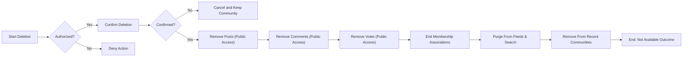
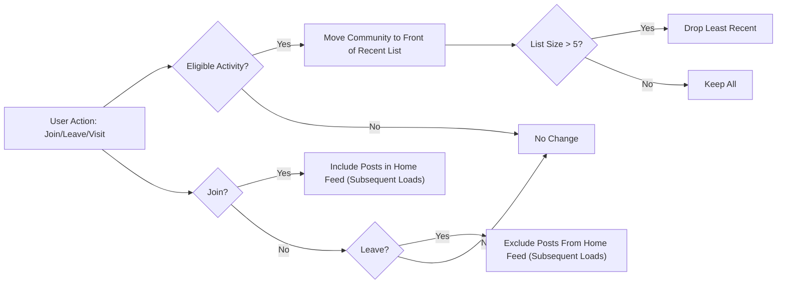

# 08 — Community and Content Rules (Business Requirements)

## 1. Scope and Objectives
Consolidates business rules for community management and content ownership in communityPlatform. Defines WHAT must happen in observable, testable terms without prescribing technical implementation. EARS syntax is used where applicable.

Objectives:
- Remove ambiguity about ownership, editability, and immutability
- Define how rules are authored and displayed consistently
- Specify member count semantics and Recent Communities behavior
- Describe authorized deletion actions and cascading effects
- State name uniqueness/format requirements and user-facing messages
- Ensure deterministic behavior, optimistic consistency, and alignment with standard copy

## 2. Definitions and Terminology
- Community: Topic-based sub-community that any authenticated user may create and others may join. Reading is open to everyone.
- Community Owner (Creator): The authenticated account that created a community; holds exclusive rights to edit that community’s metadata and rules. The community name is immutable.
- Member Count: Number of distinct users who have joined a community; displayed for discovery and credibility.
- Recent Communities: Per-user list of up to 5 communities most recently visited or interacted with, ordered by most recent activity.
- Rules: Short, numbered guidance items authored by the community owner to set participation expectations.
- Global Latest: Sitewide list of 10 most recent posts displayed on Home’s right sidebar.
- Guest (guestVisitor): Unauthenticated visitor; read-only access to public content and search.
- Member (communityMember): Authenticated user; can create/manage own posts/comments, vote on others’ content, join/leave, and create communities.
- Admin (systemAdmin): Platform administrator with policy-enforcement powers; does not gain authorship over others’ content.

## 3. Roles, Ownership, and Permissions (Business-Level)
Permission overview (business perspective):
- Community creation: communityMember
- Edit community metadata/rules: Community owner; systemAdmin may perform policy enforcement
- Community name: Immutable post-creation
- Delete community: Community owner or systemAdmin (policy action)
- Post/comment ownership: Only the author can edit/delete their items
- Voting: Single state per user per item; self-vote prohibited

EARS requirements:
- THE communityPlatform SHALL allow reading public communities, posts, and comments by any user.
- THE communityPlatform SHALL restrict joining/leaving, voting, posting, commenting, and community creation to authenticated users.
- WHERE the user is the community creator, THE communityPlatform SHALL grant exclusive edit rights to that community’s metadata and rules.
- THE communityPlatform SHALL enforce authorship ownership such that only authors can edit/delete their posts and comments.
- THE communityPlatform SHALL treat community membership as a purely personal display preference with no moderation privileges.

## 4. Community Metadata and Immutability (EARS)
### 4.1 Metadata Fields in Scope
- Name (immutable)
- Description (optional)
- Logo (optional)
- Banner (optional)
- Rules (optional; ordered list)
- Category (exactly one from allowed set)

### 4.2 Ownership and Editability
- THE communityPlatform SHALL treat the community creator as the owner for that community.
- THE communityPlatform SHALL permit only the community owner to edit description, logo, banner, rules, and category.
- WHERE policy enforcement is required, THE communityPlatform SHALL permit systemAdmin to edit or remove community metadata and rules.

### 4.3 Immutability and Visibility
- THE communityPlatform SHALL treat the community name as immutable after creation.
- THE communityPlatform SHALL display logo/banner if provided; otherwise, display defaults.
- THE communityPlatform SHALL ensure editing community metadata never changes the community’s name.

### 4.4 Categories (Fixed Set)
- THE communityPlatform SHALL require exactly one category selection from: "Tech & Programming", "Science", "Movies & TV", "Games", "Sports", "Lifestyle & Wellness", "Study & Education", "Art & Design", "Business & Finance", "News & Current Affairs".
- IF an edit attempts to set a category outside the allowed set, THEN THE communityPlatform SHALL reject the edit and retain the existing category.

### 4.5 Last Active and Created Date (Display Context)
- WHEN a community is created, THE communityPlatform SHALL record created date.
- WHEN any content or membership activity occurs (e.g., post, comment, join/leave), THE communityPlatform SHALL update a last active timestamp for display where applicable.

## 5. Rules Creation and Display Standards (EARS)
### 5.1 Composition and Limits
- THE communityPlatform SHALL allow the owner to author an ordered list of up to 20 rules.
- THE communityPlatform SHALL limit each rule text to 1–200 characters.
- THE communityPlatform SHALL preserve owner-provided order.

### 5.2 Display Standards
- THE communityPlatform SHALL display the section label "Community Rules" where rules are shown.
- THE communityPlatform SHALL display the first 5 rules by default, numbered 1, 2, 3, … in order.
- THE communityPlatform SHALL truncate rule text to approximately two lines (~50 characters per line) with an ellipsis for display only, without altering stored text.

### 5.3 Editing and Governance
- WHEN the community owner edits rules, THE communityPlatform SHALL replace the ruleset atomically to preserve consistent numbering.
- IF a non-owner attempts to edit rules, THEN THE communityPlatform SHALL deny the action with the message "You can edit or delete only items you authored.".
- WHERE platform policy requires, THE communityPlatform SHALL allow systemAdmin to remove rule items that violate platform policy.

### 5.4 Optional/Empty State
- WHEN a community is created without rules, THE communityPlatform SHALL treat rules as optional and either omit the rules section or present an empty state.

## 6. Membership Counts and Recent Communities (EARS)
### 6.1 Member Count Semantics
- THE communityPlatform SHALL define member count as the number of distinct users who have joined a community.
- WHEN a user joins a community they were not a member of, THE communityPlatform SHALL increment the member count by 1.
- WHEN a user leaves a community they were a member of, THE communityPlatform SHALL decrement the member count by 1 (not below zero).
- IF a user attempts to join when already a member, THEN THE communityPlatform SHALL keep state and count unchanged.
- IF a user attempts to leave when not a member, THEN THE communityPlatform SHALL keep state and count unchanged.

### 6.2 Recent Communities — Eligibility and Ordering
Eligible per-user activity events for recency:
- Visiting a community home
- Viewing a post in that community
- Joining or leaving that community
- Creating a post in that community
- Commenting on a post in that community
- Voting on a post/comment in that community

EARS requirements:
- THE communityPlatform SHALL maintain a per-user Recent Communities list of up to 5 communities.
- WHEN an eligible activity occurs in a community, THE communityPlatform SHALL move that community to the front of the list.
- WHERE the list already contains 5 items and a new community is added, THE communityPlatform SHALL drop the least recent item.
- WHERE two or more communities have identical activity timestamps, THE communityPlatform SHALL order them by community name ascending as a tiebreaker.
- WHILE the user is not authenticated, THE communityPlatform SHALL not display a personalized Recent Communities list.

### 6.3 Join/Leave Effects (Consistency)
- WHEN a user joins a community, THE communityPlatform SHALL include that community’s posts in the user’s Home main feed composition according to the selected sort on subsequent loads.
- WHEN a user leaves a community, THE communityPlatform SHALL exclude that community’s posts from the user’s Home main feed composition on subsequent loads.
- WHEN a user joins or leaves a community, THE communityPlatform SHALL update the Recent Communities list immediately.

## 7. Deletion Effects and Cascading Consequences (EARS)
### 7.1 Authorized Actors
- THE communityPlatform SHALL permit the community owner to delete their community.
- WHERE policy enforcement requires, THE communityPlatform SHALL permit systemAdmin to delete or disable a community.

### 7.2 Confirmation and Safeguards
- WHEN a deletion is initiated by an authorized actor, THE communityPlatform SHALL require explicit confirmation before proceeding.
- IF deletion is canceled at confirmation, THEN THE communityPlatform SHALL make no changes.

### 7.3 Cascading Outcomes (Community Deletion)
- WHEN a community is deleted, THE communityPlatform SHALL remove the community and all its posts from public access.
- WHEN a community is deleted, THE communityPlatform SHALL remove all comments beneath those posts from public access.
- WHEN a community is deleted, THE communityPlatform SHALL remove all votes on affected posts/comments from public access and exclude them from score calculations.
- WHEN a community is deleted, THE communityPlatform SHALL end all membership associations with that community.
- WHEN a community is deleted, THE communityPlatform SHALL remove that community from all users’ Recent Communities lists.
- WHEN a community is deleted, THE communityPlatform SHALL exclude its content from Global Latest, feeds, and search results.
- WHEN a community is deleted, THE communityPlatform SHALL ensure that links to the community or its posts resolve to a not-available outcome without exposing the original content.

### 7.4 Post/Comment Deletion Context
- WHEN a post is deleted by its author or systemAdmin, THE communityPlatform SHALL remove the post, its comments, and votes from public access and adjust related counts.
- WHEN a comment is deleted by its author or systemAdmin, THE communityPlatform SHALL remove the comment and its votes from public access and adjust related counts.

### 7.5 Consistency Guarantees
- THE communityPlatform SHALL ensure that feeds and search results do not include content from deleted entities.
- THE communityPlatform SHALL ensure that counters (scores, comment counts, member counts) no longer display values derived from deleted entities.

## 8. Name Uniqueness and Format Guidelines (EARS)
### 8.1 Uniqueness and Case
- THE communityPlatform SHALL require community names to be unique service-wide.
- THE communityPlatform SHALL evaluate uniqueness case-insensitively and reject duplicates that differ only by case.

### 8.2 Allowed Characters and Length
- THE communityPlatform SHALL allow alphanumeric characters, hyphen (-), and underscore (_).
- THE communityPlatform SHALL require names to start with a letter and end with an alphanumeric character.
- THE communityPlatform SHALL allow lengths from 3 to 32 characters.
- IF the name includes disallowed characters or violates length or start/end rules, THEN THE communityPlatform SHALL reject the input with the message "This name isn’t available. Please choose something simpler.".

### 8.3 Readability and Reserved Terms
- WHERE readability is compromised (e.g., excessive separators, unreadable sequences), THE communityPlatform SHALL reject the name using the same invalid-format message.
- WHERE a name matches a reserved term (e.g., "admin", "system", "support"), THE communityPlatform SHALL reject the name using the same invalid-format message.

### 8.4 Collision Handling
- IF the submitted name is already in use, THEN THE communityPlatform SHALL present "This name is already in use.".

## 9. Error Handling and Standard Messages (EARS)
Use PRD standard copy verbatim:
- Login required: "Please sign in to continue."
- No permission (author guard): "You can edit or delete only items you authored."
- Community name taken: "This name is already in use."
- Invalid community name format: "This name isn’t available. Please choose something simpler."
- No community selected: "Please choose a community to post in."
- Query too short: "Please enter at least 2 characters."
- Self-vote: "You can’t vote on your own posts/comments."
- Temporary error: "A temporary error occurred. Please try again in a moment."

EARS clarifications:
- IF a non-owner attempts to edit community metadata or rules, THEN THE communityPlatform SHALL present "You can edit or delete only items you authored." and deny the action.
- IF a guest attempts create/edit/delete/join/leave, THEN THE communityPlatform SHALL present "Please sign in to continue." and resume the action upon successful login.

## 10. Non-Functional and Consistency Expectations (Business-Level; EARS)
- WHEN a user joins/leaves a community, THE communityPlatform SHALL update Recent Communities and reflect member count changes within 1 second under typical conditions.
- WHEN a community is deleted, THE communityPlatform SHALL reflect removal from feeds and search within 5 seconds under typical conditions.
- THE communityPlatform SHALL display relative timestamps in the user’s local timezone and apply number abbreviations (e.g., 1.2k, 12.3k, 1.2m) consistently.
- THE communityPlatform SHALL maintain deterministic sorting and pagination rules across surfaces (see related documents).

## 11. Diagrams (Mermaid)
### 11.1 Community Deletion Cascade

### 11.2 Recent Communities and Join/Leave Effects

## 12. Acceptance Criteria and Test Scenarios (EARS)
### 12.1 Community Metadata and Immutability
- WHEN the owner edits description/logo/banner/rules/category with valid inputs, THE communityPlatform SHALL apply changes; name remains unchanged.
- IF a non-owner attempts any edit, THEN THE communityPlatform SHALL deny and present the standard permission message.
- WHEN category is set outside the allowed set, THE communityPlatform SHALL reject and retain the existing category.

### 12.2 Rules Creation and Display
- THE communityPlatform SHALL limit rules to 20 items, each 1–200 characters, preserving order.
- THE communityPlatform SHALL display the first 5 rules numbered and truncate lines beyond approximately two lines for display only.
- WHEN rules are edited by owner, THE communityPlatform SHALL replace the ruleset atomically and update numbering.

### 12.3 Membership Counts and Recent Communities
- WHEN a user joins/leaves, THE communityPlatform SHALL adjust member count accordingly (not below zero).
- WHEN eligible activity occurs, THE communityPlatform SHALL move the community to the front of Recent Communities and trim to 5 entries.
- WHERE timestamps tie, THE communityPlatform SHALL use alphabetical tiebreaker by community name.

### 12.4 Deletion Cascades and Outcomes
- WHEN a community is deleted by owner or systemAdmin, THE communityPlatform SHALL remove posts, comments, and votes from public access; end memberships; remove from feeds, Global Latest, search, and Recent Communities; and show a not-available outcome.
- WHEN a post/comment is deleted, THE communityPlatform SHALL remove it from public access and adjust related counts.

### 12.5 Name Uniqueness and Formatting
- THE communityPlatform SHALL reject duplicate names irrespective of case.
- THE communityPlatform SHALL enforce allowed characters, start/end rules, and length 3–32.
- THE communityPlatform SHALL present "This name is already in use." for duplicates and "This name isn’t available. Please choose something simpler." for invalid formats.

## 13. References to Related Documents
- See the [Functional Requirements Document](./04-functional-requirements.md) for end-to-end feature behaviors.
- See the [User Roles and Permissions Specification](./03-user-roles-and-permissions.md) for role taxonomy and guard behaviors.
- See the [Search and Sorting Requirements](./07-search-and-sorting-requirements.md) for deterministic ordering and pagination.
- See the [Error Handling and Recovery Specification](./09-error-handling-and-recovery.md) for standard messages and recovery flows.
- See the [Event Lifecycle and Optimistic UI Requirements](./12-event-lifecycle-and-optimistic-ui.md) for optimistic changes and reconciliation.
