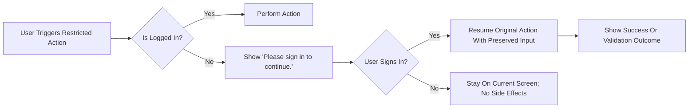
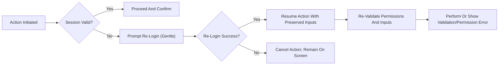
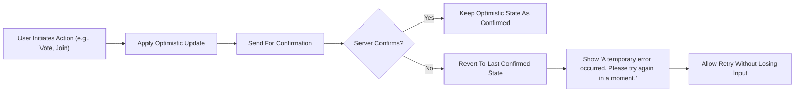

# Error Handling and Recovery Requirements — communityPlatform

## 1) Introduction and Scope
This text specifies the complete, user-facing error handling and recovery behaviors for communityPlatform. It describes predictable messages, resumable action flows, validation constraints, and optimistic reconciliation outcomes across major features: authentication prompts, community membership toggles, posting, commenting, voting, search, and sorting. All requirements are written at the business-behavior level in natural language and employ EARS syntax where applicable. Technical implementation details (e.g., APIs, schemas, protocols) are intentionally excluded.

## 2) Roles, Surfaces, and Error Taxonomy
### 2.1 Roles
- guestVisitor: Unauthenticated visitor who can read public content and search, but cannot create, vote, comment, join/leave, or create communities.
- communityMember: Authenticated user who can create and manage their own posts and comments, vote on others’ content, join/leave communities, and create communities they own.
- systemAdmin: Platform administrator who may perform elevated policy enforcement actions. Does not obtain authorship of others’ content.

### 2.2 Surfaces (Contexts)
- Home feed (/)
- Sub-community home (/c/[name])
- Post detail (/c/[name]/[postID])
- Global post composer (/submit) and community-specific composer (/c/[name]/submit)
- Explore sub-communities (/c)
- Global search (/s)
- Login & Sign Up modal (/login overlay)
- Right sidebar "Global Latest"
- Left sidebar "Recent Communities"

### 2.3 Error/Exception Taxonomy
- Authentication guard failures (login required)
- Session expiry during or before an action
- Authorization failures (no permission / author guard)
- Validation failures (input rules not met)
- Temporary errors (transient failures, connectivity, or similar)
- Empty states (no results or preconditions not satisfied)
- Optimistic UI reconciliation conflicts (server outcome differs)

## 3) Global Principles (EARS)
- THE communityPlatform SHALL keep reading open to everyone.
- THE communityPlatform SHALL require login for posting, commenting, voting, creating sub-communities, and joining/leaving.
- THE communityPlatform SHALL present clear, concise, and standardized user-facing messages for all guarded and exceptional paths.
- THE communityPlatform SHALL preserve user intent and resume the original action after successful authentication or session renewal where applicable.
- THE communityPlatform SHALL apply optimistic UI to supported actions and reconcile with server confirmation.
- THE communityPlatform SHALL avoid blocking the UI; users SHALL always be able to retry or cancel.
- THE communityPlatform SHALL use relative timestamps and local timezone for any times displayed within messages, where applicable, consistent with overall display rules.

## 4) Standard Messages Catalog (Verbatim Where Defined)
The following messages must be displayed exactly as written where the PRD defines standard copy. These messages are canonical across surfaces.

| Scenario | Standard Message (verbatim) |
|---------|------------------------------|
| Login required for restricted action | Please sign in to continue. |
| No permission (author guard) | You can edit or delete only items you authored. |
| Community name taken | This name is already in use. |
| Invalid community name format | This name isn’t available. Please choose something simpler. |
| No community selected (post composer) | Please choose a community to post in. |
| Query too short (search) | Please enter at least 2 characters. |
| Self-vote attempt | You can’t vote on your own posts/comments. |
| Temporary error | A temporary error occurred. Please try again in a moment. |

- THE communityPlatform SHALL use the above messages verbatim where specified.
- WHERE additional validation messages are required and not defined verbatim in the PRD, THE communityPlatform SHALL use concise, neutral English phrasing aligned with this style guide (see Section 9.2).

## 5) Login Required Prompts and Resumption
### 5.1 Behavioral Rules (EARS)
- WHEN a guestVisitor attempts a restricted action (post/comment/vote/create/join/leave), THE communityPlatform SHALL display "Please sign in to continue.".
- WHEN the login prompt is displayed due to a restricted action, THE communityPlatform SHALL not navigate away from the current context.
- WHEN the user successfully signs in from the prompt, THE communityPlatform SHALL resume the originally intended action using the previously provided input where applicable.
- WHEN the user cancels login while attempting a restricted action, THE communityPlatform SHALL not perform the action and SHALL maintain the current screen state without side effects.
- WHEN multiple restricted actions are queued by the user before logging in, THE communityPlatform SHALL resume only the most recent explicit action upon successful login and SHALL discard implicit or background intents.
- WHERE the original action requires selection (e.g., target community), THE communityPlatform SHALL validate presence of such selection upon resumption and SHALL display "Please choose a community to post in." if missing.

### 5.2 Flow Diagram — Guest Guard and Resumption

## 6) Session Expiry Mid-Action and Re-Login
### 6.1 Behavioral Rules (EARS)
- WHILE a user session is valid, THE communityPlatform SHALL allow all authorized actions without re-prompting for login.
- WHEN a session expires mid-action, THE communityPlatform SHALL gently prompt the user to re-login without interrupting the current screen.
- WHEN the user successfully re-logs in from a mid-action prompt, THE communityPlatform SHALL resume the in-progress action with previously entered inputs intact.
- IF the user declines to re-login, THEN THE communityPlatform SHALL cancel the pending action and keep the user on the same screen.
- WHEN resuming after re-login, THE communityPlatform SHALL re-validate permissions and inputs before performing the action.
- WHEN session renewal fails due to permission changes, THE communityPlatform SHALL display "You can edit or delete only items you authored." for author-guarded actions, or "Please sign in to continue." if no session is active.

### 6.2 Flow Diagram — Session Expiry and Recovery

## 7) Temporary Errors and Retry Messaging
### 7.1 Definition
Temporary errors include intermittent network issues, transient server problems, and short-lived conflicts that can succeed upon retry.

### 7.2 Behavioral Rules (EARS)
- WHEN a temporary error occurs on any action, THE communityPlatform SHALL display "A temporary error occurred. Please try again in a moment.".
- WHEN a temporary error is displayed, THE communityPlatform SHALL allow the user to retry the same action without losing previously entered inputs.
- WHERE an optimistic UI update has already been applied, THE communityPlatform SHALL reconcile the UI back to the last confirmed server state if the retry fails again.
- WHEN a retry succeeds after a temporary error, THE communityPlatform SHALL update all relevant counters, lists, and sidebars to reflect the confirmed state.
- WHEN multiple retries occur, THE communityPlatform SHALL not hard-limit the number of attempts; users SHALL remain able to retry or abandon.

## 8) Permission Denials and Author Guard Messages
### 8.1 Ownership and Authorship Rules (Business-Level)
- Authors may edit or delete only their own posts and comments.
- Joining/leaving communities has no moderation implication.

### 8.2 Behavioral Rules (EARS)
- WHEN a user attempts to edit or delete an item they did not author, THE communityPlatform SHALL display "You can edit or delete only items you authored." and SHALL prevent the action.
- WHEN a user attempts to vote on their own content, THE communityPlatform SHALL display "You can’t vote on your own posts/comments." and SHALL prevent the vote from taking effect.
- WHEN a user attempts a write action without a valid session, THE communityPlatform SHALL display "Please sign in to continue." and SHALL defer action until successful login.
- WHERE a user’s permissions have changed since page load, THE communityPlatform SHALL re-check ownership at action time and SHALL deny with the appropriate message if not author.

## 9) Empty States and Validation Messages
### 9.1 Empty States (Verbatim Where Defined)
- Search input shorter than 2 characters: "Please enter at least 2 characters.".
- Search with no matching results: "No matching results. Try different keywords.".
- Home feed for users with no joined communities: show latest/top across all communities and guidance to explore/join (presence required; copy content and placement are governed elsewhere).

### 9.2 Validation Rules and Messages
The following input constraints apply. Where the PRD provides a standard message, it must be used verbatim. For unspecified validations, concise neutral phrasing is provided below.

- Community name
  - Format: short, readable alphanumeric; hyphen and underscore allowed; must be unique.
  - IF name duplicates an existing community, THEN THE communityPlatform SHALL display "This name is already in use.".
  - IF name format is invalid, THEN THE communityPlatform SHALL display "This name isn’t available. Please choose something simpler.".

- Post composition
  - Community selection required.
  - Title length: 5–120 characters.
  - Body length: 10–10,000 characters; plain text and line breaks only (scripts/code prohibited).
  - Author display name: 0–32 characters; default to "Anonymous" when empty.
  - IF no community is selected, THEN THE communityPlatform SHALL display "Please choose a community to post in.".
  - IF title length is out of range, THEN THE communityPlatform SHALL display "Title must be 5–120 characters.".
  - IF body length is out of range, THEN THE communityPlatform SHALL display "Body must be 10–10,000 characters.".
  - IF body contains prohibited content types (scripts/code), THEN THE communityPlatform SHALL display "Body must be plain text only.".
  - IF author display name exceeds 32 characters, THEN THE communityPlatform SHALL display "Author name must be 0–32 characters.".

- Comment composition
  - Length: 2–2,000 characters.
  - IF comment length is out of range, THEN THE communityPlatform SHALL display "Comment must be 2–2,000 characters.".

- Search queries
  - Minimum length: 2 characters.
  - IF query length is below minimum, THEN THE communityPlatform SHALL display "Please enter at least 2 characters.".

### 9.3 Non-Blocking UI Principle (EARS)
- THE communityPlatform SHALL avoid blocking the current screen when presenting validation messages; users SHALL be able to correct inputs and retry without losing progress.

## 10) Optimistic UI Reconciliation Rules for Guarded Interactions
Optimistic updates apply to voting, join/leave membership toggles, post/comment creation, and counters (scores, comment counts) where immediate reflection is required.

### 10.1 Behavioral Rules (EARS)
- WHEN a user performs an upvote/downvote, THE communityPlatform SHALL immediately update the score and vote state locally and later reconcile to the server-confirmed state.
- WHEN a user posts a comment, THE communityPlatform SHALL immediately show the comment in the thread and later reconcile to the server-confirmed state.
- WHEN a user toggles Join/Leave, THE communityPlatform SHALL immediately update the button state, the left sidebar Recent Communities list, and home feed inclusion/exclusion, then reconcile to server-confirmed membership.
- IF server confirmation conflicts with the optimistic state, THEN THE communityPlatform SHALL revert to the last confirmed state and SHALL display "A temporary error occurred. Please try again in a moment.".
- WHEN a revert occurs, THE communityPlatform SHALL preserve the user’s ability to retry the action without losing the local inputs.

### 10.2 Flow Diagram — Optimistic Action With Reconciliation

## 11) Sorting, Pagination, and Search Error/Empty Handling
### 11.1 Sorting
- THE communityPlatform SHALL ensure sorting selections do not produce errors. IF an invalid sort state is encountered due to stale UI state, THEN THE communityPlatform SHALL default to the appropriate standard ("Newest" for search posts/comments) without error messaging.

### 11.2 Pagination
- THE communityPlatform SHALL treat pagination beyond available content as an empty state and SHALL not display an error. The "Load more" trigger SHALL be disabled when no more content is available.

### 11.3 Search Result Handling (EARS)
- WHEN a search executes with a query shorter than 2 characters, THE communityPlatform SHALL display "Please enter at least 2 characters." and SHALL not run the search.
- WHEN a search executes with no matching results, THE communityPlatform SHALL display "No matching results. Try different keywords.".

## 12) Edge Cases and Conflict Resolution Rules (EARS)
- IF a user attempts to self-vote, THEN THE communityPlatform SHALL display "You can’t vote on your own posts/comments." and SHALL ensure no vote state is recorded.
- IF a user attempts to post/comment while logged out and refuses to log in, THEN THE communityPlatform SHALL keep the current screen state unchanged and SHALL not lose any entered text until the user navigates away.
- IF a user logs in successfully but the original post target community has been deleted in the interim, THEN THE communityPlatform SHALL display "A temporary error occurred. Please try again in a moment." and SHALL not create the post.
- IF a community is deleted while being viewed, THEN THE communityPlatform SHALL handle navigation attempts gracefully by displaying "A temporary error occurred. Please try again in a moment." for write attempts and by showing an empty state for browsing.
- IF a post or comment is deleted by its author or admin while being viewed by another user, THEN THE communityPlatform SHALL remove it from lists upon next refresh and SHALL display no error to readers; write attempts against deleted content SHALL display "A temporary error occurred. Please try again in a moment.".
- IF join/leave status changes on the server while the user is offline, THEN THE communityPlatform SHALL reconcile on next refresh; conflicting local toggles SHALL follow the optimistic reconciliation rules in Section 10.

## 13) Observability and User-Facing State Consistency (Business-Level)
- THE communityPlatform SHALL ensure counters (scores, comment counts, member counts) converge to server-confirmed values within seconds after actions complete.
- THE communityPlatform SHALL maintain consistent state across surfaces (home feed, community page, right sidebar, search results) after reconciliation.
- THE communityPlatform SHALL avoid duplicate toasts or messages for the same failure event; one clear message suffices.

## 14) Acceptance and Verification Criteria
### 14.1 Guest Guard and Resumption
- WHEN an unauthenticated user clicks "Create post" and completes login, THE communityPlatform SHALL resume the composer with previously entered text and selected community, or SHALL display "Please choose a community to post in." if none was selected.
- WHEN an unauthenticated user clicks "Join" on a community, completes login, and the community still exists, THE communityPlatform SHALL set status to "Joined" and include the community in the left sidebar Recent Communities and home feed immediately.

### 14.2 Session Expiry Recovery
- WHEN a session expires during comment submission, THE communityPlatform SHALL prompt for re-login and, upon success, SHALL publish the comment without requiring re-entry.
- IF the user cancels re-login, THEN THE communityPlatform SHALL keep the entered comment text available until the user navigates away or explicitly discards it.

### 14.3 Temporary Errors and Retry
- WHEN a transient network issue prevents an upvote from confirming, THE communityPlatform SHALL revert the score and show "A temporary error occurred. Please try again in a moment." and SHALL allow an immediate retry.

### 14.4 Permissions and Author Guard
- WHEN a user tries to edit someone else’s post, THE communityPlatform SHALL show "You can edit or delete only items you authored." and SHALL prevent the edit from proceeding.

### 14.5 Validation and Empty States
- WHEN a search query is 1 character, THE communityPlatform SHALL show "Please enter at least 2 characters." and SHALL not perform search.
- WHEN a post title is 4 characters, THE communityPlatform SHALL block submission and display "Title must be 5–120 characters.".

### 14.6 Optimistic Reconciliation
- WHEN a user upvotes a post and the server later rejects it, THE communityPlatform SHALL revert the vote state and score and display "A temporary error occurred. Please try again in a moment.".

## 15) Related Documents
- See the [Functional Requirements Document](./04-functional-requirements.md) for end-to-end feature behaviors.
- See the [User Roles and Permissions Specification](./03-user-roles-and-permissions.md) for role taxonomy and session principles.
- See the [Guarded Actions and User Flows Guide](./06-user-flows.md) for flow-level behaviors.
- See the [Performance and UX Expectations](./10-performance-and-ux-expectations.md) for localization of time and responsiveness.
- See the [Event Lifecycle and Optimistic UI Rules](./12-event-lifecycle-and-optimistic-ui.md) for state transitions and reconciliation.

This content defines the business-level requirements for error handling and recovery behaviors for communityPlatform. It specifies messages, resumable flows, and reconciliation rules using EARS, without prescribing technical implementation details. It describes WHAT the system must do so that developers retain full autonomy over HOW to implement it.