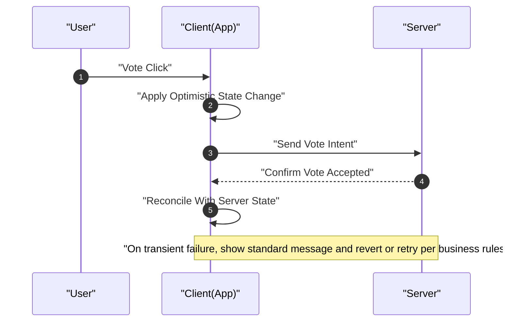

# Voting and Scoring Requirements — communityPlatform

## 1. Introduction and Scope
Business requirements governing voting and scoring across posts and comments. Defines what is allowed, how score is computed, how state changes behave, optimistic UI expectations, interactions with sorting, error handling, concurrency, abuse prevention, performance, and governance. No APIs, data schemas, or technical stacks are specified.

Scope
- In-scope: Upvote/downvote mechanics, single effective vote per user per item, score computation (upvotes − downvotes), optimistic UI rules, role constraints, self-vote restriction, sorting interactions, errors, edge cases, abuse-prevention expectations, performance and monitoring.
- Out-of-scope: Database models, API endpoints, infrastructure, UI layout or styling.

EARS baseline
- THE communityPlatform SHALL treat posts and comments as voteable items.
- THE communityPlatform SHALL maintain a single effective vote state per user per item.
- THE communityPlatform SHALL compute an integer score per item defined as upvotes minus downvotes.

## 2. Definitions and Entities
- Item: A voteable content entity (post or comment).
- Vote state: The per-user state toward a specific item. Allowed states are None, Upvote, and Downvote.
- Score: Integer equal to total upvotes minus total downvotes.
- Actor roles: guestVisitor (unauthenticated), registeredMember (authenticated), siteAdmin (authenticated with platform-wide administrative permissions).
- Ownership: Author identity associated with the item; self-vote restriction uses ownership to block voting on one’s own items.

EARS
- THE voting system SHALL support items of type post and comment.
- THE voting system SHALL track exactly one vote state per user per item.

## 3. Voting States and Transitions
Allowed states
- None, Upvote, Downvote.

EARS
- THE voting system SHALL allow the three vote states: None, Upvote, and Downvote.
- THE voting system SHALL ensure exactly one of the three states is effective per user per item at any time.

Transition rules (user actions)
- None → Upvote: click/tap Upvote.
- None → Downvote: click/tap Downvote.
- Upvote → None: click/tap Upvote again.
- Downvote → None: click/tap Downvote again.
- Upvote → Downvote: click/tap Downvote (direct switch).
- Downvote → Upvote: click/tap Upvote (direct switch).

EARS
- WHEN a user performs Upvote and current state is None, THE voting system SHALL set the state to Upvote for that item.
- WHEN a user performs Downvote and current state is None, THE voting system SHALL set the state to Downvote for that item.
- WHEN a user performs Upvote and current state is Upvote, THE voting system SHALL set the state to None for that item.
- WHEN a user performs Downvote and current state is Downvote, THE voting system SHALL set the state to None for that item.
- WHEN a user performs Upvote and current state is Downvote, THE voting system SHALL set the state to Upvote for that item.
- WHEN a user performs Downvote and current state is Upvote, THE voting system SHALL set the state to Downvote for that item.

Authentication guard for voting

EARS
- WHEN an unauthenticated user attempts to vote, THE platform SHALL show the login prompt “Please sign in to continue.” and, upon success, SHALL resume the original vote.
- WHEN a session has expired and a user attempts to vote, THE platform SHALL prompt a smooth re-login and, upon success, SHALL resume the original vote.
- WHERE a user is authenticated as registeredMember or siteAdmin, THE platform SHALL allow voting subject to other business rules.
- WHERE a user is a guestVisitor, THE platform SHALL not allow voting.

Deterministic state machine (visualization)
```mermaid
stateDiagram-v2
    direction LR
    [*] --> "None"
    "None" --> "Upvote": "Click Upvote"
    "None" --> "Downvote": "Click Downvote"
    "Upvote" --> "None": "Click Upvote"
    "Downvote" --> "None": "Click Downvote"
    "Upvote" --> "Downvote": "Click Downvote"
    "Downvote" --> "Upvote": "Click Upvote"
```

Note: The visualization is illustrative. The EARS statements are authoritative.

## 4. Self-Vote Restriction
Users cannot vote on items they authored.

EARS
- THE platform SHALL prohibit users from voting on their own posts and comments.
- WHEN a user attempts to vote on their own item, THE platform SHALL block the action and present the standardized message “You can’t vote on your own posts/comments.”
- WHEN a self-vote attempt is blocked, THE platform SHALL ensure the user’s vote state on that item remains None.

## 5. Score Calculation Rules
Scores change as a function of aggregated upvotes and downvotes.

EARS
- THE platform SHALL compute an item’s score as (total upvotes) minus (total downvotes).
- THE platform SHALL update the visible score upon any confirmed vote state change that affects the totals.
- WHERE number abbreviation rules apply to the display, THE platform SHALL follow the standards in Error Handling and Standard Copy.
- WHEN identical scores require ordering comparison, THE platform SHALL follow tie-break rules defined in Sorting and Pagination Rules.

Score deltas by transition (single user on one item)
- None → Upvote: upvotes +1, downvotes +0, score +1
- None → Downvote: upvotes +0, downvotes +1, score −1
- Upvote → None: upvotes −1, downvotes +0, score −1
- Downvote → None: upvotes +0, downvotes −1, score +1
- Upvote → Downvote: upvotes −1, downvotes +1, score −2
- Downvote → Upvote: upvotes +1, downvotes −1, score +2

EARS
- WHEN the transition is None→Upvote, THE platform SHALL increase the item’s upvote total by 1 and increase score by 1.
- WHEN the transition is None→Downvote, THE platform SHALL increase the item’s downvote total by 1 and decrease score by 1.
- WHEN the transition is Upvote→None, THE platform SHALL decrease the item’s upvote total by 1 and decrease score by 1.
- WHEN the transition is Downvote→None, THE platform SHALL decrease the item’s downvote total by 1 and increase score by 1.
- WHEN the transition is Upvote→Downvote, THE platform SHALL decrease upvotes by 1, increase downvotes by 1, and decrease score by 2.
- WHEN the transition is Downvote→Upvote, THE platform SHALL increase upvotes by 1, decrease downvotes by 1, and increase score by 2.

## 6. Optimistic UI Expectations (Business)
Voting must feel immediate while preserving correctness.

EARS
- WHEN a user performs a valid vote action, THE platform SHALL apply an optimistic state update to the UI immediately (perceived ≤ 100 ms), including score and control states.
- WHEN the server confirms synchronization, THE platform SHALL ensure the displayed score and state match the authoritative server state.
- IF a transient error occurs during synchronization, THEN THE platform SHALL present “A temporary error occurred. Please try again in a moment.” and SHALL revert the optimistic change or retry within business-acceptable limits.
- WHEN a guest is redirected to login during a vote attempt, THE platform SHALL automatically perform the intended vote upon successful login and reflect the result in the UI.
- WHILE awaiting server confirmation, THE platform SHALL prevent duplicate effect from rapid repeated clicks by honoring the final intent only.

Optimistic flow (visual)


## 7. Sorting and Visibility Interactions (Business Linkage)
Voting affects item scores, which may impact list ordering under Top sort.

EARS
- WHEN a vote changes an item’s score, THE platform SHALL reflect the updated score in subsequently fetched lists.
- WHERE the current list uses Top sort, THE platform SHALL apply the ranking rules again on refresh or requery to reflect new scores.
- WHEN scores are equal between items, THE platform SHALL apply the platform tie-break rules from Sorting and Pagination Rules.

## 8. Error Handling and Edge Cases
EARS
- IF a user without permission attempts to vote (guest or self-vote), THEN THE platform SHALL block the action and present the standardized message.
- IF a user attempts to vote on a deleted or inaccessible item, THEN THE platform SHALL reject the action and present “A temporary error occurred. Please try again in a moment.”
- IF the same user submits conflicting votes from multiple devices or tabs nearly simultaneously, THEN THE platform SHALL accept only one final authoritative state (last intent wins) and reconcile the UI.
- IF duplicate submissions occur in quick succession, THEN THE platform SHALL ignore duplicates and reflect only the final state.
- IF a session expires during a vote, THEN THE platform SHALL prompt re-login and, upon success, SHALL automatically reapply the intended vote.
- IF network connectivity is unavailable during a vote, THEN THE platform SHALL present “You appear to be offline. Please check your connection and try again.” and SHALL keep the intent recoverable.

Examples (business outcomes)
- Attempt to vote on own comment: action blocked; state remains None; message: “You can’t vote on your own posts/comments.”
- Vote on deleted post: action rejected; show temporary error; no state change.
- Rapid toggle Upvote↔Downvote: only final intent that reaches the server becomes authoritative; UI reconciles accordingly.

## 9. Concurrency and Consistency Rules
EARS
- THE platform SHALL treat the last successfully processed vote intent per user per item as the authoritative state.
- WHEN conflicting votes are received from different devices, THE platform SHALL retain only one final state and discard or overwrite the others.
- WHEN optimistic UI diverges from the authoritative server state, THE platform SHALL reconcile the UI to match the server state.
- WHERE network or clock conditions can reorder arrival, THE platform SHALL honor the user’s most recent intent as final.

## 10. Abuse Prevention Considerations
Business-level expectations for safety and integrity. Implementation details are at the development team’s discretion.

EARS
- THE platform SHALL monitor voting patterns to detect potential manipulation (e.g., coordinated brigading, reciprocal rings, unusual velocity).
- WHEN abnormal voting patterns are detected, THE platform SHALL apply mitigations such as rate limits, temporary vote blocks, additional verification, or admin review queues.
- WHERE siteAdmin action is required, THE platform SHALL provide administrative powers to invalidate or correct suspicious vote effects in a business-governed manner.
- THE platform SHALL retain vote-related records sufficient for business-level audit of suspicious activity while respecting privacy and retention policies.
- WHEN an account is restricted for policy reasons, THE platform SHALL disable that account’s ability to vote for the restriction duration.

Qualitative signals (non-exhaustive)
- Unusually high vote velocity per account or per item
- Many very new accounts voting in a short window on the same item
- Reciprocal voting patterns among small, repeated groups
- Geographic or device anomalies inconsistent with typical usage

## 11. Performance and Monitoring Expectations
EARS
- THE platform SHALL apply optimistic UI updates within 100 ms perceived time for local interactions.
- THE platform SHALL reconcile vote state with server confirmation and reflect the final state within a user-acceptable interval (generally within a few seconds; monitored as a quality metric).
- THE platform SHALL maintain accurate, consistent scores for all listed items after reconciliation.
- THE platform SHALL expose business-level monitoring for vote throughput and error rates to support operational oversight.

Metrics (business-level guidance)
- Vote latency (client action → server confirmation): p95 within 1.0 s under normal load
- Optimistic→authoritative reconciliation success rate: ≥ 99.5%
- Error rate for vote attempts: tracked and alarmed beyond agreed thresholds

## 12. Compliance and Governance Touchpoints
EARS
- WHERE legal request, policy violation, or credible abuse report requires intervention, THE platform SHALL allow administrative actions that may neutralize or reverse vote impacts.
- THE platform SHALL ensure all user-facing messages related to voting use standardized copy from Error Handling and Standard Copy.

## 13. Acceptance Criteria and Test Scenarios (Business-Level)
State transition tests
- GIVEN state None, WHEN Upvote, THEN state Upvote and score +1.
- GIVEN state None, WHEN Downvote, THEN state Downvote and score −1.
- GIVEN state Upvote, WHEN Upvote, THEN state None and score −1.
- GIVEN state Downvote, WHEN Downvote, THEN state None and score +1.
- GIVEN state Upvote, WHEN Downvote, THEN state Downvote and score −2.
- GIVEN state Downvote, WHEN Upvote, THEN state Upvote and score +2.

Authentication and guards
- GIVEN guest user, WHEN vote attempt, THEN show “Please sign in to continue.” and resume vote after successful login.
- GIVEN expired session, WHEN vote attempt, THEN prompt smooth re-login and resume vote upon success.
- GIVEN own item, WHEN vote attempt, THEN block and show “You can’t vote on your own posts/comments.”

Optimistic UI and reconciliation
- GIVEN valid vote, WHEN action performed, THEN apply optimistic state immediately (≤ 100 ms) and match server after confirmation.
- GIVEN transient failure, WHEN sync fails, THEN show “A temporary error occurred. Please try again in a moment.” and revert or retry per rules.

Concurrency and consistency
- GIVEN two devices submit conflicting votes, WHEN nearly simultaneous, THEN only one final state is authoritative and UI reflects it.
- GIVEN rapid toggles, WHEN multiple requests are sent, THEN only the last intent is honored.

Edge cases
- GIVEN deleted item, WHEN vote attempt, THEN reject and show temporary error message; no state change.
- GIVEN unauthorized item, WHEN vote attempt, THEN reject and show temporary error message; no state change.

## 14. Related Documents
- Sorting and tie-breaking: see Sorting and Pagination Rules.
- Session longevity and resume-after-login: see Session and Authentication Experience Requirements.
- Standardized copy and number formatting: see Error Handling and Standard Copy.
- Core user flows: see Functional Requirements for Core Flows.

## 15. Business Boundary Statement
Business requirements only. Technical implementation details (architecture, storage, APIs, protocols) are at the development team’s discretion. The content specifies WHAT the system must do, not HOW to build it.
