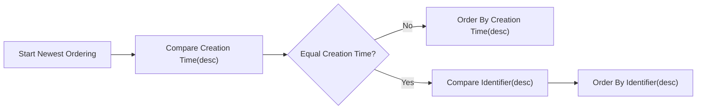
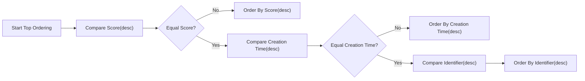
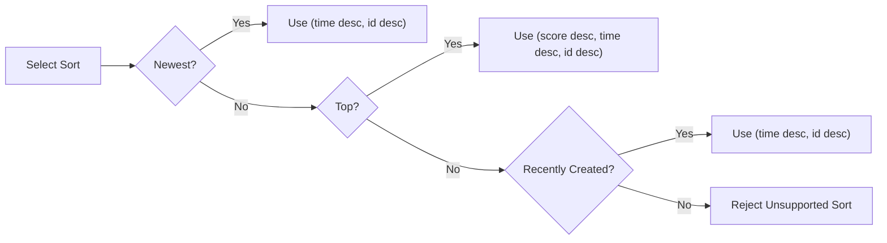
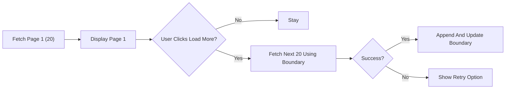
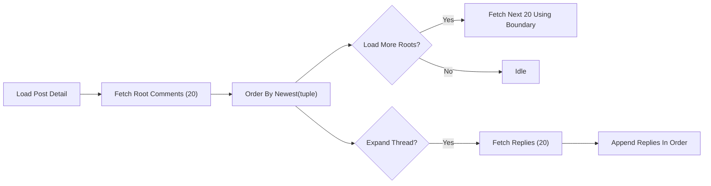
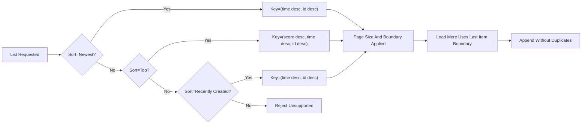

# Sorting and Pagination Rules — communityPlatform

## Scope and Definitions
Establishes deterministic ordering and pagination behaviors used across Home, Community Home, Post Detail (comments), Explore, Search result lists, and sidebars. Business-only scope with no APIs, schemas, or implementation details.

Terminology
- Post: Text-only content item within a sub-community, with creation time and score (upvotes − downvotes).
- Comment: Text reply associated with a post or another comment; supports nesting.
- Community: Topic-based group with unique immutable name and a created time.
- Score: Integer upvotes − downvotes for a post or comment.
- Creation time: Absolute timestamp of creation; displays are relative time, but ordering uses absolute time.
- Identifier: A unique, monotonically increasing value assigned at creation; larger identifier = more recent when timestamps are equal.
- Page size: Fixed number of items returned per page.
- Load more: User action that appends the next contiguous page following the last displayed item.

EARS Baseline
- THE communityPlatform SHALL apply deterministic sorting and tie-breakers that produce a total order within each list.
- THE communityPlatform SHALL exclude deleted or ineligible items from ordered results without disrupting the relative order of remaining items.
- THE communityPlatform SHALL honor fixed page sizes: 20 for main feeds and comment pages; 10 for Home right-sidebar Global Latest; up to 5 for the Left Sidebar Recent Communities list.
- THE communityPlatform SHALL avoid duplicates or omissions across sequential pages retrieved via Load more under normal conditions.

## Sort Orders

### Newest (Creation Time Descending)
Objective: Order items strictly by recency, breaking ties by identifier.

Rules (EARS)
- THE communityPlatform SHALL order items by creation time descending when sort=Newest.
- IF two or more items share the same creation time, THEN THE communityPlatform SHALL order them by identifier descending.
- THE communityPlatform SHALL use the tuple (creation time desc, identifier desc) as the deterministic key for Newest.

Edge Cases (EARS)
- IF an item becomes deleted or hidden, THEN THE communityPlatform SHALL exclude it from results without reordering remaining items beyond the defined keys.
- WHILE new items are created after a page is fetched, THE communityPlatform SHALL allow newer items to appear ahead of previously fetched windows on subsequent fetches.

Examples
- Different times: T3 > T2 > T1 → order [T3, T2, T1].
- Same time: time=T, ids 105 > 103 > 101 → order [105, 103, 101].

Mermaid — Newest Decision

### Top (Score Descending, Then Recency)
Objective: Order items by higher score first, then recency, then identifier.

Rules (EARS)
- THE communityPlatform SHALL order items by score descending when sort=Top.
- IF scores are equal, THEN THE communityPlatform SHALL order by creation time descending.
- IF both score and creation time are equal, THEN THE communityPlatform SHALL order by identifier descending.
- THE communityPlatform SHALL use the tuple (score desc, creation time desc, identifier desc) as the deterministic key for Top.

Edge Cases (EARS)
- WHERE scoring updates occur due to voting after a page is fetched, THE communityPlatform SHALL reflect new ordering on subsequent fetches without reordering items already presented within the same previously fetched window.

Examples
- Scores [50, 40, 40] with times [T2, T3, T1] and T3>T2>T1 → order [50@T2, 40@T3, 40@T1].
- Scores [0, 0] with same time T and ids [200, 198] → order [200, 198].

Mermaid — Top Decision

### Recently Created (Communities)
Objective: Order communities by most recent creation time first, then identifier.

Rules (EARS)
- WHERE communities are sorted by Recently Created, THE communityPlatform SHALL order by creation time descending and SHALL break ties using identifier descending.

Examples
- Community times [T4, T3, T3] with ids [10, 15, 14] → order [T4#10, T3#15, T3#14].

### Cross-Sort Enforcement and Unsupported Sorts
Rules (EARS)
- THE communityPlatform SHALL guarantee a total order by applying each sort’s defined key tuple and final tie-break on identifier.
- IF an unsupported sort value is requested, THEN THE communityPlatform SHALL reject the request at business level for that context.

Mermaid — Tie-Break Enforcement

## Pagination Rules

### Main Feeds (Home and Community)
Scope: Home main feed (joined communities; all communities if user has joined none) and /c/[name] community feed.

Page Size and Boundaries (EARS)
- THE communityPlatform SHALL render 20 post cards per page.
- WHEN Load more is activated, THE communityPlatform SHALL append the next 20 items immediately following the last displayed item.
- THE communityPlatform SHALL select the boundary for the next page using the active sort’s key tuple of the last displayed item, ensuring deterministic continuation without overlap.

Ordering Stability (EARS)
- THE communityPlatform SHALL maintain the active sort order across all pages in the same session until the user explicitly changes the sort.
- IF the user changes sort, THEN THE communityPlatform SHALL reset pagination to the first page under the new order.

Edge Cases (EARS)
- IF an item present in a prior page is later deleted, THEN THE communityPlatform SHALL not re-insert it and SHALL not shift the relative order of remaining items beyond the defined ordering keys.
- IF a pagination request fails temporarily, THEN THE communityPlatform SHALL preserve already displayed items and allow retry without duplicates after recovery.

Mermaid — Load More Flow (Main Feeds)

### Right Sidebar — Global Latest (Home)
Scope: The 10 most recent posts sitewide displayed in Home’s right sidebar.

Rules (EARS)
- THE communityPlatform SHALL display exactly 10 items ordered by Newest using (creation time desc, identifier desc).
- THE communityPlatform SHALL not provide Load more for this list.
- THE communityPlatform SHALL keep this list independent of membership; joined communities do not filter this list.

### Left Sidebar — Recent Communities
Scope: Up to 5 communities the user recently visited or interacted with, ordered by most recent activity.

Rules (EARS)
- THE communityPlatform SHALL display up to 5 communities ordered by most recent activity by the current user.
- THE communityPlatform SHALL treat activity as any of: visiting a community home, viewing a post detail in that community, joining/leaving, creating a post, commenting, or voting within that community.
- IF two communities have the same activity time, THEN THE communityPlatform SHALL break ties by identifier descending.
- IF a listed community is deleted or becomes inaccessible, THEN THE communityPlatform SHALL remove it immediately from the list.

### Post Detail — Comments Pagination and Ordering
Scope: Comments on /c/[name]/[postID].

Rules (EARS)
- THE communityPlatform SHALL paginate top-level (root) comments in pages of 20 per fetch.
- THE communityPlatform SHALL order comments by Newest using (creation time desc, identifier desc).
- THE communityPlatform SHALL support nested replies; replies within a thread SHALL be ordered by Newest using the same tie-breakers.
- WHEN Load more for comments is activated, THE communityPlatform SHALL append the next 20 root comments or the next 20 replies within the expanded thread scope using deterministic boundaries.
- THE communityPlatform SHALL ensure pagination stability to avoid duplicates or omissions under normal operating conditions.

Mermaid — Comments Pagination

### Search Results — Pagination Consistency Reference
Scope: Global search results across Posts, Communities, and Comments.

Rules (EARS)
- THE communityPlatform SHALL return 20 results per page for each search tab.
- WHERE Posts sort is Newest or Top, THE communityPlatform SHALL apply the same ordering and tie-break rules defined in this document.
- WHERE Communities sort is Recently Created, THE communityPlatform SHALL apply (creation time desc, identifier desc) as defined here; "Name Match" ranking is defined in search requirements, with ties broken by this document’s Recently Created tie-breakers when needed.
- WHERE Comments are listed, THE communityPlatform SHALL apply Newest ordering per this document.

## Determinism, Integrity, and Concurrency
Rules (EARS)
- THE communityPlatform SHALL use the last item’s ordering tuple in a page as the boundary for the next page to prevent overlaps.
- IF the boundary item becomes unavailable before the next fetch, THEN THE communityPlatform SHALL select the next valid boundary immediately preceding it under the same order and continue pagination.
- WHILE concurrent content creation, edits, or votes occur, THE communityPlatform SHALL keep previously fetched windows stable, allowing re-ranked items to appear correctly on subsequent fetches without shuffling items already shown within the same window.
- THE communityPlatform SHALL ensure that all lists claiming Newest or Top adhere to the same ordering keys and tie-breakers to avoid cross-surface inconsistencies.

## Error Handling and Performance Expectations (Business-Level)
Rules (EARS)
- IF a pagination request encounters a temporary error, THEN THE communityPlatform SHALL present the standardized message “A temporary error occurred. Please try again in a moment.” and SHALL allow retry without losing already displayed items.
- THE communityPlatform SHALL append subsequent pages within 1.5–2.0 seconds perceived time under normal load for main feeds and comments.
- THE communityPlatform SHALL refresh the Global Latest list with a recency freshness of ≤ 10 seconds under normal load.

## Acceptance Criteria (Business-Level, EARS)
Newest
- GIVEN items with times T3>T2>T1, WHEN Newest is selected, THEN items SHALL appear [T3, T2, T1].
- GIVEN items with equal time T and identifiers 105>103>101, WHEN Newest is selected, THEN items SHALL appear [105, 103, 101].

Top
- GIVEN items with scores [50, 40, 40] and creation times T2, T3, T1 with T3>T2>T1, WHEN Top is selected, THEN items SHALL appear [50@T2, 40@T3, 40@T1].
- GIVEN items with equal scores and equal creation time T and identifiers [200, 198], WHEN Top is selected, THEN items SHALL appear [200, 198].

Main Feeds
- GIVEN Home or Community feeds, WHEN the first page loads, THEN 20 items SHALL be displayed; WHEN Load more is clicked, THEN the next 20 SHALL append without duplicates or omissions.
- GIVEN a sort change by the user, WHEN a new order is selected, THEN pagination SHALL reset to the first page under that order.

Global Latest
- GIVEN Home page right sidebar, WHEN Global Latest renders, THEN exactly 10 newest sitewide posts SHALL be displayed with no Load more.

Comments
- GIVEN a post with more than 20 root comments, WHEN the first page loads, THEN 20 newest roots SHALL display; WHEN Load more is clicked, THEN the next 20 newest roots SHALL append.
- GIVEN a thread with more than 20 replies, WHEN the thread is expanded, THEN 20 newest replies SHALL load first and the next 20 on subsequent requests.

Search
- GIVEN search results, WHEN posts are sorted by Newest or Top, THEN ordering SHALL follow the keys defined here; WHEN communities are sorted by Recently Created, THEN ordering SHALL follow (creation time desc, identifier desc).

Integrity
- GIVEN deletion of an item, WHEN subsequent pages are fetched, THEN the deleted item SHALL not reappear and remaining items SHALL maintain relative order per the sort keys.
- GIVEN new items created after a page is fetched, WHEN subsequent pages are requested, THEN newer items MAY appear earlier as warranted by the sort; previously fetched windows SHALL remain stable.

## Quality and Verification Checklist
- Verify all lists using Newest apply (time desc, id desc) and those using Top apply (score desc, time desc, id desc).
- Verify strict page sizes: 20 for main feeds and comments; 10 for Global Latest; ≤ 5 for Recent Communities.
- Verify Load more retrieves contiguous windows with no duplicates or omissions.
- Verify Search results respect these ordering keys for their applicable sorts.
- Verify deletion and visibility changes are reflected without violating deterministic order.

## Mermaid Summary — Cross-Surface Ordering Integrity

Business boundary statement
- Defines WHAT to sort by and HOW to page in natural language. No API, schema, or technical mechanism is specified. Developers retain full autonomy over implementation while meeting these behaviors.
