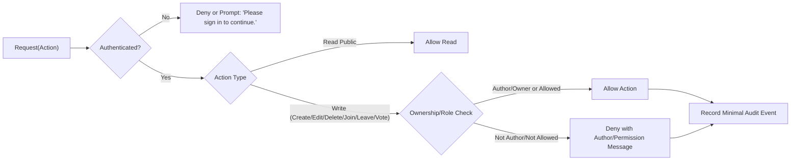
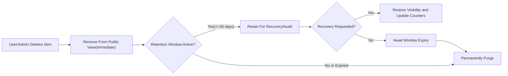

# Privacy, Security, and Compliance Requirements — communityPlatform

This specification defines business-level privacy, security, and compliance requirements for communityPlatform. It focuses on responsibilities, observable behavior, and user rights without prescribing technical implementation details. It operationalizes core product principles—open reading, guarded actions, ownership, generous sessions, smooth re-login, minimal validation—into testable, EARS-formulated requirements.

The content below states WHAT the system must do. All technical implementation decisions (architecture, APIs, database design, encryption, token storage) are at the discretion of the development team.

## 1) Introduction and Scope
- Purpose: Safeguard users and content by establishing clear access control, ownership and consent, abuse prevention expectations, data lifecycle obligations, user rights, auditability, and incident handling.
- Scope: Applies to communities, posts, comments, votes, membership, search visibility, and admin policy actions across all public surfaces.
- Out-of-scope: Cryptographic details, network protocols, API contracts, database schemas, infrastructure or vendor choices, or any low-level implementation specifics.

## 2) Principles and Roles Reference
### 2.1 Guiding Principles
- THE platform SHALL allow reading by anyone without login for public content.
- THE platform SHALL require authentication for state-changing actions (posting, commenting, voting, joining/leaving, creating communities).
- THE platform SHALL enforce authorship ownership so that only authors edit/delete their own posts/comments.
- WHEN a session expires mid-action, THE platform SHALL prompt re-login and resume the action upon success without loss of input.
- THE platform SHALL minimize validation while applying explicit input rules and standard messages from the PRD.

### 2.2 Roles (Business Perspective)
- guestVisitor: Unauthenticated visitor; read-only access to public content and search results.
- communityMember: Authenticated user; creates/edits/deletes own posts and comments; votes on others’ content; joins/leaves; creates communities; owns communities they create (metadata/rules edit rights; name immutable).
- systemAdmin: Platform administrator; enforces policy; may disable or delete communities/content when necessary; does not acquire authorship of others’ content.

## 3) Access Control Principles (Read-Open, Write-Restricted)
### 3.1 Business Access Matrix
| Capability | guestVisitor | communityMember | systemAdmin |
|-----------|--------------|-----------------|-------------|
| Read public communities/posts/comments | ✅ | ✅ | ✅ |
| Search communities/posts/comments | ✅ | ✅ | ✅ |
| Create communities | ❌ | ✅ | ✅ (policy operations permitted) |
| Edit community metadata (owner only) | ❌ | ✅ (if owner) | ✅ (policy override) |
| Join/Leave community | ❌ | ✅ | ✅ (enforcement operations only) |
| Create posts/comments | ❌ | ✅ | ✅ (as user; policy notices allowed) |
| Edit/Delete own posts/comments | ❌ | ✅ | ✅ (own only; policy takedown for others) |
| Vote on posts/comments | ❌ | ✅ | ✅ |
| Delete a community | ❌ | ✅ (if owner) | ✅ (policy takedown) |

### 3.2 EARS Requirements — Access Control
- THE platform SHALL permit reading of public content and search results by unauthenticated users.
- THE platform SHALL restrict all state-changing actions (create/edit/delete/join/leave/vote) to authenticated users.
- WHERE a user is not the author of a post or comment, THE platform SHALL deny edit/delete for that content.
- WHERE a user is not the owner of a community, THE platform SHALL deny editing of that community’s metadata and rules.
- WHEN a community owner requests deletion of their community, THE platform SHALL remove the community and all posts within it from public view.
- WHERE systemAdmin enacts a policy takedown, THE platform SHALL remove targeted content from public view and record the action for audit.

## 4) Ownership and Consent (Create/Edit/Delete)
### 4.1 Business Rules
- Authors control their posts and comments. Edit/delete is limited to the author and systemAdmin for policy actions.
- Community creators own community metadata (description/logo/banner/rules/category); the community name is immutable post-creation.
- Joining affects only personalization and does not grant moderation privileges.
- Posting does not require membership in the target community.

### 4.2 EARS Requirements — Ownership and Consent
- THE platform SHALL attribute each post and comment to a single owning account.
- WHERE the author display name is empty, THE platform SHALL display a default such as "Anonymous".
- WHEN an author requests edit of a post or comment, THE platform SHALL permit the edit subject to content input rules and record the update time.
- WHEN an author requests deletion of a post or comment, THE platform SHALL remove the item from public view immediately.
- WHERE a community creator submits an edit to community metadata (excluding name), THE platform SHALL apply the change and update the community’s last active timestamp.
- IF a user attempts to edit or delete content they did not author, THEN THE platform SHALL deny the action and present "You can edit or delete only items you authored.".
- WHERE a community name change is requested after creation, THE platform SHALL deny the request; during creation, THE platform SHALL present "This name is already in use." or "This name isn’t available. Please choose something simpler." when applicable.

## 5) Abuse Prevention Expectations (Non-Technical)
### 5.1 Business Expectations
- Accountability via authorship and auditable admin actions.
- Proportionate friction where abuse signals appear; avoid unnecessary hurdles for legitimate users.
- Self-vote prevention and coherent voting state behavior.
- Policy tools enabling admin removal/disablement of abusive content/communities.

### 5.2 EARS Requirements — Abuse Prevention
- THE platform SHALL prevent users from voting on their own posts/comments and present "You can’t vote on your own posts/comments.".
- WHEN abusive content or a violating community is identified per policy, THE platform SHALL allow systemAdmin to disable or delete it.
- WHEN content is removed for policy reasons, THE platform SHALL exclude it from feeds, search results, Global Latest, and counters.
- WHERE administrative removal affects user-visible counts, THE platform SHALL reconcile counters and scores to the authoritative state on next refresh or confirmation.
- WHEN an action is denied for temporary reasons, THE platform SHALL present "A temporary error occurred. Please try again in a moment."; WHEN permanent due to permissions, THE platform SHALL present the appropriate permission message.

## 6) Data Retention and Deletion Expectations (Business-Level)
### 6.1 Content Lifecycle
- Immediate removal from public surfaces on author deletion or admin takedown.
- Retention for recovery/audit/legal needs for a limited window.
- Final purge after retention; adjusted counters and links to omit deleted items.

### 6.2 EARS Requirements — Retention and Deletion
- WHEN an author deletes a post or comment, THE platform SHALL remove it from public view instantly.
- WHERE content is removed from public view, THE platform SHALL maintain a retention window of up to 30 days for recovery upon author request or for audit/legal processing.
- WHEN the retention window elapses, THE platform SHALL permanently purge the content so that it is no longer recoverable by normal means.
- WHERE references to deleted content exist (e.g., reply chains, counters), THE platform SHALL adjust counts and omit the deleted item from lists.
- WHEN a community is deleted by the owner or systemAdmin, THE platform SHALL remove the community and all posts within it from public view immediately and apply the same retention and purge timeline.
- WHERE an account is closed by user request, THE platform SHALL present options to delete content or anonymize attribution and SHALL execute the confirmed choice.
- WHEN anonymization is selected, THE platform SHALL replace the display name attribution with a neutral label such as "Anonymous" while retaining content if not deleted.

## 7) Compliance Posture and User Rights (Regional Neutrality)
### 7.1 User Rights (Business Obligations)
- Access: Obtain a copy of account data and authored content metadata in a human-readable format.
- Correction: Correct profile fields; update authored content within platform rules.
- Deletion/Anonymization: Delete authored content and/or close account with choice of deletion or anonymization.
- Portability: Export authored content metadata in a commonly used format.
- Preference/Consent: Limit certain processing (e.g., marketing); withdraw optional consent.

### 7.2 EARS Requirements — Compliance and Rights
- WHEN a user requests access to account data and authored content metadata, THE platform SHALL provide a human-readable export within a reasonable timeframe.
- WHEN a user requests correction of personal profile data, THE platform SHALL update the data and record the update time.
- WHEN a user requests account closure, THE platform SHALL present options for deletion or anonymization of authored content and SHALL execute the chosen option after confirmation.
- WHEN a user requests portability, THE platform SHALL provide an export of authored content metadata in a commonly used format.
- WHERE a user withdraws optional consent, THE platform SHALL cease the related processing from the time of withdrawal forward.
- WHERE legal or safety obligations require preservation, THE platform SHALL allow systemAdmin to suspend deletion/anonymization until resolved and record the reason.

## 8) Administrative Oversight, Auditability, and Safeguards
### 8.1 EARS Requirements — Admin Safeguards
- THE platform SHALL record the initiator, reason, target, and timestamp for systemAdmin policy actions that change content visibility or community status.
- WHEN systemAdmin disables or deletes a community for policy reasons, THE platform SHALL propagate the visibility change to all surfaces (Home, Community Home, Global Latest, Search) consistently.
- WHERE a deletion request conflicts with a legal hold, THE platform SHALL prioritize the legal hold and record the hold status and reason.
- WHEN a community owner deletes the community, THE platform SHALL record the deletion request and the cascading removal of posts and comments for audit purposes.

## 9) Privacy-Preserving Logging and Observability Expectations
### 9.1 EARS Requirements — Logging
- THE platform SHALL record essential events (auth-required actions, content lifecycle changes, joins/leaves, votes) with minimal necessary personal data.
- WHERE logs include user references, THE platform SHALL use stable internal identifiers rather than exposed personal attributes.
- WHEN logs are retained, THE platform SHALL apply a business-level retention period aligned with Section 6 and purge upon expiry.
- WHERE user data exports are generated, THE platform SHALL log the request and completion for audit.

## 10) Incident Handling, Notifications, and Continuity
### 10.1 EARS Requirements — Incidents
- WHEN an incident affecting user data integrity or confidentiality is confirmed, THE platform SHALL document scope, affected users, time window, and resolution status for internal audit.
- WHERE user notification is warranted by business policy, THE platform SHALL notify affected users in a timely manner with clear guidance on any user actions required.
- WHEN content is restored following an incident, THE platform SHALL reconcile counts and scores across all surfaces to the authoritative state.
- WHERE an incident necessitates temporary restrictions (e.g., disabling posting), THE platform SHALL present standard temporary error messages and SHALL resume normal operations when resolved.

## 11) Performance and UX Expectations Related to Privacy/Security
### 11.1 EARS Requirements — User-Perceived Behavior
- WHEN a guest attempts a restricted action, THE platform SHALL display "Please sign in to continue." with no loss of entered data after sign-in.
- WHEN session renewal is required during an action, THE platform SHALL complete re-authentication via a gentle prompt and SHALL resume the action without losing context.
- WHERE optimistic UI is used for votes, joins, and counts, THE platform SHALL reconcile to authoritative state upon server confirmation without user intervention.
- WHEN permission checks deny an action, THE platform SHALL respond within a user-perceived short interval and SHALL show the appropriate standard message.

## 12) Risks, Assumptions, and Out-of-Scope
- Risks: Abuse attempts; coordinated spam; legal holds delaying deletion; confusion between anonymization vs deletion; inconsistencies across surfaces if propagation fails.
- Assumptions: Public content is broadly readable; community deletion removes its posts; admins act under policy with audit; standard copy from the PRD is authoritative where specified.
- Out-of-scope: Encryption/key management; token lifecycle/storage details; endpoint design; infrastructure hardening and vendor choices.

## 13) Success Criteria and KPIs (Business-Level)
- Reduction in escalations requiring manual policy takedown due to clear ownership and deletion rules.
- Timely fulfillment of access/portability requests within published windows.
- Zero discrepancy rate in audits comparing visibility across Home, Community, Global Latest, and Search after policy actions.
- Accurate author-guard denials with correct standard messages in test suites.

## 14) Visual Diagrams (Mermaid)
### 14.1 Access Control Decision Flow

### 14.2 Deletion and Retention Lifecycle

## 15) EARS Requirement Index (Consolidated)
- THE platform SHALL allow unauthenticated reading of public content and search results.
- THE platform SHALL require authentication for posting, commenting, voting, joining/leaving, and creating communities.
- THE platform SHALL enforce ownership such that only authors can edit or delete their posts and comments.
- WHEN a session expires mid-action, THE platform SHALL prompt re-login and resume the prior action upon success without losing user input.
- THE platform SHALL restrict all state-changing actions to authenticated users.
- WHERE a user is not the author of a post or comment, THE platform SHALL deny edit and delete actions for that content.
- WHERE a user is not the owner of a community, THE platform SHALL deny editing of that community’s metadata and rules.
- WHEN a community owner requests deletion of their community, THE platform SHALL remove the community and all posts within it from public view.
- WHERE systemAdmin enacts a policy takedown, THE platform SHALL remove targeted content from public view and record the action for audit.
- THE platform SHALL attribute each post and comment to a single owning account.
- WHERE the author display name is empty, THE platform SHALL display a default value such as "Anonymous".
- WHEN an author requests edit of their post or comment, THE platform SHALL permit the edit subject to input rules and record the update time.
- WHEN an author requests deletion of their post or comment, THE platform SHALL remove the item from public view immediately.
- WHERE a community creator edits metadata (excluding name), THE platform SHALL apply the change and update last active timestamp.
- IF a user attempts to edit or delete content they did not author, THEN THE platform SHALL deny the action and present the permission message.
- THE platform SHALL prevent users from voting on their own posts or comments and present the self-vote message.
- WHEN abusive content is removed, THE platform SHALL exclude it from feeds, search results, and counters and reconcile to authoritative counts.
- WHEN content is deleted, THE platform SHALL remove it from public view instantly and retain up to 30 days for recovery/audit before purge.
- WHEN a community is deleted, THE platform SHALL remove the community and all posts and apply retention/purge timelines.
- WHERE an account is closed, THE platform SHALL present deletion or anonymization options and execute the confirmed choice.
- WHEN anonymization is selected, THE platform SHALL replace attribution with a neutral label while retaining content.
- WHEN a user requests access to their data, THE platform SHALL provide a human-readable export within a reasonable timeframe.
- WHEN a user requests correction, THE platform SHALL update data and record the update time.
- WHEN a user requests portability, THE platform SHALL provide an export in a commonly used format.
- WHERE a user withdraws optional consent, THE platform SHALL cease related processing from that point forward.
- WHERE legal holds apply, THE platform SHALL suspend deletion/anonymization until resolution and record the reason.
- THE platform SHALL record initiator, reason, target, and timestamp for systemAdmin policy actions and visibility changes.
- WHEN systemAdmin disables or deletes a community, THE platform SHALL propagate visibility changes to all surfaces.
- THE platform SHALL record essential events with minimal personal data and use internal identifiers in logs.
- WHEN logs are retained, THE platform SHALL apply retention aligned with content policies and purge upon expiry.
- WHEN an incident is confirmed, THE platform SHALL document scope, affected users, and resolution status and notify users if warranted by policy.
- WHEN content is restored after an incident, THE platform SHALL reconcile counts and scores across all surfaces.
- WHEN a guest attempts a restricted action, THE platform SHALL display "Please sign in to continue." and preserve input through login.
- WHEN session renewal is required, THE platform SHALL resume the in-progress action without losing context after re-authentication.
- WHERE optimistic UI is used, THE platform SHALL reconcile to authoritative state upon confirmation without user intervention.

## Related Documents
- Refer to the [User Roles and Permissions Specification](./03-user-roles-and-permissions.md) for role taxonomy and session principles.
- See the [Functional Requirements Document](./04-functional-requirements.md) for end-to-end behaviors and constraints.
- Consult the [Guarded Actions and User Flows Guide](./06-user-flows.md) for flow-level behaviors and resumption.
- Review the [Error Handling and Recovery Requirements](./09-error-handling-and-recovery.md) for standard messages and retry behaviors.
- Align with the [Performance and UX Expectations](./10-performance-and-ux-expectations.md) for responsiveness and session smoothness.
- Coordinate with the [Event Lifecycle and Optimistic UI Requirements](./12-event-lifecycle-and-optimistic-ui.md) for state transitions and reconciliation.
