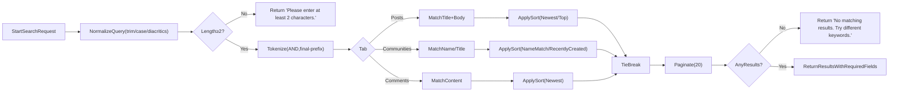
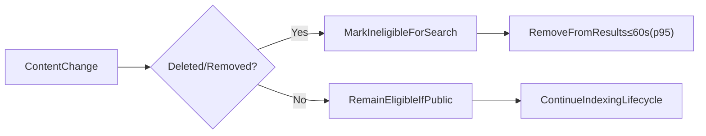
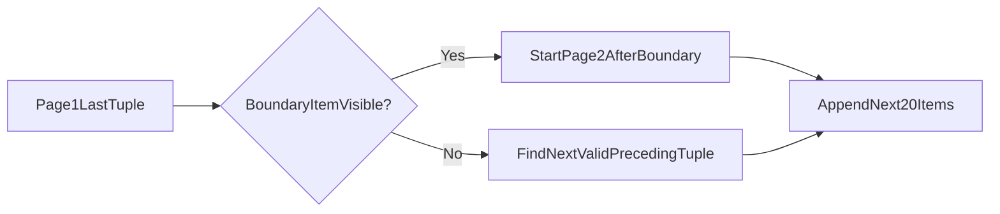

# Community Platform — Search Requirements (Business-Level)

## 1. Scope and Intent
- THE system SHALL provide a global search experience for posts, sub-communities, and comments that is available to all users, including guest visitors, for publicly visible content.
- THE system SHALL present search behaviors in deterministic, testable terms without prescribing implementation technologies or data schemas.

## 2. Roles and Access
- Roles: guestVisitor (unauthenticated), registeredMember (authenticated), siteAdmin (administrative oversight).
- THE system SHALL allow guestVisitor to run searches and view results across public content.
- THE system SHALL apply ownership, deletion, and restriction rules to determine eligibility of items displayed in results.

## 3. Entities and Definitions
- Post: Text-only content item with title and body belonging to exactly one sub-community; includes author, creation time, score (upvotes − downvotes), and comment count.
- Sub-Community (Community): Topic-based group with unique immutable name, optional description/logo/banner/rules, and required category from a fixed set.
- Comment: Text reply associated with a post (and optionally a parent comment) supporting nesting; includes author, creation time, and score.
- Score: Integer value upvotes − downvotes (see Voting requirements).
- Creation time: Absolute timestamp recorded on item creation; results display relative time in user’s local timezone.
- Identifier: Monotonically increasing unique identifier for deterministic tie-breaking.

## 4. Principles (EARS Summary)
- THE system SHALL maintain deterministic ordering for all search results using the globally defined sort keys and tie-breakers.
- THE system SHALL keep reading open to everyone; search requires no login for public content.
- THE system SHALL enforce minimal validation with clear, standardized copy for invalid inputs and empty states.
- THE system SHALL exclude deleted, policy-removed, or otherwise ineligible content from search results.
- THE system SHALL return results in discrete pages of 20 with stable pagination boundaries and Load more behavior.

## 5. Query Processing and Validation
### 5.1 Normalization
- THE system SHALL trim leading/trailing whitespace from the query before processing.
- THE system SHALL normalize internal whitespace by collapsing multiple spaces into a single space for tokenization.
- THE system SHALL perform case-insensitive matching and ignore diacritics in comparisons.
- THE system SHALL treat hyphen ("-") and underscore ("_") as token separators for matching.
- WHERE a query exceeds 256 characters after normalization, THE system SHALL process only the first 256 characters.

### 5.2 Minimum Length and Too-Short Behavior
- IF the normalized query contains fewer than 2 visible characters, THEN THE system SHALL not execute a search and SHALL return the standardized message: "Please enter at least 2 characters.".

### 5.3 Tokenization and Matching Semantics
- THE system SHALL split the normalized query into tokens using whitespace and common punctuation; hyphen and underscore act as separators.
- THE system SHALL apply AND semantics: all tokens must appear in the searchable fields of a result for it to match.
- THE system SHALL allow prefix matching for the final token only; all preceding tokens require whole-word matches.
- THE system SHALL not apply domain-specific stop-word removal at the business level; all tokens count toward matching.

## 6. Matching Semantics by Entity
### 6.1 Posts
- THE system SHALL determine matches using only the title and body fields (plain text). Author display name SHALL NOT participate in matching.

### 6.2 Sub-Communities
- THE system SHALL determine matches using community name and display title/name. The description MAY inform tie-breaking under "Recently Created" but SHALL NOT affect the "Name Match" ranking computation.

### 6.3 Comments
- THE system SHALL determine matches using only the comment’s content.

## 7. Sorting and Tie-Breaking
### 7.1 Posts and Comments — Newest
- THE system SHALL order by creation time descending.
- IF creation times are equal, THEN THE system SHALL order by identifier descending.

### 7.2 Posts — Top
- THE system SHALL order by score descending.
- IF scores are equal, THEN THE system SHALL order by creation time descending.
- IF scores and creation times are equal, THEN THE system SHALL order by identifier descending.

### 7.3 Communities — Name Match Ranking
Priority ordering under "Name Match":
1) Exact case-insensitive match of community name with the full query string.
2) Community name starts with the full query string.
3) Community name contains all query tokens in any order (whole-word matches).
4) Fuzzy proximity for typos (edit distance ≤ 1 for names length ≤ 10; ≤ 2 otherwise).
5) Tie-breaker: more recent creation time first; if equal, larger identifier first.

EARS requirements:
- THE system SHALL rank communities under "Name Match" using the priority order above.
- THE system SHALL apply creation time and then identifier as tie-breakers for equally ranked communities.

### 7.4 Communities — Recently Created
- THE system SHALL order by creation time descending.
- IF creation times are equal, THEN THE system SHALL order by identifier descending.

## 8. Pagination and Stability
- THE system SHALL return search results in pages of 20 items per request for each tab (Posts, Communities, Comments).
- WHEN a user invokes Load more, THE system SHALL append the next 20 items immediately following the last item shown using the active sort’s boundary tuple.
- THE system SHALL preserve deterministic ordering across pages for identical queries and sorts.
- IF the boundary item for pagination becomes deleted or hidden before the next fetch, THEN THE system SHALL continue from the next valid preceding item in the order without duplication or omission.

## 9. Result Item Data Requirements
### 9.1 Posts (Results Tab)
- THE system SHALL return data sufficient to present: community name (e.g., "/c/ai"), post title, body excerpt (up to 2 lines equivalent), author display name (or default), relative created time, comment count, and score.

### 9.2 Sub-Communities (Results Tab)
- THE system SHALL return data sufficient to present: community name, description (up to ~2 lines equivalent), logo presence/URL if any, created time (for tie-breaking), and the user’s Join/Joined state.

### 9.3 Comments (Results Tab)
- THE system SHALL return data sufficient to present: comment content snippet (up to 2 lines), author display name, relative time, parent post title, community name, and comment score.

## 10. Eligibility and Lifecycle Effects
- THE system SHALL exclude from results any posts, communities, or comments that are deleted, policy-removed, or otherwise restricted.
- THE system SHALL remove deleted or restricted items from search visibility within 60 seconds for 95% of cases.
- WHEN a community is deleted, THE system SHALL exclude all posts and comments that belonged to that community from future search results.

## 11. Empty States and Standard Messages
- Query too short: "Please enter at least 2 characters.".
- No results: "No matching results. Try different keywords.".

EARS requirements:
- IF query length (after normalization) < 2, THEN THE system SHALL show the "Please enter at least 2 characters." message and SHALL not execute the search.
- IF a search yields zero results, THEN THE system SHALL show the "No matching results. Try different keywords." message.

## 12. Error Handling and Recovery
- THE system SHALL treat search as read-only and independent of session state for public content.
- IF a temporary error occurs during search, THEN THE system SHALL present: "A temporary error occurred. Please try again in a moment." and SHALL allow immediate retry without re-entering the query.
- IF device connectivity is unavailable, THEN THE system SHALL present: "You appear to be offline. Please check your connection and try again.".

## 13. Performance and Observability (Business-Level)
- THE system SHALL return first-page results within 2 seconds (p95) for common queries and within 5 seconds (p99) under peak load.
- THE system SHALL return subsequent pages within the same targets as first pages.
- THE system SHALL maintain deterministic ordering for identical queries and sorts across pagination requests.
- THE system SHALL capture business-level metrics: time-to-first-page (p50/p95/p99), result counts, zero-result rate, tab distribution (Posts/Communities/Comments), query length distribution, and error rates.

## 14. Abuse Prevention and Rate Expectations
- THE system SHALL cap processed query length at 256 characters.
- WHERE abusive querying patterns are detected (e.g., extremely high frequency, automated bursts), THE system SHALL throttle searches from offending sources while allowing normal usage to continue unaffected.
- THE system SHALL exclude all policy-removed content from search results regardless of query.

## 15. Acceptance Criteria and Test Scenarios (EARS)
### 15.1 Query Validation
- GIVEN a query of "a", WHEN search is requested, THEN the system SHALL not execute and SHALL display "Please enter at least 2 characters.".
- GIVEN a query with leading/trailing spaces, WHEN normalized, THEN the system SHALL trim whitespace and apply matching to the trimmed query.

### 15.2 Posts Tab
- GIVEN query tokens ["quantum","computing"], WHEN searching Posts, THEN the system SHALL match only posts whose title/body contain both tokens and SHALL sort by Newest by default.
- GIVEN sort Top for Posts, WHEN scores tie, THEN the system SHALL apply creation time descending and then identifier descending.

### 15.3 Communities Tab
- GIVEN query "ai", WHEN searching Communities with Name Match, THEN exact name "ai" SHALL rank first, then names starting with "ai" (e.g., "ai-research"), then names containing all tokens.
- GIVEN two communities tied in ranking and creation time, WHEN ordering, THEN the system SHALL place the larger identifier first.
- GIVEN sort Recently Created, WHEN ordering, THEN the system SHALL use creation time descending with identifier tie-breaker.

### 15.4 Comments Tab
- GIVEN query "dataset", WHEN searching Comments, THEN the system SHALL match only comment content containing "dataset" and SHALL sort by Newest.

### 15.5 Pagination Stability
- GIVEN Page 1 ends at ordering tuple (score/time/id for Top; time/id for Newest), WHEN Load more is requested, THEN Page 2 SHALL begin strictly after Page 1’s last tuple without duplicates or gaps.

### 15.6 Eligibility & Removal Latency
- GIVEN a post that is deleted, WHEN re-running the same search, THEN the post SHALL disappear from results within 60 seconds (p95).

### 15.7 Error Handling
- GIVEN a transient backend failure, WHEN searching, THEN the system SHALL present "A temporary error occurred. Please try again in a moment." and SHALL allow immediate retry.

## 16. Mermaid Diagrams
### 16.1 Global Search Flow

### 16.2 Eligibility and Lifecycle Effects

### 16.3 Pagination Boundary Continuation

## 17. Cross-References
- Sorting and tie-breakers: see Sorting and Pagination Rules.
- Standard messages and formats: see Error Handling and Standard Copy.
- Session independence and resume behaviors: see Session and Authentication Experience.
- Non-functional targets and observability: see Non-Functional Requirements.

## 18. Glossary
- AND semantics: All tokens must be present in searchable fields for a match.
- Larger identifier: A deterministic, monotonically increasing identifier for final tie-breaks.
- Relative time: Human-friendly time strings rendered in user’s local timezone.
- Name Match: Ranking mode prioritizing exact/starts-with/contains/fuzzy, then creation time and identifier.
