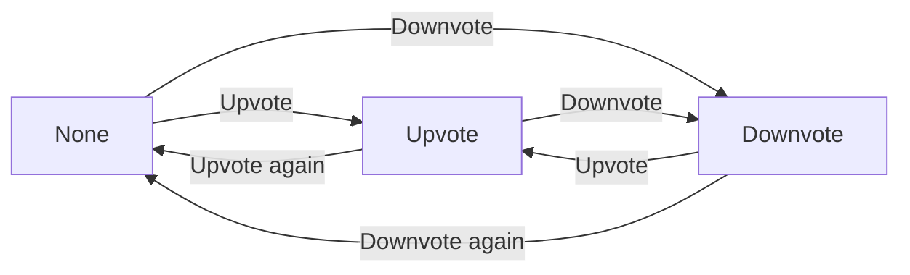
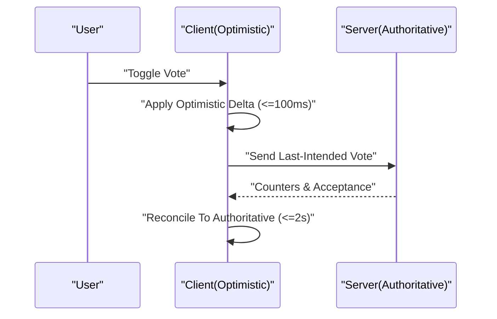
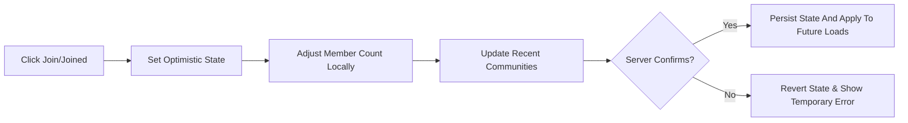
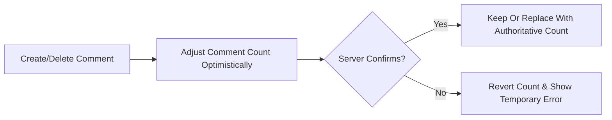
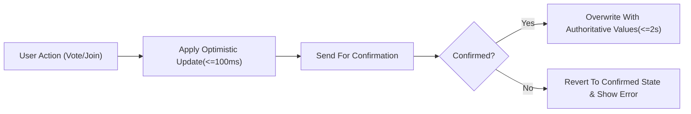

# Event Lifecycle and Optimistic UI Requirements (communityPlatform)

This requirement defines WHAT the platform must do for event-style interactions with optimistic feedback and authoritative reconciliation, focused on voting, joining/leaving communities, and comment-related counters. All statements use natural language in en-US with EARS keywords in English. No technical implementation details (e.g., APIs, schemas, stacks) are prescribed. Developers retain full autonomy over HOW to implement these behaviors.

## 1) Business Scope and Positioning
- Coverage includes: vote toggles on posts and comments; join/leave membership; derived counter updates (scores, comment counts, member counts); cross-surface propagation; reconciliation timing; failure handling; and acceptance criteria.
- Reading is open to all users. Guarded actions (post/comment/edit/delete/vote/join/leave/create community) require authentication.
- Optimistic UI is required for a responsive, predictable experience, with reconciliation to server-confirmed state immediately upon confirmation.

## 2) Definitions and Concepts
- Event: A user-triggered action that changes state (e.g., vote toggle, join/leave, create/delete comment).
- Optimistic update: Immediate local reflection of intended change before server confirmation.
- Reconciliation: Alignment of optimistic state to the authoritative server state after confirmation or refresh.
- Authoritative state: The server-confirmed state for counters and statuses; supersedes any optimistic estimate.
- Surfaces: Places where items appear (Home feed, Community Home, Post Detail, Global Search, Right Sidebar “Global Latest”, Left Sidebar “Recent Communities”, Explore listing).
- Counter: Displayed numeric value derived from data, such as score (upvotes − downvotes), comment count, or member count.
- Last-intended-state: The most recent user-intended state after a sequence of rapid toggles before confirmation arrives.

## 3) Roles and Preconditions
Roles (business-level):
- guestVisitor: Unauthenticated visitor; read-only access to public content and search results.
- communityMember: Authenticated user; can create/edit/delete own posts and comments, vote on others’ content, join/leave communities, and create communities.
- systemAdmin: Administrator for policy enforcement and emergency actions; does not assume authorship of others’ content.

Preconditions and Guards (EARS):
- WHEN a guestVisitor attempts a guarded action (vote/join/leave/create/edit/delete post or comment), THE system SHALL present “Please sign in to continue.” and SHALL suspend the action for resume after successful login.
- WHEN a communityMember triggers a guarded action covered by this requirement, THE system SHALL apply optimistic updates as defined herein and SHALL reconcile to the server-confirmed state upon response.
- IF a user attempts to vote on their own post or comment, THEN THE system SHALL present “You can’t vote on your own posts/comments.” and SHALL not change any counters or vote state.
- THE system SHALL enforce authorship such that edit/delete controls and actions are available only to the content author.

## 4) Global Principles for Optimistic Interactions
Ubiquitous rules (EARS):
- THE system SHALL apply optimistic updates within 100 ms of the user action under typical conditions.
- THE system SHALL treat server responses as authoritative and SHALL reconcile local optimistic states within 2 seconds of receiving a response.
- WHILE an action is pending, THE system SHALL prevent duplicate side effects; repeated toggles SHALL coalesce such that the last-intended-state is the one committed upon reconciliation.
- WHERE a temporary error occurs, THE system SHALL revert the affected optimistic change to the last confirmed server state and SHALL show “A temporary error occurred. Please try again in a moment.”
- WHEN session expiry is detected during an action, THE system SHALL prompt re-login and, upon success, SHALL resume and complete the original action using the last-intended-state.

## 5) Voting Lifecycle

### 5.1 State Machine and Transitions
A user maintains exactly one vote state per item (post or comment): None, Upvote, Downvote.

Permitted transitions (EARS):
- WHEN state is None and the user presses Upvote, THE system SHALL set state to Upvote.
- WHEN state is None and the user presses Downvote, THE system SHALL set state to Downvote.
- WHEN state is Upvote and the user presses Downvote, THE system SHALL set state to Downvote.
- WHEN state is Downvote and the user presses Upvote, THE system SHALL set state to Upvote.
- WHEN state is Upvote and the user presses Upvote again, THE system SHALL set state to None.
- WHEN state is Downvote and the user presses Downvote again, THE system SHALL set state to None.
- IF the user is the author of the item, THEN THE system SHALL deny voting and present “You can’t vote on your own posts/comments.”

Score deltas (EARS):
- WHEN None→Upvote, THE system SHALL adjust score by +1 immediately (optimistic) and reconcile with confirmed counts.
- WHEN None→Downvote, THE system SHALL adjust score by −1 immediately and reconcile with confirmed counts.
- WHEN Upvote→Downvote, THE system SHALL adjust score by −2 immediately and reconcile with confirmed counts.
- WHEN Downvote→Upvote, THE system SHALL adjust score by +2 immediately and reconcile with confirmed counts.
- WHEN Upvote→None, THE system SHALL adjust score by −1 immediately and reconcile with confirmed counts.
- WHEN Downvote→None, THE system SHALL adjust score by +1 immediately and reconcile with confirmed counts.

### 5.2 Rapid Toggles and Idempotency
- WHILE a vote action is pending, THE system SHALL accept further toggles, coalescing them so that only the last-intended-state is committed after confirmation.
- THE system SHALL ensure idempotency such that repeated submissions of the same end state do not create duplicate effects on scores or counters.

### 5.3 Cross-Surface Consistency
- WHEN a vote state changes, THE system SHALL update the visible vote indicator and score consistently across all concurrently visible surfaces for that item (e.g., Home card and Post Detail in the same session).
- WHEN server confirmation arrives, THE system SHALL replace optimistic counters with authoritative counters and SHALL keep the vote indicator reflecting the last-intended-state if accepted.

### 5.4 Voting Acceptance Criteria (EARS)
- WHEN a user toggles Upvote→Downvote, THE system SHALL change the score optimistically by −2 and reconcile with confirmed counts.
- WHEN multiple toggles are made within 2 seconds, THE system SHALL commit the last-intended-state after confirmation and disregard intermediate states.
- IF server confirmation fails, THEN THE system SHALL revert the score and vote state to the last confirmed state and present “A temporary error occurred. Please try again in a moment.”
- IF the user attempts to vote on their own content, THEN THE system SHALL present the self-vote message and SHALL not alter state.

### 5.5 Mermaid — Voting State Flow

### 5.6 Mermaid — Voting Optimistic and Reconciliation

## 6) Join/Leave Lifecycle

### 6.1 Membership Semantics
- Membership is a personal preference that affects the user’s Home feed inclusion of a community’s posts and the Recent Communities list.
- Joining does not grant moderation or administrative privileges.

### 6.2 Immediate Effects (EARS)
- WHEN a user selects Join, THE system SHALL optimistically set state to Joined, SHALL increase the visible member count by +1 for that user’s view, and SHALL add the community to the Recent Communities list immediately.
- WHEN a user selects Leave, THE system SHALL optimistically set state to Join, SHALL decrease the visible member count by −1 for that user’s view (not below zero), and SHALL update the Recent Communities list immediately.
- WHEN a join occurs, THE system SHALL include the community’s posts in the user’s Home feed composition for subsequent loads and refreshes.
- WHEN a leave occurs, THE system SHALL exclude the community’s posts from the user’s Home feed composition for subsequent loads and refreshes.

### 6.3 Current Page vs. Subsequent Loads (EARS)
- WHERE items from a just-joined community are not present in the current page, THE system SHALL apply inclusion beginning with the next pagination or refresh; the current page SHALL remain stable.
- WHERE items from a just-left community are present in the current page, THE system SHALL leave the current page unchanged but SHALL exclude those items from the next pagination or refresh.

### 6.4 Reconciliation and Failures (EARS)
- WHEN server confirmation accepts the join/leave, THE system SHALL keep the optimistic state and, if necessary, replace counters with authoritative values.
- IF server confirmation rejects the join/leave, THEN THE system SHALL revert the optimistic state and counters and SHALL present “A temporary error occurred. Please try again in a moment.”
- WHEN session expiry interrupts a join/leave, THE system SHALL prompt re-login and, upon success, SHALL resume the last-intended-state.

### 6.5 Cross-Surface Consistency (EARS)
- WHEN join state changes, THE system SHALL reflect the state consistently on the community page, Explore listings, Search results, and any other visible surface within the session.

### 6.6 Join/Leave Acceptance Criteria (EARS)
- WHEN a user joins a community, THE system SHALL add it to Recent Communities immediately and include its posts on the next Home feed load.
- WHEN a user leaves a community, THE system SHALL remove its posts from subsequent Home feed loads and SHALL update the Recent Communities ordering.
- IF join fails at confirmation, THEN THE system SHALL revert to Join and present the temporary error message.

### 6.7 Mermaid — Join/Leave Lifecycle

## 7) Comment Count and Score Updates

### 7.1 Comment Count (EARS)
- WHEN a user submits a new comment successfully, THE system SHALL optimistically increase the parent post’s comment count by +1 and later reconcile to the confirmed count.
- WHEN a user deletes their comment, THE system SHALL optimistically decrease the parent post’s comment count by −1 (not below zero) and later reconcile to the confirmed count.
- WHEN a user edits a comment, THE system SHALL not change the comment count.
- WHEN replies are created or deleted, THE system SHALL adjust the parent post’s overall comment count accordingly.

### 7.2 Comment Score (EARS)
- WHEN votes change on a comment, THE system SHALL adjust the comment’s score using the same voting state machine and deltas as posts and SHALL reconcile to authoritative counters upon confirmation.

### 7.3 Acceptance Criteria (EARS)
- WHEN a comment is created, THE system SHALL show the new comment and increase the displayed comment count immediately, then replace with authoritative count upon confirmation.
- WHEN a comment is deleted, THE system SHALL remove it from the list and decrease the post’s comment count immediately, then replace with authoritative count upon confirmation.

### 7.4 Mermaid — Comment Count Adjustment

## 8) Consistency Across Surfaces

### 8.1 Surfaces Enumerated
- Home feed (joined communities prioritized)
- Community Home (/c/[name])
- Post Detail (/c/[name]/[postID])
- Global Search (/s) across posts, communities, comments
- Right Sidebar “Global Latest” (10 most recent posts sitewide)
- Left Sidebar “Recent Communities” (up to 5 by most recent activity)
- Explore listing (/c)

### 8.2 Uniformity Principles (EARS)
- THE system SHALL maintain a session-consistent optimistic state across all visible surfaces for the same item or community.
- WHEN new posts qualify for Global Latest, THE system SHALL display the 10 newest sitewide by created time (with standard tie-breakers) without exceeding 10 items.
- WHEN an item or community is removed authoritatively, THE system SHALL remove it from all surfaces in the session.

### 8.3 Sorting and Pagination Interaction (EARS)
- WHERE Top sort is active, THE system SHALL apply ordering by score, then by more recent creation time, then by larger identifier on next refresh or load.
- WHERE Newest sort is active, THE system SHALL apply ordering by most recent creation time first with tie-break by larger identifier on next refresh or load.
- THE system SHALL avoid disruptive reordering of already-rendered lists solely due to optimistic deltas; reordering SHALL occur at refresh or subsequent loads based on authoritative state.

### 8.4 Acceptance Criteria (EARS)
- WHEN a vote changes a score, THE system SHALL defer list reordering until the next refresh or load by the active sort rules.
- WHEN a join/leave occurs, THE system SHALL affect Home feed composition starting with the next load and SHALL keep the current page stable.

## 9) Reconciliation Strategies and Error Handling

### 9.1 Authoritative Overwrite (EARS)
- THE system SHALL treat server-confirmed counters (upvotes, downvotes, comment counts, member counts) as authoritative and SHALL overwrite local estimates immediately upon receipt.

### 9.2 Last-Intended-State Wins (EARS)
- WHEN multiple toggles occur before confirmation, THE system SHALL apply the last-intended-state if accepted by the server and SHALL discard prior optimistic states.

### 9.3 Concurrent External Changes (EARS)
- IF other users’ actions change the counters concurrently, THEN THE system SHALL display the server-confirmed counters without attempting to preserve prior optimistic deltas.

### 9.4 Failures and Rollback (EARS)
- IF confirmation fails permanently (e.g., permission denied, ownership mismatch), THEN THE system SHALL revert the optimistic change fully and SHALL present the appropriate standard message (e.g., “You can edit or delete only items you authored.”).
- IF confirmation fails temporarily, THEN THE system SHALL revert affected optimistic portions and SHALL present “A temporary error occurred. Please try again in a moment.” while allowing retry.

### 9.5 Session Expiry Mid-Action (EARS)
- WHEN session expiry is detected mid-action, THE system SHALL prompt re-login gently and, upon success, SHALL reattempt the last-intended-state once.

### 9.6 Idempotency (EARS)
- THE system SHALL ensure repeated submissions of the same end state do not produce duplicate side effects on counters or membership.

### 9.7 Acceptance Criteria (EARS)
- WHEN confirmation returns authoritative counters, THE system SHALL replace optimistic values within 2 seconds of receipt.
- WHEN a failure occurs after an optimistic update, THE system SHALL revert the visible state to the last confirmed state and SHALL show the appropriate message.
- WHEN re-login succeeds mid-action, THE system SHALL complete the action using the last-intended-state without losing user input.

### 9.8 Mermaid — Optimistic Action With Reconciliation

## 10) Performance and User-Perceived Targets (Business-Level)
EARS requirements:
- THE system SHALL present visible acknowledgment of an optimistic change within 100 ms of the user action under typical conditions.
- THE system SHALL reconcile to authoritative values within 2 seconds of receiving a response under typical conditions.
- WHERE network latency is high, THE system SHALL maintain optimistic state until confirmation or failure is received.

## 11) Auditability and Business Logging Expectations
EARS requirements:
- THE system SHALL record business-level events for vote toggles, join/leave actions, and comment create/delete, including actor identity, target, and timestamp in a non-technical manner suitable for audit.
- WHEN administrative removals occur, THE system SHALL record the action and ensure removal from all surfaces.

## 12) Edge Scenarios and Special Cases
EARS requirements:
- IF a user attempts to interact with content deleted during the session, THEN THE system SHALL present “A temporary error occurred. Please try again in a moment.” and SHALL not recreate the deleted state.
- IF a community is deleted while a user is viewing it, THEN THE system SHALL remove its items from feeds and search and SHALL show not-available outcomes for navigations.
- IF join/leave status changes on the server while the user is offline, THEN THE system SHALL reconcile on next refresh and SHALL apply the last-intended-state for any local toggles made after reconnection if accepted.

## 13) Consolidated EARS Requirement Index
- THE system SHALL apply optimistic updates within 100 ms and SHALL reconcile authoritative counters within 2 seconds of response receipt.
- WHEN a guestVisitor attempts a guarded action, THE system SHALL show “Please sign in to continue.” and suspend the action for resume after login.
- IF a user attempts to vote on their own content, THEN THE system SHALL show “You can’t vote on your own posts/comments.” and SHALL not change state.
- WHEN None→Upvote/Downvote, THE system SHALL apply +1/−1 score respectively; WHEN toggling Upvote↔Downvote, THE system SHALL apply ±2; WHEN removing a vote, THE system SHALL apply −1/+1 respectively.
- WHILE an action is pending, THE system SHALL coalesce rapid toggles to last-intended-state and SHALL ensure idempotency.
- WHEN join/leave occurs, THE system SHALL update join state, member count (not below zero), Recent Communities, and Home feed composition for subsequent loads.
- WHERE current pages already display items, THE system SHALL avoid disruptive retroactive reordering or insertion; changes apply at next refresh or load.
- THE system SHALL propagate optimistic changes across visible surfaces and SHALL overwrite with authoritative values upon confirmation.
- IF confirmation fails temporarily, THEN THE system SHALL revert affected optimistic portions and show “A temporary error occurred. Please try again in a moment.”; permanent failures SHALL show the appropriate permission message.
- WHEN session expiry is detected, THE system SHALL prompt re-login and, upon success, SHALL complete the action using last-intended-state.
- WHEN a comment is created or deleted, THE system SHALL adjust the post’s comment count by +1/−1 immediately and reconcile after confirmation.
- THE system SHALL maintain deterministic ordering at refresh time per global sorting rules (Top: score, then newer created time, then larger identifier; Newest: newer created time, then larger identifier).

## 14) Glossary
- Authoritative counters: Server-confirmed values for counts and scores.
- Last-intended-state: The final state the user intended after rapid toggles before confirmation.
- Optimistic update: Immediate local change presented before confirmation.
- Reconciliation: Process of aligning local optimistic change with authoritative server state.
- Surfaces: Distinct places where items are displayed (Home, Community Home, Post Detail, Global Search, Global Latest, Recent Communities, Explore).

## 15) Traceability to PRD
- Voting rules and score arithmetic match PRD Section 3.4 and composition in 3.2/3.3.
- Sorting and pagination references adhere to PRD Section 3.5 and related screens for Home, Community, Search, and Global Latest.
- Guest guard, author guard, and session resumption align with PRD Sections 5 and I (Login & Sign Up).
- Recent Communities behavior and join/leave effects align with PRD Sections 3.1.a and 4.1/4.3.
- Standard messages (“Please sign in to continue.”, “You can’t vote on your own posts/comments.”, “A temporary error occurred. Please try again in a moment.”) align with PRD Sections 7 and Error Handling.

This requirement defines business behaviors only. All technical implementation decisions (architecture, APIs, database design, and infrastructure) are entirely at the discretion of the development team.