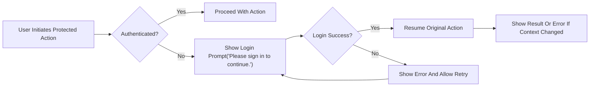
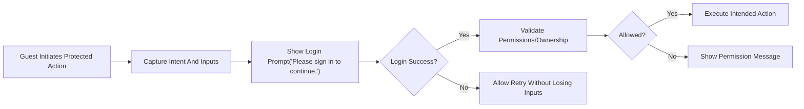
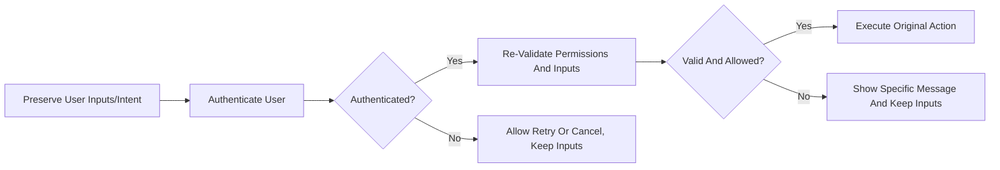
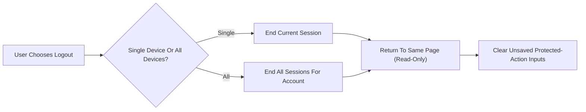

# communityPlatform — Session and Authentication Experience Requirements (Business-Level)

## 1. Scope and Intent
Define session longevity, expiry handling, guest guard prompting, resume-after-login behavior, and profile/logout journeys across the platform. Specify WHAT must happen in user-facing terms, not HOW to implement it. Maintain consistency with ownership and permission rules, deterministic sorting/pagination, and standardized copy strings. Use EARS (WHEN/WHILE/IF/THEN/WHERE/THE/SHALL) for testability. Keep content in en-US.

Business-only scope: no token formats, protocols, infrastructure, API contracts, or data schemas. Behavior applies across Home, Community Home, Post Detail, Global/Community Composers, Explore, and Search.

## 2. Glossary, Roles, and Assumptions
- Roles
  - guestVisitor: Unauthenticated; read-only across public content and search.
  - registeredMember: Authenticated; can create sub-communities, post, comment, vote, join/leave; can edit/delete only authored content; can edit/delete communities they created (name immutable).
  - siteAdmin: Administrator; may act for policy/legal compliance and override where necessary.
- Terms
  - Active Session: A session considered valid for authenticated actions.
  - Idle Timeout: Maximum inactivity before re-login is required.
  - Absolute Lifetime: Maximum elapsed time from login before re-login is required regardless of activity.
  - Guest Guard: Prompt shown to unauthenticated users attempting protected actions; resumes action after login.
  - Resume-after-login: Continuation of the exact interrupted action with inputs/intent preserved after successful authentication.

Assumptions:
- Reading is open to everyone; posting, commenting, voting, creating sub-communities, and joining/leaving require login.
- Validation is minimal to preserve smooth flows, while enforcing essential constraints and ownership.

## 3. Core Principles (EARS)
- THE experience SHALL be smooth, minimally interruptive, and favor long-lived sessions.
- THE experience SHALL enforce ownership and role-based permissions without exposing technical mechanisms to end users.
- THE experience SHALL preserve user inputs across re-login prompts wherever feasible.
- THE experience SHALL remain consistent across Home, Community, Post Detail, Composers, Explore, and Search.
- WHEN session expiry is detected mid-action, THE platform SHALL prompt a gentle re-login and resume the action upon success.
- WHEN a guestVisitor attempts a protected action, THE platform SHALL prompt login and, upon success, SHALL complete the intended action using preserved inputs and intent.

## 4. Session Longevity Expectations
### 4.1 Targets and Renewal (EARS)
- THE session management SHALL provide an idle timeout of at least 30 days of inactivity before requiring re-login.
- THE session management SHALL provide an absolute lifetime of at most 90 days from login after which re-login is required.
- WHEN a registeredMember performs an authenticated action, THE session management SHALL renew the idle timeout countdown.
- WHERE a user is a guestVisitor, THE platform SHALL allow read-only access without creating an authenticated session.
- WHERE a user selects “log out of all devices,” THE platform SHALL end all active sessions associated with that account.

### 4.2 Cross-Device and Cross-Context (EARS)
- THE session management SHALL treat sessions per device/browser context; logging in on one device SHALL NOT forcibly terminate others unless “log out of all devices” is requested.
- WHEN multiple tabs or windows share the same authenticated state, THE platform SHALL recognize re-login in any tab and consider others authenticated on their next interaction without destructive refresh.
- WHEN a device time shift or timezone change occurs, THE platform SHALL continue to honor session validity based on server-side evaluation while maintaining user-local relative time displays.

### 4.3 User Expectations (EARS)
- THE experience SHALL feel “stay signed in” by default on the same device/browser.
- IF a session is invalid or expired, THEN THE platform SHALL prompt a gentle re-login without losing the current screen or scroll position.

## 5. Session Expiry Handling
### 5.1 Triggers
- Protected actions initiated while unauthenticated or after expiry.
- Idle timeout or absolute lifetime exceeded.
- Explicit sign-out from current device or “all devices” action.

### 5.2 Behavioral Rules (EARS)
- WHEN a protected action is initiated and the user is unauthenticated, THE platform SHALL show a login prompt with “Please sign in to continue.”
- WHEN a session has expired at the moment of a new request, THE platform SHALL show a login prompt and preserve in-progress context.
- WHILE the login prompt is visible, THE platform SHALL block only the protected action; read-only browsing of the background content SHALL continue.
- IF login succeeds, THEN THE platform SHALL resume the original action from preserved context.
- IF login fails, THEN THE platform SHALL show “Login failed. Please try again.” and allow retry without losing preserved context.
- IF a temporary error occurs during login, THEN THE platform SHALL show “A temporary error occurred. Please try again in a moment.” and allow retry without losing preserved context.
- WHEN an expired session is detected on page load, THE platform SHALL defer any automatic write operations and await explicit user intent before prompting login.

### 5.3 Edge Cases (EARS)
- WHEN multiple tabs are open and one prompts re-login, THE platform SHALL accept re-login from any tab and consider others authenticated at next interaction.
- IF underlying content becomes unavailable during re-login (e.g., post deleted), THEN THE platform SHALL show a non-blocking notice and abort resuming that specific action.
- IF the user’s role changes during re-login, THEN THE platform SHALL apply the new permissions and present the appropriate standardized message where relevant.

### 5.4 Session Expiry Handling Flow

## 6. Guest Guard and Login Prompt Rules
### 6.1 Actions Requiring Login (Business)
- Create post, create comment, vote on posts/comments, create sub-community, join/leave community, edit/delete authored items.

### 6.2 Guard Rules (EARS)
- WHEN a guestVisitor attempts any protected action, THE platform SHALL present “Please sign in to continue.” and SHALL preserve inputs/intent for resumption.
- WHEN login succeeds, THE platform SHALL resume the exact action with preserved inputs (composer fields, vote state, join intent, edit changes).
- WHEN login fails, THE platform SHALL display “Login failed. Please try again.” and keep the action recoverable.

### 6.3 Guest Guard Flow

## 7. Resume Original Action After Login
### 7.1 Preservation of Context and Inputs (EARS)
- THE platform SHALL preserve composer inputs: Community, Title, Body, Author Display Name.
- THE platform SHALL preserve target identifiers: Post ID, Comment ID, Community name; and operation intent: vote state, join/leave, edit/delete.
- THE platform SHALL preserve scroll position and local view state where feasible.

### 7.2 Idempotency and Duplicate Prevention (EARS)
- WHEN resuming a post submission, THE platform SHALL ensure at most one created post per confirmed user action (no duplicates under retries).
- WHEN resuming a comment submission, THE platform SHALL ensure at most one created comment per confirmed user action.
- WHEN resuming a vote, THE platform SHALL apply exactly one resulting vote state according to voting rules.
- WHEN resuming a join/leave, THE platform SHALL apply the latest intended membership state and update Recent Communities and the home feed accordingly.

### 7.3 Failure and Validation Handling (EARS)
- IF the preserved target community is unavailable, THEN THE platform SHALL show a contextual temporary error and allow the user to select another community.
- IF a self-vote is attempted after login, THEN THE platform SHALL show “You can’t vote on your own posts/comments.” and keep vote state as None.
- IF authorship checks fail for edit/delete after login, THEN THE platform SHALL show “You can edit or delete only items you authored.” and SHALL not perform the action.
- IF inputs violate constraints (title/body/comment/display name ranges), THEN THE platform SHALL show the specific validation message and keep inputs intact for correction.

### 7.4 Resume Flow

### 7.5 Resume Matrix (Business)
| Action | Preserved Inputs/Intent | Success Outcome | Denial/Validation Outcome |
|---|---|---|---|
| Create Post | Community, Title, Body, Display Name | Post created; redirect or remain per flow | Show field validation or temporary error; inputs retained |
| Comment | Post ID, Parent, Text | Comment created and visible | Show validation or temporary error; text retained |
| Vote | Target ID, Intended State | Vote applied with optimistic update | Self-vote or temporary error; revert to None; message shown |
| Join/Leave | Community ID, Intended State | State applied; Recent Communities updated | Temporary error; revert to prior state |
| Edit/Delete | Target ID, Proposed Edits | Edits saved / item deleted | Not author or validation error; show permission/validation copy |

## 8. Profile and Logout Behaviors
### 8.1 Profile Menu Expectations (Business)
- THE platform SHALL provide a profile area for initiating logout and viewing account options reflecting current authentication state.

### 8.2 Logout Behavior (EARS)
- WHEN “Log out” is selected, THE platform SHALL end the current device session and return to the same page in read-only state.
- WHEN “Log out of all devices” is selected, THE platform SHALL end all active sessions for the account and return to the current page in read-only state.
- WHEN logout completes, THE platform SHALL clear unsaved inputs tied to protected actions unless explicitly saved by the user.

### 8.3 Post-Logout State (EARS)
- WHEN logged out, THE platform SHALL allow browsing and searching publicly visible content without errors.
- WHEN logged out, THE platform SHALL apply Guest Guard for any protected action attempted thereafter.

### 8.4 Logout Flow

## 9. Error Messaging and Standard Copy
Use standardized copy from the centralized guide for consistency.
- Authentication prompts: “Please sign in to continue.”; failure: “Login failed. Please try again.”; expiry: “Your session has expired. Please sign in again to continue.”
- Permission/ownership: “You can edit or delete only items you authored.”; self-vote: “You can’t vote on your own posts/comments.”
- Temporary errors: “A temporary error occurred. Please try again in a moment.”
- Offline (optional): “You appear to be offline. Please check your connection and try again.”

EARS:
- WHEN a restricted action is attempted while unauthenticated, THE platform SHALL present “Please sign in to continue.” and SHALL resume the action upon successful login.
- WHEN a session expires during an action, THE platform SHALL present “Your session has expired. Please sign in again to continue.” and SHALL resume the action upon successful login.
- WHEN permission checks fail, THE platform SHALL present “You can edit or delete only items you authored.” and SHALL not perform the action.
- WHEN a self-vote is attempted, THE platform SHALL present “You can’t vote on your own posts/comments.” and keep state as None.
- IF a recoverable error occurs, THEN THE platform SHALL present “A temporary error occurred. Please try again in a moment.” and allow retry without data loss.

## 10. Performance and UX Timing Requirements (Business-Level)
- WHEN a protected action triggers authentication, THE platform SHALL show the login prompt within 300 ms under typical conditions.
- WHEN login succeeds, THE platform SHALL resume the original action within 2 seconds (p95) for standard operations.
- WHEN optimistic UI applies (vote/join), THE platform SHALL reflect intent immediately and reconcile within 3 seconds under normal conditions.
- WHEN the network is slow or unavailable, THE platform SHALL keep preserved context, allow retries, and avoid duplicate submissions.

## 11. Security and Privacy (Business-Level)
- THE platform SHALL avoid exposing sensitive authentication details to end users.
- THE platform SHALL allow users to end sessions (single device or all devices) at will.
- THE platform SHALL minimize personal data processed for authentication and preserve only what is necessary for business operation and compliance.
- WHERE suspicious activity is detected (e.g., repeated login failures), THE platform SHALL throttle or prompt additional verification within business policy (without specifying mechanisms) and preserve user context.

## 12. Observability and Audit (Business-Level)
- THE platform SHALL record business-significant events with timestamps and minimal identifiers: login success/failure, logout, session expiry, resume-after-login completions.
- THE platform SHALL retain operational logs up to 30 days and sensitive audit events up to 180 days under business policy (values may be adjusted by policy) while restricting access to authorized personnel.
- THE platform SHALL log administrator interventions related to authentication/session management and SHALL audit access to audit records.

## 13. Success Metrics and Acceptance Criteria
### 13.1 KPIs (Targets)
- Session Longevity: ≥95% of active users remain signed in across a 30-day period without unexpected prompts (excludes voluntary logout and absolute lifetime).
- Resume-After-Login Success: ≥98% of re-authenticated protected actions complete without re-entry of user inputs (excluding validation failures).
- Prompt Responsiveness: 95th percentile login prompt display latency ≤500 ms after a protected action.
- Resume Latency: 95th percentile completion ≤2 seconds for standard actions.
- Input Preservation Failures: <1% of resume flows result in lost inputs under transient failures.

### 13.2 Acceptance Criteria (EARS)
Authentication and Prompts
- WHEN an unauthenticated user clicks Join, THE platform SHALL show “Please sign in to continue.” and, upon success, SHALL join the community and update Recent Communities.
- WHEN a session expires during post submission, THE platform SHALL prompt re-login and, upon success, SHALL submit the post with previously entered content.
- WHILE a session is valid, THE platform SHALL not show re-login prompts.

Ownership and Permissions
- WHEN a non-author attempts to delete a post, THE platform SHALL deny and show “You can edit or delete only items you authored.”

Resume Accuracy
- WHEN login succeeds after a vote attempt, THE platform SHALL apply the intended vote exactly once and reflect updated score.
- WHEN login succeeds after a comment attempt, THE platform SHALL create exactly one comment and retain scroll position.

Error Handling
- IF a temporary error occurs during re-login, THEN THE platform SHALL show “A temporary error occurred. Please try again in a moment.” and keep inputs intact.
- IF the target content is removed during re-login, THEN THE platform SHALL stop resuming and show “This content is no longer available.”

Cross-Context
- WHEN login is completed in one tab, THE platform SHALL consider other tabs authenticated upon their next interaction without losing local inputs.

## 14. Appendices
### 14.1 Action-to-Guard Mapping
| Action | Requires Login | Preserved Context For Resume |
|-------|-----------------|-------------------------------|
| Create Post | Yes | Community, Title, Body, Author Display Name |
| Comment | Yes | Post ID, Reply Target, Comment Text |
| Vote (Post/Comment) | Yes | Target ID, Intended Vote State |
| Join/Leave Community | Yes | Community ID, Intended Join State |
| Edit/Delete Own Post | Yes | Post ID, Proposed Edits |
| Edit/Delete Own Comment | Yes | Comment ID, Proposed Edits |
| Create Sub-Community | Yes | Name, Description, Logo/Banner, Rules, Category |

### 14.2 Consolidated EARS Summary
- THE platform SHALL provide long-lived sessions with idle timeout 30 days and absolute lifetime 90 days.
- WHEN a session expires during a protected action, THE platform SHALL prompt login, preserve context, and resume upon success.
- WHEN a guestVisitor attempts a protected action, THE platform SHALL present “Please sign in to continue.” and resume after login.
- WHEN logout occurs, THE platform SHALL end the appropriate sessions and return to the same page in read-only state, clearing unsaved inputs.
- THE platform SHALL record business-significant auth/session events with restricted access to logs.

### 14.3 Related Documents
- Roles and permissions: 03-user-roles-and-permissions.md
- Core flows: 05-functional-requirements-core-flows.md
- Standard copy and formats: 13-error-handling-and-standard-copy.md
- Performance and reliability: 14-nonfunctional-requirements.md

## 15. Mermaid Diagrams Index
- Session Expiry Handling Flow (Section 5.4)
- Guest Guard Flow (Section 6.3)
- Resume Flow (Section 7.4)
- Logout Flow (Section 8.4)

All diagrams use double quotes for labels, proper arrow syntax, and valid Mermaid graph syntax.
