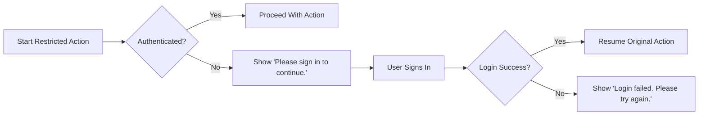
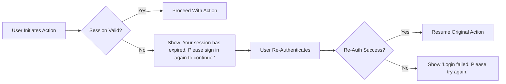
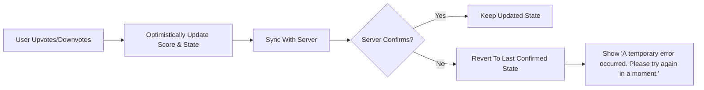

# Error Handling and Standard Copy Requirements (communityPlatform)

## 1) Title and Scope
Standardized user-facing messages, relative time formatting, number abbreviation behavior, and business-level error handling for the communityPlatform. Content is in en-US, defines WHAT users see and experience, and excludes any technical implementation details (APIs, schemas, storage, infrastructure).

## 2) Terminology and Conventions
- Standard copy: exact English (en-US) strings presented to users.
- Temporary error: recoverable condition (e.g., brief network or backend issue) expected to succeed on retry.
- Permission error: either authentication required (guest) or authorization denied (insufficient rights/ownership).
- Relative time: human-friendly time in the user’s local timezone.
- Number abbreviations: compact k/m/B representation for thousands, millions, billions.
- EARS: requirements expressed with WHEN/WHILE/IF/WHERE/THE/SHALL to be testable.

EARS baseline:
- THE platform SHALL use standardized en-US copy across all relevant scenarios.
- THE platform SHALL avoid jargon and present concise, neutral, and helpful language.
- THE platform SHALL refrain from prescribing technical implementation details.

## 3) Standard Messages and Copy Catalogue (Canonical Strings)
All strings must be used verbatim. Include punctuation and capitalization exactly as shown.

### 3.1 Authentication and Session
- Login required: "Please sign in to continue."
- Login failure (generic): "Login failed. Please try again."
- Session expired: "Your session has expired. Please sign in again to continue."
- Sign-out success (optional informational): "You have been signed out."

EARS:
- WHEN an unauthenticated user attempts a restricted action (post, comment, vote, create community, join/leave), THE system SHALL present "Please sign in to continue." and SHALL pause the action until sign-in completes.
- WHEN login credentials are rejected, THE system SHALL present "Login failed. Please try again." and SHALL allow immediate retry.
- WHEN a session expires during an action, THE system SHALL present "Your session has expired. Please sign in again to continue." and SHALL resume the original action after successful re-authentication.
- WHEN a user signs out, THE system MAY present "You have been signed out." without blocking navigation of public content.

### 3.2 Authorization and Ownership
- No permission (author guard): "You can edit or delete only items you authored."
- Self-vote: "You can’t vote on your own posts/comments."

EARS:
- WHEN a user attempts to edit or delete content not authored by them, THE system SHALL present "You can edit or delete only items you authored." and SHALL not apply the attempted change.
- WHEN a user attempts to vote on their own content, THE system SHALL present "You can’t vote on your own posts/comments." and SHALL retain vote state as None.

### 3.3 Community Creation and Management
- Community name taken: "This name is already in use."
- Invalid community name format: "This name isn’t available. Please choose something simpler."
- Destructive confirmation (community delete): "Delete this community? This action cannot be undone."

EARS:
- WHEN a community name collides with an existing one, THE system SHALL present "This name is already in use." and SHALL block creation.
- WHEN a community name fails format rules, THE system SHALL present "This name isn’t available. Please choose something simpler." and SHALL block creation.
- WHEN a community owner initiates deletion, THE system SHALL present "Delete this community? This action cannot be undone." and SHALL proceed only upon explicit confirmation.

### 3.4 Posts and Comments
Validation and availability:
- No community selected (post composer): "Please choose a community to post in."
- Title length invalid: "Title must be between 5 and 120 characters."
- Body length invalid: "Body must be between 10 and 10,000 characters."
- Comment length invalid: "Comment must be between 2 and 2,000 characters."
- Display name invalid: "Display name must be 0 to 32 characters."
- Content unavailable: "This content is no longer available."
- Destructive confirmation (post delete): "Delete this post? This action cannot be undone."
- Destructive confirmation (comment delete): "Delete this comment? This action cannot be undone."

EARS:
- WHEN a post submission lacks a target community, THE system SHALL present "Please choose a community to post in." and SHALL block submission.
- WHEN post title/body/display name violate constraints, THE system SHALL present the corresponding message and SHALL block submission until corrected.
- WHEN a comment violates length constraints, THE system SHALL present "Comment must be between 2 and 2,000 characters." and SHALL block submission.
- WHEN content has been deleted or is inaccessible, THE system SHALL present "This content is no longer available." and SHALL prevent further interactions on it.
- WHEN a user initiates deletion of their post/comment, THE system SHALL present the respective destructive confirmation message and SHALL proceed only if the user confirms.

### 3.5 Voting
- Self-vote: "You can’t vote on your own posts/comments."
- Temporary error (vote-specific or generic): "A temporary error occurred. Please try again in a moment."

EARS:
- WHEN a recoverable error occurs during voting, THE system SHALL present "A temporary error occurred. Please try again in a moment." and SHALL keep the action retryable while reconciling optimistic state.

### 3.6 Search and Empty States
- Query too short: "Please enter at least 2 characters."
- No results: "No matching results. Try different keywords."

EARS:
- WHEN a search query is under 2 characters after normalization, THE system SHALL present "Please enter at least 2 characters." and SHALL not execute the search.
- WHEN a search yields zero results, THE system SHALL present "No matching results. Try different keywords."

### 3.7 Network, Temporary Errors, and Rate Limits
- Temporary error (generic): "A temporary error occurred. Please try again in a moment."
- Offline detected: "You appear to be offline. Please check your connection and try again."
- Rate limit reached: "You’re doing that too fast. Please wait a moment and try again."

EARS:
- WHEN a transient backend failure is detected, THE system SHALL present "A temporary error occurred. Please try again in a moment." and SHALL allow a retry.
- IF the device is offline, THEN THE system SHALL present "You appear to be offline. Please check your connection and try again." and SHALL allow retry once connectivity returns.
- WHEN an action exceeds rate limits, THE system SHALL present "You’re doing that too fast. Please wait a moment and try again." and SHALL block the action until limits reset.

## 4) Relative Time Display Rules
Business-standard formatting for all timestamps shown to users.

### 4.1 Units and Thresholds
- Under 60 seconds: "just now"
- 1 minute to < 60 minutes: "X minute(s) ago"
- 60 minutes to < 24 hours: "X hour(s) ago"
- 24 hours to < 7 days: "X day(s) ago"
- ≥ 7 days: absolute date in en-US, "MMM D, YYYY" (e.g., "Sep 30, 2025")

Rounding:
- Minutes: floor to whole minutes
- Hours: floor to whole hours
- Days: floor to whole days
- Singular/plural: use singular for 1, plural otherwise

EARS:
- THE platform SHALL compute relative time in the user’s local timezone.
- WHEN elapsed time < 60 seconds, THE platform SHALL display "just now".
- WHEN 60 seconds ≤ elapsed < 60 minutes, THE platform SHALL display "X minute(s) ago" with floor rounding and correct singular/plural.
- WHEN 60 minutes ≤ elapsed < 24 hours, THE platform SHALL display "X hour(s) ago" with floor rounding and correct singular/plural.
- WHEN 24 hours ≤ elapsed < 7 days, THE platform SHALL display "X day(s) ago" with floor rounding and correct singular/plural.
- WHEN elapsed ≥ 7 days, THE platform SHALL display an absolute date formatted as "MMM D, YYYY" in en-US.

### 4.2 Timezone and Edge Cases
EARS:
- THE platform SHALL base relative expressions on user-local time; if timezone is unavailable, THE platform SHALL use device/browser timezone.
- IF a timestamp is up to 60 seconds in the future (clock skew), THEN THE platform SHALL display "just now"; IF beyond 60 seconds, THEN THE platform SHALL display the absolute date.

## 5) Number Abbreviation Rules
### 5.1 Thresholds and Suffixes
- < 1,000: show full number (e.g., 999 → "999")
- 1,000 to < 1,000,000: thousands with "k" (e.g., 1,234 → "1.2k")
- 1,000,000 to < 1,000,000,000: millions with "m" (e.g., 1,234,567 → "1.2m")
- ≥ 1,000,000,000: billions with "B" (e.g., 1,234,000,000 → "1.2B")

### 5.2 Rounding and Formatting
- One decimal place, half-up rounding; strip trailing ".0" (e.g., 1,000 → "1k", 12,340 → "12.3k")
- Retain sign for negatives (e.g., −1,234 → "-1.2k")
- Zero as "0"
- No thousands separators within abbreviated forms; no spaces (e.g., "1.2k", not "1.2 k")

EARS:
- THE platform SHALL abbreviate numbers per thresholds and suffixes and SHALL use half-up rounding to one decimal, stripping trailing ".0".
- WHERE a value is negative, THE platform SHALL retain the negative sign.

## 6) Temporary Error Handling, Retries, and Optimistic Reconciliation
### 6.1 Error Classes (Business-Level)
- Recoverable: network timeouts, transient backend errors, brief rate limits.
- Non-recoverable: validation violations, permission/ownership denials, immutable name conflicts.

EARS:
- WHEN a recoverable error occurs, THE system SHALL present "A temporary error occurred. Please try again in a moment." and SHALL allow retry.
- WHEN a non-recoverable violation occurs, THE system SHALL present the specific message from the copy catalogue and SHALL not apply the action.

### 6.2 Retry Strategy and Idempotency
EARS:
- WHERE the action is idempotent (e.g., loading lists), THE system MAY auto-retry with short backoff and SHALL avoid flooding.
- WHERE the action is user-submission (post/comment), THE system SHALL avoid duplicate submissions and SHALL present the appropriate message for user-controlled retry.

### 6.3 Optimistic UI Reconciliation
EARS:
- WHEN an optimistic vote or join/leave fails server confirmation, THE system SHALL revert to the last confirmed state and SHALL present "A temporary error occurred. Please try again in a moment." or a more specific message if applicable.

## 7) Permission Error Messaging (Trigger-to-Copy Rules)
EARS:
- WHEN authentication is required, THE system SHALL present "Please sign in to continue."
- WHEN authorship or rights checks fail, THE system SHALL present "You can edit or delete only items you authored."
- WHEN a self-vote is attempted, THE system SHALL present "You can’t vote on your own posts/comments."

## 8) Acceptance Criteria and Test Scenarios (Copy-Centric)
Authentication and session:
- WHEN an unauthenticated user clicks Vote, THEN the UI SHALL show "Please sign in to continue." within 300 ms, and AFTER successful login, the system SHALL resume the vote action.
- WHEN a session expires mid-comment, THEN the UI SHALL show "Your session has expired. Please sign in again to continue." and AFTER login, the comment text SHALL be preserved and submitted once.

Ownership and authorization:
- WHEN a non-author attempts to delete a post, THEN the UI SHALL show "You can edit or delete only items you authored." and SHALL not delete.
- WHEN a user votes on their own comment, THEN the UI SHALL show "You can’t vote on your own posts/comments." and the state SHALL remain None.

Validation and posting:
- WHEN a post is submitted without a selected community, THEN the UI SHALL show "Please choose a community to post in." and block submission.
- WHEN a title is 4 characters, THEN the UI SHALL show "Title must be between 5 and 120 characters." and block submission.
- WHEN a comment is 2,001 characters, THEN the UI SHALL show "Comment must be between 2 and 2,000 characters." and block submission.

Search:
- WHEN a normalized query is 1 character, THEN the UI SHALL show "Please enter at least 2 characters." and SHALL not run a search.
- WHEN a search returns zero results, THEN the UI SHALL show "No matching results. Try different keywords."

Temporary errors and offline:
- WHEN a transient failure occurs during voting, THEN the UI SHALL show "A temporary error occurred. Please try again in a moment." and SHALL allow retry.
- WHEN the device goes offline, THEN the UI SHALL show "You appear to be offline. Please check your connection and try again." and SHALL allow retry upon return.

Destructive confirmations:
- WHEN the owner initiates community deletion, THEN the UI SHALL show "Delete this community? This action cannot be undone." and SHALL proceed only upon explicit confirmation.
- WHEN a user deletes their post, THEN the UI SHALL show "Delete this post? This action cannot be undone." and SHALL proceed only upon explicit confirmation.

Number/time formatting:
- GIVEN a count of 12,340, WHEN displayed abbreviated, THEN the UI SHALL render "12.3k".
- GIVEN an event 90 seconds ago, WHEN displayed relative, THEN the UI SHALL render "1 minute ago" (floor rounding).

## 9) Process Diagrams (Mermaid)
Guest guard and resume after login:

Session expiry mid-action:

Optimistic vote reconciliation:

## 10) Non-Functional Expectations for Copy Behavior
EARS:
- THE platform SHALL present standard messages within 200 ms of the triggering condition under typical conditions.
- THE platform SHALL compute relative time and abbreviations for 20-item pages within 50 ms overall and SHALL not noticeably delay rendering.
- THE platform SHALL ensure copying/pasting of standard messages is exact, with no unintended variations.

## 11) Accessibility, Tone, and Localization Guidance
EARS:
- THE platform SHALL keep copy concise and readable at a general-audience level.
- THE platform SHALL use en-US as the canonical source strings; WHERE localization is added, THE platform SHALL maintain semantic equivalence to en-US and SHALL not alter business meaning.
- THE platform SHALL avoid idioms, sarcasm, or culturally specific references that hinder translation.

## 12) Glossary
- Authentication: verifying the identity of a user via sign-in.
- Authorization: determining whether a user has rights to perform an action.
- Guest Guard: rule preventing unauthenticated users from restricted actions, prompting sign-in.
- Author Guard: rule preventing users from modifying content they do not own.
- Relative Time: user-friendly timestamps relative to now, like "2 hours ago".
- Number Abbreviation: compact rendering for large numbers (e.g., "12.3k").

## 13) Related Documents
- Roles and permissions: User Roles and Permissions — 03-user-roles-and-permissions.md
- Core flows and guards: Functional Requirements — 05-functional-requirements-core-flows.md
- Sorting and pagination: Sorting and Pagination Rules — 10-sorting-and-pagination-rules.md
- Session experience: Session and Authentication Experience — 12-session-and-auth-experience.md
- Non-functional expectations: Non-Functional Requirements — 14-nonfunctional-requirements.md

