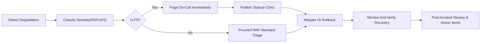
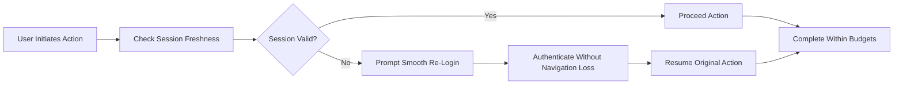
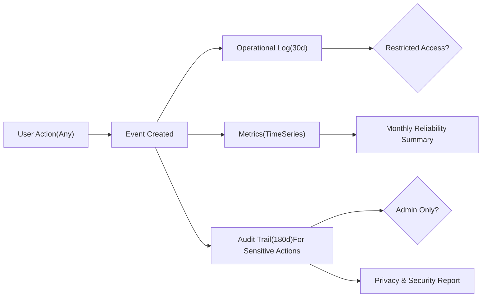

# Non-Functional Requirements (NFR) — Community Platform (communityPlatform)

## Purpose and Scope
Business-facing, measurable expectations govern performance, reliability, scalability, security/privacy, accessibility, internationalization, observability, and operational readiness for communityPlatform. Requirements are expressed in EARS style and remain strictly business-level, avoiding API designs, storage schemas, or technology stacks. All times and copy are en-US.

## Global EARS Commitments
- THE platform SHALL provide open reading access to public content for all roles while enforcing authentication for protected actions.
- THE platform SHALL deliver predictable responsiveness with explicit time budgets and deterministic behaviors for sorting, pagination, and counters.
- THE platform SHALL maintain long-lived sessions and, upon expiry during actions, SHALL prompt smooth re-login and resume the interrupted action.
- THE platform SHALL prefer optimistic UI for actions (vote, join/leave, compose) with timely reconciliation to authoritative state.
- THE platform SHALL prioritize availability and reliable reads under both normal load and peak spikes, with graceful degradation for non-essential work.
- THE platform SHALL protect user data using industry-accepted practices and minimize data collected for core operations.
- THE platform SHALL provide accessible, localized experiences with relative time in the user’s local timezone and standardized number abbreviations.
- THE platform SHALL log business-significant events and maintain auditable trails for sensitive actions under appropriate access controls.

## Roles and Scope Assumptions
- guestVisitor: read-only access to public content and search.
- registeredMember: create communities, post, comment, vote, and join/leave; edit/delete only authored items; edit/delete communities they created.
- siteAdmin: platform-wide administrative powers for policy/legal compliance and safety.

## Performance Expectations

### Perceived Responsiveness Budgets (Normal Load)
- WHEN Home feed (joined communities) is requested, THE platform SHALL present the first 20 post cards within 1.5 seconds (p95) and 2.5 seconds (p99).
- WHEN Community feed is requested, THE platform SHALL present the first 20 post cards within 1.5 seconds (p95) and 2.5 seconds (p99).
- WHEN Post Detail is opened, THE platform SHALL present post content within 1.0 second (p95) and initial 20 comments within 1.8 seconds (p95), with progressive rendering allowed.
- WHEN Load more is activated for posts, THE platform SHALL append the next 20 items within 1.2 seconds (p95) and 2.0 seconds (p99).
- WHEN Load more is activated for comments, THE platform SHALL append the next 20 comments within 1.5 seconds (p95) and 2.5 seconds (p99).
- WHEN a vote is toggled, THE platform SHALL reflect optimistic state within 100 ms perceived time and confirm reconciliation within 1.0 second (p95).
- WHEN a join/leave action is toggled, THE platform SHALL reflect optimistic state immediately and reconcile feed inclusion/exclusion and Recent Communities within 2.0 seconds (p95).
- WHEN a post is submitted (text-only), THE platform SHALL accept and confirm within 2.0 seconds (p95) and make it visible in feeds by applicable sorting within 5.0 seconds.
- WHEN a comment is submitted, THE platform SHALL accept and display it in-thread within 1.5 seconds (p95).
- WHEN a search query (≥ 2 characters) is executed, THE platform SHALL return first-page results within 1.8 seconds (p95) and 3.0 seconds (p99).

### First Feedback and Progress Indication
- WHEN an operation cannot complete within 300 ms, THE platform SHALL present a visible progress indicator without blocking scrolling or navigation where feasible.
- WHILE a long-running operation is in progress, THE platform SHALL maintain interactability for read-only content and SHALL not freeze the screen.

### Freshness and Eventual Consistency
- THE Global Latest module on Home SHALL reflect the 10 newest posts with freshness ≤ 10 seconds under normal load.
- THE platform SHALL reconcile optimistic counters (score, comment count, member count) to authoritative state within 3 seconds (p95) under normal load.
- IF consistency cannot be achieved due to temporary errors, THEN THE platform SHALL revert optimistic changes and present “A temporary error occurred. Please try again in a moment.”

### Deterministic Sorting and Pagination Integrity
- WHERE lists are sorted by Newest, THE platform SHALL enforce ordering by (creation time desc, identifier desc).
- WHERE lists are sorted by Top, THE platform SHALL enforce ordering by (score desc, creation time desc, identifier desc).
- WHEN paginating main feeds or search results, THE platform SHALL return exactly 20 items per page and SHALL avoid duplicates or omissions across Load more actions.

## Reliability and Availability

### Availability Targets and Error Budgets (Business-Level)
- THE platform SHALL target monthly availability of 99.9% for read operations (feeds, post detail, search visibility) and 99.5% for write operations (posting, commenting, voting, join/leave, community creation/edit/delete).
- THE platform SHALL manage an error budget per target that permits controlled maintenance and improvements without compromising user trust.

### Durability and Data Acceptance
- WHEN a write is acknowledged, THE platform SHALL preserve the data durably and SHALL make the content visible per business rules after any brief propagation delays.
- IF a failure occurs after acknowledgement, THEN THE platform SHALL remediate to a state that preserves user intent (e.g., ensure the post exists or clearly notify and provide recovery).

### Graceful Degradation
- IF a dependency outage affects non-critical features (e.g., search or counts), THEN THE platform SHALL preserve read access to core content and SHALL communicate temporary limitations using standardized copy.
- IF load surges beyond planned capacity, THEN THE platform SHALL prioritize read operations and critical writes (vote, comment, join/leave) over non-essential background work.

### Maintenance Windows
- WHERE scheduled maintenance is required, THE platform SHALL minimize user impact by choosing low-traffic windows and, where feasible, maintaining read-only access.

## Scalability Expectations

### Growth and Concurrency
- THE platform SHALL scale from thousands to hundreds of thousands of monthly active users without functional redesign, preserving the performance budgets defined above.
- WHEN content hotspots arise (e.g., viral posts), THE platform SHALL retain read responsiveness within 2.5 seconds (p95) and critical write responsiveness within 3.0 seconds (p95) for the duration of typical peaks.

### Hotspot and Spike Handling
- WHEN a single post or community becomes a hotspot, THE platform SHALL maintain feed and post detail responsiveness within peak budgets and MAY defer non-critical recomputations to preserve user experience.

### Elastic Capacity
- THE platform SHALL increase capacity in step with sustained load so that p95 response times remain within the defined budgets during normal load.
- IF hard limits are unavoidable, THEN THE platform SHALL apply soft-fail behaviors with clear, standardized messages and prompt recovery.

## Security, Privacy, and Data Protection (Business-Level)

### Data Minimization and Purpose Limitation
- THE platform SHALL collect only the data necessary to operate core features: account identifier, optional display name, community memberships, posts, comments, votes, and minimal telemetry for reliability and abuse prevention.

### Access Control and Least Privilege
- THE platform SHALL restrict access to personal data to authorized personnel and SHALL ensure administrative actions are auditable.

### Transport and Storage Expectations
- THE platform SHALL protect user data in transit and at rest using industry-accepted practices without exposing sensitive details in user-facing flows.

### Consent and User Control
- WHEN Terms of Service or Privacy Policy are materially updated, THE platform SHALL notify users and require re-consent before enabling protected actions.
- WHEN a user requests account deletion, THE platform SHALL delete or irreversibly anonymize personal data not required for legal or safety obligations within 30 days, cascading effects per ownership and deletion rules.

### Abuse Monitoring and Response
- WHEN suspicious patterns are detected (e.g., abnormal voting velocity, mass sign-ups), THE platform SHALL throttle or temporarily restrict implicated actions and SHALL log the event for review.

### Retention Windows (Business-Level)
- THE platform SHALL retain operational logs up to 30 days and sensitive audit trails up to 180 days; aggregated, non-identifiable analytics MAY be retained as needed for trends.

## Accessibility and Usability (Business-Level)

### Inclusive Access Targets
- THE platform SHALL target conformance aligned with widely recognized accessibility guidelines at a commonly accepted level for contrast, keyboard navigation, and screen-reader semantics expressed in business terms.
- WHEN a user navigates via keyboard only, THE platform SHALL ensure logical, visible focus progression across interactive elements.
- WHEN high-contrast or reduced-motion preferences are detected, THE platform SHALL respect those preferences for non-essential animations.

### Error Prevention and Recovery
- WHEN validation fails, THE platform SHALL display clear, field-specific messages and SHALL preserve user inputs to enable correction.

## Internationalization and Localization

### Time and Numbers
- THE platform SHALL display relative time using en-US copy and the user’s local timezone (e.g., “just now,” “X minutes ago,” “X hours ago,” “X days ago”).
- THE platform SHALL abbreviate large numbers using k/m/B (e.g., 1.2k, 12.3k, 1.2m, 1.2B) and SHALL strip trailing .0.

### Language and Locale Readiness
- THE platform SHALL default to en-US copy and SHALL be ready to localize standard messages, relative time strings, and numbers for additional locales without altering business logic.

## Observability and Audit (Business-Level)

### Event Logging and Metrics
- THE platform SHALL record high-level events with timestamps and minimal identifiers for: authentication (login/logout/re-login prompts/failures), community actions (create/edit/delete/join/leave), content actions (post/comment create/edit/delete), voting transitions, and search queries.
- THE platform SHALL capture metrics sufficient to compute time-to-first-result percentiles, error rates, and availability for core flows.

### Audit Trails and Access Controls
- THE platform SHALL maintain immutable audit trails for sensitive actions (admin removals, community deletions, account restrictions) and SHALL restrict access to siteAdmin with access to audit access itself recorded.

### Reporting and Transparency
- THE platform SHALL support monthly reliability and privacy reports summarizing availability, performance against budgets, privacy incidents (if any), and deletion/request handling timeliness.

## Operational Readiness and Incident Management

### Severity and Escalation (Business-Level)
- THE platform SHALL classify incidents by severity (e.g., P0 critical read outage, P1 degraded performance, P2 partial feature impact) and SHALL trigger immediate escalation for P0 incidents.

### User Communication and Recovery Targets
- WHEN a P0 incident is confirmed, THE platform SHALL publish a user-facing status within 15 minutes and SHALL provide updates at reasonable intervals until resolution.
- WHEN an incident impacts data visibility but not durability, THE platform SHALL clarify that content remains intact while remediation proceeds.

### Rollback and Mitigation Expectations
- WHEN a change causes widespread regressions, THE platform SHALL support rapid rollback and SHALL restore expected performance within the peak budgets where feasible.

### Incident Response Flow (Mermaid)

## Data Lifecycle and Deletion

### Visibility and Indexing Effects
- WHEN a post or comment is deleted, THE platform SHALL remove it from public views and search within 60 seconds (p95) and prevent new interactions.
- WHEN a community is deleted, THE platform SHALL remove the community and all posts within it from public views and search and SHALL remove related memberships.

### Account Deletion
- WHEN a user requests account deletion, THE platform SHALL remove or anonymize personal data within 30 days except where lawful retention applies and SHALL restrict subsequent login.

## Acceptance Criteria and Measurement

### Performance (Black-Box)
- GIVEN normal load, WHEN Home or Community feed is requested, THEN first 20 post cards appear within 1.5s (p95), 2.5s (p99).
- GIVEN a vote toggle, WHEN action occurs, THEN optimistic state reflects within 100 ms and reconciles within 1.0s (p95).
- GIVEN a search query of ≥ 2 characters, WHEN submitted, THEN first-page results return within 1.8s (p95).

### Reliability and Availability
- GIVEN a calendar month, WHEN measuring availability, THEN read ≥ 99.9% and write ≥ 99.5% with an explicit error budget tracked.
- GIVEN a write acknowledged to the user, WHEN later verified, THEN content exists and is visible according to business rules.

### Scalability and Spikes
- GIVEN a hotspot, WHEN load spikes, THEN read operations meet ≤ 2.5s (p95) and critical writes meet ≤ 3.0s (p95) until stabilization.

### Security/Privacy
- GIVEN updated Terms/Privacy, WHEN material changes publish, THEN users are notified and protected actions are gated until re-consent.
- GIVEN an access to audit trails, WHEN access occurs, THEN the access is logged and limited to siteAdmin.

### Accessibility & i18n
- GIVEN keyboard-only navigation, WHEN traversing interactive elements, THEN focus order is logical and visible.
- GIVEN user locale, WHEN times and numbers display, THEN relative time and abbreviations follow en-US copy rules and local timezone behavior.

### Observability and Incident Response
- GIVEN a P0 incident, WHEN confirmed, THEN on-call is paged immediately and public status is published within 15 minutes.
- GIVEN a sensitive action (admin removal), WHEN performed, THEN an immutable audit event exists with actor, target, action, and timestamp.

## Cross-References
- Roles and Permissions: User roles and ownership constraints are defined in “User Roles and Permissions — Business Requirements”.
- Session Experience: Long-session and resume-after-login behaviors are defined in “Session and Authentication Experience Requirements (Business-Level)”.
- Sorting & Pagination: Deterministic order and page sizes are defined in “Sorting and Pagination Rules”.
- Search Experience: Query validation, sorting defaults, and removal latency are defined in “Search Requirements (Business-Level)”.
- Standard Copy, Time, Numbers: Canonical messages and formatting are defined in “Error Handling and Standard Copy Requirements”.

## Visual Appendix (Mermaid)

### Session Expiry and Resume (Business Flow)

### Audit and Observability (Business View)

## EARS Summary (Consolidated)
- THE platform SHALL meet or exceed the performance, availability, scalability, privacy, accessibility, and observability requirements stated above.
- WHEN a session expires during an action, THE platform SHALL prompt gentle re-login and SHALL resume the intended action upon success.
- WHEN operations exceed the first-feedback threshold, THE platform SHALL surface progress indicators within 300 ms and SHALL avoid blocking read interactions.
- WHEN content is deleted, THE platform SHALL remove it from public views and search within 60 seconds (p95) and prevent further interactions.
- WHEN a P0 incident occurs, THE platform SHALL page on-call immediately and SHALL publish a status within 15 minutes, followed by mitigation or rollback and post-incident review.
- WHERE optimistic UI is used, THE platform SHALL reconcile to authoritative state within 3 seconds (p95) or revert with the standardized temporary error message.
