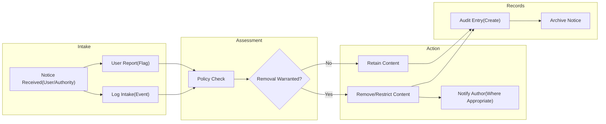
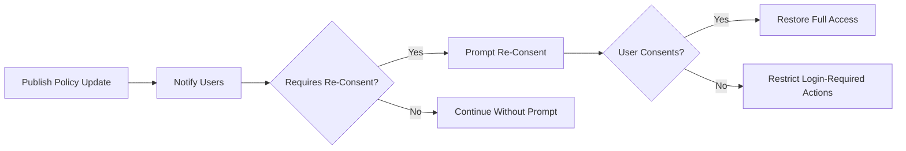

# Business Rules and Compliance Requirements — communityPlatform

## 1) Introduction and Scope
Consolidates cross-cutting business rules, constraints, and compliance expectations for communityPlatform. Focus areas include access and roles, input validation baselines, ownership and content removal, legal/compliance processes, governance and change management, and acceptance criteria. Business requirements only; no APIs, storage schemas, or technical stack prescriptions.

Scope alignment:
- Reading is open to everyone.
- Actions requiring login: posting, commenting, voting, creating sub-communities, joining/leaving.
- Sessions are long-lived; on expiry, prompt smooth re-login and resume the in-progress action.
- Ownership is account-based; only authors can edit/delete their content; community creators control metadata (name immutable).
- Validation is minimized to ensure smooth flows; only essential constraints are enforced.

## 2) Global Business Rules

### 2.1 Platform Access and Roles
- THE platform SHALL support three roles at business level: guestVisitor, registeredMember, siteAdmin.
- WHEN a user is not authenticated, THE platform SHALL treat them as guestVisitor with read-only access to public content.
- WHERE a user is authenticated as registeredMember, THE platform SHALL allow posting, commenting, voting, creating sub-communities, and joining/leaving, subject to ownership rules.
- WHERE a user is authenticated as siteAdmin, THE platform SHALL allow administrative interventions for policy/legal compliance, including removing or restricting any content or account as required by policy.

### 2.2 Reading vs. Actions and Guards
- THE platform SHALL allow reading of public content to all users without login.
- WHEN a guestVisitor attempts any restricted action (post, comment, vote, create community, join/leave), THE platform SHALL prompt login using standard copy and, upon success, SHALL resume the intended action.
- WHILE a session is valid, THE platform SHALL not interrupt user activity with re-authentication prompts.
- IF a session expires mid-action, THEN THE platform SHALL prompt smooth re-login and, upon success, SHALL resume the interrupted action from preserved context.

### 2.3 Ownership and Author Guard
- THE platform SHALL enforce account-based ownership for posts and comments.
- WHERE a user is the author of a post or comment, THE platform SHALL allow only that user to edit or delete that content.
- WHERE a user is the creator of a sub-community, THE platform SHALL allow only that user to edit its metadata (description, logo, banner, rules, category) and SHALL treat the community name as immutable.
- WHEN a non-author attempts to edit or delete content, THE platform SHALL deny the action and present standard copy: “You can edit or delete only items you authored.”

### 2.4 Join/Leave Behavior
- WHEN a registeredMember toggles Join ↔ Joined on a community, THE platform SHALL immediately update joined state (optimistic), include/exclude the community in the member’s home feed, and update the left sidebar Recent Communities list.
- THE platform SHALL clarify that joining a community does not grant moderation or administrative privileges.

### 2.5 Deterministic Sorting and Pagination
- THE platform SHALL apply deterministic ordering for Newest and Top across all lists using the rules in the Sorting and Pagination specification.
- THE platform SHALL paginate Home and Community feeds in increments of 20 items per Load more; Global Latest SHALL always display exactly 10 items; search results SHALL display 20 results per page.

### 2.6 Optimistic UI Consistency
- WHEN a user votes, joins/leaves, or submits content, THE platform SHALL reflect the expected outcome immediately and reconcile with server-confirmed state.
- IF reconciliation fails, THEN THE platform SHALL revert to the last confirmed state and present the standardized temporary error message.

### 2.7 Standardized Time and Number Displays
- THE platform SHALL display relative time in the user’s local timezone (e.g., “just now,” “X minutes ago,” “X hours ago,” “X days ago”).
- THE platform SHALL abbreviate large numbers (e.g., 1.2k, 12.3k, 1.2m) per the standardized rules.

### 2.8 Guest-Accessible Pages and Global Latest
- THE platform SHALL make Home, Community Home, Post Detail, and Search pages readable by guestVisitor.
- THE platform SHALL always show the 10 newest posts sitewide in the Home right sidebar “Global Latest” module.

## 3) Input Validation Rules (Business)
Validation is intentionally minimal to preserve smooth flows while ensuring meaningful content and predictable behavior. All lengths are inclusive.

### 3.1 Sub-Community Inputs
- THE platform SHALL require community name to be unique, short, and readable alphanumeric allowing hyphen ("-") and underscore ("_").
- THE platform SHALL require exactly one category from the fixed set: Tech & Programming, Science, Movies & TV, Games, Sports, Lifestyle & Wellness, Study & Education, Art & Design, Business & Finance, News & Current Affairs.
- WHERE description, logo, banner, or rules are provided, THE platform SHALL accept them as optional and display defaults when absent.
- IF the requested community name is already in use, THEN THE platform SHALL present: “This name is already in use.”
- IF the requested community name format is invalid, THEN THE platform SHALL present: “This name isn’t available. Please choose something simpler.”

### 3.2 Post Inputs
- THE platform SHALL require selection of a target sub-community for each post.
- THE platform SHALL require title length 5–120 characters inclusive.
- THE platform SHALL require body length 10–10,000 characters inclusive; plain text and line breaks only; scripts/code prohibited.
- WHERE author display name is empty, THE platform SHALL display a default such as “Anonymous.”
- IF no community is selected at submission, THEN THE platform SHALL present: “Please choose a community to post in.”

### 3.3 Comment Inputs
- THE platform SHALL require login to create, edit, or delete comments.
- THE platform SHALL require comment length 2–2,000 characters inclusive.
- THE platform SHALL support nested replies with soft-deletion semantics for parents that preserve thread continuity.

### 3.4 Search Inputs
- THE platform SHALL require a minimum query length of 2 characters for all search tabs.
- IF the query is under 2 characters, THEN THE platform SHALL present: “Please enter at least 2 characters.” and SHALL not execute the search.
- THE platform SHALL default post search sort to Newest and allow Top.

### 3.5 Voting Inputs
- THE platform SHALL enforce a single vote state per user per item among {None, Upvote, Downvote}; direct toggling is allowed; pressing the same vote again returns to None.
- THE platform SHALL prevent users from voting on their own posts/comments and SHALL present: “You can’t vote on your own posts/comments.”

## 4) Ownership and Content Removal Policies

### 4.1 Ownership
- THE platform SHALL treat content ownership as account-based for posts and comments.
- WHERE a user is the author of a post or comment, THE platform SHALL allow only that user to edit or delete that content.
- WHERE a user is the creator of a sub-community, THE platform SHALL allow only that user to edit its metadata (description, logo, banner, rules, category) and SHALL not allow renaming.

### 4.2 Deletion Scope and Visibility
- WHEN a post is deleted by its author or siteAdmin, THE platform SHALL remove the post from all feeds, search results, and community lists, and SHALL prevent new comments or votes on that post.
- WHEN a comment is deleted by its author or siteAdmin, THE platform SHALL remove the comment’s body from public view and preserve thread integrity per soft-deletion rules.
- WHEN a sub-community is deleted by its creator or siteAdmin, THE platform SHALL remove the sub-community and all posts within it from public views.
- WHERE content is deleted, THE platform SHALL ensure displayed scores and counts reflect only visible content.

### 4.3 Administrative Overrides and Appeals
- WHERE siteAdmin action is necessary to comply with policy or law, THE platform SHALL allow siteAdmin to remove or edit content and restrict accounts as needed.
- WHEN siteAdmin removes or edits content, THE platform SHALL create an internal audit event including actor, target, action type, and timestamp.
- WHERE a user contests an administrative action, THE platform SHALL provide a channel to submit an appeal and SHALL track receipt and outcome.

### 4.4 Content Integrity and Anti-Abuse (Business-Level)
- THE platform SHALL deter spam and abuse through business-level measures such as rate limits and report workflows without prescribing implementation.
- WHEN content is reported by users, THE platform SHALL route it for assessment and potential enforcement per policy.

## 5) Legal/Compliance Considerations (Business-Level)

### 5.1 User Consent and Policies
- THE platform SHALL present Terms of Service and Privacy Policy during registration and at material updates.
- WHEN policies are materially updated, THE platform SHALL notify users and request re-consent before allowing actions requiring login.
- WHERE a user declines updated terms, THE platform SHALL restrict actions requiring login until consent is provided.

### 5.2 Illegal Content, Notices, and Takedowns
- WHEN the platform receives a credible legal notice (e.g., infringement, court order) or identifies content likely violating applicable law or policy, THE platform SHALL promptly assess the content.
- WHERE removal is warranted, THE platform SHALL remove the content expeditiously and, where appropriate, notify the author with a reason consistent with policy.
- WHERE counter-notice or appeal is permitted, THE platform SHALL provide a submission channel and SHALL track resolution within a reasonable timeframe.
- THE platform SHALL keep internal records of takedown requests, actions taken, and timestamps for accountability.

Mermaid — Content Takedown Workflow (Business-Level)

### 5.3 Privacy and Data Minimization
- THE platform SHALL collect only data necessary to operate: account identifiers, optional display name, community memberships, posts, comments, votes, and minimal telemetry for reliability and abuse prevention.
- WHEN a user requests account deletion, THE platform SHALL delete or irreversibly anonymize personal data not required for legal or safety obligations within a reasonable period and SHALL cascade effects per content ownership and community deletion rules.
- WHERE consent is required for non-essential analytics, THE platform SHALL obtain explicit consent and honor withdrawal by ceasing non-essential data collection.

### 5.4 Age and Sensitive Content Considerations
- THE platform SHALL apply policy restrictions appropriate for target audiences and jurisdictions; if age-based restrictions are adopted, THE platform SHALL enforce them consistently at the business process level.
- WHERE sensitive/adult content policies are defined, THE platform SHALL require community and content compliance, including labeling where applicable.

### 5.5 Transparency and Auditability
- THE platform SHALL maintain internal audit records for administrative actions (takedowns, account restrictions, community deletions).
- THE platform SHALL enable aggregate transparency reporting summarizing volumes and categories of enforcement actions without exposing personal data.

## 6) Governance and Change Management

### 6.1 Rule Versioning and Publication
- THE platform SHALL maintain versioned business rules and policies that are discoverable by users.
- WHEN rules change materially, THE platform SHALL publish a summary of changes and effective date and SHALL prompt re-consent when user rights or obligations change.

### 6.2 Category and Taxonomy Management
- WHERE community categories are adjusted (added, renamed, retired), THE platform SHALL preserve historical integrity and provide a migration path that minimizes disruption to discovery and feeds.

### 6.3 Deprecation and Sunset Policies
- WHEN a feature is deprecated, THE platform SHALL announce deprecation, provide timelines, and offer guidance for transitions.
- WHERE deprecation affects user-generated content, THE platform SHALL provide options to export or adapt content where feasible.

### 6.4 Incident Response and Continuity
- WHEN a critical incident (e.g., widespread abuse, legal injunction, data exposure) is suspected, THE platform SHALL initiate an incident response process that includes assessment, containment, user notification where appropriate, and post-incident review.
- THE platform SHALL track incidents with timestamps, responsible roles, and outcomes for accountability.

### 6.5 Abuse Management and User Safety
- THE platform SHALL provide a user reporting mechanism for posts, comments, and communities that violate policies.
- WHEN repeat or egregious violations occur, THE platform SHALL escalate actions up to account restrictions consistent with policy and applicable law.
- WHERE safety concerns are credible, THE platform SHALL prioritize removal and notify appropriate stakeholders per policy.

Mermaid — Policy Update and Re-Consent Flow (Business-Level)

## 7) High-Level Permission Overview (Business Matrix)

| Action | guestVisitor | registeredMember | siteAdmin |
|---|---|---|---|
| Read public content | ✅ | ✅ | ✅ |
| Create sub-community | ❌ | ✅ | ✅ |
| Edit/delete own community metadata | ❌ | ✅ (creator) | ✅ (any) |
| Delete community | ❌ | ✅ (creator) | ✅ (any) |
| Join/Leave community | ❌ | ✅ | ✅ |
| Create post (text-only) | ❌ | ✅ | ✅ |
| Edit/Delete own post | ❌ | ✅ (own) | ✅ (any) |
| Create comment | ❌ | ✅ | ✅ |
| Edit/Delete own comment | ❌ | ✅ (own) | ✅ (any) |
| Vote on post/comment (not own) | ❌ | ✅ | ✅ |

Notes:
- “(creator)” denotes the account that created the community.
- siteAdmin actions are confined to policy/legal compliance needs and are audited.

## 8) Acceptance Criteria and Test Scenarios (Business-Level, EARS)

### 8.1 Access and Guards
- WHEN a guestVisitor attempts to post/comment/vote/join/create, THE platform SHALL present “Please sign in to continue.” and, upon successful login, SHALL resume the attempted action with inputs preserved.
- WHEN a session expires mid-action, THE platform SHALL prompt re-login and, upon success, SHALL resume the action without data loss.

### 8.2 Ownership and Author Guard
- GIVEN a post authored by User A, WHEN User B attempts to edit or delete it, THEN THE platform SHALL deny and present “You can edit or delete only items you authored.”
- GIVEN a comment authored by User A, WHEN User A edits it with valid content, THEN THE platform SHALL save the edit and reflect the edited state.

### 8.3 Join/Leave Semantics
- WHEN a registeredMember clicks Join on a community, THE platform SHALL immediately reflect “Joined”, include the community in the member’s home feed, and update Recent Communities.
- WHEN the member clicks Joined to leave, THE platform SHALL immediately reflect “Join”, exclude the community from the member’s home feed, and update Recent Communities.
- WHEN a user joins/leaves, THE platform SHALL not grant or revoke moderation rights as a result of membership changes.

### 8.4 Deletion Cascades and Visibility
- WHEN a community is deleted by its creator or siteAdmin, THE platform SHALL remove the community and all posts therein from public views within a single atomic business action.
- WHEN a post is deleted by its author, THE platform SHALL remove it from public views and prohibit further comments or votes on it.
- WHEN a comment is soft-deleted, THE platform SHALL hide its content and preserve thread visibility for replies.

### 8.5 Legal/Compliance Workflows
- WHEN a credible notice is received, THE platform SHALL assess, determine action, and record an audit event with timestamp and actor.
- WHEN removal is warranted, THE platform SHALL remove content promptly and, where appropriate, notify the author in line with policy.
- WHEN a counter-notice or appeal is permitted and submitted, THE platform SHALL track and resolve it within a reasonable timeframe.

### 8.6 Governance and Change Management
- WHEN policies materially change, THE platform SHALL notify users and require re-consent before allowing login-required actions; declining SHALL restrict such actions.
- WHEN categories are adjusted, THE platform SHALL preserve discovery integrity and offer migration without loss of access to existing content.

## 9) Cross-Document Consistency and References
- Roles and permissions details: see the descriptive “User Roles and Permissions” requirements.
- Page responsibilities and navigation: see “Information Architecture and Navigation Requirements”.
- Core flows and guest guard behaviors: see “Functional Requirements for Core User Flows”.
- Sub-community constraints: see “Sub-Communities Requirements”.
- Post composition: see “Posts Requirements”.
- Comments and nesting: see “Comments and Nesting Requirements”.
- Voting semantics: see “Voting and Scoring Requirements”.
- Ordering and pagination: see “Sorting and Pagination Rules”.
- Search behaviors: see “Search Requirements”.
- Session longevity and re-login: see “Session and Authentication Experience Requirements”.
- Standard copy and formats: see “Error Handling and Standard Copy Requirements”.
- Experience-level non-functional expectations: see “Non-Functional Requirements (NFR)”.

## 10) Glossary
- guestVisitor: Unauthenticated user with read-only access to public content.
- registeredMember: Authenticated user who can create sub-communities, post, comment, vote, and join/leave; can edit/delete only their authored content; can edit metadata of communities they created; can delete communities they created (with cascading removal of all posts therein).
- siteAdmin: Administrator with platform-wide oversight and authority to intervene for policy/legal compliance.
- Community: Topic-based sub-community with unique immutable name, optional description/logo/banner/rules, and a required category from a fixed set.
- Post: Text-only content (title + body) that belongs to exactly one sub-community.
- Comment: User reply content with nesting support; soft-deletion hides body while preserving thread continuity.
- Vote: Single per-user state per item among None/Upvote/Downvote; score equals upvotes minus downvotes; self-vote prohibited.
- Global Latest: Sitewide list of the 10 most recent posts shown on the home right sidebar.
- Deterministic Sorting: Consistent, rule-based ordering with tie-breakers applied identically across lists.

## 11) Consolidated EARS Requirements Index
- THE platform SHALL allow reading of public content without login.
- WHEN a guestVisitor attempts any action requiring login, THE platform SHALL present “Please sign in to continue.” and SHALL resume the action after successful login.
- WHILE a session is valid, THE platform SHALL not interrupt ongoing actions.
- IF a session expires mid-action, THEN THE platform SHALL prompt re-login and continue the action upon success.
- THE platform SHALL enforce account-based ownership for posts and comments.
- WHERE a user is the content author, THE platform SHALL allow only that user to edit or delete that content.
- WHERE a user created a sub-community, THE platform SHALL allow only that user to edit its metadata and SHALL not allow renaming.
- THE platform SHALL require unique, well-formed community names allowing alphanumeric, hyphen, and underscore characters only, with exactly one category from the fixed list.
- THE platform SHALL require post title length 5–120 and body length 10–10,000 characters with plain text only.
- THE platform SHALL require comment length 2–2,000 characters and support nesting with soft-deletion semantics.
- THE platform SHALL disallow self-voting and present “You can’t vote on your own posts/comments.”
- THE platform SHALL enforce deterministic sorting for Newest and Top with defined tie-breakers.
- THE platform SHALL paginate main feeds and community feeds in increments of 20 items and search results in increments of 20; Global Latest SHALL always be 10.
- WHEN a community is deleted, THE platform SHALL remove the community and all posts within it from public views.
- WHEN a post is deleted, THE platform SHALL remove it from public views and prevent new comments or votes.
- WHEN a comment is deleted, THE platform SHALL hide its content and preserve thread continuity where applicable.
- WHERE siteAdmin acts for policy/legal compliance, THE platform SHALL log an internal audit record with actor, action, target, timestamp.
- WHEN a credible legal notice is received, THE platform SHALL assess promptly and remove or retain content per policy, notifying the author where appropriate.
- WHEN policies are updated materially, THE platform SHALL notify users and request re-consent before allowing actions requiring login.
- WHERE a user requests account deletion, THE platform SHALL process within a reasonable timeframe subject to lawful retention obligations.
- THE platform SHALL maintain audit records of takedowns, account restrictions, and community deletions for accountability and aggregate transparency reporting.

Business boundary statement: Business requirements only. Technical implementation decisions (architecture, APIs, storage, indices, and protocols) are at the discretion of the development team.